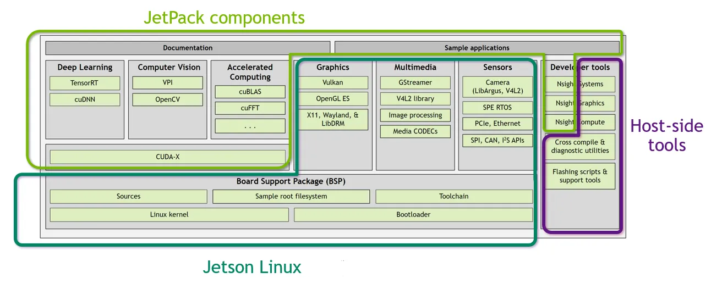

### NVIDIA GPU 架构与产品线对应表

|架构代号 (科学家)     | 发布年份 | 消费级（GeForce GTX(gaming)/RTX(AI with tensor core)） | 专业图形（Quadro / RTX A） | 数据中心（Tesla / A/H/B） | 边缘AI（Jetson）       |
|----------------|----------|----------------------------|-----------------------------|----------------------------|-------------------------|
| **Fermi**      | 2010     | GTX 480                    | Quadro 6000                | Tesla M2090                | —                       |
| **Kepler**     | 2012     | GTX 680                    | Quadro K6000               | Tesla K80                  | Tegra K1                |
| **Maxwell**    | 2014     | GTX 980                    | Quadro M6000               | —                          | Jetson Nano             |
| **Pascal**     | 2016     | GTX 1080                   | Quadro P6000               | Tesla P100                 | Jetson TX2              |
| **Volta**      | 2017     | —                          | —                           | Tesla V100                 | Jetson Xavier           |
| **Turing**     | 2018     | RTX 2080 Ti                | Quadro RTX 8000            | T4                         | —                       |
| **Ampere**     | 2020     | RTX 3080 / 3090            | RTX A6000                  | A100                       | Jetson Orin 系列        |
| **Ada Lovelace** | 2022   | RTX 4090                   | RTX 6000 Ada               | —                          | —                       |
| **Hopper**  Grace Hopper，编译器先驱（女性计算机科学家）  | 2022     | —                          | —                           | H100                       | —                       |
| **Blackwell** David Blackwell，概率论与统计学家（非裔数学家） | 2024     | —                          | —                           | B100 / GB200               | —                       |


### S - HW:SoC GPU
- Discrete GPU（独立显卡） 独立于 CPU 的 GPU，通常是单独的芯片
- SoC GPU（集成显卡）集成在 SoC中的 GPU
  - System on Chip: one chip has the system of CPU, GPU, and others.

T - Jetson devices (Jetson Orion Nano Developer Kit)

|**Device**|Jetson modules|Jetson developer kits|
|-|-|-|
|**HW**|  Include CPU, GPU, memory, and limited storage, but ship without a carrier board or pre-installed software <br>-   attach it to a carrier board designed or procured for your end product <br>- flash it with the software image you have developed|  includes a non-production-specification Jetson module attached to a reference carrier board|
|**SW**|ships with no software preinstalled|with NVIDIA JetPack SDK|
|**Usecase**|  suitable for deployment in a production environment |  not intended for production use, to develop and test only|
|**Product**|Jetson Orin Nano module|Jetson Orion Nano Developer Kit|

A

https://developer.nvidia.com/buy-jetson?product=all&location=CN


### S - SW:Linux + CUDA
T - Jetson software (L4T, jetpack SDK)


<u>Jetson Linux/L4T/Linux for Tegra</u>
- Version
  - 36.4.3 via cat /etc/os-release
  - nvcr.io/nvidia/l4t-base:r36.2.0
- Include
  - Driver Package/Board Support Package (BSP)
    - includes Linux Kernel, UEFI bootloader, NVIDIA drivers, flashing utilities, sample filesystem based on Ubuntu, and Ubuntu desktop environment for the Jetson platform
    -  https://developer.nvidia.com/downloads/embedded/l4t/r36_release_v4.3/release/Jetson_Linux_r36.4.3_aarch64.tbz2
  - Sample Root Filesystem
    - https://developer.nvidia.com/downloads/embedded/l4t/r36_release_v4.3/release/Tegra_Linux_Sample-Root-Filesystem_r36.4.3_aarch64.tbz2
-  Issue
    - Issue - Can’t flash Orin Nano 4GB (might be timeout in USB write) at https://forums.developer.nvidia.com/t/cant-flash-orin-nano-4gb-might-be-timeout-in-usb-write/259575
    - RC -  .config file has issue at https://forums.developer.nvidia.com/t/orin-nano-8gb-no-display/259589/14
    - Solution - changes to our .config file
      - 35.3.1 released at Mar 2023
      - Solution at Jul 18 '23
      - 36.4.3 released at Jan 2025
      - ALWAYS use latest available release

<u>Jetpack SDK</u>
- Version
  - JetPack 6.2 via apt-show cache nvidia-jetpack
  - nvcr.io/nvidia/l4t-jetpack:r36.4.0
  - nvcr.io/nvidia/l4t-cuda:12.6.11-runtime cuda only
- Include
  - Jetson Linux:36.4.3 via cat /etc/os-release
  - Jetson AI Stack: CUDA 12.6.10 via nvcc -V
  - Jetson Platform Services

<u>Jetson Stats</u>
  - a package for monitoring and controlling your NVIDIA Jetson [Orin, Xavier, Nano, TX] series
  - Issue
    - Issue - Unable to run jtop on jetson Orin Nano at https://forums.developer.nvidia.com/t/unable-to-run-jtop-on-jetson-orin-nano/276970/2
    - Solution - use tegrastats


A

- https://docs.nvidia.com/jetson/

1.Install Jetson Linux
```bash
# 1. Download the latest Jetson Linux release package and sample file system for your Jetson developer kit
# Jetson Linux release package
${L4T_RELEASE_PACKAGE} = Jetson_Linux_<version>_aarch64.tbz2

# Sample file system package
${SAMPLE_FS_PACKAGE} = Tegra_Linux_Sample-Root-Filesystem_<version>_aarch64.tbz2


# 2. Untar the files and assemble the rootfs
tar xf ${L4T_RELEASE_PACKAGE}
tar xpf ${SAMPLE_FS_PACKAGE} -C Linux_for_Tegra/rootfs/
cd Linux_for_Tegra/
./tools/l4t_flash_prerequisites.sh
./apply_binaries.sh


# 3. Put your Jetson developer kit into Force Recovery Mode
# Disconnect the power cable to ensure that the developer kit is powered off.
# Place a jumper to short the REC and GND pins on the 12-pin button header.
# Reconnect the power cable.
# Nvidia APX

# 4. Install/flash the Jetson release onto the Jetson developer kit
# jetson-orin-nano-devkit.conf is the .config file
./tools/kernel_flash/l4t_initrd_flash.sh --external-device nvme0n1p1 \
  -c tools/kernel_flash/flash_l4t_t234_nvme.xml -p "-c bootloader/generic/cfg/flash_t234_qspi.xml" \
  --showlogs --network usb0 jetson-orin-nano-devkit internal

# 5. Kit will auto reboot to Linux, remove the jumper
```

2.Config Jetson Linux
```bash
# 1. bluetooth
systemctl start bluetooth
systemctl enable bluetooth
bluetoothctl 
> discoverable on
> scan on
> pair MAC

# 2. Install broswer
snap install chromium
```

3.Install JetPack
```bash
apt update
apt install nvidia-jetpack

vim /etc/bash.bashrc
export PATH=/usr/local/cuda/bin:$PATH
export LD_LIBRARY_PATH=/usr/local/cuda/lib64:$LD_LIBRARY_PATH
export CUDA_ROOT=/usr/local/cuda
```

4.Install Jetson Stats
```
apt-get install python3-pip
pip3 install -U pip
pip3 install -U jetson-stats
systemctl restart jtop.service
systemctl enable jtop.service
jtop
```


### S - PyTorch 
T - PyTorch for Jetson Platform

- Version
  - 2.0
  - nvcr.io/nvidia/l4t-pytorch:r35.2.1-pth2.0-py3

A
- https://docs.nvidia.com/deeplearning/frameworks/install-pytorch-jetson-platform/index.html

```bash
# 1. Install system packages required by PyTorch
apt-get -y update
apt-get install -y  python3-pip libopenblas-dev

# 2. 24.06 PyTorch or later versions, cusparselt needs to be installed first
wget raw.githubusercontent.com/pytorch/pytorch/5c6af2b583709f6176898c017424dc9981023c28/.ci/docker/common/install_cusparselt.sh 
export CUDA_VERSION=12.1 # as an example   
bash ./install_cusparselt.sh

# 3.install PyTorch 
export TORCH_INSTALL=https://developer.download.nvidia.cn/compute/redist/jp/v61/pytorch/torch-2.5.0a0+872d972e41.nv24.08.17622132-cp310-cp310-linux_aarch64.whl
# Specific version: https://developer.download.nvidia.com/compute/redist/jp/v$JP_VERSION/pytorch/$PYT_VERSION
# JP_VERSION: The major and minor version of JetPack you are using, such as 461 for JetPack 4.6.1 or 50 for JetPack 5.0.


python3 -m pip install numpy=='1.26.1'
python3 -m pip install --no-cache $TORCH_INSTALL
# Attempting uninstall: sympy
#     Found existing installation: sympy 1.9
#    ━━━━━━━━━━╺━━━━━━━━━━━━━━━━━━━━━━━━━━━━━ 2/8 [sympy]error: uninstall-distutils-installed-package

# × Cannot uninstall sympy 1.9
# ╰─> It is a distutils installed project and thus we cannot accurately determine which files belong to it which would lead to only a partial uninstall.
--ignore-installed

# 4. Test Torch
import torch
# ImportError: libcusparseLt.so.0: cannot open shared object file: No such file or directory
# Install libcusparseLt: https://discuss.pytorch.org/t/importerror-libcusparselt-so-0-cannot-open-shared-object-file-no-such-file-or-directory/190061/2

pytorch.cuda.is_available()
```