## Thread
### HW POV(线程的硬件执行): focus Core than GPU
#### A GPU
```
COMP
|_2 division
     |_4 GPC (Graphics Processing Cluster)
            |_8 TPC (Texture/Processing Cluster)
                 |_2 SM (Streaming Multiprocessor)

MEM
|_other components
     |_HMB3e + memory controller
     |_L2 Cache
     |_NVLink + High-speed hub
     |_PCIE
```
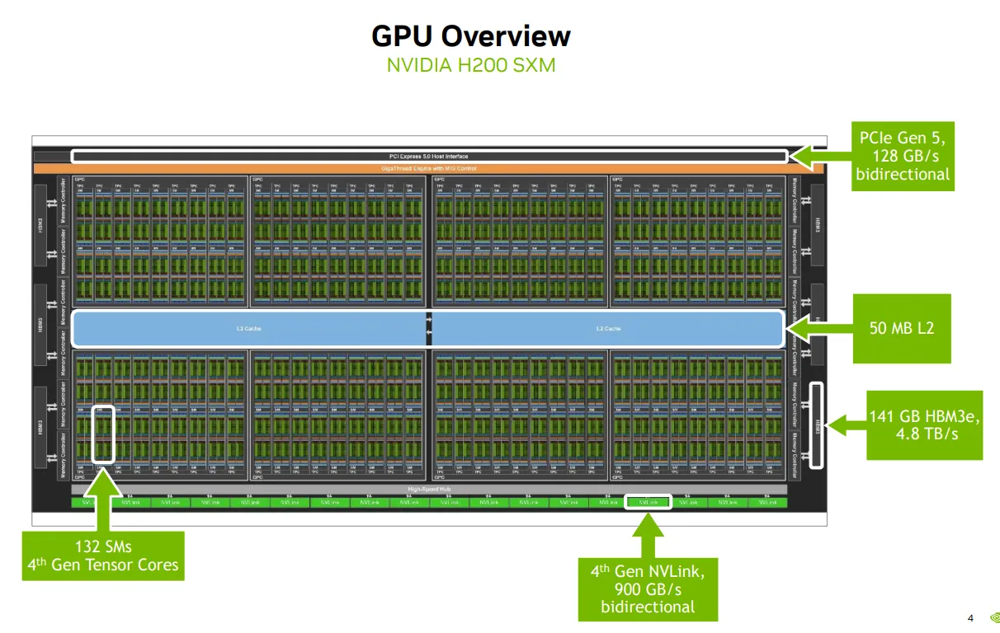
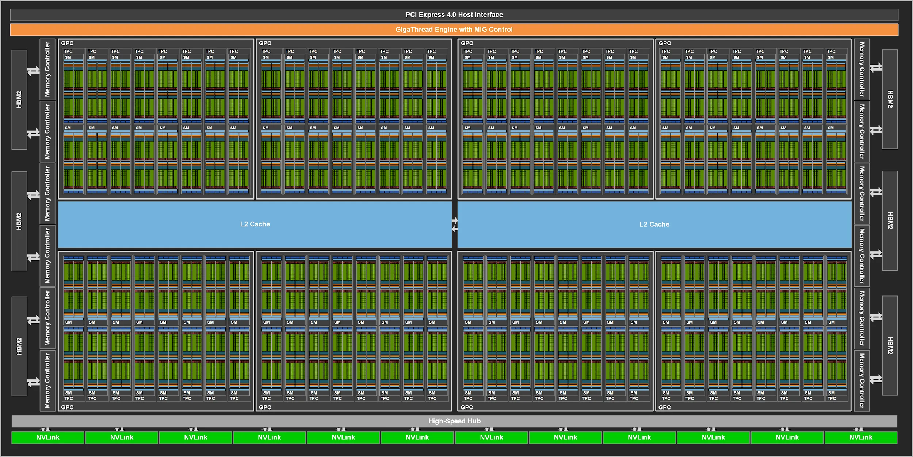


#### A SM
```
INST
|_L1 instruction cache
|_ 4 *
     |_L0 instruction cache

COMP
|_ 4 *
     |_Cores - 32 FP32 cores + 16 FP64 cores + 16 INT32 cores + 1 mixed-precision tensor cores
     |_Units - 8 LD/ST units + 4 Special Function Units/SFU + 1 Dispatch unit
     |_16K * 32 bit register file
     |_Warp scheduler

MEM
|_256KB L1 data cache/shared memory
|_Tensor Memory Accelerator
```
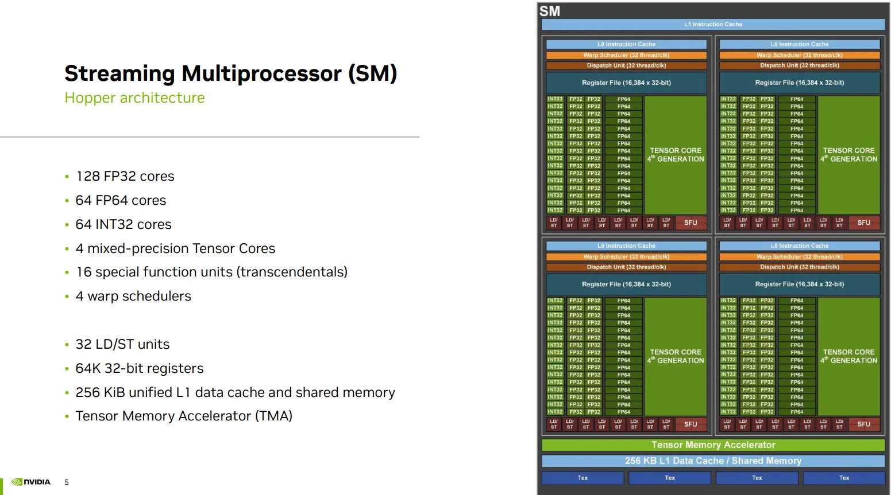


### Orchestration POV(线程的硬件调度): focus SIMT Architecture than Warp
#### Flynn's taxonomy
<u> 程序设计角度 的模型（Program-Level）</u>
- 是你怎么写代码

SPMD (Single Program Multiple Data)
- Single Program, Multiple Data：所有处理单元运行同一个程序，但处理不同的数据。
- 它是程序员写代码时的思维模型，比如 CUDA、OpenCL、MPI、OpenMP 都是 SPMD 风格。
- 每个线程/进程通过自己的 ID（如 threadIdx.x）来决定处理哪部分数据。
- 重点是“写一份代码，跑在多个数据上”。
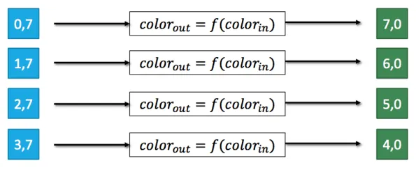


<u>硬件执行角度 的模型（Instruction-Level）</u>
- 是硬件怎么执行它, 指令和数据的调度方式

| 模型 | 指令流               | 数据流             | 举例                          |
|------|----------------------|------------|-------------------------------|
| MIMD | 多指令               | 多数据         | 多核 CPU、分布式系统          |
| SIMD | 单指令               | 多数据        | Intel AVX、ARM NEON           |
| SIMT | 单指令（每个 warp） | 多线程    | NVIDIA CUDA Warp              |


Running SPMD on MIMD (Multiple Instruction Multiple Data)
- Multiple Instruction: 线程可以运行不同的程序
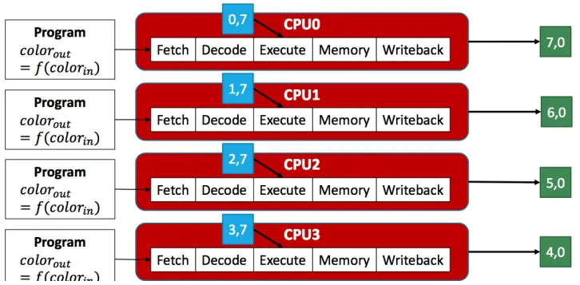


Running SPMD on SIMD(Single Instruction Multiple Data)
- Single Instruction: 所有线程运行相同的程序
- Multiple Data: 一个线程（single register file） + 数据通道（vector lanes）
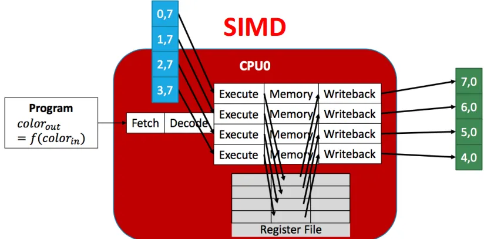


Running SPMD on SIMT(Single Instruction Multiple Thread)
- Single Instruction: 所有线程运行相同的程序
- Multiple Thread: 每个线程处理不同的数据（独立的context, Multiple register files） + Scalar Ops
  - 独立的程序计数器（PC）
  - 独立的寄存器文件
  - 独立的栈和局部变量
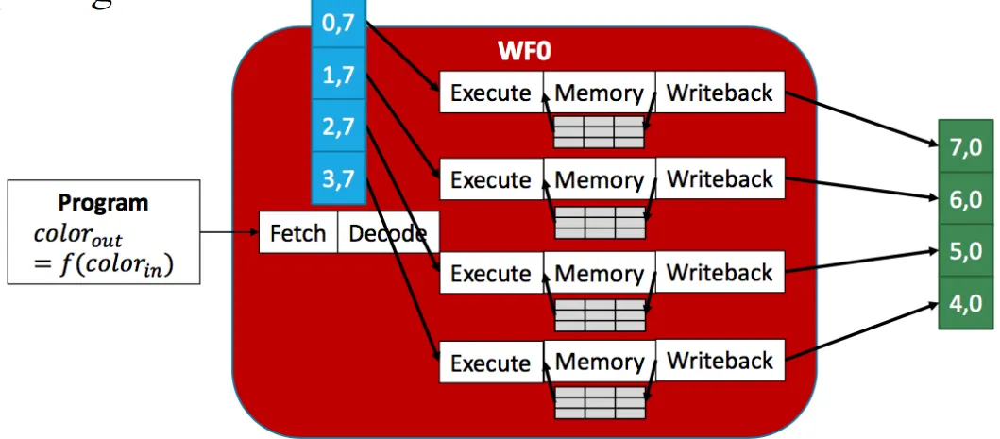


#### 怎么高效调度SIMT定义的这些多个线程：Warp32个一起

Threads are grouped into warps
  - 每个 Warp有 32 threads
  - 线程以 warp 为单位调度。
  - Warps are interleaving to hide latencies

调度器的并发管理能力
- 一个 Warp Scheduler 最多可以同时追踪和管理 16 个活跃的 Warps。
- 这些 Warps 并不是每个时钟周期都在执行，而是处于“准备好被调度”的状态。
- 这样做的目的是为了隐藏延迟（如内存访问延迟），通过切换不同的 Warps 来保持执行单元的高利用率。

调度器的吞吐执行能力
- “32 threads/clk”，每个时钟周期，Warp Scheduler 最多可以发射一个 Warp（即 32 个线程）去执行。
- SM 有 4 个 warp scheduler，理论上可以每个时钟周期调度 4 个 warp（128 个线程）
- 这代表的是 执行能力的上限，而不是它能同时“管理”的 Warp 数量。
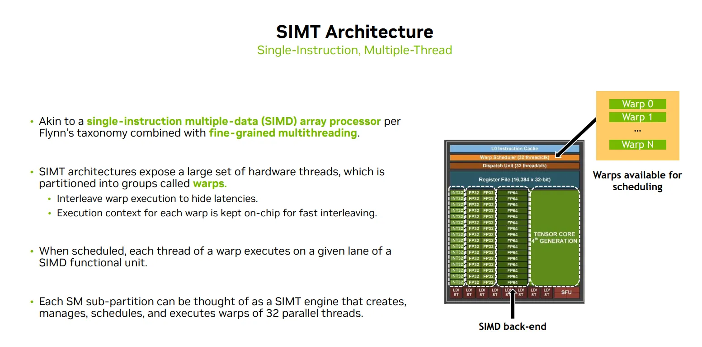


#### SIMT下WARP的问题
- Single instruction, 一个warp里的线程通常执行相同的指令 
- Warp是基本调度单位, Threads in a warp may diverge
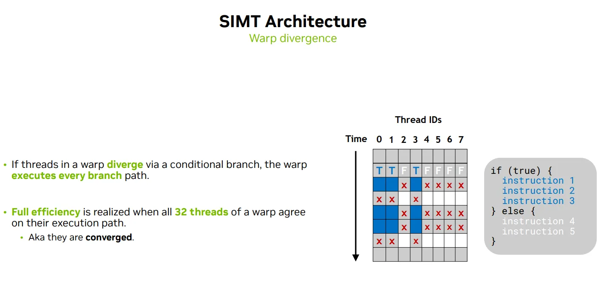

- Multiple threads, 一个warp里的线程通常处理不同的数据
- Warp是基本调度单位, Threads in a warp execute independently asyncly
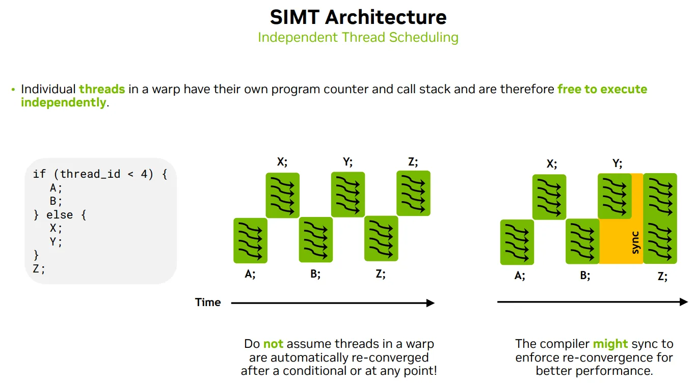


### Programming POV(线程的逻辑结构Thread Hierachy): focus SPMD than CUDA Programming Model

#### Kernel
Threads use their unique thread index to work on disjoint data
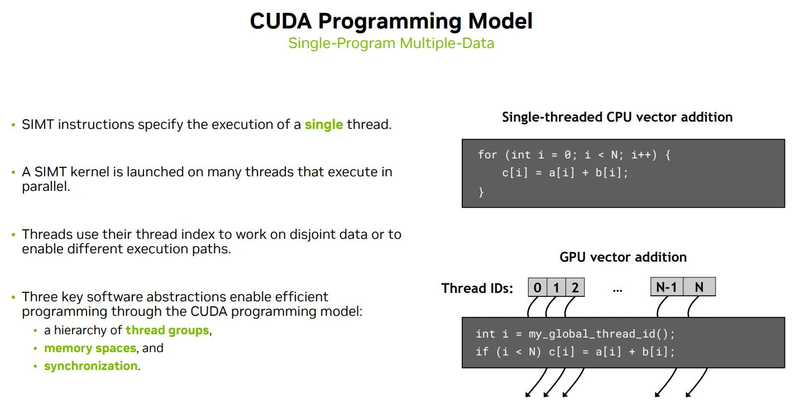


#### Thread Hierachy to orchestration to HW
- Kernel is launched on a grid of thread blocks, which are completely independent, on GPU
  - Optional level of Thread block clusters 跨 Thread Block 的共享内存访问，跨 SM 的线程块协作
- Several thread blocks are executed concurently on one SM
  - At runtime, thread block is divided into warps for SIMT execution
  - The way of partition is always the same: each warp conatins threads of consective, increasing thread IDs with the first wap containing thread 0.
- Thread executes on core

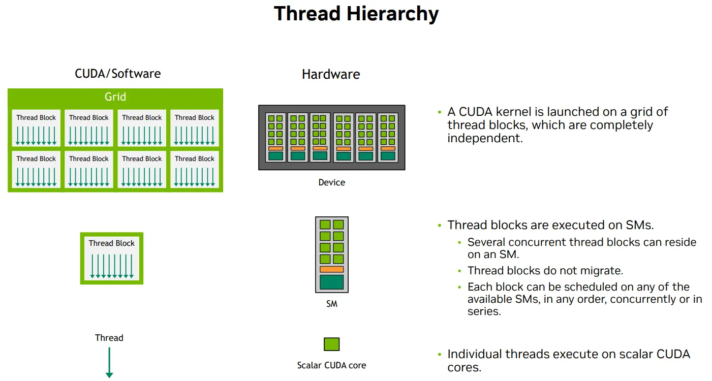

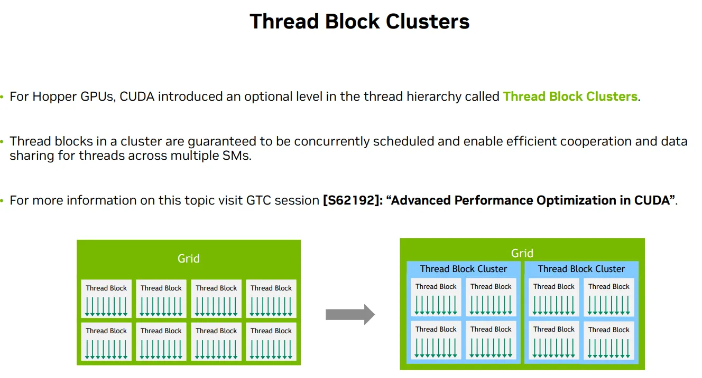

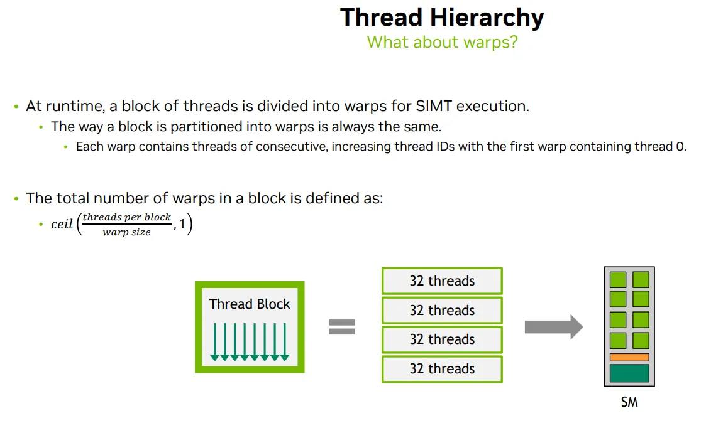


#### Thread block sizing
|变量	|含义|	值|
|-|-|-|
|gridDim.x	|网格在 x 方向上的 block 数量	|10|
|blockDim.x	|每个 block 中的线程数|	100|

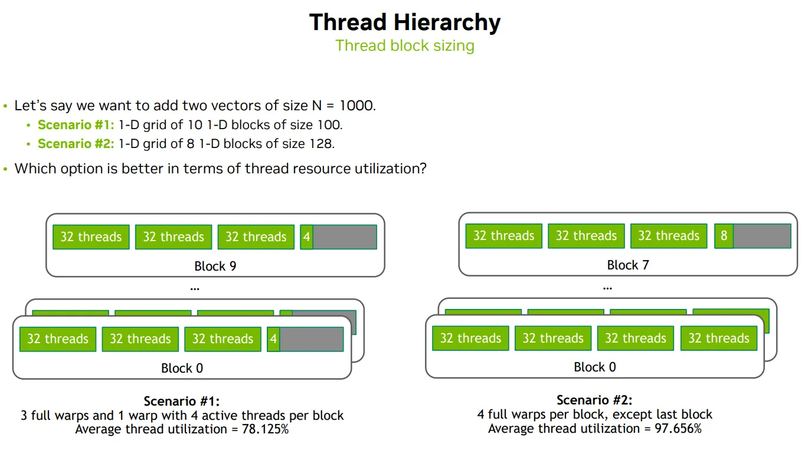


## Memory Hierachy
### Logical thread corresponding Memory hierarchy

|Logical thread|Mem|HW|
|-|-|-|
|Per-thread  |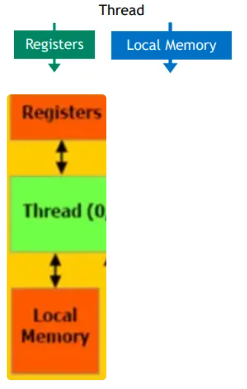||
|Per-block|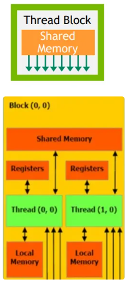|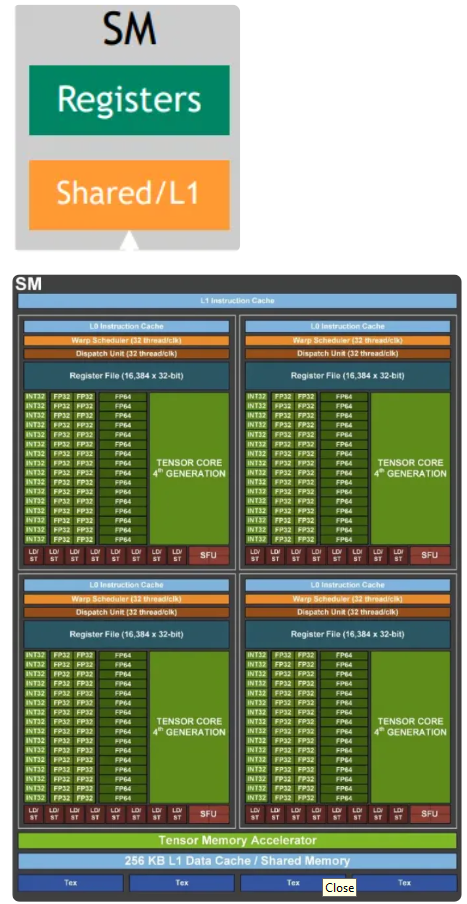|
|Per-grid|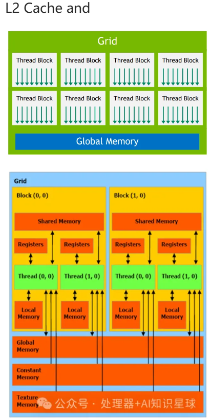|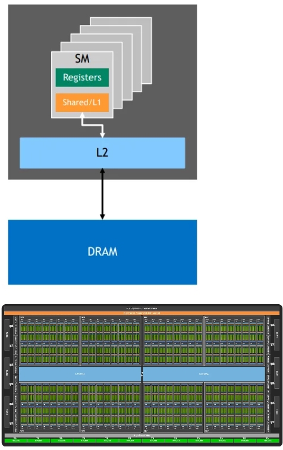|


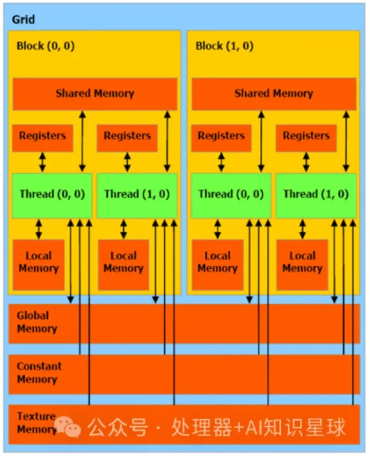
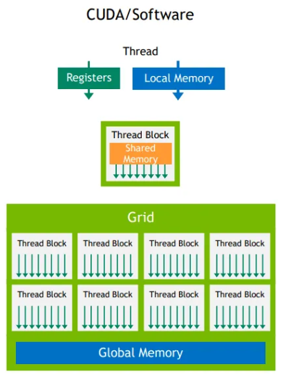 
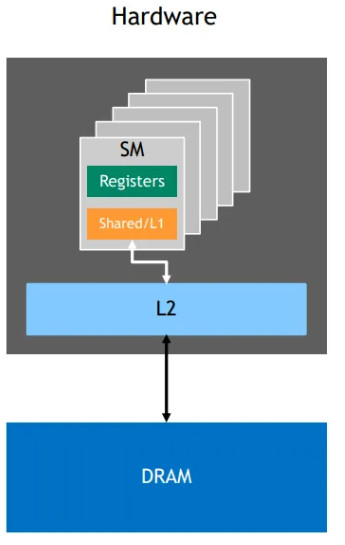 


Shared mem
```c
// 共享内存，仅限 Block 内访问
__shared__ float sharedData[BLOCK_SIZE];
sharedData[i];
```

Global mem
```c
// 在设备上分配内存
cudaMalloc(void** devPtr, size_t size); 
// 释放设备内存
cudaFree(void* devPtr);

float *d_input;
cudaMalloc((void**)&d_input, 256 * sizeof(float));
d_input[i];
cudaFree(d_input);
```


CPU-GPU Unified Memory
||CPU-GPU Unified Memory（统一内存|Non-Unified Memory非统一内存|
|-|-|-|
|地址空间|单一地址空间：CPU 和 GPU 共享 同一个虚拟地址空间|独立地址空间|
|数据迁移|自动数据迁移：当 GPU 访问 CPU 端的数据时，CUDA 会自动将数据迁移到 GPU 端，反之亦然。|手动数据迁移 cudaMemcpy|

```c
// 分配托管内存
cudaMallocManaged(void** devPtr, size_t size); 
//提前预取数据
cudaMemPrefetchAsync(void* devPtr, size_t size, int device, cudaStream_t stream);
```

```c
// 从主机复制到设备
cudaMemcpy(void* dst, const void* src, size_t size, cudaMemcpyHostToDevice);

// 从设备复制到主机
cudaMemcpy(void* dst, const void* src, size_t size, cudaMemcpyDeviceToHost);

// 设备内存之间复制
cudaMemcpy(void* dst, const void* src, size_t size, cudaMemcpyDeviceToDevice);

// 没有提前预取
// 异步内存复制
cudaMemcpyAsync(void* dst, const void* src, size_t size, cudaMemcpyHostToDevice, cudaStream_t stream);
```