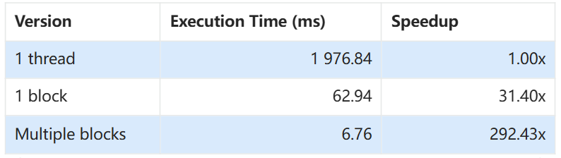
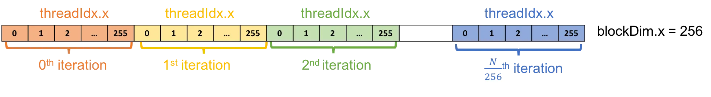
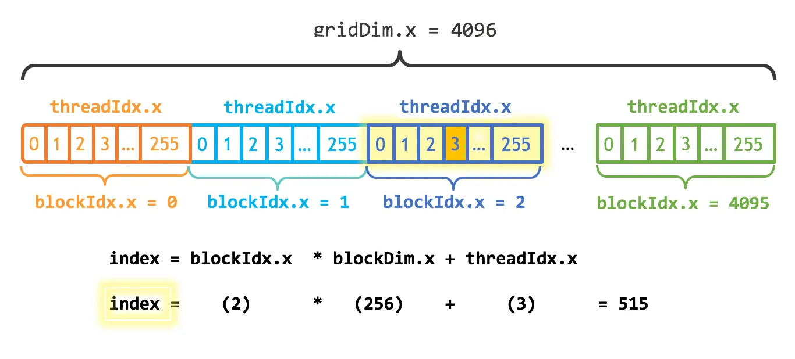
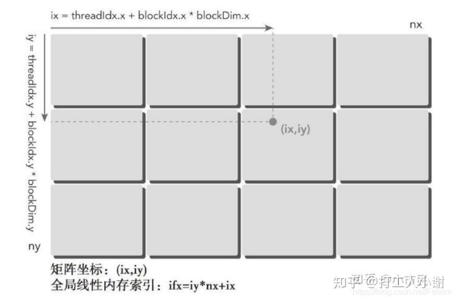

### S - Run on GPU
T - Kernel & Kernel Launch

- Host: CPU HW itself
- Device: GPU HW itself
- Kernel: function that run on GPU
- Kernel launch: run kernel from host
- Kernenel execution configuration

A

CPU
```c
void c_hello(){
    printf("Hello World!\n");
}

int main() {
    c_hello();
    return 0;
}
```

hello.cu
```c
__global__ void cuda_hello(){
    printf("Hello World from GPU!\n");
}

int main() {
    cuda_hello<<<1,1>>>(); 
    return 0;
}
```
- _ _ global _ _ specifier, specify a function as kernel
- cuda_hello(); host code call, called kernel launch
- <<<N,N>>> syntax, provides kernenel execution configuration

Compile & run
```
nvcc hello.cu -o hello
./hello
```
- The CUDA hello world example does nothing, and even if the program is compiled, nothing will show up on screen. 


### S - Load data from CPU to GPU
T - memory transfer

- Memory transfer: data move between host and device
  - For data to be accessible by GPU, it must be presented in the device memory. CUDA provides APIs for device memory mgmt and data transfer between host and device memory. 

```c
cudaMalloc(void **devPtr, size_t count);
cudaFree(void *devPtr);
```
- cudaMalloc() allocates memory of size count in the device memory and updates the device pointer devPtr to the allocated memory. 
- cudaFree() deallocates a region of the device memory where the device pointer devPtr points to. They are comparable to malloc() and free() in C, respectively

```c
cudaMemcpy(void *dst, void *src, size_t count, cudaMemcpyKind kind)
```
- cudaMemcpy copy a memory of size count from src to dst. kind indicates the direction. For typical usage, the value of kind is either cudaMemcpyHostToDevice or cudaMemcpyDeviceToHost. similar to memcpy in C.


<u>Common workflow of CUDA programs</u>
1. Define kernel
2. Allocate host memory & initialized host data
3. Allocate device memory & Transfer input data from host to device memory
4. Execute kernels
5. Transfer output from device memory to host
6. Verification & others
7. Free device memory & host memeory


A

Vector addition implemented in C
```c
#include <stdio.h>
#include <stdlib.h>
#include <math.h>
#include <assert.h>

#define N 10000000
#define MAX_ERR 1e-6

void vector_add(float *out, float *a, float *b, int n) {
    for(int i = 0; i < n; i++){
        out[i] = a[i] + b[i];
    }
}

int main(){
    float *a, *b, *out; 

    // Allocate memory
    a   = (float*)malloc(sizeof(float) * N);
    b   = (float*)malloc(sizeof(float) * N);
    out = (float*)malloc(sizeof(float) * N);

    // Initialize array
    for(int i = 0; i < N; i++){
        a[i] = 1.0f;
        b[i] = 2.0f;
    }

    // Main function
    vector_add(out, a, b, N);

    // Verification
    for(int i = 0; i < N; i++){
        assert(fabs(out[i] - a[i] - b[i]) < MAX_ERR);
    }

    printf("out[0] = %f\n", out[0]);
    printf("PASSED\n");
}
```

cuda
```c
cp vector_add.c vector_add.cu

# Convert vector_add() to GPU kernel
__global__ void vector_add(float *out, float *a, float *b, int n) {
    for(int i = 0; i < n; i++){
        out[i] = a[i] + b[i];
    }
}

# Change vector_add() call in main() to kernel call
vector_add<<<1,1>>>(out, a, b, N);
```

working
```c
#include <stdio.h>
#include <stdlib.h>
#include <math.h>
#include <assert.h>
#include <cuda.h>
#include <cuda_runtime.h>

#define N 10000000
#define MAX_ERR 1e-6

__global__ void vector_add(float *out, float *a, float *b, int n) {
    for(int i = 0; i < n; i ++){
        out[i] = a[i] + b[i];
    }
}

int main(){
    float *a, *b, *out;
    float *d_a, *d_b, *d_out; 

    // Allocate host memory
    a   = (float*)malloc(sizeof(float) * N);
    b   = (float*)malloc(sizeof(float) * N);
    out = (float*)malloc(sizeof(float) * N);

    // Initialize host arrays
    for(int i = 0; i < N; i++){
        a[i] = 1.0f;
        b[i] = 2.0f;
    }

    // Allocate device memory
    cudaMalloc((void**)&d_a, sizeof(float) * N);
    cudaMalloc((void**)&d_b, sizeof(float) * N);
    cudaMalloc((void**)&d_out, sizeof(float) * N);

    // Transfer data from host to device memory
    cudaMemcpy(d_a, a, sizeof(float) * N, cudaMemcpyHostToDevice);
    cudaMemcpy(d_b, b, sizeof(float) * N, cudaMemcpyHostToDevice);

    // Executing kernel 
    vector_add<<<1,1>>>(d_out, d_a, d_b, N);
    
    // Transfer data back to host memory
    cudaMemcpy(out, d_out, sizeof(float) * N, cudaMemcpyDeviceToHost);

    // Verification
    for(int i = 0; i < N; i++){
        assert(fabs(out[i] - a[i] - b[i]) < MAX_ERR);
    }
    printf("out[0] = %f\n", out[0]);
    printf("PASSED\n");

    // Deallocate device memory
    cudaFree(d_a);
    cudaFree(d_b);
    cudaFree(d_out);

    // Deallocate host memory
    free(a); 
    free(b); 
    free(out);
}
```

### S - Performance profiling
T - Nsight Systems (nsys) 

time - does not give much information about the program performance
```
time ./vector_add

real    0m2.316s
user    0m0.221s
sys     0m0.109s
```

nvprof - NVIDIA provides a commandline profiler tool called nvprof, which give a more insight information of CUDA program performance.

nsys - NVIDIA Nsight Systems, Included in CUDA toolkit
```bash
# 使用 nsys 运行你的程序
nsys profile ./your_cuda_program


# 如果你只关心 kernel 执行时间，可以加上过滤参数：
nsys profile --trace=cuda ./your_program
# --trace=cuda
# 只跟踪 CUDA 相关的活动，比如：
# CUDA kernel 启动与执行时间
# CUDA memory copy（如 cudaMemcpy）
# CUDA API 调用（如 cudaMalloc, cudaFree 等）


# 使用 Nsight Systems GUI 查看
nsys-ui my_report
# 在 Timeline 视图中，找到 CUDA Kernels 的轨道（track）。
# 你可以看到每个 kernel 的执行时间（以微秒或毫秒为单位）


# 命令行
nsys stats my_report.qdrep
# all info


# 提取 CUDA kernel 执行统计信息，并在终端中以表格形式展示
nsys stats --report cuda_gpu_kern_sum rep1-1.nsys-rep
# ** CUDA GPU Kernel Summary (cuda_gpu_kern_sum):

# Time (%)  Total Time (ns)  Instances     Avg (ns)         Med (ns)        Min (ns)       Max (ns)     StdDev (ns)                     Name
# --------  ---------------  ---------  ---------------  ---------------  -------------  -------------  -----------  ------------------------------------------
#    100.0    1,976,843,072          1  1,976,843,072.0  1,976,843,072.0  1,976,843,072  1,976,843,072          0.0  add_tensor(float *, float *, float *, int)
# 每个 kernel 的总执行时间
# 调用次数（Instances）
# 平均、最小、最大执行时间


# 想导出为 CSV 文件用于进一步分析
nsys stats --report cuda_gpu_kern_sum --format csv my_report.qdrep > kernel_stats.csv
# 100.0,1976843072,1,1976843072.0,1976843072.0,1976843072,1976843072,0.0,"add_tensor(float *, float *, float *, int)"
```


A



- 说configuration太简单了  -> version
- 用<<<>>>说的太代码了不直观 -> 直接说明单词
- ns说的太代码了太长了不直观，不容易对比 -> For execution, fatest execution is minimum base with readable unit -> Only two digits after dot, right-aligned
- 倍数具体点，不要00倍，不然像编造的 -> For speedup, slowest execution is base as 1.00x


### S - Run on GPU in parallel
T - multithread with kernel execution configuration

- CUDA use a kernel execution configuration <<<...>>> to tell CUDA runtime how many threads to launch on GPU

```c
<<< M , T >>>
```
- indicate that a kernel launches with a grid of M thread blocks. Each thread block has T parallel threads.
- gridDim, blockDim
- <<<1,1>>> indicates that the kernel is launched with only 1 thread

#### Using a thread block with 256 threads

<u>Launch</u>
CUDA GPUs run kernels using blocks of threads that are a multiple of 32 in size; 256 threads is a reasonable size to choose.
```c
// Kernel launch
vector_add <<< 1 , 256 >>> (d_out, d_a, d_b, N);
```

<u>tid</u>
CUDA provides built-in variables for accessing thread information.
  - blockDim.x contains the size of thread block (number of threads in the thread block)
  - threadIdx.x contains the index of the thread within the block
  - For the vector_add() configuration, the value of threadIdx.x ranges from 0 to 255 and the value of blockDim.x is 256


<u>Code</u>
One thread computes vector addition by iterating through the whole arrays
- For the k-th thread, the loop starts from k-th element and iterates through the array with a loop stride of 256. 
- For example, in the 0-th iteration, the k-th thread computes the addition of k-th element. In the next iteration, the k-th thread computes the addition of (k+256)-th element, and so on.
```c
#include <stdio.h>
#include <stdlib.h>
#include <math.h>
#include <assert.h>
#include <cuda.h>
#include <cuda_runtime.h>

#define N 10000000
#define MAX_ERR 1e-6

__global__ void vector_add(float *out, float *a, float *b, int n) {
    int index = threadIdx.x; // each thread exe this kernel will has different idx, thus compute different postion of element
    int stride = blockDim.x; //stride步距，步幅	

    for(int i = index; i < n; i += stride){
        out[i] = a[i] + b[i];
    }
}

int main(){
    float *a, *b, *out;
    float *d_a, *d_b, *d_out; 

    // Allocate host memory
    a   = (float*)malloc(sizeof(float) * N);
    b   = (float*)malloc(sizeof(float) * N);
    out = (float*)malloc(sizeof(float) * N);

    // Initialize host arrays
    for(int i = 0; i < N; i++){
        a[i] = 1.0f;
        b[i] = 2.0f;
    }

    // Allocate device memory 
    cudaMalloc((void**)&d_a, sizeof(float) * N);
    cudaMalloc((void**)&d_b, sizeof(float) * N);
    cudaMalloc((void**)&d_out, sizeof(float) * N);

    // Transfer data from host to device memory
    cudaMemcpy(d_a, a, sizeof(float) * N, cudaMemcpyHostToDevice);
    cudaMemcpy(d_b, b, sizeof(float) * N, cudaMemcpyHostToDevice);

    // Executing kernel 
    vector_add<<<1,256>>>(d_out, d_a, d_b, N);
    
    // Transfer data back to host memory
    cudaMemcpy(out, d_out, sizeof(float) * N, cudaMemcpyDeviceToHost);

    // Verification
    for(int i = 0; i < N; i++){
        assert(fabs(out[i] - a[i] - b[i]) < MAX_ERR);
    }

    printf("PASSED\n");

    // Deallocate device memory
    cudaFree(d_a);
    cudaFree(d_b);
    cudaFree(d_out);

    // Deallocate host memory
    free(a); 
    free(b); 
    free(out);
}
```


#### Adding more thread blocks
<u>Launch</u>
Since I have N elements to process, and 256 threads per block, I just need to calculate the number of blocks to get at least N threads. I simply divide N by the block size (being careful to round up in case N is not a multiple of blockSize).
```c
int block_dim = 256;
int grid_dim = (N + block_dim) / block_dim;
add<<<grid_dim, block_dim>>>(N, x, y);
```

<u>tid</u>
- gridDim.x contains the size of the grid
- blockIdx.x contains the index of the block with in the grid
-  gridDim = N/256 = 4096
-  blockDim = 256
- tid = blockIdx * blockDim +threadIdx



<u>Code</u>
```c
#include <stdio.h>
#include <stdlib.h>
#include <math.h>
#include <assert.h>
#include <cuda.h>
#include <cuda_runtime.h>

#define N 10000000
#define MAX_ERR 1e-6

__global__ void vector_add(float *out, float *a, float *b, int n) {
    int tid = blockIdx.x * blockDim.x + threadIdx.x;
    
    // Handling arbitrary vector size
    if (tid < n){
        out[tid] = a[tid] + b[tid];
    }

    int index = blockIdx.x * blockDim.x + threadIdx.x;
    int stride = blockDim.x * gridDim.x;
    for (int i = index; i < n; i += stride)
    y[i] = x[i] + y[i];

    int numBlocks = (N + blockSize - 1) / blockSize;
    
}

int main(){
    float *a, *b, *out;
    float *d_a, *d_b, *d_out; 

    // Allocate host memory
    a   = (float*)malloc(sizeof(float) * N);
    b   = (float*)malloc(sizeof(float) * N);
    out = (float*)malloc(sizeof(float) * N);

    // Initialize host arrays
    for(int i = 0; i < N; i++){
        a[i] = 1.0f;
        b[i] = 2.0f;
    }

    // Allocate device memory 
    cudaMalloc((void**)&d_a, sizeof(float) * N);
    cudaMalloc((void**)&d_b, sizeof(float) * N);
    cudaMalloc((void**)&d_out, sizeof(float) * N);

    // Transfer data from host to device memory
    cudaMemcpy(d_a, a, sizeof(float) * N, cudaMemcpyHostToDevice);
    cudaMemcpy(d_b, b, sizeof(float) * N, cudaMemcpyHostToDevice);


    // Executing kernel 
    int block_dim = 256;
    int grid_dim = ((N + block_dim) / block_dim);
    vector_add<<<grid_dim, block_dim>>>(d_out, d_a, d_b, N);
    
    // Transfer data back to host memory
    cudaMemcpy(out, d_out, sizeof(float) * N, cudaMemcpyDeviceToHost);

    // Verification
    for(int i = 0; i < N; i++){
        assert(fabs(out[i] - a[i] - b[i]) < MAX_ERR);
    }

    printf("PASSED\n");

    // Deallocate device memory
    cudaFree(d_a);
    cudaFree(d_b);
    cudaFree(d_out);

    // Deallocate host memory
    free(a); 
    free(b); 
    free(out);
}
```

#### 2D & 3D threads
|fixed|vary|
|-|-|
|gridDim |blockIdx  |
|blockDim |threadIdx|

| CUDA 维度     | 图像/体积数据中的含义     | 常见用途示例                     |
|---------------|----------------------------|----------------------------------|
| x           | Width（宽度）              | 图像的列、体素的横向维度        |
| y           | Height（高度）             | 图像的行、体素的纵向维度        |
| z           | Depth / Length（深度/长度）| 视频帧、3D 图像的切片或时间维度 |


<u>Launch</u>
```c
dim3 grid_dim(grid_dim_x, grid_dim_y, grid_dim_z);
dim3 block_dim(block_dim_x, block_dim_y, block_dim_z);
kernel<<<grid_dim, block_dim>>>(d_MatA, d_MatB, d_MatC, nx, ny);
```

<u>tid</u>
```c
// 2D
int tid_x = threadIdx.x + blockIdx.x * blockDim.x;
int tid_y = threadIdx.y + blockIdx.y * blockDim.y;

// 2D mapping to 1D
int tid = tid_y * (gridDim.x * blockDim.x) + tid_x;
```



```c
// 3D
int tid_x = threadIdx.x + blockIdx.x * blockDim.x;
int tid_y = threadIdx.y + blockIdx.y * blockDim.y;
int tid_z = threadIdx.z + blockIdx.z * blockDim.z;

// 3D mapping to 1D
int tid = tid_z * (gridDim.y * blockDim.y) * (gridDim.x * blockDim.x)
        + tid_y * (gridDim.x * blockDim.x)
        + tid_x;
```


<u>Code</u>
```c
//2D

__global__ void kernel2D() {
    int tid_x = threadIdx.x + blockIdx.x * blockDim.x;
    int tid_y = threadIdx.y + blockIdx.y * blockDim.y;

    int width = gridDim.x * blockDim.x;
    int tid = tid_y * width + tid_x;

    printf("2D Thread (%d, %d) => tid = %d\n", tid_x, tid_y, tid);
}

int main() {
    dim3 blockDim(4, 4);  // 每个 block 有 4x4 个线程
    dim3 gridDim(2, 2);   // 网格是 2x2 个 block
    kernel2D<<<gridDim, blockDim>>>();
    cudaDeviceSynchronize();
    return 0;
}
```


```c
// 3D

__global__ void kernel3D() {
    int tid_x = threadIdx.x + blockIdx.x * blockDim.x;
    int tid_y = threadIdx.y + blockIdx.y * blockDim.y;
    int tid_z = threadIdx.z + blockIdx.z * blockDim.z;

    int width = gridDim.x * blockDim.x;
    int height = gridDim.y * blockDim.y;

    int tid = tid_z * width * height + tid_y * width + tid_x;

    printf("3D Thread (%d, %d, %d) => tid = %d\n", tid_x, tid_y, tid_z, tid);
}

int main() {
    dim3 blockDim(2, 2, 2);  // 每个 block 是 2x2x2
    dim3 gridDim(2, 2, 2);   // 网格是 2x2x2 个 block
    kernel3D<<<gridDim, blockDim>>>();
    cudaDeviceSynchronize();
    return 0;
}
```