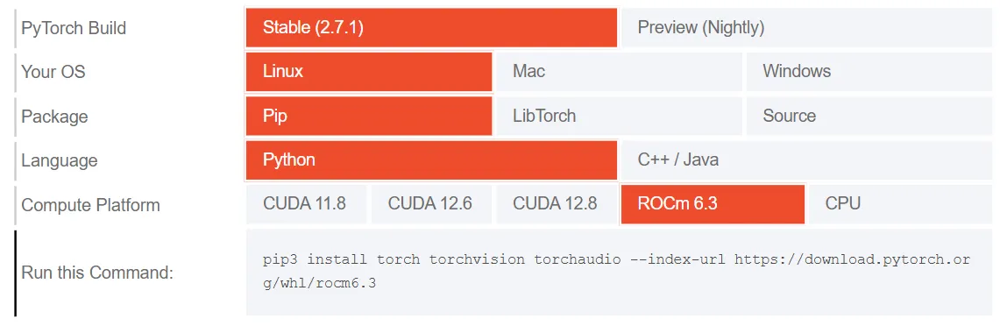

## S - While leveraging power of NVIDIA GPUs for DL, need a high-level interface
T - Built on CUDA, python framework

| Interface  | Type          | Contributor                            | Intro                                          | Used in    |
| ---------- | ------------- | -------------------------------------- | ---------------------------------------------- | ---------- |
| PyTorch    | DL framework  | Meta                                   | dynamic computing graph, easy to debug         | research   |
| TensorFlow | DL framework  | Google                                 | support deployment                             | Production |
| Keras      | Highlevel API | Independent first, then merged into TF | easy to use for prototyping, default run on TF | Education  |

R
- Ultimately call highly optimized CUDA routines
- abstracts away the complexity of direct CUDA programming, allowing you to write intuitive Python code

### Close look into PyTorch
<u> Core components </u>
- Linear algebra, Tensor lib, torch.tensor()
  - Expand numpy by GPU accelaration, to achive seamles computing bewteen CPU and GPU
- Calculus, Autograd engine, loss.backward()
  - Automatically calculate the gradient of tensor, simplifying backpropogation and model optimization
- DL lib, torch.nn.Module
  - _ _ init _ _() - define network in contructor
  - foward() - define interaction between layers
  - Modular, flexible building blocks, to accelerate design and train a model with ease

<u> PyTorch HW support </u>

| HW                | Support                                                  |
| ----------------- | -------------------------------------------------------- |
| Nvidia GPU (CUDA) | Fully support                                            |
| AMD GPU(ROCm)     | Limited support on Linux only                            |
| Intel GPU         | Not support   Intel is developing oneAPI and OpenVINO |

<u> Google Colab env </u>  
S - need a env  
- Like Jupyter Notebook
- Cloud based
- Free NVIDIA GPU (T4 most cases)

T - Google Colab env https://colab.research.google.com/

## S - How to train a LLM
T - 6 steps
- 1.Data preparation
  - Prepare datasets (MNIST, CIFAR, self-defined)
  - Encapsulate by Dataset and Dataloader
  - Data preprocessing (enhancement, normalization)
- 2.Model definition
  - Use pretrained model(ResNet, BERT) or define a new one by nn.Module
- 3.Training loop
  - Move both data and model to GPU
  - Forward pass -> calculate loss with Loss function (CrossEntropyLoss, MSELoss) -> backpropogation -> update parameters with Optimzaer (SGD, Adam, AdamW)
  - Train by Epoch loop
- 4.Model usage/inference
  - For inference sets, no need backpropogation by model.eval and torch.no_grad()
  - But need softmax
- 5.Model evaluation
  - Calculate loss, accuracy on training or test sets
  - For test sets, no need backpropogation by model.eval and torch.no_grad()
- 6.Model checkpoint save and load
