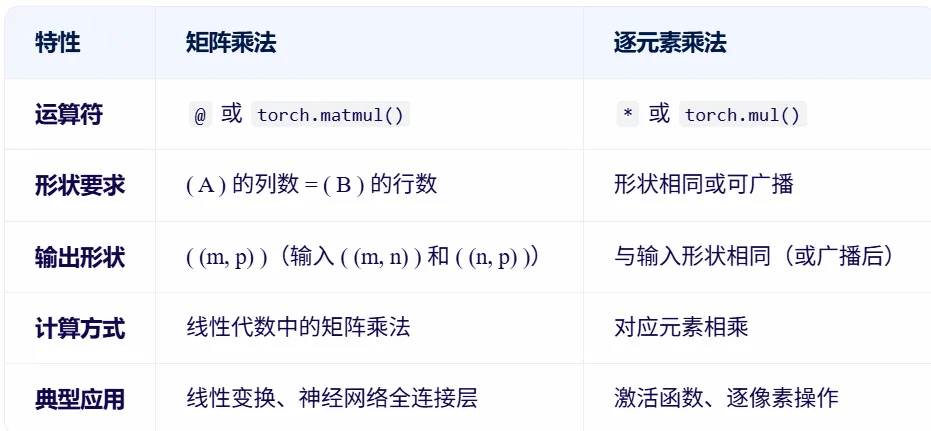
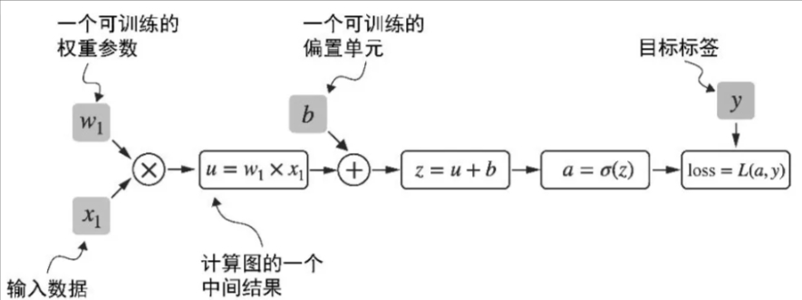
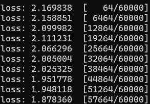

## Problem statement
FashionMNIST Problem Statement
- Classify grayscale images of fashion items (e.g., shirts, shoes, bags) into one of 10 categories.
- Like MNIST, each image is 28×28 pixels, but the content is clothing-related instead of digits.

MNIST Problem Statement
- Classify grayscale images of handwritten digits (0–9) into their correct numeric labels.
- Each image is 28×28 pixels, and the task is a 10-class classification problem.

The mainstream PyTorch will solve FashionMNIST probelm.
The minor stream of TensorFlow will demostarte how to solve MNIST problem.

---
## Step 1. Data preparation

### S - Collecting raw data
FashionMNIST Dataset
- Content: 70,000 grayscale images of fashion items (60,000 training + 10,000 test)
- Image size: 28×28 pixels
- Format: Same binary IDX format as MNIST
  - train-images-idx3-ubyte.gz: training images
  - train-labels-idx1-ubyte.gz: training labels
  - t10k-images-idx3-ubyte.gz: test images
  - t10k-labels-idx1-ubyte.gz: test labels
- Official link: https://github.com/zalandoresearch/fashion-mnis

MNIST Dataset
- Content: 70,000 grayscale images of handwritten digits (60,000 training + 10,000 test)
Image size: 28×28 pixels
- Format: Binary IDX format (compressed .gz files)
    - train-images-idx3-ubyte.gz: training images
    - train-labels-idx1-ubyte.gz: training labels
    - t10k-images-idx3-ubyte.gz: test images
    - t10k-labels-idx1-ubyte.gz: test labels
- Official link: http://yann.lecun.com/exdb/mnist/

FashionMNIST is in format of PIL in pytorch namespace
MNIST is in format of tensor digits in tensorflow namespace


### S - [Tensor lib] How to encode inputs, outputs and paramters of a model

- We have raw datasets at hands
- How to encode them into the pytorch
- This is where is the first core feature of pytorch, tensor lib, comes into play

T - Tensor  
**torch.Tensor/torch.tensor()**  
- similar to numpy's ndarrays, support matrix arithmetics
- optmized for running on GPUs and automatic differentiation  

A 
<u>Initialize tensor</u>
```py
# 1. from python list
import torch
x_data = torch.tensor([[1,2], [3,4]])


# 2. from numpy array
torch.from_numpy(np.array([[1,2], [3,4]]))


# 3. create random or constant values
shape = (2,3,)
torch.rand(shape)
torch.zeros(shape)
torch.ones(shape)
# Random Tensor:
#  tensor([[0.8918, 0.9173, 0.4270],
#         [0.3927, 0.7944, 0.0999]])
# Zeros Tensor:
#  tensor([[0., 0., 0.],
#         [0., 0., 0.]])
# Ones Tensor:
#  tensor([[1., 1., 1.],
#         [1., 1., 1.]])


# 4. from another tensor
## retain properties (shape and datatype) by default
torch.ones_like(x_data)
#  tensor([[1, 1],
#         [1, 1]])

## override datatype
torch.rand_like(x_data, dtype=torch.float)
#  tensor([[0.7985, 0.1295],
#         [0.4909, 0.2647]])
```


<u>Data type</u>
```py
#1. tensor's .dtype, to get
## int is python default int64
tensor_int = torch.tensor([1,2])
tensor_int.dtype
# torch.int64

## float is python default float32
torch.tensor([1.0,2.0]).dtype
# torch.float32
```

```py
#1. tensor's .to(), to convert
## convert int64 to float32
tensor_float = tensor_int.to(torch.float64)
# tensor_int is still torch.int64
# tensor_float is torch.float64, tensor([1., 2.], dtype=torch.float64)
```

<u>Shape</u>
```py
tensor2d = torch.tensor([[1, 2, 3], 
            [4, 5, 6]])

#1. tensor's .shape, to get
tensor2d.shape
torch.rand(2,3).shape
# Shape of tensor: torch.Size([3, 4])
```

```py
# pytroch has many syntax to run same function
# initial syntax for Lua version Torch
# new syntax for numpy like

#1.1 tensor's .reshape, to reshape, will auto copy data if not continous
# reshape to 3 * 2
tensor2d.reshape(3,2)
# tensor([[1, 2],
#         [3, 4],
#         [5, 6]])

#1.2 tensor's .view, is more used one, need the raw data is continous in memory
tensor2d.view(3, 2)
# tensor([[1, 2],
#         [3, 4],
#         [5, 6]])
```


<u>Arithmetics</u>
```py
tensor2d = torch.tensor([[1, 2, 3], 
            [4, 5, 6]])

########### Addition ###########
#1.1 tensor's .sum(), add all values of a tensor into one value
agg = tensor2d.sum() 
# tensor(21)

## .item(), convert single-element tensor to python numerical value
agg_item = agg.item()
print(agg_item, type(agg_item))
# 21 <class 'int'>


#1.2 tensor's .add(), add each value by a same value
tensor2d.add(5)
# tensor2d itself not changed

## tensor's _ suffix, is in-place operations that store result into rhe operand
tensor2d.add_(5)
# tensor2d itself is changed


########### When dot product, Matrix Multiplication ###########
#2 tensor's .T, to transpose, interchange row and column
tensor2d.T
# tensor([[1, 4],
#         [2, 5],
#         [3, 6]])

#3.1 tensor's .matmul, matrix multiplication
tensor2d.matmul(tensor2d.T)
# tensor([[14, 32],
#         [32, 77]])

#3.2 @ operator for tensors, more used one
tensor2d @ tensor2d.T
# tensor([[14, 32],
#         [32, 77]])

########### Element-wise Multiplication ###########
# matrix multiplication
A = torch.rand(2, 3)  #  (2, 3)
B = torch.rand(3, 4)  #  (3, 4)
C = A @ B             #  (2, 4)
 
# element-wise multiplication
A = torch.rand(2, 3)  #  (2, 3)
B = torch.rand(2, 3)  #  (2, 3)
D = A * B             #  (2, 3)
```
 


<u>Device</u>
```py
tensor2d = torch.tensor([[1, 2, 3], 
            [4, 5, 6]])

#1. tensor's .device, to get
tensor2d.device
# device(type='cpu')
```

```py
# by default, tensors are on CPU
#1. tensor's .to(), to explictly move to GPU, copying is expensive in time and memory
device = "cuda" if torch.cuda.is_available() else "cpu"
tensor2d.to(device) 
```


### S - Encapsulate tensors and decople for better consumption
- We have lots of tensors at hands
- Code for processing data samples cane get messy and hard to maintain
- How to organize/encapsulate them for better consumption
- Decople dataset code from model training code for better readability and modularity

TA - Dataset and Dataloader
1. We have four **torch.Tensor** for traning and testing including samples and labels
```py
X_train = torch.tensor([
    [-1.2, 3.1],
    [-0.9, 2.9],
    [-0.5, 2.6],
    [2.3, -1.1],
    [2.7, -1.5]
])

y_train = torch.tensor([0, 0, 0, 1, 1])

X_test = torch.tensor([
    [-0.8, 2.8],
    [2.6, -1.6],
])

y_test = torch.tensor([0, 1])
```

2. **torch.utils.data.dataset.Dataset/torch.utils.data.Dataset** stores the samples and their corresponding labels into one object
- Inheritate PyTorch's Dataset to self define
- _ _ init _ _() - initialize properties used by following methods, tensor object
- _ _ getitem _ _() - return single sample and label by index
- _ _ len _ _() - return samples length
```py
from torch.utils.data import Dataset

class ToyDataset(Dataset):
    def __init__(self, X, y):
        self.features = X
        self.labels = y

    def __getitem__(self, index):
        return self.features[index], self.labels[index]

    def __len__(self):
        return self.labels.shape[0]

train_ds = ToyDataset(X_train, y_train)
test_ds = ToyDataset(X_test, y_test)
# <__main__.ToyDataset object at 0x7f9a7cb46620>


train_ds[0]
# (tensor([-1.2000,  3.1000]), tensor(0))
x, y = test_ds[0][0], test_data[0][1]
```

3. **torch.utils.data.dataloader.DataLoader/torch.utils.data.DataLoadera()** wraps an iterable around the Dateset to enable easy access to the samples.
   - batch_size=2
     - improve efficiency
   - drop_last=True
     - the last batch may smaller than others, could impact convergence
     - drop the last batch
   - shuffle=True
     - Each epoch has same sequence of data, could impact training
     - Shuffle data sequence among epoches
     - use torch.manual_seed(123) to set seed, to get same order of shuffling
   - num_workers=4
     - start numtiple worker processes to load data paralelly, to feed GPU
```py
from torch.utils.data import DataLoader

torch.manual_seed(123)

train_loader = DataLoader(
    dataset=train_ds,
    batch_size=2,
    shuffle=True,
    num_workers=0
)

test_loader = DataLoader(
    dataset=test_ds,
    batch_size=2,
    shuffle=False,
    num_workers=0
)
# <torch.utils.data.dataloader.DataLoader object at 0x7f9a7cf0d930>

```
```py
############ dataloader is an iterable ############
#1. get one batch of data (samples and labels)
i = iter(train_loader) # creates an iterator
data = next(i) # retrieves the first batch from that iterator
# [tensor([[ 2.3000, -1.1000],
#         [-0.9000,  2.9000]]), tensor([1, 0])]
# [tensor(of size 2), tensor(of size 2)]


#2. get each batch of data (samples and labels)
for X, y in test_loader:
    print(X.shape)
    print(y.shape)
    break
# torch.Size([2, 2])
# torch.Size([2])


#3. get one batch of data (samples and labels), with batch index
e = enumerate(test_loader) # enumerator is an interator with index
batch, (X, y) = next(e) 
# (0, [tensor([[-0.8000,  2.8000],
#         [ 2.6000, -1.6000]]), tensor([0, 1])])
# (0, [tensor(of size 2), tensor(of size 2)])


# 4. get each batch of data (samples and labels), with index
for batch_id, (X, y) in enumerate(test_loader):
    print(batch_id)
    print(X.shape)
    print(y.shape)
    break
# 0
# torch.Size([2, 2])
# torch.Size([2])
```

```py
############ dataloader progress ############
# Batch is based on loader
test_loader
# <torch.utils.data.dataloader.DataLoader object at 0x7f9a7cf0d930>

# 1. total batch num
num_batches = len(test_loader)

# 2. every 100 batch
for batch, (X, y) in enumerate(test_loader): 
    if batch % 100 == 0:
        print(batch)
        # 0,1,2,3,...,60000/64


# data is based on loader.dataset
test_loader.dataset
# <__main__.ToyDataset object at 0x7f9b4e0dcdc0>

# 3. total sample num
len(test_loader.dataset)
# 60000

# 4. current sample num
for batch, (X, y) in enumerate(test_loader): 
    if batch % 100 == 0:
        print((batch + 1) * len(X))
```

### S - Data preprocessing (enhancement, normalization)
- Data does not always come in its final processed form that is required for training machine learning algorithms
- Need to perform some manipulation of the data and make it suitable for training
  
T - transform

<u>Load the pre-defined FashionMNIST **datasets** from torchvision.datasets.FashionMNIST()</u>
- encapsulate raw data by datasets
- root - is the path where the train/test data is stored
- train - specifies training or test dataset
- download=True - downloads the data from the internet if it’s not available at root

<u>**Preprocessing** the datasets</u>
- transforms - We use transforms to perform some manipulation of the data and make it suitable for training.

|FashionMNIST|Features|Labels|
|-|-|-|
|Original|in PIL Image format|integers|
Parameter. Both accept callables containing the transformation logic|transform to modify the features |target_transform to modify the labels|
|Callables| ToTensor() converts a PIL image into a FloatTensor and scales the image’s pixel intensity values in the range [0., 1.] ``` transform=ToTensor(),``` | Lambda transforms apply any user-defined lambda function. Here, we define a function to turn the integer into a one-hot encoded tensor. It first creates a zero tensor of size 10 (the number of labels in our dataset) and calls scatter_ which assigns a value=1 on the index as given by the label y. ```py target_transform = Lambda(lambda y: torch.zeros(10, dtype=torch.float).scatter_(dim=0, index=torch.tensor(y), value=1)) ```|
|Trainig req| as normalized tensors |as one-hot encoded tensors.|

A2 - PT on MNIST
```py
from torchvision import datasets
from torchvision.transforms import ToTensor

# Download training data from open datasets.
training_data = datasets.FashionMNIST(
    root="data",
    train=True,
    download=True,
    transform=ToTensor(),
)

# Download test data from open datasets.
test_data = datasets.FashionMNIST(
    root="data",
    train=False,
    download=True,
    transform=ToTensor(),
)
```

```py
from torch.utils.data import DataLoader

batch_size = 3

train_dataloader = DataLoader(training_data, batch_size=batch_size)
test_dataloader = DataLoader(test_data, batch_size=batch_size)
```


A2 - TF on MNIST

<u>Load the MNIST from tf.keras.datasets.mnist.load_data()</u>
Originally
- pixel values of the images range from 0 through 255
- they are all numpy.ndarray

<u>Normalization</u>
- Scale these values to a range of 0 to 1 by dividing the values by 255.0.
- Above also converts the sample data from integers to floating-point numbers
```py
import tensorflow as tf

mnist = tf.keras.datasets.mnist

(x_train, y_train), (x_test, y_test) = mnist.load_data()
x_train, x_test = x_train / 255.0, x_test / 255.0
```

### Summary
PT
```py
from torchvision import datasets
from torchvision.transforms import ToTensor
from torch.utils.data import DataLoader

batch_size = 3

# Download training data from open datasets.
training_data = datasets.FashionMNIST(
    root="data",
    train=True,
    download=True,
    transform=ToTensor(),
)

# Download test data from open datasets.
test_data = datasets.FashionMNIST(
    root="data",
    train=False,
    download=True,
    transform=ToTensor(),
)

train_dataloader = DataLoader(training_data, batch_size=batch_size)
test_dataloader = DataLoader(test_data, batch_size=batch_size)
```

TF

```py
import tensorflow as tf

mnist = tf.keras.datasets.mnist

(x_train, y_train), (x_test, y_test) = mnist.load_data()
x_train, x_test = x_train / 255.0, x_test / 255.0
```


---
## Step2. Model definition
### S - [DL lib] Define the model/neural network
T - DL lib
**torch.nn** namespace provides all the building blocks you need to build your own neural network
- inherits from nn.Module
- _ _ init _ _() function - define the layers of the network
- forward function - specify how data will pass through the network. This forms the computing graph
- move the model also to the accelerator.


1. Input - a sample minibatch of 3 images of size 28x28
```py
input_image = torch.rand(3,28,28)
print(input_image.size())
# torch.Size([3, 28, 28])
```
2. initialize the **nn.Flatten layer** to convert each 2D 28x28 image into a contiguous array of 784 pixel values
```py
flatten = nn.Flatten()
flat_image = flatten(input_image)
print(flat_image.size())
# torch.Size([3, 784])
```
3. **nn.Linear layer** is a module that applies a linear transformation on the input using its stored weights and biases.
```py
layer1 = nn.Linear(in_features=28*28, out_features=20)
hidden1 = layer1(flat_image)
print(hidden1.size())
# torch.Size([3, 20])
```
4. **nn.ReLU non-linear activations**  are applied after linear transformations to introduce nonlinearity, helping neural networks learn a wide variety of phenomena.
```py
print(f"Before ReLU: {hidden1}\n\n")
hidden1 = nn.ReLU()(hidden1)
print(f"After ReLU: {hidden1}")
```
5. **nn.Sequential** is an ordered container of modules. The data is passed through all the modules in the same order as defined. 
```py
seq_modules = nn.Sequential(
    flatten,
    layer1,
    nn.ReLU(),
    nn.Linear(20, 10)
)
```

A
```py
from torch import nn

# Define model
class NeuralNetwork(nn.Module):
    def __init__(self):
        super().__init__()
        self.flatten = nn.Flatten()
        self.linear_relu_stack = nn.Sequential(
            nn.Linear(28*28, 512),
            nn.ReLU(),
            nn.Linear(512, 512),
            nn.ReLU(),
            nn.Linear(512, 10)
        )

    def forward(self, x):
        x = self.flatten(x)
        logits = self.linear_relu_stack(x)
        return logits

import torch
device = torch.device("cuda" if torch.cuda.is_available() else "cpu")
model = NeuralNetwork().to(device)
print(model)
# NeuralNetwork(
#   (flatten): Flatten(start_dim=1, end_dim=-1)
#   (linear_relu_stack): Sequential(
#     (0): Linear(in_features=784, out_features=512, bias=True)
#     (1): ReLU()
#     (2): Linear(in_features=512, out_features=512, bias=True)
#     (3): ReLU()
#     (4): Linear(in_features=512, out_features=10, bias=True)
#   )
# )

# Every param with requires_grad=True will be trained and updated ruding training.
# Accee weight of one layer
model.layers[0].weight
# Accee bias of one layer
model.layers[0].bias
# Check all trainable params of one model
sum(p.numel() for p in model.parameters() if p.requires_grad)
```

TF

PT: nn.Linear(in_features, out_features)
- in_features: input dimension
- out_features: output dimension = number of neurons in the layer  

TF: tf.keras.layers.Dense(units)
- units: Number of neurons in the layer = output dimension
- Input dimension is inferred from the previous layer or specified using input_shape.

```py
model = tf.keras.models.Sequential([
  tf.keras.layers.Flatten(input_shape=(28, 28)),
  tf.keras.layers.Dense(128, activation='relu'),
  tf.keras.layers.Dense(10)
])
```

---
## Step3. Training loop

### S - Move data and model to GPU
```py
model = model.to(device)

for batch, (X, y) in enumerate(dataloader):
    X, y = X.to(device), y.to(device)
```

### S - Training
T
<u>1. Put model in training mode</u>
```py
model.train()
```
> 📌 Evaluation
turns off dropout
model.eval()

> 📌 Inference
turns off dropout
model.eval()


<u>2. Forward pass/predict</u>

Dynamic computation graph
- Dynamic
  - Computation graph is constructed **on-the-fly** when you really forward pass. 
  - Every foward pass will build a **new** computation graph to accomodate current input data
- Computation graph
  - Is a directed graph
  - List all the computing sequnce, which will be used later to calculate gradient when backpropagation.
- How
  - As long as one of the end node is set with required_grad=True, PyTorch will build a computing graph by default accroding to foward().
```py
pred = model(X)
# tensor([[-1.0240e-01,  6.9089e-02,  ...
```

How to use the pred result
```py
pred = model(x)
pred
# tensor([[-2.6683, -3.2515, -1.3364, -2.3363, -1.3656,  3.0426, -1.2521,  3.0325,
#           2.0545,  3.5086]], grad_fn=<AddmmBackward0>)

pred[0]
# tensor([-2.6683, -3.2515, -1.3364, -2.3363, -1.3656,  3.0426, -1.2521,  3.0325,
#          2.0545,  3.5086], grad_fn=<SelectBackward0>)

pred[0].argmax(0)
# tensor(9)

# if pred is a matrix
# (pred.argmax(1) == y).type(torch.float).sum().item()
```


> 📌 Evaluation 
No backpropagation, no training, no need to build computation graph to save memory
with torch.no_grad(): out = model(X)

> 📌 Inference 
No backpropagation, no training, no need to build computation graph to save memory
with torch.no_grad(): out = model(X)


<u>3. Calculate loss/prediction error with Loss function (CrossEntropyLoss, MSELoss)</u>
Return logits in last layer in pytorch
- Pytorch's loss function (CrossEntropyLoss) will apply softmax for logits internally, and use more stable way like log-softmax + NLLLoss to avoid overflow and underflow
```py
loss_fn = nn.CrossEntropyLoss()
loss = loss_fn(pred, y)
# tensor(2.3065, grad_fn=<NllLossBackward0>)
```

> 📌 Evaluation
Need this step to show loss only.

> 📌 Inference 
No need this step. 
But need to softmax the output
logits=[2.0,1.0,0.1]
probs=softmax(logits)


<u>4. Backpropogation to compute gradient</u>
Calculate loss's garident to w1 by grad()
```py
import torch.nn.functional as F
from torch.autograd import grad

y = torch.tensor([1.0])
x1 = torch.tensor([1.1])
w1 = torch.tensor([2.2], requires_grad=True)
b = torch.tensor([0.0], requires_grad=True)

z = x1 * w1 + b 
a = torch.sigmoid(z)

loss = F.binary_cross_entropy(a, y)

grad_L_w1 = grad(loss, w1, retain_graph=True)
grad_L_b = grad(loss, b, retain_graph=True)

print(grad_L_w1)
print(grad_L_b)

# (tensor([-0.0898]),)
# (tensor([-0.0817]),)
```
PyTorch provides Autograd to automate this process: loss.backward()
- Compute the gradients of all leaf nodes in the computation graph.
- These gradients are stored in the .grad attribute of the tensors
```py
loss.backward()

print(w1.grad)
print(b.grad)
# tensor([-0.0898])
# tensor([-0.0817])
```

> 📌 Evaluation
No need this step.

> 📌 Inference 
No need this step.

<u>5. Update parameters with Optimizer (SGD, Adam, AdamW)</u>
```py
optimizer = torch.optim.SGD(model.parameters(), lr=1e-3)
# params：params to be optimized, normally model.parameters()
# lr：learning rate

# Gradients accumulate by default in PyTorch (i.e., they are not overwritten), so you need to zero them out before the next backward pass.
optimizer.zero_grad()

# Computes the gradients of the loss with respect to all model parameters (i.e., performs backpropagation).
# loss.backward()

# Applies the optimization algorithm (e.g., SGD, Adam) to adjust the weights to minimize the loss.
optimizer.step()
```

> 📌 Evaluation
No need this step.

> 📌 Inference 
No need this step.

### S - Epochs loop
```py
epochs = 5
for t in range(epochs):
    print(f"Epoch {t} ------------------------------")
    train()
```

### Summary
```py
def train(dataloader, model, loss_fn, optimizer):
    model.train()
    for batch, (X, y) in enumerate(dataloader):
        X, y = X.to(device), y.to(device)

        # Compute prediction error
        pred = model(X)
        loss = loss_fn(pred, y)

        # Backpropagation
        optimizer.zero_grad()
        loss.backward()
        optimizer.step()  

loss_fn = nn.CrossEntropyLoss()
optimizer = torch.optim.SGD(model.parameters(), lr=1e-3)

epochs = 5
for t in range(epochs):
    print(f"Epoch {t} ------------------------------")
    train(train_dataloader, model, loss_fn, optimizer)
```

TF on MNIST
Why from_logits=True?
- If your model's final layer does not include a Softmax activation (i.e., it outputs raw scores or "logits"), you must set from_logits=True.
- This tells TensorFlow to apply softmax internally before computing the cross-entropy loss.

```py
loss_fn = tf.keras.losses.SparseCategoricalCrossentropy(from_logits=True)
optimizer='adam'

model.compile(optimizer='adam',
              loss=loss_fn,
              metrics=['accuracy'])

model.fit(x_train, y_train, epochs=5)
```


---
## Step 5. Model usage/inference
```py
classes = [
    "T-shirt/top",
    "Trouser",
    "Pullover",
    "Dress",
    "Coat",
    "Sandal",
    "Shirt",
    "Sneaker",
    "Bag",
    "Ankle boot",
]

model.eval()
x, y = test_data[0][0], test_data[0][1]
with torch.no_grad():
    x = x.to(device)
    pred = model(x)
    predicted, actual = classes[pred[0].argmax(0)], classes[y]
    print(f'Predicted: "{predicted}", Actual: "{actual}"')
```


---
## Step 5.Model evaluation

### S - Show progress with loss and accuracy
T
<u>Train</u>
Every 100 batch and overall data process, show the loss

```
>7f denotes
  > right aligned
  7 overall width is 7 chars
  f show float
```
```py
size = len(dataloader.dataset)
for batch, (X, y) in enumerate(dataloader):
    if batch % 100 == 0:
        loss, current = loss.item(), (batch + 1) * len(X)
        print(f"loss: {loss:>7f}  [{current:>5d}/{size:>5d}]")
```

<u>Test</u>
Each epoch, show average loss by batch
```py
test_loss = 0
for every batch:
    test_loss += loss_fn(pred,y).item()
num_batches = len(dataloader)
test_loss /= num_batches
```

Each epoch, show the accurate sample number
```py
correct = 0
for:
    correct += (pred.argmax(1) == y).type(torch.float).sum().item()
size = len(dataloader.dataset)
correct /= size
```
- pred.argmax(1)：get index of highest value
- == y：compare with target
- .type(torch.float): convert bool to float
- .sum(): sum each sample
- .item(): covnert to python datatype

A
```py
def train(dataloader, model, loss_fn, optimizer):
    size = len(dataloader.dataset)
    model.train()
    for batch, (X, y) in enumerate(dataloader):
        X, y = X.to(device), y.to(device)

        # Compute prediction error
        pred = model(X)
        loss = loss_fn(pred, y)

        # Backpropagation
        optimizer.zero_grad()
        loss.backward()
        optimizer.step()

        if batch % 100 == 0:
            loss, current = loss.item(), (batch + 1) * len(X)
            print(f"loss: {loss:>7f}  [{current:>5d}/{size:>5d}]")

def test(dataloader, model, loss_fn):
    size = len(dataloader.dataset)
    num_batches = len(dataloader)
    test_loss, correct = 0, 0

    model.eval()
    with torch.no_grad():
        for X, y in dataloader:
            X, y = X.to(device), y.to(device)
            pred = model(X)
            test_loss += loss_fn(pred, y).item()
            correct += (pred.argmax(1) == y).type(torch.float).sum().item()
    test_loss /= num_batches
    correct /= size
    print(f"Test Error: \n Accuracy: {(100*correct):>0.1f}%, Avg loss: {test_loss:>8f} \n")

loss_fn = nn.CrossEntropyLoss()
optimizer = torch.optim.SGD(model.parameters(), lr=1e-3)

epochs = 5
for t in range(epochs):
    print(f"Epoch {t}------------------------------")
    train(train_dataloader, model, loss_fn, optimizer)
    test(test_dataloader, model, loss_fn)
print("Done!")
```

TF on MNIST
```py
model.evaluate(x_test,  y_test, verbose=2)
```


---
## Step 6. Model checkpoint save and load
T   
Model has
- structure 
- internal state dictionary (containing the model parameters)
- 像 AdamW 这样的自适应优化器可以为每个模型权重存储额外的参数。AdamW 可以使用历史数据动态地调整每个模型参数的学习率。

Save a model
- is to serialize the internal state dictionary to a file .pth

Load a model includes 
- re-creating the model structure
- loading the state dictionary into it.

A
```py
torch.save(model.state_dict(), "model.pth")

model = NeuralNetwork().to(device)
model.load_state_dict(torch.load("model.pth", weights_only=True))
```

```py
# save
torch.save({
    "model_state_dict": model.state_dict(),
    "optimizer_state_dict": optimizer.state_dict(),
    }, 
    "model_and_optimizer.pth"
)

# load
checkpoint = torch.load("model_and_optimizer.pth", weights_only=True)

model = GPTModel(GPT_CONFIG_124M)
model.load_state_dict(checkpoint["model_state_dict"])

optimizer = torch.optim.AdamW(model.parameters(), lr=0.0005, weight_decay=0.1)
optimizer.load_state_dict(checkpoint["optimizer_state_dict"])

model.train()
```

---
## Conclusion
PT
```py
from torchvision import datasets
from torchvision.transforms import ToTensor

# Download training data from open datasets.
training_data = datasets.FashionMNIST(
    root="data",
    train=True,
    download=True,
    transform=ToTensor(),
)

# Download test data from open datasets.
test_data = datasets.FashionMNIST(
    root="data",
    train=False,
    download=True,
    transform=ToTensor(),
)


from torch.utils.data import DataLoader

batch_size = 3

# Create data loaders.
train_dataloader = DataLoader(training_data, batch_size=batch_size)
test_dataloader = DataLoader(test_data, batch_size=batch_size)


from torch import nn

# Define model
class NeuralNetwork(nn.Module):
    def __init__(self):
        super().__init__()
        self.flatten = nn.Flatten()
        self.linear_relu_stack = nn.Sequential(
            nn.Linear(28*28, 512),
            nn.ReLU(),
            nn.Linear(512, 512),
            nn.ReLU(),
            nn.Linear(512, 10)
        )

    def forward(self, x):
        x = self.flatten(x)
        logits = self.linear_relu_stack(x)
        return logits

import torch
device = torch.device("cuda" if torch.cuda.is_available() else "cpu")
model = NeuralNetwork().to(device)
print(model)


def train(dataloader, model, loss_fn, optimizer):
    size = len(dataloader.dataset)
    model.train()
    for batch, (X, y) in enumerate(dataloader):
        X, y = X.to(device), y.to(device)

        # Compute prediction error
        pred = model(X)
        loss = loss_fn(pred, y)

        # Backpropagation
        loss.backward()
        optimizer.step()
        optimizer.zero_grad()

        if batch % 100 == 0:
            loss, current = loss.item(), (batch + 1) * len(X)
            print(f"loss: {loss:>7f}  [{current:>5d}/{size:>5d}]")


def test(dataloader, model, loss_fn):
    size = len(dataloader.dataset)
    num_batches = len(dataloader)
    model.eval()
    test_loss, correct = 0, 0
    with torch.no_grad():
        for X, y in dataloader:
            X, y = X.to(device), y.to(device)
            pred = model(X)
            test_loss += loss_fn(pred, y).item()
            correct += (pred.argmax(1) == y).type(torch.float).sum().item()
    test_loss /= num_batches
    correct /= size
    print(f"Test Error: \n Accuracy: {(100*correct):>0.1f}%, Avg loss: {test_loss:>8f} \n")


loss_fn = nn.CrossEntropyLoss()
optimizer = torch.optim.SGD(model.parameters(), lr=1e-3)


epochs = 5
for t in range(epochs):
    print(f"Epoch {t}\n-------------------------------")
    train(train_dataloader, model, loss_fn, optimizer)
    test(test_dataloader, model, loss_fn)
print("Done!")


classes = [
    "T-shirt/top",
    "Trouser",
    "Pullover",
    "Dress",
    "Coat",
    "Sandal",
    "Shirt",
    "Sneaker",
    "Bag",
    "Ankle boot",
]

model.eval()
x, y = test_data[0][0], test_data[0][1]
with torch.no_grad():
    x = x.to(device)
    pred = model(x)
    predicted, actual = classes[pred[0].argmax(0)], classes[y]
    print(f'Predicted: "{predicted}", Actual: "{actual}"')
```

TF
```py
import tensorflow as tf

mnist = tf.keras.datasets.mnist

(x_train, y_train), (x_test, y_test) = mnist.load_data()
x_train, x_test = x_train / 255.0, x_test / 255.0


model = tf.keras.models.Sequential([
  tf.keras.layers.Flatten(input_shape=(28, 28)),
  tf.keras.layers.Dense(128, activation='relu'),
  tf.keras.layers.Dropout(0.2),
  tf.keras.layers.Dense(10)
])


loss_fn = tf.keras.losses.SparseCategoricalCrossentropy(from_logits=True)
optimizer='adam'

model.compile(optimizer='adam',
              loss=loss_fn,
              metrics=['accuracy'])

model.fit(x_train, y_train, epochs=5)


model.evaluate(x_test,  y_test, verbose=2)
```