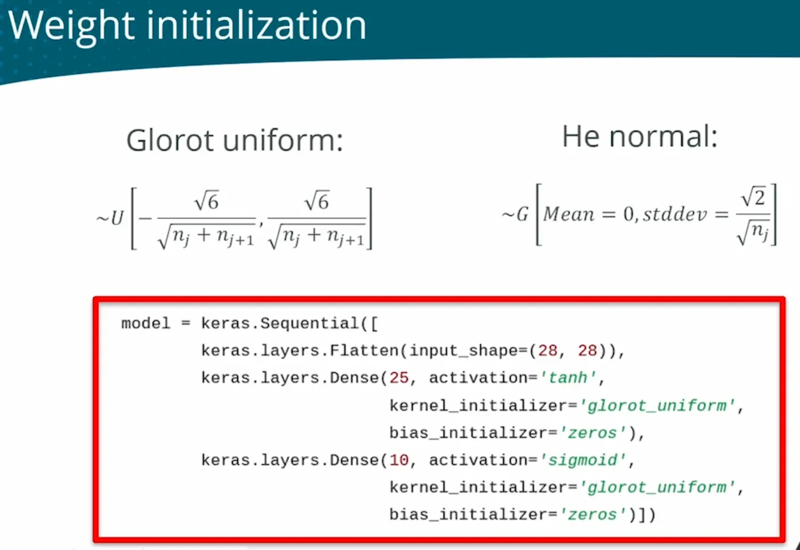
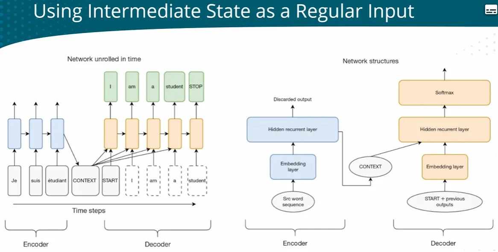
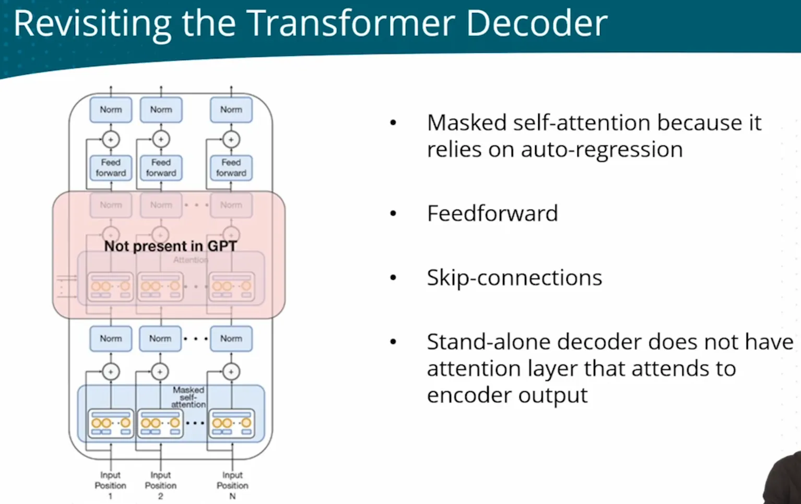

## Quick refresher
|Input | Output|Child|Arch|Activation|Loss|
|-|-|-|-|-|-|
Non-sequential data|Binary classification || Multil-layer | Sigmoid |Binary cross entropy|
||Multiclass calssification|| **Normalization** is about around zero to avoid vanishing gradient| Relu/softmax| Categorical cross-entry |
||Multiclass classification - Image recognization|| CNN||
||Regression||**Regularization** is about dropping or penalty to avoid overfitting|Linear/no activation|MSE|
|Sequential data| Regression||RNN/LSTM|
||Multiclass classification - Text autocompletion (char-by-char) ||
||Text autocompletion (token-by-token)||RNN with embedding|
|||Translation|attention+RNN/ED  -> self-attenion/multi-head/Transformer-RNN|
||NLP - understand the context|| BERT|
||NLP - text generation||GPT|

---
## Full landscape
| 
Problem type| 
note
 | 
Network topology
 | 
Activation function
 | 
Loss function
 | 
Adjust weights
 |
|-|-|-|-|-|-|
| **Binary classification - logical OR/AND/NAND functions** | - | Single perceptron  | Sign  | y != y_hat | x[i] is the magnitude  y is the direction   L_R = 0.1   w[i] += y * L_R * x[i] |
| **Binary classification - logical XOR function** | - | Perceptron cannot separate XOR with a single straight line    Multi perceptron - Two layer network  |  Sign contains discontinuity. Need continous functions to use gradient descent    Defferentiable active function: tanh for hidden, logistic for output  |  Sum of errors: 1.multiple errors may cancel each other out. 2.sum depends on num of examples     Mean squared error  | Gradient    derivative is the sensitivity: 1.slope is steep, derivate is large, step are large. 2.slope is positive, minus, move to left   w = w -  L_R * de/dw|
|**Binary classification - if a patient has a specific condition based on a num of input variables (From bellow optimized)**| - | logistic output unit  | Sigmoid|Binary Cross Entropy|-|
|**Multiclass classification - classify MNIST handwritten digits**|-| Need a multiclass output    | - Sign | - MSE | - SDG |
|(DL framework) | -| Higher level | Configuration | Configuration | Automatic |
| Saturated neuron to Vanishing gradients    Mitigation | (Input) & Hidden layer | Input layer - Input normalization/standardization to control the range of input       Hidden layer - Batch normalization    Weights in every layer - Weight initialization  | using tanh hidden activation function     Different activation function: relu |-|Gradient direction diverge   BATCH_SIZE     Fixed lr vibrating when converging   dynamic L_R of Adam|
|-|Output layer| glorot_uniform for sigmoid |sigmoid|When using sigmoid funcction in output layer, use binary cross-entry loss function |-|
|Some sigmoid may have same value   |-| | softmax is mutual exclusive|Categorical cross-entry loss function|-|
|**Multiclass classification - classify CIFAR-10 objects/ImageNet DS 1000 objetcs**|-|Image needs to extract spatial features   Adding convolutional layers   CNN       Heavy computing for large image  Max-pooling by model.add(MaxPooling2D(pool_size=(2,2), stride=2))    Edge pixel not learned   Padding by padding='same'    Inefficient CNN  Depth-wise separable convolutions; EffificentNet |- ConLayer is relu; - Output layer is softmax| - Categorical cross-entry loss function|-|
|(Use a pre-trained network/model e.g. ResNet-50)|-|Arch:   AlexNet   VGGNet - building block   GoogLeNet - Inception module   ResNet - Skip-Connection|-|-|-|
|(Customize a pre-trained network/model)|-|Transfer learning - Replace the output layers and retrain Fine-tuning model - Retrain directly the upper layers   Data augmentation  - Create more training data from extsing data|-|-|-|
|**Regression - predict a numeral value rather than a class/predict demand and price for an item**|-|Need to output any number without restriction from activation    The output layer consists of a single neuron with a linear activation function|Linear activaiton/no activation function|MSE|-|
|ALL PROBLEM - training error rise/raise at end, not good|-|Deeper(adding more layers) and wider(adding more neurons) network|-|-|-|
|ALL PROBLEM- overfitting (test error rise at end, not training error)   Regularizaiton|-| Drop-out neurons by model.add(Dropout(0.3))|-|Wright decay adding a penalty term to the loss function |eary stopping|
|**Sequential data - Regression - Predict book sales based on historical sales data** | -|  Need depends on previous inputs and requires memory. Fully Connected Networks (FCNs) cannot capture temporal dependencies.  To handle variable-length sequences, FCNs can only process fixed-length inputs.    Add a Recurrent layer  RNN  model.add(SimpleRNN(128, activation='relu')) |-|BPTT Unroll automatically|-|
|Long sequence network, Weight multplication leads to gadient vanishing or explore  |-| Use LSTM layer instead of RNN layer  LSTM(64,input_shape=(10,8)),|
|**Sequential data - Multiclass classification - Text autocompletion (char-by-char)**|-|How to generate a sequence step by step   Autoregression    How to avoid greedy selection during the generation process   Beam size|
|**<u>Text autocompletion (token-by-token)</u> - Speech recognition - Translation**| RNN | Neural Language Models (RNN but  autoregression token-by-token) with embedding layer |
|**- <u>Translation</u>** | RNN/ED+attenion|Tranlation involves two languages, need two LM   Encoder-Decoder network     When processing long texts, easy to 'forget' earlier information   Attention mechanism - ALL - every timestep has all context  - FOCUS - Dynanically focus on different parts of context at different time steps - Attention network  |
||Self-attenion without RNN|one attention serial and slow   Self-attention layer - Mutli attentions(forms an attention layer)    - Replace RNN with FCL - Self - Q and KV all from self, remove dependency   No dependencies between words, in parellel and fast     Capture features in one dimension only   multi-head self-attention layer: multi-head can capture differenent aspects of features for one input     Transformer - multi-head attention layer - multi-head  self-attention layer - Norm layer - Mutli-encoder-decoder-modules  |
|**NLP - understand the context  - better at understanding context , mainly used for comprehension tasks such as classification and labeling.   - but has weaker generation capabilities, needs to be combined with other models to perform text generation.** ● Sentiment analysis  ● Spam analysis  ● Classify second sentence as entailemnt, contradiction, or neutral  ● Identify words that answer a question|E|LLM -BERT   <u>Birdirectional</u> Predicting the middle part from the surrounding context — cloze-style tasks.    <u>(Pretained)</u> as ● masked language model  ● next-sentence prediction <u>Encoder Representations from Transformers</u> only |
|**NLP - phrase the problem in a way that probability of a given completion can be interpreted as solution Good at generating coherent and logically structured text, suitable for scenarios such as dialogue generation, article continuation, and creative writing**  ● Sentiment analysis ● Entailment ● Similarity ● Multiple choice |D|LLM - GPT  <u>Generative</u> predict next word  <u>Pre-trained</u> as LM <u>Transformer</u> decoder only without cross-attention   ● GPT-2: Scaling the model make zero-shot much better  ● GPT-3: providng in-context(learning at inference time) examples(few-shots) improves accuracy  - Codex/Copilot: Based on GPT-3, supervised fine-tuned (with code/docstring/ut as data) to generate Python code   - InstructGPT/ChatGPT: Based on GPT-3, SFT+RLHF, align model with user's intention  ● GPT-4: Fine-tuned with RLHF, align model wtih Multi-Modal(text, image) Input