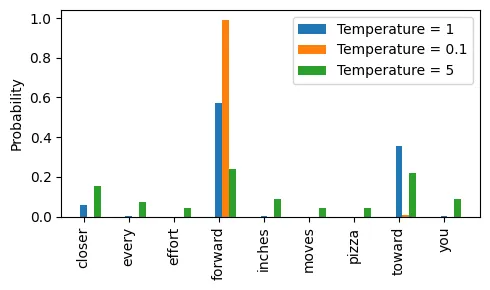

## QA


## Quick refresher
### Overall flow


### Architecture
GPT-2
 
```py
class GPTModel(nn.Module):
    def __init__(self, cfg):
        super().__init__()
        self.tok_emb = nn.Embedding(cfg["vocab_size"], cfg["emb_dim"])
        self.pos_emb = nn.Embedding(cfg["context_length"], cfg["emb_dim"])
        self.drop_emb = nn.Dropout(cfg["drop_rate"])

        self.trf_blocks = nn.Sequential(
            *[TransformerBlock(cfg) for _ in range(cfg["n_layers"])])

        self.final_norm = LayerNorm(cfg["emb_dim"])
        self.out_head = nn.Linear(cfg["emb_dim"], cfg["vocab_size"], bias=False)

    def forward(self, in_idx):
        batch_size, seq_len = in_idx.shape
        tok_embeds = self.tok_emb(in_idx)
        pos_embeds = self.pos_emb(torch.arange(seq_len, device=in_idx.device))
        x = tok_embeds + pos_embeds  # Shape [batch_size, num_tokens, emb_size]
        x = self.drop_emb(x)
        x = self.trf_blocks(x)
        x = self.final_norm(x)
        logits = self.out_head(x)
        return logits
```


MultiHeadAttention
 
```py
class MultiHeadAttention(nn.Module):
    def __init__(self, d_in, d_out, context_length, dropout, num_heads, qkv_bias=False):
        super().__init__()

        # New
        assert (d_out % num_heads == 0), \
            "d_out must be divisible by num_heads"
        self.d_out = d_out
        self.num_heads = num_heads
        self.head_dim = d_out // num_heads # Reduce the projection dim to match desired output dim

        self.W_query = nn.Linear(d_in, d_out, bias=qkv_bias)
        self.W_key = nn.Linear(d_in, d_out, bias=qkv_bias)
        self.W_value = nn.Linear(d_in, d_out, bias=qkv_bias)
        
        
        self.register_buffer("mask", torch.triu(torch.ones(context_length, context_length),diagonal=1))
        self.dropout = nn.Dropout(dropout)

        # New
        self.out_proj = nn.Linear(d_out, d_out)  # Linear layer to combine head outputs

    def forward(self, x):
        b, num_tokens, d_in = x.shape

        queries = self.W_query(x)
        keys = self.W_key(x) # Shape: (b, num_tokens, d_out)
        values = self.W_value(x)

        ####################### decompose #################################
        # We implicitly split the matrix by adding a `num_heads` dimension
        # Unroll last dim: (b, num_tokens, d_out) -> (b, num_tokens, num_heads, head_dim)
        queries = queries.view(b, num_tokens, self.num_heads, self.head_dim)
        keys = keys.view(b, num_tokens, self.num_heads, self.head_dim) 
        values = values.view(b, num_tokens, self.num_heads, self.head_dim) 
        # Transpose: (b, num_tokens, num_heads, head_dim) -> (b, num_heads, num_tokens, head_dim)
        queries = queries.transpose(1, 2)
        keys = keys.transpose(1, 2)
        values = values.transpose(1, 2)
        ####################################################################

        attn_scores = queries @ keys.transpose(2, 3)  # Dot product for each head
        attn_scores.masked_fill_(self.mask.bool()[:num_tokens, :num_tokens], -torch.inf)        
        attn_weights = torch.softmax(attn_scores / keys.shape[-1]**0.5, dim=-1)
        attn_weights = self.dropout(attn_weights)

        ########################## compose #################################
        # Shape: (b, num_tokens, num_heads, head_dim)
        context_vec = (attn_weights @ values).transpose(1, 2) 
        # Combine heads, where self.d_out = self.num_heads * self.head_dim
        context_vec = context_vec.contiguous().view(b, num_tokens, self.d_out)
        ####################################################################

        context_vec = self.out_proj(context_vec) # optional projection

        return context_vec
```


---
## Step 1. Data preparation
### S - Collecting raw data
T - Raw data is a .txt file with natural language
```py
with open("the-verdict.txt", "r", encoding="utf-8") as f: raw_text = f.read()
# open(...)：打开名为 "the-verdict.txt" 的文本文件。
# "r"：表示以“只读”模式打开。
# encoding="utf-8"：指定文件编码为 UTF-8，确保支持中文、特殊符号等。
# f.read()：读取整个文件内容为一个字符串，赋值给 raw_text。
```


A
```py
import os
import urllib.request

# download raw data
if not os.path.exists("the-verdict.txt"):
    url = ("https://raw.githubusercontent.com/rasbt/"
           "LLMs-from-scratch/main/ch02/01_main-chapter-code/"
           "the-verdict.txt")
    file_path = "the-verdict.txt"
    urllib.request.urlretrieve(url, file_path)

with open("the-verdict.txt", "r", encoding="utf-8") as f:
    raw_text = f.read()
    
print("Total number of character:", len(raw_text))
print(raw_text[:99])
```


### S - Model cannot handle text string, need to numeralize
TA - Text string to token id interger
1. 将输入文本分割为独立的词元

2. 将词元转换为词元 ID by vocab
- 从 Python 字符串转换为整数表示


3. 特殊词元
- 可能包括用于标识未知词汇和文档边界的词元<|unk|> 和 <|endoftext|>

4. 基于 BPE 概念的更复杂的分词方案
- BPE 算法的原理是将不在预定义词汇表中的单词分解为更小的子词单元甚至单个字符，从而能够**处理词汇表之外的单词**
- 由于 BPE的实现相对复杂，因此我们将使用现有的 Python 开源库 tiktoken

```py
import tiktoken

tokenizer = tiktoken.get_encoding("gpt2")

text = (
    "Hello, do you like tea? <|endoftext|> In the sunlit terraces"
     "of someunknownPlace."
)
integers = tokenizer.encode(text, allowed_special={"<|endoftext|>"})
# [15496, 11, 466, 345, 588, 8887, 30, 220, 50256, 554, 262, 4252, 18250, 8812, 2114, 1659, 617, 34680, 27271, 13]

strings = tokenizer.decode(integers)
# text
```

### S - Create dataset and dataloader
- Encode integers to tensor
- Genarative means Unsupervised, this needs to extract training pair itself
- Encapsulate tensor with dataset and dataloader

T - 使用滑动窗口(sliding window)方法从 训练数据集 中提取 输入-目标对


滑动窗口的逻辑
- 每次从 token 序列中取出一段长度为 max_length 的输入。
- 然后取出它的“右移一位”作为目标输出。
- 每次滑动 stride 个位置，生成下一个样本。
- 如果 stride < max_length，样本之间会有重叠；
- 如果 stride = max_length，样本之间不重叠；
- 如果 stride > max_length，会跳过一些 token

```py
token_ids = [10, 20, 30, 40, 50, 60, 70]
max_length = 4
stride = 2


# 第一次迭代（i = 0）：
input_chunk  = token_ids[0:4] = [10, 20, 30, 40]
target_chunk = token_ids[1:5] = [20, 30, 40, 50]

# 第二次迭代（i = 2）：
input_chunk  = token_ids[2:6] = [30, 40, 50, 60]
target_chunk = token_ids[3:7] = [40, 50, 60, 70]


for i in range(0, len(token_ids) - max_length, stride):
    input_chunk = token_ids[i:i + max_length]
    target_chunk = token_ids[i + 1: i + max_length + 1]
```

A  
Dataset
```py
from torch.utils.data import Dataset, DataLoader
import torch


class GPTDatasetV1(Dataset):
    def __init__(self, txt, tokenizer, max_length, stride):
        self.input_ids = []
        self.target_ids = []

        # Tokenize the entire text
        token_ids = tokenizer.encode(txt, allowed_special={"<|endoftext|>"})
        assert len(token_ids) > max_length, "Number of tokenized inputs must at least be equal to max_length+1"

        # Use a sliding window to chunk the book into overlapping sequences of max_length
        for i in range(0, len(token_ids) - max_length, stride):
            input_chunk = token_ids[i:i + max_length]
            target_chunk = token_ids[i + 1: i + max_length + 1]
            self.input_ids.append(torch.tensor(input_chunk))
            self.target_ids.append(torch.tensor(target_chunk))

    def __getitem__(self, idx): # 返回第 idx 个样本的输入和目标
        return self.input_ids[idx], self.target_ids[idx]

    def __len__(self): # 返回样本数量
        return len(self.input_ids)
```

Dataloader
```py
import tiktoken

def create_dataloader_v1(txt, max_length=256, stride=128,
                        batch_size=4, shuffle=True, drop_last=True,
                        num_workers=0):

    # Initialize the tokenizer
    tokenizer = tiktoken.get_encoding("gpt2")

    # Create dataset
    dataset = GPTDatasetV1(txt, tokenizer, max_length, stride)

    # Create dataloader
    dataloader = DataLoader(
        dataset,
        batch_size=batch_size,
        shuffle=shuffle,
        drop_last=drop_last,
        num_workers=num_workers
    )

    return dataloader


dataloader = create_dataloader_v1(
    raw_text, batch_size=1, max_length=4, stride=1, shuffle=False
)

data_iter = iter(dataloader)
first_batch = next(data_iter)
# [tensor([[  40,  367, 2885, 1464]]), tensor([[ 367, 2885, 1464, 1807]])]
# 不需要label，因为生成式决定了下一个token就是label
```

### Summary
```py
from torch.utils.data import Dataset, DataLoader
import torch
import tiktoken


class GPTDatasetV1(Dataset):
    def __init__(self, txt, tokenizer, max_length, stride):
        self.input_ids = []
        self.target_ids = []

        # Tokenize the entire text
        token_ids = tokenizer.encode(txt, allowed_special={"<|endoftext|>"})

        # Use a sliding window to chunk the book into overlapping sequences of max_length
        for i in range(0, len(token_ids) - max_length, stride):
            input_chunk = token_ids[i:i + max_length]
            target_chunk = token_ids[i + 1: i + max_length + 1]
            self.input_ids.append(torch.tensor(input_chunk))
            self.target_ids.append(torch.tensor(target_chunk))

    def __len__(self):
        return len(self.input_ids)

    def __getitem__(self, idx):
        return self.input_ids[idx], self.target_ids[idx]


def create_dataloader_v1(txt, batch_size=4, max_length=256,
                         stride=128, shuffle=True, drop_last=True, num_workers=0):
    # Initialize the tokenizer
    tokenizer = tiktoken.get_encoding("gpt2")

    # Create dataset
    dataset = GPTDatasetV1(txt, tokenizer, max_length, stride)

    # Create dataloader
    dataloader = DataLoader(
        dataset, batch_size=batch_size, shuffle=shuffle, drop_last=drop_last, num_workers=num_workers)

    return dataloader

```


---
## Step2. Model definition
### S - Implement Multi-head Attention

#### TA - 简化的自注意力
score w -> weight alpha -> context_vec z

1. 该句嵌入为三维向量


```py
import torch

inputs = torch.tensor(
  [[0.43, 0.15, 0.89], # Your     (x^1)
   [0.55, 0.87, 0.66], # journey  (x^2)
   [0.57, 0.85, 0.64], # starts   (x^3)
   [0.22, 0.58, 0.33], # with     (x^4)
   [0.77, 0.25, 0.10], # one      (x^5)
   [0.05, 0.80, 0.55]] # step     (x^6)
)
```
将第二个输入元素 x^2作为查询，来演示上下文向量 z^2的计算过程

2. 注意力分数w by dot product
- 通过点积计算查询 x^2 与其他所有输入元素之间的注意力分数 w
- **点积**
  - 不仅被视为一种将两个向量转化为标量值的数学工具
  - 而且也是度量相似度的一种方式：点积越大，向量之间的对齐程度或相似度就越高。在自注意机制中，点积决定了序列中每个元素对其他元素的关注程度：点积越大，两个元素之间的相似度和注意力分数就越高。

```py
query = inputs[1]  # 2nd input token is the query

# query和inputs的点积
# >>> inputs.shape
# torch.Size([6, 3])
# >>> inputs.shape[0]
# 6
# inputs.shape[0]：表示 inputs 张量的第一个维度的大小
# torch.empty(n)：创建一个长度为 n 的张量，但不初始化其值，里面的数值是内存中的随机值（不可预测）。
attn_scores_2 = torch.empty(inputs.shape[0])
for i, x_i in enumerate(inputs):
    attn_scores_2[i] = torch.dot(x_i, query) # dot product (transpose not necessary here since they are 1-dim vectors)

print(attn_scores_2)
# tensor([0.9544, 1.4950, 1.4754, 0.8434, 0.7070, 1.0865])
```

3. 注意力权重alpha by normalization
- 对先前计算的每个注意力分数进行归一化处理。归一化的主要目的是获得总和为 1的注意力权重
- 二维tensor的维度
  - dim = 0：沿着行的方向操作（垂直方向，跨行计算）
  - dim = 1 or -1：沿着列的方向操作（水平方向，跨列计算）  


```py
# 1.sum作为分母
attn_weights_2_tmp = attn_scores_2 / attn_scores_2.sum()
print("Attention weights:", attn_weights_2_tmp)
print("Sum:", attn_weights_2_tmp.sum())

# 2.softmax 函数进行归一化
# 更好地处理了极值，并在训练期间提供了更有利的梯度特性
# 可以保证注意力权重总是正值，这使得输出可以被解释为概率或相对重要性，其中权重越高表示重要程度越高。
def softmax_naive(x):
    return torch.exp(x) / torch.exp(x).sum(dim=0)
attn_weights_2_naive = softmax_naive(attn_scores_2)

# 3.torch.softmax(tensor, dim=0)：
# 避免在处理大输入值或小输入值时可能会遇到数值稳定性问题，比如溢出和下溢
# 对 tensor 沿着第 dim 维进行 softmax 操作。
# softmax 会将输入张量中的每个值转换为一个概率值，所有值的总和为 1。
attn_weights_2 = torch.softmax(attn_scores_2, dim=0)
```

4. 上下文向量 z^2
- 是所有输入向量的加权总和


```py
query = inputs[1] # 2nd input token is the query

context_vec_2 = torch.zeros(query.shape)
for i,x_i in enumerate(inputs):
    context_vec_2 += attn_weights_2[i]*x_i

print(context_vec_2)
# tensor([0.4419, 0.6515, 0.5683])
```

5. 计算所有输入的注意力权重和上下文向量


```py
attn_scores = inputs @ inputs.T
# 每行是点积
# tensor([[0.9995, 0.9544, 0.9422, 0.4753, 0.4576, 0.6310],
#         [0.9544, 1.4950, 1.4754, 0.8434, 0.7070, 1.0865],
#         [0.9422, 1.4754, 1.4570, 0.8296, 0.7154, 1.0605],
#         [0.4753, 0.8434, 0.8296, 0.4937, 0.3474, 0.6565],
#         [0.4576, 0.7070, 0.7154, 0.3474, 0.6654, 0.2935],
#         [0.6310, 1.0865, 1.0605, 0.6565, 0.2935, 0.9450]])

attn_weights = torch.softmax(attn_scores, dim=-1)
# >>> attn_weights
# tensor([[0.2098, 0.2006, 0.1981, 0.1242, 0.1220, 0.1452],
#         [0.1385, 0.2379, 0.2333, 0.1240, 0.1082, 0.1581],
#         [0.1390, 0.2369, 0.2326, 0.1242, 0.1108, 0.1565],
#         [0.1435, 0.2074, 0.2046, 0.1462, 0.1263, 0.1720],
#         [0.1526, 0.1958, 0.1975, 0.1367, 0.1879, 0.1295],
#         [0.1385, 0.2184, 0.2128, 0.1420, 0.0988, 0.1896]])
# >>> attn_weights[0]
# tensor([0.2098, 0.2006, 0.1981, 0.1242, 0.1220, 0.1452])
# >>> attn_weights[0].sum()
# tensor(1.0000)

all_context_vecs = attn_weights @ inputs
# 每一行都是对应输入的上下文向量
# >>> inputs
# tensor([[0.4300, 0.1500, 0.8900],
#         [0.5500, 0.8700, 0.6600],
#         [0.5700, 0.8500, 0.6400],
#         [0.2200, 0.5800, 0.3300],
#         [0.7700, 0.2500, 0.1000],
#         [0.0500, 0.8000, 0.5500]])
# >>> all_context_vecs
# tensor([[0.4421, 0.5931, 0.5790],
#         [0.4419, 0.6515, 0.5683],
#         [0.4431, 0.6496, 0.5671],
#         [0.4304, 0.6298, 0.5510],
#         [0.4671, 0.5910, 0.5266],
#         [0.4177, 0.6503, 0.5645]])
```

#### TA - 可训练权重的自注意力
1. 权重参数是定义网络连接的基本学习系数
- 3 个可训练的权重矩阵 Wq, Wk, Wv将嵌入的输入词元 x^i 分别映射为查询向量、键向量和值向量


```py
x_2 = inputs[1] # second input element

# 初始化3个权重矩阵
d_in = inputs.shape[1] # the input embedding dim, d=3
d_out = 2 # the output embedding dim, d=2
torch.manual_seed(123)
W_query = torch.nn.Parameter(torch.rand(d_in, d_out), requires_grad=False)
W_key   = torch.nn.Parameter(torch.rand(d_in, d_out), requires_grad=False)
W_value = torch.nn.Parameter(torch.rand(d_in, d_out), requires_grad=False)
# torch.rand(d_in, d_out) 创建一个形状为 (d_in, d_out) 的张量，元素是 0 到 1 之间的均匀分布随机数。
# torch.nn.Parameter(...) 将普通张量包装成一个 Parameter 对象，这样它可以被自动添加到模型的参数列表中（即 model.parameters()）
# requires_grad=False
# 	表示这个参数 不需要参与反向传播，不会被优化器更新。
# 	这在某些情况下很有用，比如你想使用一个固定的权重矩阵（例如冻结预训练模型的一部分）。
# >>> W_query
# Parameter containing:
# tensor([[0.2961, 0.5166],
#         [0.2517, 0.6886],
#         [0.0740, 0.8665]])

# 计算查询向量、键向量和值向量
query_2 = x_2 @ W_query # _2 because it's with respect to the 2nd input element
key_2 = x_2 @ W_key 
value_2 = x_2 @ W_value

print(query_2)
```

2. 注意力分数
- 不是直接计算输入元素之间的点积，而是查询向量和键向量进行点乘

```py
# 所有输入元素的键向量和值向量
keys = inputs @ W_key 
values = inputs @ W_value

attn_scores_2 = query_2 @ keys.T # All attention scores for given query
```

3. 注意力权重是动态且特定于上下文的值
- 将注意力分数除以键向量的嵌入维度的平方根来进行缩放（取平方根在数学上等同于以 0.5 为指数进行幂运算）

```py
d_k = keys.shape[1]
attn_weights_2 = torch.softmax(attn_scores_2 / d_k**0.5, dim=-1)
print(attn_weights_2)
```


4. 上下文向量

```py
context_vec_2 = attn_weights_2 @ values
```

5. 相比手动实现nn.Parameter(torch.rand(...))
- 使用nn.Linear的一个重要优势是它提供了优化的权重初始化方案


6. 简化的自注意 Python 类


```py
class SelfAttention_v2(nn.Module):
    def __init__(self, d_in, d_out, qkv_bias=False):
        super().__init__()
        self.W_query = nn.Linear(d_in, d_out, bias=qkv_bias)
        self.W_key   = nn.Linear(d_in, d_out, bias=qkv_bias)
        self.W_value = nn.Linear(d_in, d_out, bias=qkv_bias)

    def forward(self, x):
        # 计算查询向量、键向量和值向量
        # 把_2 去掉即可
        # query_2 = x_2 @ W_query 
        # key_2 = x_2 @ W_key 
        # value_2 = x_2 @ W_value
        # attn_scores_2 = query_2 @ keys.T
        # attn_weights_2 = torch.softmax(attn_scores_2 / keys.shape[1]**0.5, dim=-1)
        # context_vec_2 = attn_weights_2 @ values
        queries = self.W_query(x)
        keys = self.W_key(x)
        values = self.W_value(x)
        
        attn_scores = queries @ keys.T
        attn_weights = torch.softmax(attn_scores / keys.shape[-1]**0.5, dim=-1)
        context_vec = attn_weights @ values

        return context_vec

torch.manual_seed(789)
sa_v2 = SelfAttention_v2(d_in, d_out)
print(sa_v2(inputs))
# >>> inputs
# tensor([[0.4300, 0.1500, 0.8900],
#         [0.5500, 0.8700, 0.6600],
#         [0.5700, 0.8500, 0.6400],
#         [0.2200, 0.5800, 0.3300],
#         [0.7700, 0.2500, 0.1000],
#         [0.0500, 0.8000, 0.5500]])
# >>> sa_v2(inputs)  # context_vec
# tensor([[-0.0739,  0.0713],
#         [-0.0748,  0.0703],
#         [-0.0749,  0.0702],
#         [-0.0760,  0.0685],
#         [-0.0763,  0.0679],
#         [-0.0754,  0.0693]], grad_fn=<MmBackward0>)
```

#### TA - 因果/掩码注意力隐藏未来词汇
1. mask


```py
# tril = triangular lower → 保留下三角
# triu = triangular upper → 保留上三角
# diagonal 控制“从哪条对角线开始保留”，正值向上，负值向下。

torch.tril(torch.ones(3,3), diagonal=0)
# tensor([[1., 0., 0.],
#         [1., 1., 0.],
#         [1., 1., 1.]])
# 作用：返回一个与输入张量形状相同的张量，只保留下三角部分（包括对角线），其余部分设为 0。
# 参数：
# input：输入张量，通常是二维的（矩阵）。
# diagonal：控制对角线的偏移量。
# 0 表示主对角线。
# 整数 表示上方的对角线。
# 负数 表示下方的对角线。

torch.triu(torch.ones(3,3), diagonal=0)
# tensor([[1., 1., 1.],
#         [0., 1., 1.],
#         [0., 0., 1.]])
# 作用：返回一个与输入张量形状相同的张量，只保留上三角部分（包括对角线），其余部分设为 0。
# 参数：同上。
```

```py
queries = sa_v2.W_query(inputs)
keys = sa_v2.W_key(inputs) 

# 1
attn_scores = queries @ keys.T

# 2
attn_weights = torch.softmax(attn_scores / keys.shape[-1]**0.5, dim=-1)

# 3
context_length = attn_scores.shape[0]
mask_simple = torch.tril(torch.ones(context_length, context_length))
masked_simple = attn_weights*mask_simple

# 4
# 重新归一化注意力权重，使每一行的总和再次为 1。可以通过将每行中的每个元素除以每行中的和来实现这一点
# 当你对张量进行聚合操作（如 .sum()、.mean()、.max() 等）时，通常会减少一个维度。
# keepdim=True 的作用是：
# 保留被操作的维度，但将其大小设为 1。
# 这样可以保持张量的维度结构一致，方便后续的广播（broadcasting）操作
row_sums = masked_simple.sum(dim=-1, keepdim=True)
masked_simple_norm = masked_simple / row_sums
print(masked_simple_norm)
```


2. 用负无穷大值进行掩码


掩码在 softmax 之后做
- softmax 已经把注意力分配给了所有位置（包括未来位置），只是你后面把它乘成了 0。
- 这意味着未来位置虽然最终权重为 0，但它们参与了归一化过程，影响了其他位置的权重分布。
- 可能导致信息泄露, 在训练中，模型可能会“看到”未来的信息（虽然权重为 0），但梯度仍可能传播到这些位置。

获得掩码后的注意力权重矩阵的一种更有效的方法是在应用 softmax 函数之前将注意力分数用负无穷大值进行掩码
- 未来位置的分数是 -inf，softmax 时变成 0
  - softmax 函数会将其输入转换为一个概率分布。当输入中出现负无穷大值时，softmax 函数会将这些值视为零概率。（从数学角度来看，这是因为 e^ -00 无限接近于0。）
  - 可以通过创建一个对角线以上是 1的掩码，并将这些 1 替换为负无穷大(-inf)值，来实现这种更高效的掩码“方法
- 它们完全不参与归一化和梯度传播
- 模型只能看到过去的信息，符合自回归的要求

```py
mask = torch.triu(torch.ones(context_length, context_length), diagonal=1)
masked = attn_scores.masked_fill(mask.bool(), -torch.inf)

attn_weights = torch.softmax(masked / keys.shape[-1]**0.5, dim=-1)
print(attn_weights)
```

3. 对注意力权重矩阵应用dropout

- 通常会在两个特定时间点使用注意力机制中的 dropout：一是计算注意力权重之后，二是将这些权重应用于值向量之后
- 在对注意力权重矩阵应用 50%的 dropout 率时，矩阵中有一半的元素会随机被置为0。为了补偿减少的活跃元素，矩阵中剩余元素的值会按 1/0.5 = 2的比例进行放大。这种放大对于维持注意力权重的整体平衡非常重要，可以确保在训练和推理过程中，注

```py
torch.manual_seed(123)
dropout = torch.nn.Dropout(0.5) # dropout rate of 50%
example = torch.ones(6, 6) # create a matrix of ones

print(dropout(example))
# tensor([[2., 2., 0., 2., 2., 0.],
#         [0., 0., 0., 2., 0., 2.],
#         [2., 2., 2., 2., 0., 2.],
#         [0., 2., 2., 0., 0., 2.],
#         [0., 2., 0., 2., 0., 2.],
#         [0., 2., 2., 2., 2., 0.]])
```

4. register_buffer
`module.register_buffer(name, tensor, persistent=True)`
是 PyTorch 中 nn.Module 的一个方法，用于注册一个不会被视为模型参数（parameter），但又希望它随着模型保存和加载的张量（tensor）。
- name	str	缓冲区的名称（字符串） 
- tensor	torch.Tensor 或 None	要注册的张量 
- persistent	bool（默认 True）	是否在 state_dict() 中保存

`self.register_buffer('mask', torch.triu(torch.ones(context_length, context_length), diagonal=1))`
将生成的上三角矩阵注册为模型的缓冲区，名称为 'mask'

设备一致性（Device Consistency）
- 问题：当模型参数移动到GPU（或其他设备）时，普通张量（如未注册的变量）不会自动跟随移动。
- 解决方案：通过register_buffer注册的张量会与模型参数同步移动到设备（如CPU/GPU），确保一致性。

状态字典管理（State Dict Management）
- 问题：普通张量不会被包含在模型的state_dict中，导致保存/加载模型时丢失数据。
- 解决方案：register_buffer的张量会被包含在state_dict中，确保模型状态完整保存。

梯度无关性（No Gradient Tracking）
- 问题：某些张量（如掩码、统计量）不需要参与反向传播，但普通张量可能意外计算梯度。
- 解决方案：register_buffer的张量默认requires_grad=False，避免不必要的梯度计算。

模块化与可读性（Modularity & Readability）
- 问题：直接在模块中定义普通张量可能导致代码混乱，难以区分参数和非参数。
- 解决方案：register_buffer明确标识张量的用途（如“这是掩码”或“这是统计量”），提高代码可读性。


5. summary
```py
class CausalAttention(nn.Module):

    def __init__(self, d_in, d_out, context_length,
                 dropout, qkv_bias=False):
        super().__init__()
        self.d_out = d_out
        self.W_query = nn.Linear(d_in, d_out, bias=qkv_bias)
        self.W_key   = nn.Linear(d_in, d_out, bias=qkv_bias)
        self.W_value = nn.Linear(d_in, d_out, bias=qkv_bias)
        
        self.register_buffer('mask', torch.triu(torch.ones(context_length, context_length), diagonal=1)) # New
        self.dropout = nn.Dropout(dropout) # New

    def forward(self, x):
        keys = self.W_key(x)
        queries = self.W_query(x)
        values = self.W_value(x)

        attn_scores = queries @ keys.transpose(1, 2) # Changed transpose under batch， transpose dimen 1 and 2, 0 is batch
        b, num_tokens, d_in = x.shape # New
        # Not use, b	batch size，表示一次输入了多少个样本
        # num_tokens	序列长度，也叫 context_length，表示每个样本中有多少个 token（词）
        # Note use, d_in	输入维度，表示每个 token 的向量维度是多少
        attn_scores.masked_fill_(self.mask.bool()[:num_tokens, :num_tokens], -torch.inf)  
        # New
        #_ ops are in-place
        # :num_tokens to account for cases where the number of tokens in the batch is smaller than the supported context_size
        attn_weights = torch.softmax(attn_scores / keys.shape[-1]**0.5, dim=-1)
        attn_weights = self.dropout(attn_weights) # New
        context_vec = attn_weights @ values

        return context_vec


torch.manual_seed(123)

batch = torch.stack((inputs, inputs), dim=0)
context_length = batch.shape[1]
d_in, d_out = 3, 2
ca = CausalAttention(d_in, d_out, context_length, 0.0)

context_vecs = ca(batch)

print(context_vecs)
print("context_vecs.shape:", context_vecs.shape)
# >>> context_vecs
# tensor([[[-0.4519,  0.2216],
#          [-0.5874,  0.0058],
#          [-0.6300, -0.0632],
#          [-0.5675, -0.0843],
#          [-0.5526, -0.0981],
#          [-0.5299, -0.1081]],

#         [[-0.4519,  0.2216],
#          [-0.5874,  0.0058],
#          [-0.6300, -0.0632],
#          [-0.5675, -0.0843],
#          [-0.5526, -0.0981],
#          [-0.5299, -0.1081]]], grad_fn=<UnsafeViewBackward0>)
# >>> context_vecs.shape
# torch.Size([2, 6, 2])
```


#### TA - 将单头注意力扩展到多头注意力
- 单个因果注意力模块可以被看作单头注意力，因为它只有一组注意力权重按顺序处理输入。
- “多头”这一术语指的是将注意力机制分成多个“头”，每个“头”独立工作。

1. 叠加多个单头注意力层


```py

class MultiHeadAttentionWrapper(nn.Module):
    def __init__(self, d_in, d_out, context_length, dropout, num_heads, qkv_bias=False):
        super().__init__()
        self.heads = nn.ModuleList(
            [CausalAttention(d_in, d_out, context_length, dropout, qkv_bias) 
             for _ in range(num_heads)]
        )

    def forward(self, x):
        return torch.cat([head(x) for head in self.heads], dim=-1)


torch.manual_seed(123)

context_length = batch.shape[1] # This is the number of tokens
d_in, d_out = 3, 2
mha = MultiHeadAttentionWrapper(
    d_in, d_out, context_length, 0.0, num_heads=2
)

context_vecs = mha(batch)

print(context_vecs)
print("context_vecs.shape:", context_vecs.shape)
# >>> context_vecs
# tensor([[[-0.4519,  0.2216,  0.4772,  0.1063],
#          [-0.5874,  0.0058,  0.5891,  0.3257],
#          [-0.6300, -0.0632,  0.6202,  0.3860],
#          [-0.5675, -0.0843,  0.5478,  0.3589],
#          [-0.5526, -0.0981,  0.5321,  0.3428],
#          [-0.5299, -0.1081,  0.5077,  0.3493]],

#         [[-0.4519,  0.2216,  0.4772,  0.1063],
#          [-0.5874,  0.0058,  0.5891,  0.3257],
#          [-0.6300, -0.0632,  0.6202,  0.3860],
#          [-0.5675, -0.0843,  0.5478,  0.3589],
#          [-0.5526, -0.0981,  0.5321,  0.3428],
#          [-0.5299, -0.1081,  0.5077,  0.3493]]], grad_fn=<CatBackward0>)
# >>> context_vecs.shape
# torch.Size([2, 6, 4]) 4 instead of 2
```


2. 创建多头注意力模块的一种更高效的方法是使用批量矩阵乘法
将输入向量投影成多个子空间（多个头），每个头独立计算注意力，然后再拼接结果。.view & .transpose 拆分合并

分割QKV
- 通过使用 .view 方法进行张量重塑以及使用.transpose 方法进行张量转置，我们实现了对查询张量、键张量和值张量的分割。
- 关键操作是将 d_out 维度分割为 num_heads 和 head_dim，其中head_dim = d_out / num_heads。此分割通过.view 方法来实现：维度为 (b, num_tokens, d_out)的张量被重塑后的维度为 (b,num_tokens, num_heads, head_dim)。
- 然后转置张量，使 num_heads 维度置于 num_tokens 维度之前，从而形成一个 (b, num_heads, num_tokens, head_dim)的形状。
```py
# .view() 是 PyTorch 中用于 改变张量形状（reshape） 的方法。它不会改变张量中的数据，只是改变它的“外观”
x = torch.tensor([
    [1, 2, 3, 4],
    [5, 6, 7, 8]
])  # shape: (2, 4)

>>> x.view(4, 2)  # shape: (4, 2)
tensor([[1, 2],
        [3, 4],
        [5, 6],
        [7, 8]])
x.view(1, 8)  # shape: (1, 8)

keys = torch.randn(2, 5, 8)  #  (batch_size, seq_len, d_out) 
# 如果我们有 num_heads = 2，那么每个头的维度就是 head_dim = 4。
keys.view(2, 5, 2, 4)  # (batch_size, seq_len, num_heads, head_dim)
keys.transpose(1, 2)  # (batch_size, num_heads, seq_len, head_dim)
# 这样每个注意力头就可以独立处理自己的部分了。
```


合并Z
- 将所有头的上下文向量转置为 (b, num_tokens, num_heads,head_dim)的形状。这些向量接着会被重塑（展平）为 (b,num_tokens, d_out)的形状，从而有效地整合所有头的输出
- view() 要求张量在内存中是连续的。
- contiguous() 的功能
  - 如果张量已经是连续的，contiguous() 直接返回原张量。
  - 如果张量是非连续的，contiguous() 会返回一个新的张量，其数据是原张量的拷贝，并在内存中连续存储。
```py
# (b, num_heads, num_tokens, head_dim) ->
# (b, num_tokens, num_heads, head_dim)
context_vec = (attn_weights @ values).transpose(1, 2) 

# Combine heads, where self.d_out = self.num_heads * self.head_dim
context_vec = context_vec.contiguous().view(b, num_tokens, self.d_out)
```

```py
class MultiHeadAttention(nn.Module):
    def __init__(self, d_in, d_out, context_length, dropout, num_heads, qkv_bias=False):
        super().__init__()

        # New
        assert (d_out % num_heads == 0), \
            "d_out must be divisible by num_heads"
        self.d_out = d_out
        self.num_heads = num_heads
        self.head_dim = d_out // num_heads # Reduce the projection dim to match desired output dim

        self.W_query = nn.Linear(d_in, d_out, bias=qkv_bias)
        self.W_key = nn.Linear(d_in, d_out, bias=qkv_bias)
        self.W_value = nn.Linear(d_in, d_out, bias=qkv_bias)
        
        
        self.register_buffer("mask", torch.triu(torch.ones(context_length, context_length),diagonal=1))
        self.dropout = nn.Dropout(dropout)

        # New
        self.out_proj = nn.Linear(d_out, d_out)  # Linear layer to combine head outputs

    def forward(self, x):
        b, num_tokens, d_in = x.shape

        queries = self.W_query(x)
        keys = self.W_key(x) # Shape: (b, num_tokens, d_out)
        values = self.W_value(x)

        ####################### decompose #################################
        # We implicitly split the matrix by adding a `num_heads` dimension
        # Unroll last dim: (b, num_tokens, d_out) -> (b, num_tokens, num_heads, head_dim)
        queries = queries.view(b, num_tokens, self.num_heads, self.head_dim)
        keys = keys.view(b, num_tokens, self.num_heads, self.head_dim) 
        values = values.view(b, num_tokens, self.num_heads, self.head_dim) 
        # Transpose: (b, num_tokens, num_heads, head_dim) -> (b, num_heads, num_tokens, head_dim)
        queries = queries.transpose(1, 2)
        keys = keys.transpose(1, 2)
        values = values.transpose(1, 2)
        ####################################################################

        attn_scores = queries @ keys.transpose(2, 3)  # Dot product for each head
        attn_scores.masked_fill_(self.mask.bool()[:num_tokens, :num_tokens], -torch.inf)        
        attn_weights = torch.softmax(attn_scores / keys.shape[-1]**0.5, dim=-1)
        attn_weights = self.dropout(attn_weights)

        ########################## compose #################################
        # Shape: (b, num_tokens, num_heads, head_dim)
        context_vec = (attn_weights @ values).transpose(1, 2) 
        # Combine heads, where self.d_out = self.num_heads * self.head_dim
        context_vec = context_vec.contiguous().view(b, num_tokens, self.d_out)
        ####################################################################

        context_vec = self.out_proj(context_vec) # optional projection

        return context_vec

torch.manual_seed(123)

batch_size, context_length, d_in = batch.shape
d_out = 2
mha = MultiHeadAttention(d_in, d_out, context_length, 0.0, num_heads=2)

context_vecs = mha(batch)

print(context_vecs)
print("context_vecs.shape:", context_vecs.shape)
```

#### Summary
```py
class MultiHeadAttention(nn.Module):
    def __init__(self, d_in, d_out, context_length, dropout, num_heads, qkv_bias=False):
        super().__init__()

        # New
        assert (d_out % num_heads == 0), \
            "d_out must be divisible by num_heads"
        self.d_out = d_out
        self.num_heads = num_heads
        self.head_dim = d_out // num_heads # Reduce the projection dim to match desired output dim

        self.W_query = nn.Linear(d_in, d_out, bias=qkv_bias)
        self.W_key = nn.Linear(d_in, d_out, bias=qkv_bias)
        self.W_value = nn.Linear(d_in, d_out, bias=qkv_bias)
        
        
        self.register_buffer("mask", torch.triu(torch.ones(context_length, context_length),diagonal=1))
        self.dropout = nn.Dropout(dropout)

        # New
        self.out_proj = nn.Linear(d_out, d_out)  # Linear layer to combine head outputs

    def forward(self, x):
        b, num_tokens, d_in = x.shape

        queries = self.W_query(x)
        keys = self.W_key(x) # Shape: (b, num_tokens, d_out)
        values = self.W_value(x)

        ####################### decompose #################################
        # We implicitly split the matrix by adding a `num_heads` dimension
        # Unroll last dim: (b, num_tokens, d_out) -> (b, num_tokens, num_heads, head_dim)
        queries = queries.view(b, num_tokens, self.num_heads, self.head_dim)
        keys = keys.view(b, num_tokens, self.num_heads, self.head_dim) 
        values = values.view(b, num_tokens, self.num_heads, self.head_dim) 
        # Transpose: (b, num_tokens, num_heads, head_dim) -> (b, num_heads, num_tokens, head_dim)
        queries = queries.transpose(1, 2)
        keys = keys.transpose(1, 2)
        values = values.transpose(1, 2)
        ####################################################################

        attn_scores = queries @ keys.transpose(2, 3)  # Dot product for each head
        attn_scores.masked_fill_(self.mask.bool()[:num_tokens, :num_tokens], -torch.inf)        
        attn_weights = torch.softmax(attn_scores / keys.shape[-1]**0.5, dim=-1)
        attn_weights = self.dropout(attn_weights)

        ########################## compose #################################
        # Shape: (b, num_tokens, num_heads, head_dim)
        context_vec = (attn_weights @ values).transpose(1, 2) 
        # Combine heads, where self.d_out = self.num_heads * self.head_dim
        context_vec = context_vec.contiguous().view(b, num_tokens, self.d_out)
        ####################################################################

        context_vec = self.out_proj(context_vec) # optional projection

        return context_vec
```


### S - Implement Transformer Block
norm1/norm2 + att/ff + dropout + shortcut
#### 层归一化
- 主要思想是调整神经网络层的激活（输出），使其均值为 0 且方差（单位方差）为 1


```py
# create 2 training examples with 5 dimensions (features) each
torch.manual_seed(123)
batch_example = torch.randn(2, 5) 
layer = nn.Sequential(nn.Linear(5, 6), nn.ReLU())
out = layer(batch_example)

# BEFORE
mean = out.mean(dim=-1, keepdim=True)
var = out.var(dim=-1, keepdim=True)
print("Mean:\n", mean)
print("Variance:\n", var)


out_norm = (out - mean) / torch.sqrt(var)
print("Normalized layer outputs:\n", out_norm)

# AFTER
mean = out_norm.mean(dim=-1, keepdim=True)
var = out_norm.var(dim=-1, keepdim=True)
print("Mean:\n", mean)
print("Variance:\n", var)
```

- 变量 eps 是一个小常数(epsilon)，在归一化过程中会被加到方差上以防止除零错误。
- scale 和 shift 是两个可训练的参数（与输入维度相同），如果在训练过程中发现调整它们可以改善模型的训练任务表现，那么大语言模型会自动进行调整。这使得模型能够学习适合其数据处理的最佳缩放和偏移。
```py
class LayerNorm(nn.Module):
    def __init__(self, emb_dim):
        super().__init__()
        self.eps = 1e-5
        self.scale = nn.Parameter(torch.ones(emb_dim))
        self.shift = nn.Parameter(torch.zeros(emb_dim))

    def forward(self, x):
        mean = x.mean(dim=-1, keepdim=True)
        var = x.var(dim=-1, keepdim=True, unbiased=False)
        norm_x = (x - mean) / torch.sqrt(var + self.eps)
        return self.scale * norm_x + self.shift

ln = LayerNorm(emb_dim=5)
out_ln = ln(batch_example)
mean = out_ln.mean(dim=-1, keepdim=True)
var = out_ln.var(dim=-1, unbiased=False, keepdim=True)
```

#### Forward pass with GELU
- GELU(Gaussian Error Linear Unit)和 SwiGLU(Swish-gated Linear Unit) 是更为复杂且平滑的激活函数

```py
class GELU(nn.Module):
    def __init__(self):
        super().__init__()

    def forward(self, x):
        return 0.5 * x * (1 + torch.tanh(
            torch.sqrt(torch.tensor(2.0 / torch.pi)) * 
            (x + 0.044715 * torch.pow(x, 3))
        ))
```

- 使用 GELU 函数来实现小型神经网络模块FeedForward


```py
class FeedForward(nn.Module):
    def __init__(self, cfg):
        super().__init__()
        self.layers = nn.Sequential(
            nn.Linear(cfg["emb_dim"], 4 * cfg["emb_dim"]),
            GELU(),
            nn.Linear(4 * cfg["emb_dim"], cfg["emb_dim"]),
        )

    def forward(self, x):
        return self.layers(x)

ffn = FeedForward(GPT_CONFIG_124M)
x = torch.rand(2, 3, 768) 
out = ffn(x)
# (2, 3, 768) 
```


#### 快捷连接
- 添加快捷连接（也称为“跳跃连接”或“残差连接”）
  - 将某一层的输入添加到其输出中，有效地创建了一条绕过某些层的替代路径
  - 目的是缓解梯度消失问题


```py
class ExampleDeepNeuralNetwork(nn.Module):
    def __init__(self, layer_sizes, use_shortcut):
        super().__init__()
        self.use_shortcut = use_shortcut
        self.layers = nn.ModuleList([
            nn.Sequential(nn.Linear(layer_sizes[0], layer_sizes[1]), GELU()),
            nn.Sequential(nn.Linear(layer_sizes[1], layer_sizes[2]), GELU()),
            nn.Sequential(nn.Linear(layer_sizes[2], layer_sizes[3]), GELU()),
            nn.Sequential(nn.Linear(layer_sizes[3], layer_sizes[4]), GELU()),
            nn.Sequential(nn.Linear(layer_sizes[4], layer_sizes[5]), GELU())
        ])

    def forward(self, x):
        for layer in self.layers:
            # Compute the output of the current layer
            layer_output = layer(x)
            # Check if shortcut can be applied
            if self.use_shortcut and x.shape == layer_output.shape:
                x = x + layer_output
            else:
                x = layer_output
        return x


torch.manual_seed(123)
layer_sizes = [3, 3, 3, 3, 3, 1]
model_with_shortcut = ExampleDeepNeuralNetwork(
    layer_sizes, use_shortcut=True
)
```


#### Transformer 块
- 一个多头注意力机制(MultiHeadAttention)
- 一个前馈神经网络(FeedForward)
- 层归一化(LayerNorm)应用于这两个组件之前
- dropout 应用于这两个组件之后，以便对模型进行正则化并防止过拟合。
- 两个跳跃连接
- norm1/norm2 + att/ff + dropout + shortcut


```py
from previous_chapters import MultiHeadAttention


class TransformerBlock(nn.Module):
    def __init__(self, cfg):
        super().__init__()
        self.norm1 = LayerNorm(cfg["emb_dim"])
        self.att = MultiHeadAttention(
            d_in=cfg["emb_dim"],
            d_out=cfg["emb_dim"],
            context_length=cfg["context_length"],
            num_heads=cfg["n_heads"], 
            dropout=cfg["drop_rate"],
            qkv_bias=cfg["qkv_bias"])
        self.drop_shortcut = nn.Dropout(cfg["drop_rate"])
        
        self.norm2 = LayerNorm(cfg["emb_dim"])
        self.ff = FeedForward(cfg)
        

    def forward(self, x):
        # Shortcut connection for attention block
        shortcut = x
        x = self.norm1(x)
        x = self.att(x)  # Shape [batch_size, num_tokens, emb_size]
        x = self.drop_shortcut(x)
        x = x + shortcut  # Add the original input back

        # Shortcut connection for feed forward block
        shortcut = x
        x = self.norm2(x)
        x = self.ff(x)
        x = self.drop_shortcut(x)
        x = x + shortcut  # Add the original input back

        return x

torch.manual_seed(123)

x = torch.rand(2, 4, 768)  # Shape: [batch_size, num_tokens, emb_dim]
block = TransformerBlock(GPT_CONFIG_124M)
output = block(x)
```

#### Summary
```py
class GELU(nn.Module):
    def __init__(self):
        super().__init__()

    def forward(self, x):
        return 0.5 * x * (1 + torch.tanh(
            torch.sqrt(torch.tensor(2.0 / torch.pi)) *
            (x + 0.044715 * torch.pow(x, 3))
        ))

class FeedForward(nn.Module):
    def __init__(self, cfg):
        super().__init__()
        self.layers = nn.Sequential(
            nn.Linear(cfg["emb_dim"], 4 * cfg["emb_dim"]),
            GELU(),
            nn.Linear(4 * cfg["emb_dim"], cfg["emb_dim"]),
        )

    def forward(self, x):
        return self.layers(x)


class LayerNorm(nn.Module):
    def __init__(self, emb_dim):
        super().__init__()
        self.eps = 1e-5
        self.scale = nn.Parameter(torch.ones(emb_dim))
        self.shift = nn.Parameter(torch.zeros(emb_dim))

    def forward(self, x):
        mean = x.mean(dim=-1, keepdim=True)
        var = x.var(dim=-1, keepdim=True, unbiased=False)
        norm_x = (x - mean) / torch.sqrt(var + self.eps)
        return self.scale * norm_x + self.shift


class TransformerBlock(nn.Module):
    def __init__(self, cfg):
        super().__init__()
        self.att = MultiHeadAttention(
            d_in=cfg["emb_dim"],
            d_out=cfg["emb_dim"],
            context_length=cfg["context_length"],
            num_heads=cfg["n_heads"],
            dropout=cfg["drop_rate"],
            qkv_bias=cfg["qkv_bias"])
        self.ff = FeedForward(cfg)
        self.norm1 = LayerNorm(cfg["emb_dim"])
        self.norm2 = LayerNorm(cfg["emb_dim"])
        self.drop_shortcut = nn.Dropout(cfg["drop_rate"])

    def forward(self, x):
        # Shortcut connection for attention block
        shortcut = x
        x = self.norm1(x)
        x = self.att(x)   # Shape [batch_size, num_tokens, emb_size]
        x = self.drop_shortcut(x)
        x = x + shortcut  # Add the original input back

        # Shortcut connection for feed-forward block
        shortcut = x
        x = self.norm2(x)
        x = self.ff(x)
        x = self.drop_shortcut(x)
        x = x + shortcut  # Add the original input back

        return x
```


### S - Implement GPT-2 like LLM
#### Embedding layers
1. 将词元 ID 转换为嵌入向量
- 嵌入层执行查找操作，即从它的权重矩阵中检索与特定词元 ID 对应的嵌入向量。例如，词元 ID 为 5的嵌入向量位于嵌入层权重矩阵的第6 行（因为 Python的索引从 0 开始，所以它位于第6 行而非第5 行）。

```py
# have a small vocabulary of only 6 words and we want to create embeddings of size 3:
vocab_size = 6
output_dim = 3
torch.manual_seed(123)
embedding_layer = torch.nn.Embedding(vocab_size, output_dim)


print(embedding_layer.weight)
# a 6x3 weight matrix

print(embedding_layer(torch.tensor([3])))
# tensor([[-0.4015,  0.9666, -1.1481]], grad_fn=<EmbeddingBackward0>)
```

2. 编码词元在文本中的位置信息
为什么需要位置嵌入（Positional Embedding）？
- Transformer 模型不像 RNN 或 LSTM 那样是“按顺序处理”的。
- 它是并行处理所有 token，所以它不知道哪个词在前，哪个词在后。
- "我 爱 你" Transformer 看到的是三个 token 的向量，但它不知道“我”在第一个位置，也不知道“你”在最后。
- 我们给每个位置一个“位置向量”，然后把它加到 token 向量上： 输入向量 = token_embedding + position_embedding
- 这样模型就知道：“我”是第 0 个词, “爱”是第 1 个词, “你”是第 2 个词

```py
# torch.arange() 是 PyTorch 中的一个函数，用于生成一个一维张量（tensor）
torch.arange(start, end, step=1, *, dtype=None, layout=torch.strided, device=None, requires_grad=False)
# start (int, optional): 序列的起始值，默认为 0。
# end (int): 序列的结束值（不包括此值）。
# step (int, optional): 序列的步长，默认为 1

torch.arange(4)
tensor([0, 1, 2, 3])
```

```py
# 这些词元 ID 是由我们之前实现的词汇量为 50 257的 BPE 分词器创建的
vocab_size = 50257

# 将输入的词元编码为 256 维的向量表示
output_dim = 256

token_embedding_layer = torch.nn.Embedding(vocab_size, output_dim)


# 设定批次大小为 8, 且每个批次包含 4 个词元
dataloader = create_dataloader_v1(
    raw_text, batch_size=8, max_length=4,
    stride=max_length, shuffle=False
)
data_iter = iter(dataloader)
inputs, targets = next(data_iter)
print("Inputs:\n", inputs)
print("\nTargets:\n", targets)
# Inputs:
#  tensor([[   40,   367,  2885,  1464],
#         [ 1807,  3619,   402,   271],
#         [10899,  2138,   257,  7026],
#         [15632,   438,  2016,   257],
#         [  922,  5891,  1576,   438],
#         [  568,   340,   373,   645],
#         [ 1049,  5975,   284,   502],
#         [  284,  3285,   326,    11]])

# Targets:
#  tensor([[  367,  2885,  1464,  1807],
#         [ 3619,   402,   271, 10899],
#         [ 2138,   257,  7026, 15632],
#         [  438,  2016,   257,   922],
#         [ 5891,  1576,   438,   568],
#         [  340,   373,   645,  1049],
#         [ 5975,   284,   502,   284],
#         [ 3285,   326,    11,   287]])


# 每个批次中的每个词元都将被嵌入为一个 256 维的向量
# 则结果将是一个 8 × 4 × 256的张量。
token_embeddings = token_embedding_layer(inputs)
print(token_embeddings.shape)
# torch.Size([8, 4, 256])


# 创建一个嵌入层，它会为 context_length 个位置（例如 0 到 3）生成 output_dim 维的向量。
context_length = max_length
pos_embedding_layer = torch.nn.Embedding(context_length, output_dim)

# 生成一个张量 [0, 1, 2, 3]，表示序列中每个位置的索引
index = torch.arange(max_length)

# 将每个位置索引映射为一个 256 维的向量。
pos_embeddings = pos_embedding_layer(index)

# 位置嵌入张量由 4 个 256 维的向量组成。
print(pos_embeddings.shape)
# torch.Size([4, 256])


# 在每个批次中的每个 4 × 256 维的词元嵌入张量上都添加一个 4 × 256 维的 pos_embeddings 张量
input_embeddings = token_embeddings + pos_embeddings
print(input_embeddings.shape)
# torch.Size([8, 4, 256])
```
```py
self.tok_emb = nn.Embedding(cfg["vocab_size"], cfg["emb_dim"])
self.pos_emb = nn.Embedding(cfg["context_length"], cfg["emb_dim"])

# in_idx就是inputs
# tensor([[6109, 3626, 6100,  345],
#         [6109, 1110, 6622,  257]])
batch_size, seq_len = in_idx.shape
tok_embeds = self.tok_emb(in_idx)
pos_embeds = self.pos_emb(torch.arange(seq_len, device=in_idx.device))
x = tok_embeds + pos_embeds  # Shape [batch_size, num_tokens, emb_size]
```


#### GPT-2

```py
class GPTModel(nn.Module):
    def __init__(self, cfg):
        super().__init__()
        self.tok_emb = nn.Embedding(cfg["vocab_size"], cfg["emb_dim"])
        self.pos_emb = nn.Embedding(cfg["context_length"], cfg["emb_dim"])
        self.drop_emb = nn.Dropout(cfg["drop_rate"])
        
        self.trf_blocks = nn.Sequential(
            *[TransformerBlock(cfg) for _ in range(cfg["n_layers"])])
        
        self.final_norm = LayerNorm(cfg["emb_dim"])
        self.out_head = nn.Linear(
            cfg["emb_dim"], cfg["vocab_size"], bias=False
        )

    def forward(self, in_idx):
        batch_size, seq_len = in_idx.shape
        tok_embeds = self.tok_emb(in_idx)
        pos_embeds = self.pos_emb(torch.arange(seq_len, device=in_idx.device))
        x = tok_embeds + pos_embeds  # Shape [batch_size, num_tokens, emb_size]
        x = self.drop_emb(x)
        x = self.trf_blocks(x)
        x = self.final_norm(x)
        logits = self.out_head(x)
        return logits


# Model
GPT_CONFIG_124M = {
    "vocab_size": 50257,    # Vocabulary size
    "context_length": 1024, # Context length
    "emb_dim": 768,         # Embedding dimension
    "n_heads": 12,          # Number of attention heads
    "n_layers": 12,         # Number of layers
    "drop_rate": 0.1,       # Dropout rate
    "qkv_bias": False       # Query-Key-Value bias
}
# vocab_size 表示会被 BPE 分词器使用的由 50 257 个单词组成的词汇表（参见第2章）
# context_length 指的是模型通过位置嵌入能够处理的最大输入词元数量（参见第2章）
# emb_dim 表示嵌入维度大小，可以将每个词元转化为 768 维的向量。
# n_heads 表示多头注意力机制中注意力头的数量（参见第3章）。•
# n_layers 表示模型中的 Transformer 块数量，接下来的讨论中将介绍。• 
# drop_rate 表示 dropout 机制的强度（0.1表示有10%的隐藏单元被随机丢弃），以防止过拟合（参见第3章）。•
# qkv_bias 指的是是否在多头注意力机制的线性层中添加一个偏置向量，用于查询、键和值的计算

torch.manual_seed(123)
model = GPTModel(GPT_CONFIG_124M)


# Input
batch = []

import tiktoken
tokenizer = tiktoken.get_encoding("gpt2")

txt1 = "Every effort moves you"
txt2 = "Every day holds a"

batch.append(torch.tensor(tokenizer.encode(txt1)))
batch.append(torch.tensor(tokenizer.encode(txt2)))
batch = torch.stack(batch, dim=0)
print(batch)
# tensor([[6109, 3626, 6100,  345],
#         [6109, 1110, 6622,  257]])


# Output
out = model(batch)
print(logits.shape)
print(logits)
# Output shape: torch.Size([2, 4, 50257])
# tensor([[[-1.2034,  0.3201, -0.7130,  ..., -1.5548, -0.2390, -0.4667],
#          [-0.1192,  0.4539, -0.4432,  ...,  0.2392,  1.3469,  1.2430],
#          [ 0.5307,  1.6720, -0.4695,  ...,  1.1966,  0.0111,  0.5835],
#          [ 0.0139,  1.6754, -0.3388,  ...,  1.1586, -0.0435, -1.0400]],

#         [[-1.0908,  0.1798, -0.9484,  ..., -1.6047,  0.2439, -0.4530],
#          [-0.7860,  0.5581, -0.0610,  ...,  0.4835, -0.0077,  1.6621],
#          [ 0.3567,  1.2698, -0.6398,  ..., -0.0162, -0.1296,  0.3717],
#          [-0.2407, -0.7349, -0.5102,  ...,  2.0057, -0.3694,  0.1814]]],
#        grad_fn=<UnsafeViewBackward0>)
```


#### Summary
```py
class GPTModel(nn.Module):
    def __init__(self, cfg):
        super().__init__()
        self.tok_emb = nn.Embedding(cfg["vocab_size"], cfg["emb_dim"])
        self.pos_emb = nn.Embedding(cfg["context_length"], cfg["emb_dim"])
        self.drop_emb = nn.Dropout(cfg["drop_rate"])

        self.trf_blocks = nn.Sequential(
            *[TransformerBlock(cfg) for _ in range(cfg["n_layers"])])

        self.final_norm = LayerNorm(cfg["emb_dim"])
        self.out_head = nn.Linear(cfg["emb_dim"], cfg["vocab_size"], bias=False)

    def forward(self, in_idx):
        batch_size, seq_len = in_idx.shape
        tok_embeds = self.tok_emb(in_idx)
        pos_embeds = self.pos_emb(torch.arange(seq_len, device=in_idx.device))
        x = tok_embeds + pos_embeds  # Shape [batch_size, num_tokens, emb_size]
        x = self.drop_emb(x)
        x = self.trf_blocks(x)
        x = self.final_norm(x)
        logits = self.out_head(x)
        return logits
```


---
## Step3. Training loop
1. Loss
计算文本生成损失

```py
inputs = torch.tensor([[16833, 3626, 6100],   # ["every effort moves",
                       [40,    1107, 588]])   #  "I really like"]

targets = torch.tensor([[3626, 6100, 345  ],  # [" effort moves you",
                        [1107,  588, 11311]]) #  " really like chocolate"]

with torch.no_grad():
    logits = model(inputs)

probas = torch.softmax(logits, dim=-1)

text_idx = 0
target_probas_1 = probas[text_idx, [0, 1, 2], targets[text_idx]]
text_idx = 1
target_probas_2 = probas[text_idx, [0, 1, 2], targets[text_idx]]

log_probas = torch.log(torch.cat((target_probas_1, target_probas_2)))

avg_log_probas = torch.mean(log_probas)

neg_avg_log_probas = avg_log_probas * -1
```

交叉熵损失
```py
print("Logits shape:", logits.shape)
print("Targets shape:", targets.shape)
# Logits have shape (batch_size, num_tokens, vocab_size)
# Targets have shape (batch_size, num_tokens)
# Logits shape: torch.Size([2, 3, 50257])
# Targets shape: torch.Size([2, 3])


# For the cross_entropy function in PyTorch, we want to flatten these tensors by combining them over the batch dimension:
logits_flat = logits.flatten(0, 1)
targets_flat = targets.flatten()
print("Flattened logits:", logits_flat.shape)
print("Flattened targets:", targets_flat.shape)
# Flattened logits: torch.Size([6, 50257])
# Flattened targets: torch.Size([6])
```

困惑度
- 困惑度可以通过perplexity = torch.exp(loss) 计算得出，在先前计算的损失上应用该公式会得到 tensor(48725.8203)。困惑度通常被认为比原始损失值更易于解释，因为它表示模型在每一步中对于有效词汇量的不确定性。在给定的示例中，这意味着模型不确定在词汇表的 48 725 个词元中应该生成哪个来作为下一个词元。
```py
perplexity = torch.exp(loss)
```

Summary
```py
def calc_loss_batch(input_batch, target_batch, model, device):
    input_batch, target_batch = input_batch.to(device), target_batch.to(device)
    logits = model(input_batch)
    loss = torch.nn.functional.cross_entropy(logits.flatten(0, 1), target_batch.flatten())
    return loss
```

2. input

```py
file_path = "the-verdict.txt"
with open(file_path, "r", encoding="utf-8") as file:
    text_data = file.read()


# Train/validation ratio
train_ratio = 0.90
split_idx = int(train_ratio * len(text_data))
train_data = text_data[:split_idx]
val_data = text_data[split_idx:]


torch.manual_seed(123)

train_loader = create_dataloader_v1(
    train_data,
    batch_size=2,
    max_length=GPT_CONFIG_124M["context_length"],
    stride=GPT_CONFIG_124M["context_length"],
    drop_last=True,
    shuffle=True,
    num_workers=0
)

val_loader = create_dataloader_v1(
    val_data,
    batch_size=2,
    max_length=GPT_CONFIG_124M["context_length"],
    stride=GPT_CONFIG_124M["context_length"],
    drop_last=False,
    shuffle=False,
    num_workers=0
)
```

Input + Loss  
使用 calc_loss_batch 工具函数（该函数计算单个批次的损失）来实现 calc_loss_loader 函数（该函数计算由给定数据加载器采样的所有批次的损失）。
- 会遍历给定数据加载器中的所有批次, 或者，可以通过num_batches 指定较小的批次数，以加快模型训练期间的评估速度
- 将损失累积在 total_loss 变量中
- 然后计算所有批次的损失的平均值
```py
def calc_loss_loader(data_loader, model, device, num_batches=None):
    total_loss = 0.
    if len(data_loader) == 0:
        return float("nan")
    elif num_batches is None:
        num_batches = len(data_loader)
    else:
        num_batches = min(num_batches, len(data_loader))
        
    for i, (input_batch, target_batch) in enumerate(data_loader):
        if i < num_batches:
            loss = calc_loss_batch(input_batch, target_batch, model, device)
            total_loss += loss.item()
        else:
            break
    return total_loss / num_batches
```


3. train
```py
def train_model_simple(model, train_loader, optimizer, device, num_epochs):
    # Main training loop
    for epoch in range(num_epochs):
        model.train()  # Set model to training mode
        
        for input_batch, target_batch in train_loader:
            optimizer.zero_grad() # Reset loss gradients from previous batch iteration
            loss = calc_loss_batch(input_batch, target_batch, model, device)
            loss.backward() # Calculate loss gradients
            optimizer.step() # Update model weights using loss gradients
```


---
## Step 4. Model usage/inference

#### 将 GPT 模型的张量输出转换成文本

INPUT/OUTPUT
- encoded_tensor = torch.tensor(encoded).unsqueeze(0)
  - 将已经 编码好的文本（encoded） 转换为一个 PyTorch tensor。
  - 使用 .unsqueeze(0) 在最前面添加一个维度，通常是 batch 维度。
- decoded_text = tokenizer.decode(out.squeeze(0).tolist())这一行是将模型输出的 tensor 还原成人类可读的文本：
  - out 是模型的输出，例如一个 tensor，形状可能是 [1, sequence_length]
  - .squeeze(0) 去掉前面的 batch 维度，变成 [sequence_length]
  - .tolist() 把 tensor 转成普通 Python 列表
  - tokenizer.decode(...) 将 token ID 列表转换为文本字符串

GENERATE


ITERATION


```py
def generate_text_simple(model, idx, max_new_tokens, context_size):
    # idx is (batch, n_tokens) array of indices in the current context
    for _ in range(max_new_tokens):
        
        # Crop current context if it exceeds the supported context size
        # E.g., if LLM supports only 5 tokens, and the context size is 10
        # then only the last 5 tokens are used as context
        idx_cond = idx[:, -context_size:]
        
        # Get the predictions
        with torch.no_grad():
            logits = model(idx_cond)
        
        # Focus only on the last time step
        # (batch, n_tokens, vocab_size) becomes (batch, vocab_size)
        logits = logits[:, -1, :]  

        # Apply softmax to get probabilities
        probas = torch.softmax(logits, dim=-1)  # (batch, vocab_size)

        # Get the idx of the vocab entry with the highest probability value
        idx_next = torch.argmax(probas, dim=-1, keepdim=True)  # (batch, 1)

        # Append sampled index to the running sequence
        idx = torch.cat((idx, idx_next), dim=1)  # (batch, n_tokens+1)

    return idx


start_context = "Hello, I am"
encoded = tokenizer.encode(start_context) # encoded: [15496, 11, 314, 716]
encoded_tensor = torch.tensor(encoded).unsqueeze(0)

model.eval() # disable dropout
out = generate_text_simple(
    model=model,
    idx=encoded_tensor, 
    max_new_tokens=6, 
    context_size=GPT_CONFIG_124M["context_length"]
)

decoded_text = tokenizer.decode(out.squeeze(0).tolist())
# Output: tensor([[15496,    11,   314,   716, 27018, 24086, 47843, 30961, 42348,  7267]])
# Hello, I am Featureiman Byeswickattribute argue
```

#### 文本生成策略/解码策略，以生成更具原创性的文本
1. 贪婪解码
- 在每个生成步骤中，生成的词元是从词汇表的所有词元中选择**概率分数最大**的那一个。这意味着，即使在相同的起始上下文(Every effort moves you)中多次运行前面的 generate_text_simple 函数，大语言模型也将始终生成相同的输出。
- Choose by torch.argmax

2. 温度缩放的概率采样方法
- 温度缩放指的是将logits 除以一个大于 0的数(temperature)
  - 温度大于 1 会导致词元概率更加均匀分布，而小于 1的温度将导致更加自信（更尖锐或更陡峭）的分布
- Choose by multinomial 函数按照其概率分数采样下一个词元
- 这种方法的一个缺点是，它有时会导致语法不正确或完全无意义的输出，比如 every effort moves you pizza



```py
def softmax_with_temperature(logits, temperature):
    scaled_logits = logits / temperature
    return torch.softmax(scaled_logits, dim=0)

# Temperature values
temperatures = [1, 0.1, 5]  # Original, higher confidence, and lower confidence

# Calculate scaled probabilities
scaled_probas = [softmax_with_temperature(next_token_logits, T) for T in temperatures]


next_token_id = torch.multinomial(probas, num_samples=1).item()
```

3. Top-k 采样
- 将采样的词元限制在前k个最可能的词元上，并通过掩码概率分数的方式来排除其他词元


- 通过与概率采样和温度缩放相结合，Top-k 采样可以改善文本生成结果
- Choose by multinomial
```py
# 按降序排列的前 3 个词元的 logits 值和词元 ID 如下所示
top_k = 3
top_logits, top_pos = torch.topk(next_token_logits, top_k)
print("Top logits:", top_logits)
print("Top positions:", top_pos)
# Top logits: tensor([6.7500, 6.2800, 4.5100])
# Top positions: tensor([3, 7, 0])

# 随后，使用 PyTorch的 where 函数将低于我们选择的前 3 个词元中最低 logits 值的词元的 logits 值设置为负无穷(-inf)
new_logits = torch.where(
    condition=next_token_logits < top_logits[-1],
    input=torch.tensor(float("-inf")), 
    other=next_token_logits
)
print(new_logits)
# tensor([4.5100,   -inf,   -inf, 6.7500,   -inf,   -inf,   -inf, 6.2800,   -inf])

# 最后，应用 softmax 函数将这些值转换为下一个词元的概率
topk_probas = torch.softmax(new_logits, dim=0)
print(topk_probas)
# tensor([0.0615, 0.0000, 0.0000, 0.5775, 0.0000, 0.0000, 0.0000, 0.3610, 0.0000])

# Top-3 方法的结果是一个包含 3 个非零概率分数的向量：
# tensor([0.0615, 0.0000, 0.0000, 0.5775, 0.0000, 0.0000, 0.0000, 0.3610, 0.0000])
# 现在，可以应用温度缩放和 multinomial 函数进行概率采样，从这 3 个非零概率分数中选择一个词元作为生成的下一个词元。
```


4. Summary
```py
def generate(model, idx, max_new_tokens, context_size, temperature=0.0, top_k=None, eos_id=None):

    # For-loop is the same as before: Get logits, and only focus on last time step
    for _ in range(max_new_tokens):
        idx_cond = idx[:, -context_size:]
        with torch.no_grad():
            logits = model(idx_cond)
        logits = logits[:, -1, :]

        # New: Filter logits with top_k sampling
        if top_k is not None:
            # Keep only top_k values
            top_logits, _ = torch.topk(logits, top_k)
            min_val = top_logits[:, -1]
            logits = torch.where(logits < min_val, torch.tensor(float("-inf")).to(logits.device), logits)

        # New: Apply temperature scaling
        if temperature > 0.0:
            logits = logits / temperature

            # Apply softmax to get probabilities
            probs = torch.softmax(logits, dim=-1)  # (batch_size, context_len)

            # Sample from the distribution
            idx_next = torch.multinomial(probs, num_samples=1)  # (batch_size, 1)

        # Otherwise same as before: get idx of the vocab entry with the highest logits value
        else:
            idx_next = torch.argmax(logits, dim=-1, keepdim=True)  # (batch_size, 1)

        if idx_next == eos_id:  # Stop generating early if end-of-sequence token is encountered and eos_id is specified
            break

        # Same as before: append sampled index to the running sequence
        idx = torch.cat((idx, idx_next), dim=1)  # (batch_size, num_tokens+1)

    return idx


torch.manual_seed(123)

token_ids = generate(
    model=model,
    idx=text_to_token_ids("Every effort moves you", tokenizer),
    max_new_tokens=15,
    context_size=GPT_CONFIG_124M["context_length"],
    top_k=25,
    temperature=1.4
)

print("Output text:\n", token_ids_to_text(token_ids, tokenizer))
# Output text:
#  Every effort moves you stand to work on surprise, a one of us had gone with random-
```


---
## Step 5.Model evaluation
### S - Show progress with loss and text

#### Every batch, evaluate from loss模型训练进度的数值估计
- evaluate_model 它会在每次模型更新后打印训练集和验证集的损失，以便我们可以评估训练是否改善了模型性能

```py
def evaluate_model(model, train_loader, val_loader, device, eval_iter):
    model.eval()
    with torch.no_grad():
        train_loss = calc_loss_loader(train_loader, model, device, num_batches=eval_iter)
        val_loss = calc_loss_loader(val_loader, model, device, num_batches=eval_iter)
    model.train()
    return train_loss, val_loss
```


#### Every epoch, evaluate from text 模型训练进度的文本样本估计
INPUT/OUTPUT
```py
import tiktoken
from previous_chapters import generate_text_simple

def text_to_token_ids(text, tokenizer):
    encoded = tokenizer.encode(text, allowed_special={'<|endoftext|>'})
    encoded_tensor = torch.tensor(encoded).unsqueeze(0) # add batch dimension
    return encoded_tensor

def token_ids_to_text(token_ids, tokenizer):
    flat = token_ids.squeeze(0) # remove batch dimension
    return tokenizer.decode(flat.tolist())
```

Example use
```py
start_context = "Every effort moves you"
tokenizer = tiktoken.get_encoding("gpt2")

token_ids = generate_text_simple(
    model=model,
    idx=text_to_token_ids(start_context, tokenizer),
    max_new_tokens=10,
    context_size=GPT_CONFIG_124M["context_length"]
)

print("Output text:\n", token_ids_to_text(token_ids, tokenizer))
```

generate_and_print_sample用来跟踪模型在训练过程中是否有所改进。具体而言，函数以文本片段(start_context)作为输入，先将其转换为词元 ID，然后将其提供给大语言模型，最后使用我们之前使用的generate_text_simple 函数生成一个文本样本
```py
def generate_and_print_sample(model, tokenizer, device, start_context):
    model.eval()
    context_size = model.pos_emb.weight.shape[0]
    encoded = text_to_token_ids(start_context, tokenizer).to(device)
    with torch.no_grad():
        token_ids = generate_text_simple(
            model=model, idx=encoded,
            max_new_tokens=50, context_size=context_size
        )
    decoded_text = token_ids_to_text(token_ids, tokenizer)
    print(decoded_text.replace("\n", " "))  # Compact print format
    model.train()
```


#### Train + Eval


```py
def train_model_simple(model, train_loader, val_loader, optimizer, device, num_epochs,
                       eval_freq, eval_iter, start_context, tokenizer):
    # return
    train_losses, val_losses, track_tokens_seen = [], [], []
    tokens_seen = 0

    # progress
    global_step = -1

    # Main training loop
    for epoch in range(num_epochs):
        model.train()  # Set model to training mode
        
        for input_batch, target_batch in train_loader:
            optimizer.zero_grad() # Reset loss gradients from previous batch iteration
            loss = calc_loss_batch(input_batch, target_batch, model, device)
            loss.backward() # Calculate loss gradients
            optimizer.step() # Update model weights using loss gradients
            tokens_seen += input_batch.numel()
            global_step += 1

            # Optional evaluation step
            if global_step % eval_freq == 0:
                train_loss, val_loss = evaluate_model(model, train_loader, val_loader, device, eval_iter)
                train_losses.append(train_loss)
                val_losses.append(val_loss)
                track_tokens_seen.append(tokens_seen)

                print(f"Ep {epoch+1} (Step {global_step:06d}): "
                      f"Train loss {train_loss:.3f}, Val loss {val_loss:.3f}")

        # Print a sample text after each epoch
        generate_and_print_sample(model, tokenizer, device, start_context)

    return train_losses, val_losses, track_tokens_seen

# Ep 1 (Step 000000): Train loss 9.781, Val loss 9.933
# Ep 1 (Step 000005): Train loss 8.111, Val loss 8.339
# Every effort moves you,,,,,,,,,,,,.                                     
# Ep 2 (Step 000010): Train loss 6.661, Val loss 7.048
# Ep 2 (Step 000015): Train loss 5.961, Val loss 6.616
# Every effort moves you, and, and, and, and, and, and, and, and, and, and, and, and, and, and, and, and, and, and, and, and, and, and,, and, and,
# Ep 3 (Step 000020): Train loss 5.726, Val loss 6.600
# Ep 3 (Step 000025): Train loss 5.201, Val loss 6.348
# Every effort moves you, and I had been. 


torch.manual_seed(123)
model = GPTModel(GPT_CONFIG_124M)
model.to(device)
optimizer = torch.optim.AdamW(model.parameters(), lr=0.0004, weight_decay=0.1)

num_epochs = 10
train_losses, val_losses, tokens_seen = train_model_simple(
    model, train_loader, val_loader, optimizer, device,
    num_epochs=num_epochs, eval_freq=5, eval_iter=5,
    start_context="Every effort moves you", tokenizer=tokenizer
)

```


#### 图表,将训练集和验证集的损失并列显示


```py
import matplotlib.pyplot as plt
from matplotlib.ticker import MaxNLocator


def plot_losses(epochs_seen, tokens_seen, train_losses, val_losses):
    fig, ax1 = plt.subplots(figsize=(5, 3))

    # Plot training and validation loss against epochs
    ax1.plot(epochs_seen, train_losses, label="Training loss")
    ax1.plot(epochs_seen, val_losses, linestyle="-.", label="Validation loss")
    ax1.set_xlabel("Epochs")
    ax1.set_ylabel("Loss")
    ax1.legend(loc="upper right")
    ax1.xaxis.set_major_locator(MaxNLocator(integer=True))  # only show integer labels on x-axis

    # Create a second x-axis for tokens seen
    ax2 = ax1.twiny()  # Create a second x-axis that shares the same y-axis
    ax2.plot(tokens_seen, train_losses, alpha=0)  # Invisible plot for aligning ticks
    ax2.set_xlabel("Tokens seen")

    fig.tight_layout()  # Adjust layout to make room
    plt.savefig("loss-plot.pdf")
    plt.show()

epochs_tensor = torch.linspace(0, num_epochs, len(train_losses))
plot_losses(epochs_tensor, tokens_seen, train_losses, val_losses)
```


---
## Conclusion
Architecture
```py
# Copyright (c) Sebastian Raschka under Apache License 2.0 (see LICENSE.txt).
# Source for "Build a Large Language Model From Scratch"
#   - https://www.manning.com/books/build-a-large-language-model-from-scratch
# Code: https://github.com/rasbt/LLMs-from-scratch
#
# This file collects all the relevant code that we covered thus far
# throughout Chapters 2-4.
# This file can be run as a standalone script.

import tiktoken
import torch
import torch.nn as nn
from torch.utils.data import Dataset, DataLoader

#####################################
# Chapter 2
#####################################


class GPTDatasetV1(Dataset):
    def __init__(self, txt, tokenizer, max_length, stride):
        self.input_ids = []
        self.target_ids = []

        # Tokenize the entire text
        token_ids = tokenizer.encode(txt, allowed_special={"<|endoftext|>"})

        # Use a sliding window to chunk the book into overlapping sequences of max_length
        for i in range(0, len(token_ids) - max_length, stride):
            input_chunk = token_ids[i:i + max_length]
            target_chunk = token_ids[i + 1: i + max_length + 1]
            self.input_ids.append(torch.tensor(input_chunk))
            self.target_ids.append(torch.tensor(target_chunk))

    def __len__(self):
        return len(self.input_ids)

    def __getitem__(self, idx):
        return self.input_ids[idx], self.target_ids[idx]


def create_dataloader_v1(txt, batch_size=4, max_length=256,
                         stride=128, shuffle=True, drop_last=True, num_workers=0):
    # Initialize the tokenizer
    tokenizer = tiktoken.get_encoding("gpt2")

    # Create dataset
    dataset = GPTDatasetV1(txt, tokenizer, max_length, stride)

    # Create dataloader
    dataloader = DataLoader(
        dataset, batch_size=batch_size, shuffle=shuffle, drop_last=drop_last, num_workers=num_workers)

    return dataloader


#####################################
# Chapter 3
#####################################
class MultiHeadAttention(nn.Module):
    def __init__(self, d_in, d_out, context_length, dropout, num_heads, qkv_bias=False):
        super().__init__()
        assert d_out % num_heads == 0, "d_out must be divisible by n_heads"

        self.d_out = d_out
        self.num_heads = num_heads
        self.head_dim = d_out // num_heads  # Reduce the projection dim to match desired output dim

        self.W_query = nn.Linear(d_in, d_out, bias=qkv_bias)
        self.W_key = nn.Linear(d_in, d_out, bias=qkv_bias)
        self.W_value = nn.Linear(d_in, d_out, bias=qkv_bias)
        self.out_proj = nn.Linear(d_out, d_out)  # Linear layer to combine head outputs
        self.dropout = nn.Dropout(dropout)
        self.register_buffer('mask', torch.triu(torch.ones(context_length, context_length), diagonal=1))

    def forward(self, x):
        b, num_tokens, d_in = x.shape

        keys = self.W_key(x)  # Shape: (b, num_tokens, d_out)
        queries = self.W_query(x)
        values = self.W_value(x)

        # We implicitly split the matrix by adding a `num_heads` dimension
        # Unroll last dim: (b, num_tokens, d_out) -> (b, num_tokens, num_heads, head_dim)
        keys = keys.view(b, num_tokens, self.num_heads, self.head_dim)
        values = values.view(b, num_tokens, self.num_heads, self.head_dim)
        queries = queries.view(b, num_tokens, self.num_heads, self.head_dim)

        # Transpose: (b, num_tokens, num_heads, head_dim) -> (b, num_heads, num_tokens, head_dim)
        keys = keys.transpose(1, 2)
        queries = queries.transpose(1, 2)
        values = values.transpose(1, 2)

        # Compute scaled dot-product attention (aka self-attention) with a causal mask
        attn_scores = queries @ keys.transpose(2, 3)  # Dot product for each head

        # Original mask truncated to the number of tokens and converted to boolean
        mask_bool = self.mask.bool()[:num_tokens, :num_tokens]

        # Use the mask to fill attention scores
        attn_scores.masked_fill_(mask_bool, -torch.inf)

        attn_weights = torch.softmax(attn_scores / keys.shape[-1]**0.5, dim=-1)
        attn_weights = self.dropout(attn_weights)

        # Shape: (b, num_tokens, num_heads, head_dim)
        context_vec = (attn_weights @ values).transpose(1, 2)

        # Combine heads, where self.d_out = self.num_heads * self.head_dim
        context_vec = context_vec.reshape(b, num_tokens, self.d_out)
        context_vec = self.out_proj(context_vec)  # optional projection

        return context_vec


#####################################
# Chapter 4
#####################################
class LayerNorm(nn.Module):
    def __init__(self, emb_dim):
        super().__init__()
        self.eps = 1e-5
        self.scale = nn.Parameter(torch.ones(emb_dim))
        self.shift = nn.Parameter(torch.zeros(emb_dim))

    def forward(self, x):
        mean = x.mean(dim=-1, keepdim=True)
        var = x.var(dim=-1, keepdim=True, unbiased=False)
        norm_x = (x - mean) / torch.sqrt(var + self.eps)
        return self.scale * norm_x + self.shift


class GELU(nn.Module):
    def __init__(self):
        super().__init__()

    def forward(self, x):
        return 0.5 * x * (1 + torch.tanh(
            torch.sqrt(torch.tensor(2.0 / torch.pi)) *
            (x + 0.044715 * torch.pow(x, 3))
        ))


class FeedForward(nn.Module):
    def __init__(self, cfg):
        super().__init__()
        self.layers = nn.Sequential(
            nn.Linear(cfg["emb_dim"], 4 * cfg["emb_dim"]),
            GELU(),
            nn.Linear(4 * cfg["emb_dim"], cfg["emb_dim"]),
        )

    def forward(self, x):
        return self.layers(x)


class TransformerBlock(nn.Module):
    def __init__(self, cfg):
        super().__init__()
        self.att = MultiHeadAttention(
            d_in=cfg["emb_dim"],
            d_out=cfg["emb_dim"],
            context_length=cfg["context_length"],
            num_heads=cfg["n_heads"],
            dropout=cfg["drop_rate"],
            qkv_bias=cfg["qkv_bias"])
        self.ff = FeedForward(cfg)
        self.norm1 = LayerNorm(cfg["emb_dim"])
        self.norm2 = LayerNorm(cfg["emb_dim"])
        self.drop_shortcut = nn.Dropout(cfg["drop_rate"])

    def forward(self, x):
        # Shortcut connection for attention block
        shortcut = x
        x = self.norm1(x)
        x = self.att(x)   # Shape [batch_size, num_tokens, emb_size]
        x = self.drop_shortcut(x)
        x = x + shortcut  # Add the original input back

        # Shortcut connection for feed-forward block
        shortcut = x
        x = self.norm2(x)
        x = self.ff(x)
        x = self.drop_shortcut(x)
        x = x + shortcut  # Add the original input back

        return x


class GPTModel(nn.Module):
    def __init__(self, cfg):
        super().__init__()
        self.tok_emb = nn.Embedding(cfg["vocab_size"], cfg["emb_dim"])
        self.pos_emb = nn.Embedding(cfg["context_length"], cfg["emb_dim"])
        self.drop_emb = nn.Dropout(cfg["drop_rate"])

        self.trf_blocks = nn.Sequential(
            *[TransformerBlock(cfg) for _ in range(cfg["n_layers"])])

        self.final_norm = LayerNorm(cfg["emb_dim"])
        self.out_head = nn.Linear(cfg["emb_dim"], cfg["vocab_size"], bias=False)

    def forward(self, in_idx):
        batch_size, seq_len = in_idx.shape
        tok_embeds = self.tok_emb(in_idx)
        pos_embeds = self.pos_emb(torch.arange(seq_len, device=in_idx.device))
        x = tok_embeds + pos_embeds  # Shape [batch_size, num_tokens, emb_size]
        x = self.drop_emb(x)
        x = self.trf_blocks(x)
        x = self.final_norm(x)
        logits = self.out_head(x)
        return logits


def generate_text_simple(model, idx, max_new_tokens, context_size):
    # idx is (B, T) array of indices in the current context
    for _ in range(max_new_tokens):

        # Crop current context if it exceeds the supported context size
        # E.g., if LLM supports only 5 tokens, and the context size is 10
        # then only the last 5 tokens are used as context
        idx_cond = idx[:, -context_size:]

        # Get the predictions
        with torch.no_grad():
            logits = model(idx_cond)

        # Focus only on the last time step
        # (batch, n_token, vocab_size) becomes (batch, vocab_size)
        logits = logits[:, -1, :]

        # Get the idx of the vocab entry with the highest logits value
        idx_next = torch.argmax(logits, dim=-1, keepdim=True)  # (batch, 1)

        # Append sampled index to the running sequence
        idx = torch.cat((idx, idx_next), dim=1)  # (batch, n_tokens+1)

    return idx


if __name__ == "__main__":

    GPT_CONFIG_124M = {
        "vocab_size": 50257,     # Vocabulary size
        "context_length": 1024,  # Context length
        "emb_dim": 768,          # Embedding dimension
        "n_heads": 12,           # Number of attention heads
        "n_layers": 12,          # Number of layers
        "drop_rate": 0.1,        # Dropout rate
        "qkv_bias": False        # Query-Key-Value bias
    }

    torch.manual_seed(123)
    model = GPTModel(GPT_CONFIG_124M)
    model.eval()  # disable dropout

    start_context = "Hello, I am"

    tokenizer = tiktoken.get_encoding("gpt2")
    encoded = tokenizer.encode(start_context)
    encoded_tensor = torch.tensor(encoded).unsqueeze(0)

    print(f"\n{50*'='}\n{22*' '}IN\n{50*'='}")
    print("\nInput text:", start_context)
    print("Encoded input text:", encoded)
    print("encoded_tensor.shape:", encoded_tensor.shape)

    out = generate_text_simple(
        model=model,
        idx=encoded_tensor,
        max_new_tokens=10,
        context_size=GPT_CONFIG_124M["context_length"]
    )
    decoded_text = tokenizer.decode(out.squeeze(0).tolist())

    print(f"\n\n{50*'='}\n{22*' '}OUT\n{50*'='}")
    print("\nOutput:", out)
    print("Output length:", len(out[0]))
    print("Output text:", decoded_text)
```

Train
```py
import matplotlib.pyplot as plt
import os
import torch
import urllib.request
import tiktoken

from models import GPTModel, create_dataloader_v1, generate_text_simple

def text_to_token_ids(text, tokenizer):
    encoded = tokenizer.encode(text)
    encoded_tensor = torch.tensor(encoded).unsqueeze(0)  # add batch dimension
    return encoded_tensor


def token_ids_to_text(token_ids, tokenizer):
    flat = token_ids.squeeze(0)  # remove batch dimension
    return tokenizer.decode(flat.tolist())


def calc_loss_batch(input_batch, target_batch, model, device):
    input_batch, target_batch = input_batch.to(device), target_batch.to(device)
    logits = model(input_batch)
    loss = torch.nn.functional.cross_entropy(logits.flatten(0, 1), target_batch.flatten())
    return loss

def calc_loss_loader(data_loader, model, device, num_batches=None):
    total_loss = 0.
    if len(data_loader) == 0:
        return float("nan")
    elif num_batches is None:
        num_batches = len(data_loader)
    else:
        num_batches = min(num_batches, len(data_loader))
    for i, (input_batch, target_batch) in enumerate(data_loader):
        if i < num_batches:
            loss = calc_loss_batch(input_batch, target_batch, model, device)
            total_loss += loss.item()
        else:
            break
    return total_loss / num_batches


def evaluate_model(model, train_loader, val_loader, device, eval_iter):
    model.eval()
    with torch.no_grad():
        train_loss = calc_loss_loader(train_loader, model, device, num_batches=eval_iter)
        val_loss = calc_loss_loader(val_loader, model, device, num_batches=eval_iter)
    model.train()
    return train_loss, val_loss

def generate_and_print_sample(model, tokenizer, device, start_context):
    model.eval()
    context_size = model.pos_emb.weight.shape[0]
    encoded = text_to_token_ids(start_context, tokenizer).to(device)
    with torch.no_grad():
        token_ids = generate_text_simple(
            model=model, idx=encoded,
            max_new_tokens=50, context_size=context_size
        )
        decoded_text = token_ids_to_text(token_ids, tokenizer)
        print(decoded_text.replace("\n", " "))  # Compact print format
    model.train()

def train_model_simple(model, train_loader, val_loader, optimizer, device, num_epochs,
                       eval_freq, eval_iter, start_context, tokenizer):
    # Initialize lists to track losses and tokens seen
    train_losses, val_losses, track_tokens_seen = [], [], []
    tokens_seen = 0
    global_step = -1

    # Main training loop
    for epoch in range(num_epochs):
        model.train()  # Set model to training mode

        for input_batch, target_batch in train_loader:
            optimizer.zero_grad()  # Reset loss gradients from previous batch iteration
            loss = calc_loss_batch(input_batch, target_batch, model, device)
            loss.backward()  # Calculate loss gradients
            optimizer.step()  # Update model weights using loss gradients
            tokens_seen += input_batch.numel()
            global_step += 1

            # Optional evaluation step
            if global_step % eval_freq == 0:
                train_loss, val_loss = evaluate_model(
                    model, train_loader, val_loader, device, eval_iter)
                train_losses.append(train_loss)
                val_losses.append(val_loss)
                track_tokens_seen.append(tokens_seen)
                print(f"Ep {epoch+1} (Step {global_step:06d}): "
                      f"Train loss {train_loss:.3f}, Val loss {val_loss:.3f}")

        # Print a sample text after each epoch
        generate_and_print_sample(
            model, tokenizer, device, start_context
        )

    return train_losses, val_losses, track_tokens_seen


def plot_losses(epochs_seen, tokens_seen, train_losses, val_losses):
    fig, ax1 = plt.subplots()

    # Plot training and validation loss against epochs
    ax1.plot(epochs_seen, train_losses, label="Training loss")
    ax1.plot(epochs_seen, val_losses, linestyle="-.", label="Validation loss")
    ax1.set_xlabel("Epochs")
    ax1.set_ylabel("Loss")
    ax1.legend(loc="upper right")

    # Create a second x-axis for tokens seen
    ax2 = ax1.twiny()  # Create a second x-axis that shares the same y-axis
    ax2.plot(tokens_seen, train_losses, alpha=0)  # Invisible plot for aligning ticks
    ax2.set_xlabel("Tokens seen")

    fig.tight_layout()  # Adjust layout to make room
    # plt.show()


def main(gpt_config, settings):

    torch.manual_seed(123)
    device = torch.device("cuda" if torch.cuda.is_available() else "cpu")

    ##############################
    # Download data if necessary
    ##############################

    file_path = "the-verdict.txt"
    url = "https://raw.githubusercontent.com/rasbt/LLMs-from-scratch/main/ch02/01_main-chapter-code/the-verdict.txt"

    if not os.path.exists(file_path):
        with urllib.request.urlopen(url) as response:
            text_data = response.read().decode('utf-8')
        with open(file_path, "w", encoding="utf-8") as file:
            file.write(text_data)
    else:
        with open(file_path, "r", encoding="utf-8") as file:
            text_data = file.read()

    ##############################
    # Initialize model
    ##############################

    model = GPTModel(gpt_config)
    model.to(device)  # no assignment model = model.to(device) necessary for nn.Module classes
    optimizer = torch.optim.AdamW(
        model.parameters(), lr=settings["learning_rate"], weight_decay=settings["weight_decay"]
    )

    ##############################
    # Set up dataloaders
    ##############################

    # Train/validation ratio
    train_ratio = 0.90
    split_idx = int(train_ratio * len(text_data))

    train_loader = create_dataloader_v1(
        text_data[:split_idx],
        batch_size=settings["batch_size"],
        max_length=gpt_config["context_length"],
        stride=gpt_config["context_length"],
        drop_last=True,
        shuffle=True,
        num_workers=0
    )

    val_loader = create_dataloader_v1(
        text_data[split_idx:],
        batch_size=settings["batch_size"],
        max_length=gpt_config["context_length"],
        stride=gpt_config["context_length"],
        drop_last=False,
        shuffle=False,
        num_workers=0
    )

    ##############################
    # Train model
    ##############################

    tokenizer = tiktoken.get_encoding("gpt2")

    train_losses, val_losses, tokens_seen = train_model_simple(
        model, train_loader, val_loader, optimizer, device,
        num_epochs=settings["num_epochs"], eval_freq=5, eval_iter=1,
        start_context="Every effort moves you", tokenizer=tokenizer
    )

    return train_losses, val_losses, tokens_seen, model


if __name__ == "__main__":

    GPT_CONFIG_124M = {
        "vocab_size": 50257,    # Vocabulary size
        "context_length": 256,  # Shortened context length (orig: 1024)
        "emb_dim": 768,         # Embedding dimension
        "n_heads": 12,          # Number of attention heads
        "n_layers": 12,         # Number of layers
        "drop_rate": 0.1,       # Dropout rate
        "qkv_bias": False       # Query-key-value bias
    }

    OTHER_SETTINGS = {
        "learning_rate": 5e-4,
        "num_epochs": 10,
        "batch_size": 2,
        "weight_decay": 0.1
    }

    ###########################
    # Initiate training
    ###########################

    train_losses, val_losses, tokens_seen, model = main(GPT_CONFIG_124M, OTHER_SETTINGS)

    ###########################
    # After training
    ###########################

    # Plot results
    epochs_tensor = torch.linspace(0, OTHER_SETTINGS["num_epochs"], len(train_losses))
    plot_losses(epochs_tensor, tokens_seen, train_losses, val_losses)
    plt.savefig("loss.pdf")

    # Save and load model
    torch.save(model.state_dict(), "model.pth")
    model = GPTModel(GPT_CONFIG_124M)
    model.load_state_dict(torch.load("model.pth", weights_only=True))
```