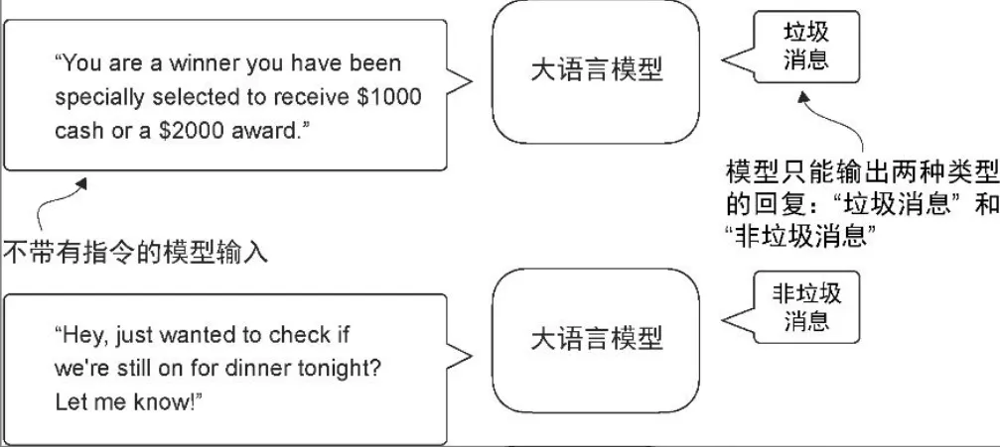
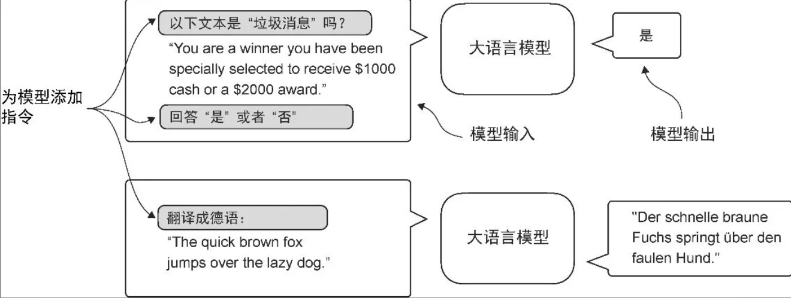
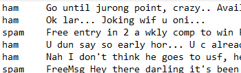
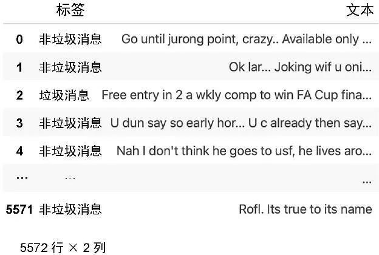
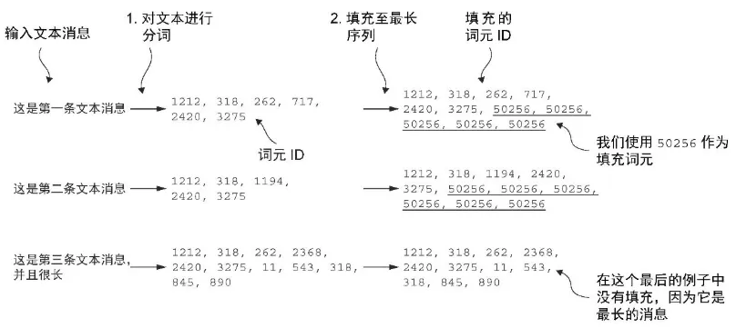
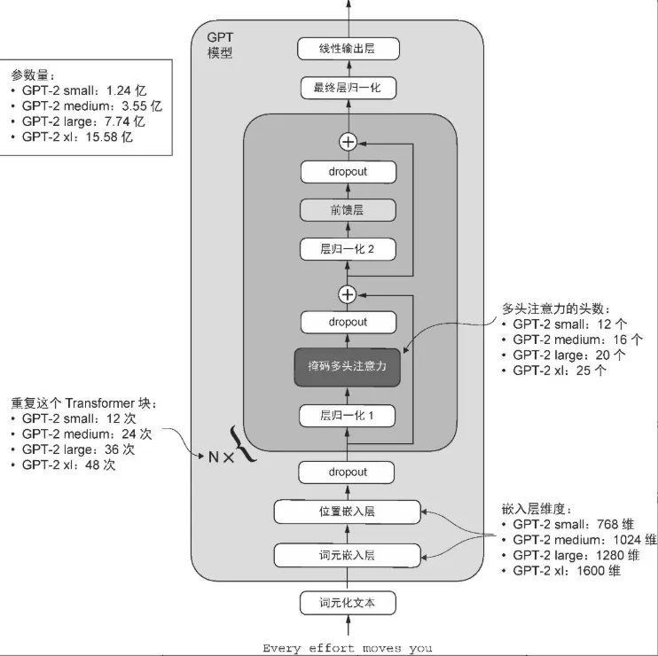
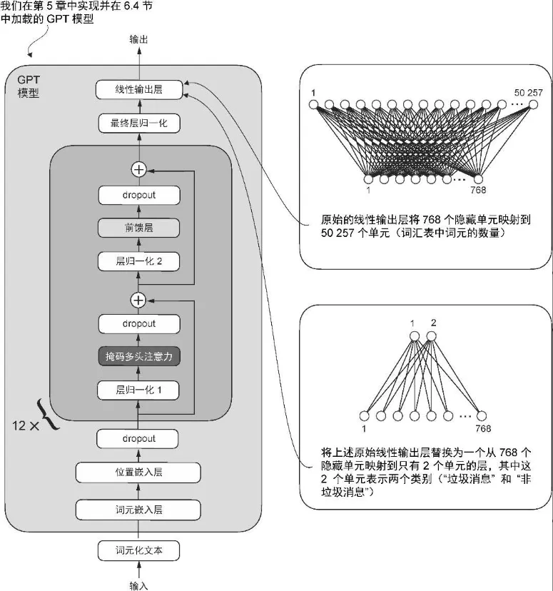
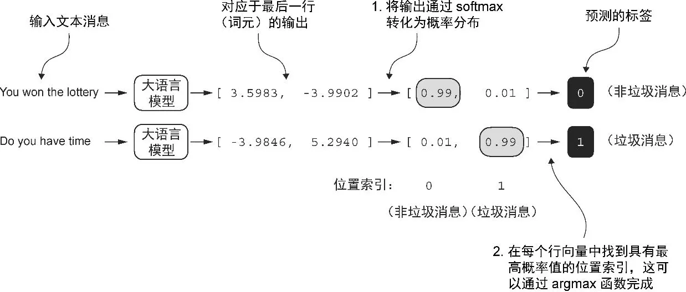
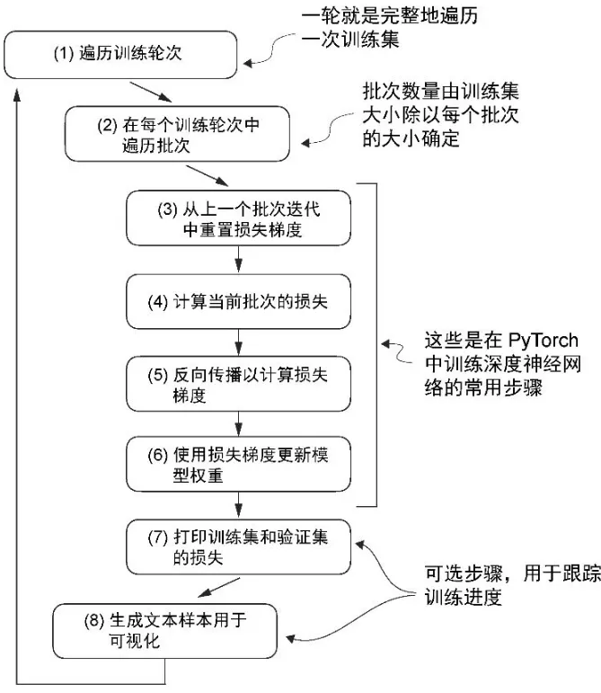

## 微调语言模型最常见的方法
|方法|分类微调|(遵循人类)指令微调|
|-|-|-|
|Instruction|提示不能有指令|模型被指示将英语句子翻译成德语|
|Scope|经过分类微调的模型只能预测它在训练过程中遇到的类别。例如，它可以判断某条内容是“垃圾消息”还是“非垃圾消息”|经过指令微调的模型通常能够执行更广泛的任务|
|Cap|判断给定文本是否为垃圾消息|- 预训练后的大语言模型能够进行文本补全，这意味着给定任意一个片段作为输入，模型能够生成一个句子或撰写一个段落<br>- 然而，预训练后的大语言模型在执行特定指令时往往表现不佳，比如无法完成像“纠正这段文字的语法”或“将这段话变成被动语态”这样的指令|





## Classification finetuning (Email Spam)
### Datasets
#### S - Download raw datasets

T
- save to sms_spam_collection/SMSSpamCollection.tsv
- sms: Short Message Service 短信
- Ham 是你想要的, 是火腿, “非垃圾邮件”
- Spam 是你不想要的, 是午餐肉, “垃圾邮件”或“垃圾信息”


A
```py
import urllib.request
import zipfile
import os
from pathlib import Path


def download_and_unzip_spam_data(url, zip_path, extracted_path, data_file_path):
    if data_file_path.exists():
        print(f"{data_file_path} already exists. Skipping download and extraction.")
        return

    # Downloading the file
    with urllib.request.urlopen(url) as response:
        with open(zip_path, "wb") as out_file:
            out_file.write(response.read())

    # Unzipping the file
    with zipfile.ZipFile(zip_path, "r") as zip_ref:
        zip_ref.extractall(extracted_path)

    # Add .tsv file extension
    original_file_path = Path(extracted_path) / "SMSSpamCollection"
    os.rename(original_file_path, data_file_path)
    print(f"File downloaded and saved as {data_file_path}")


url = "https://archive.ics.uci.edu/static/public/228/sms+spam+collection.zip"
zip_path = "sms_spam_collection.zip"
extracted_path = "sms_spam_collection"
data_file_path = Path(extracted_path) / "SMSSpamCollection.tsv"


try:
    download_and_unzip_spam_data(url, zip_path, extracted_path, data_file_path)
except (urllib.error.HTTPError, urllib.error.URLError, TimeoutError) as e:
    print(f"Primary URL failed: {e}. Trying backup URL...")
    url = "https://f001.backblazeb2.com/file/LLMs-from-scratch/sms%2Bspam%2Bcollection.zip"
    download_and_unzip_spam_data(url, zip_path, extracted_path, data_file_path) 
```

#### ***S - Data preprocessing
- 加载tsv到 pandas DataFrame中
- 为简单起见，我们会使用一个较小的数据集（这将有助于更快地微调大语言模型），每个类别包含 747 个实例
- 标签是ham, spam string，需要数字化
- 创建不同的数据集
- 现在我们处理的是包含不同长度文本消息的垃圾消息数据集。为了像处理文本块那样对这些消息进行批处理

T

- 
- 对数据集进行下采样
- 将“string”类别标签 "ham" 和 "spam" 分别转换为整数类别标签 0 和 1
- 创建一个 random_split 函数，将数据集分成 3 部分：70% 用于训练，20% 用于测试，10% 用于验证
- 填充统一数据长度
  - 为了实现批处理，将所有消息填充到数据集中最长消息的长度，需要向所有较短的消息添加填充词元。为此，可以使用 "<|endoftext|>" 作为填充词元。
  - 然而，基于性能与效率的考虑，与其直接将字符串 "<|endoftext|>" 附加到每条文本消息中，不如将与 "<|endoftext|>" 对应的词元 ID 50256添加到编码的文本消息中
  - 


A

```py
# DF
import pandas as pd

df = pd.read_csv(data_file_path, sep="\t", header=None, names=["Label", "Text"])
df
```

```py
# 数据集下采样
def create_balanced_dataset(df):
    
    # Count the instances of "spam"
    num_spam = df[df["Label"] == "spam"].shape[0]
    
    # Randomly sample "ham" instances to match the number of "spam" instances
    ham_subset = df[df["Label"] == "ham"].sample(num_spam, random_state=123)
    
    # Combine ham "subset" with "spam"
    balanced_df = pd.concat([ham_subset, df[df["Label"] == "spam"]])

    return balanced_df


balanced_df = create_balanced_dataset(df)
print(balanced_df["Label"].value_counts())
# Label
# ham     747
# spam    747
# Name: count, dtype: int64
```

```py
# 标签数字化
balanced_df["Label"] = balanced_df["Label"].map({"ham": 0, "spam": 1})    
```

```py
# 划分数据集
def random_split(df, train_frac, validation_frac):
    # Shuffle the entire DataFrame
    df = df.sample(frac=1, random_state=123).reset_index(drop=True)

    # Calculate split indices
    train_end = int(len(df) * train_frac)
    validation_end = train_end + int(len(df) * validation_frac)

    # Split the DataFrame
    train_df = df[:train_end]
    validation_df = df[train_end:validation_end]
    test_df = df[validation_end:]

    return train_df, validation_df, test_df

train_df, validation_df, test_df = random_split(balanced_df, 0.7, 0.1)
# Test size is implied to be 0.2 as the remainder

# 将数据集保存为 CSV(Comma-Separated Value)文件，以便以后重用
train_df.to_csv("train.csv", index=None)
validation_df.to_csv("validation.csv", index=None)
test_df.to_csv("test.csv", index=None)
```


#### S - Encapsulate
- 填充

T

SpamDataset 类
- 从我们之前创建的 CSV 文件中加载数据，
- 使用 tiktoken中的 GPT-2 分词器对文本进行分词，
- 并将序列填充或截断到由最长序列或预定义的最大长度确定的统一长度

```py
self.data.iloc[index]["Label"]  从一个 DataFrame 中按行索引提取某一列的值
- self.data：表示一个 Pandas 的 DataFrame，通常是某个类中的属性。
- .iloc[index]：使用整数位置（而不是标签）来选取第 index 行的数据。
- ["Label"]：从选中的那一行中提取名为 "Label" 的列的值。
```

A

```py
import torch
from torch.utils.data import Dataset

class SpamDataset(Dataset):
    def __init__(self, csv_file, tokenizer, max_length=None, pad_token_id=50256):
        # two data containers: encoded_texts, data
        self.data = pd.read_csv(csv_file)

        # Pre-tokenize texts
        self.encoded_texts = [
            tokenizer.encode(text) for text in self.data["Text"]
        ]

        if max_length is None:
            self.max_length = self._longest_encoded_length()
        else:
            self.max_length = max_length
            # Truncate sequences if they are longer than max_length
            self.encoded_texts = [
                encoded_text[:self.max_length]
                for encoded_text in self.encoded_texts
            ]

        # Pad sequences to the longest sequence
        self.encoded_texts = [
            encoded_text + [pad_token_id] * (self.max_length - len(encoded_text))
            for encoded_text in self.encoded_texts
        ]

    def __getitem__(self, index):
        encoded = self.encoded_texts[index]
        label = self.data.iloc[index]["Label"]
        return (
            torch.tensor(encoded, dtype=torch.long),
            torch.tensor(label, dtype=torch.long)
        )

    def __len__(self):
        return len(self.data)

    def _longest_encoded_length(self):
        max_length = 0
        for encoded_text in self.encoded_texts:
            encoded_length = len(encoded_text)
            if encoded_length > max_length:
                max_length = encoded_length
        return max_length
        # Note: A more pythonic version to implement this method
        # is the following, which is also used in the next chapter:
        # return max(len(encoded_text) for encoded_text in self.encoded_texts)
```

```py
tokenizer = tiktoken.get_encoding("gpt2")

train_dataset = SpamDataset(
    csv_file="train.csv",
    max_length=None,
    tokenizer=tokenizer
)

val_dataset = SpamDataset(
    csv_file="validation.csv",
    max_length=train_dataset.max_length,
    tokenizer=tokenizer
)

test_dataset = SpamDataset(
    csv_file="test.csv",
    max_length=train_dataset.max_length,
    tokenizer=tokenizer
)

num_workers = 0
batch_size = 8

torch.manual_seed(123)

train_loader = DataLoader(
    dataset=train_dataset,
    batch_size=batch_size,
    shuffle=True,
    num_workers=num_workers,
    drop_last=True,
)

val_loader = DataLoader(
    dataset=val_dataset,
    batch_size=batch_size,
    num_workers=num_workers,
    drop_last=False,
)

test_loader = DataLoader(
    dataset=test_dataset,
    batch_size=batch_size,
    num_workers=num_workers,
    drop_last=False,
)
```

### Model
#### S - 创建模型
T



A

```py
INPUT_PROMPT = "Every effort moves"

BASE_CONFIG = {
    "vocab_size": 50257,     # Vocabulary size
    "context_length": 1024,  # Context length
    "drop_rate": 0.0,        # Dropout rate
    "qkv_bias": True         # Query-key-value bias
}

model_configs = {
    "gpt2-small (124M)": {"emb_dim": 768, "n_layers": 12, "n_heads": 12},
    "gpt2-medium (355M)": {"emb_dim": 1024, "n_layers": 24, "n_heads": 16},
    "gpt2-large (774M)": {"emb_dim": 1280, "n_layers": 36, "n_heads": 20},
    "gpt2-xl (1558M)": {"emb_dim": 1600, "n_layers": 48, "n_heads": 25},
}

CHOOSE_MODEL = "gpt2-small (124M)"

BASE_CONFIG.update(model_configs[CHOOSE_MODEL])
```

#### ***S - 加载预训练权重到自定义 GPT 模型中
T

- OpenAI 公开分享了它们的 GPT-2 模型的权重，从而省去了我们自己在大型语料库上重新训练模型所需投入的数万到数十万美元
- OpenAI 最初通过TensorFlow 保存了GPT-2的权重，我们需要在Python中安装 TensorFlow 才能加载这些权重


<u> Params mapping </u>
|Layer|Self model params|Assign|
|-|-|-|
|Whole model|model.parameters()|-|
|Transformer block|model.trf_blocks[-1].parameters() | ```q_w, k_w, v_w = np.split((params["blocks"][b]["attn"]["c_attn"])["w"], 3, axis=-1)    gpt.trf_blocks[b].att.W_query.weight, q_w.T```|
|Final norm|model.final_norm.parameters()|```gpt.final_norm.scale, params["g"]      gpt.final_norm.shift, params["b"]```|

```py
# 下载gpt_download.py 这个 Python 模块
# https://github.com/rasbt/LLMs-from-scratch/blob/main/ch05/01_main-chapter-code/gpt_download.py

# 从 gpt_download.py 文件中导入 download_and_load_gpt2函数，这将加载 GPT-2 架构设置(settings)和权重参数(params)到 Python 会话中
# Not use, 设置(settings) 字典存储了大语言模型架构的设置，类似于我们手动定义的 GPT_CONFIG_124M
# 权重参数(params)字典包含实际的权重张量
from gpt_download import download_and_load_gpt2
settings, params = download_and_load_gpt2(model_size="124M", models_dir="gpt2")
{'n_vocab': 50257, 'n_ctx': 1024, 'n_embd': 768, 'n_head': 12, 'n_layer': 12}

params = {
    'wte': ...,  # token embedding
    'wpe': ...,  # position embedding
    'blocks': [
        {
            'attn': {
                'c_attn': {'w': ..., 'b': ...},
                'c_proj': {'w': ..., 'b': ...}
            },
            'mlp': {
                'c_fc': {'w': ..., 'b': ...},
                'c_proj': {'w': ..., 'b': ...}
            },
            'ln_1': {'g': ..., 'b': ...},
            'ln_2': {'g': ..., 'b': ...}
        },
        ...
    ],
    'g': ...,  # final layer norm scale
    'b': ...   # final layer norm bias
}
```


A

```py
# assign 工具函数，该函数会检查两个张量或数组（left 和 right）是否具有相同的维度或形状，并将 right 张量返回为可训练的 PyTorch 参数
def assign(left, right):
    if left.shape != right.shape:
        raise ValueError(f"Shape mismatch. Left: {left.shape}, Right: {right.shape}")
    return torch.nn.Parameter(torch.tensor(right))

import numpy as np

def load_weights_into_gpt(gpt, params):
    gpt.pos_emb.weight = assign(gpt.pos_emb.weight, params['wpe'])
    gpt.tok_emb.weight = assign(gpt.tok_emb.weight, params['wte'])
    
    for b in range(len(params["blocks"])):
        q_w, k_w, v_w = np.split(
            (params["blocks"][b]["attn"]["c_attn"])["w"], 3, axis=-1)
        gpt.trf_blocks[b].att.W_query.weight = assign(
            gpt.trf_blocks[b].att.W_query.weight, q_w.T)
        gpt.trf_blocks[b].att.W_key.weight = assign(
            gpt.trf_blocks[b].att.W_key.weight, k_w.T)
        gpt.trf_blocks[b].att.W_value.weight = assign(
            gpt.trf_blocks[b].att.W_value.weight, v_w.T)

        q_b, k_b, v_b = np.split(
            (params["blocks"][b]["attn"]["c_attn"])["b"], 3, axis=-1)
        gpt.trf_blocks[b].att.W_query.bias = assign(
            gpt.trf_blocks[b].att.W_query.bias, q_b)
        gpt.trf_blocks[b].att.W_key.bias = assign(
            gpt.trf_blocks[b].att.W_key.bias, k_b)
        gpt.trf_blocks[b].att.W_value.bias = assign(
            gpt.trf_blocks[b].att.W_value.bias, v_b)

        gpt.trf_blocks[b].att.out_proj.weight = assign(
            gpt.trf_blocks[b].att.out_proj.weight, 
            params["blocks"][b]["attn"]["c_proj"]["w"].T)
        gpt.trf_blocks[b].att.out_proj.bias = assign(
            gpt.trf_blocks[b].att.out_proj.bias, 
            params["blocks"][b]["attn"]["c_proj"]["b"])

        gpt.trf_blocks[b].ff.layers[0].weight = assign(
            gpt.trf_blocks[b].ff.layers[0].weight, 
            params["blocks"][b]["mlp"]["c_fc"]["w"].T)
        gpt.trf_blocks[b].ff.layers[0].bias = assign(
            gpt.trf_blocks[b].ff.layers[0].bias, 
            params["blocks"][b]["mlp"]["c_fc"]["b"])
        gpt.trf_blocks[b].ff.layers[2].weight = assign(
            gpt.trf_blocks[b].ff.layers[2].weight, 
            params["blocks"][b]["mlp"]["c_proj"]["w"].T)
        gpt.trf_blocks[b].ff.layers[2].bias = assign(
            gpt.trf_blocks[b].ff.layers[2].bias, 
            params["blocks"][b]["mlp"]["c_proj"]["b"])

        gpt.trf_blocks[b].norm1.scale = assign(
            gpt.trf_blocks[b].norm1.scale, 
            params["blocks"][b]["ln_1"]["g"])
        gpt.trf_blocks[b].norm1.shift = assign(
            gpt.trf_blocks[b].norm1.shift, 
            params["blocks"][b]["ln_1"]["b"])
        gpt.trf_blocks[b].norm2.scale = assign(
            gpt.trf_blocks[b].norm2.scale, 
            params["blocks"][b]["ln_2"]["g"])
        gpt.trf_blocks[b].norm2.shift = assign(
            gpt.trf_blocks[b].norm2.shift, 
            params["blocks"][b]["ln_2"]["b"])

    gpt.final_norm.scale = assign(gpt.final_norm.scale, params["g"])
    gpt.final_norm.shift = assign(gpt.final_norm.shift, params["b"])
    gpt.out_head.weight = assign(gpt.out_head.weight, params["wte"])


model_size = CHOOSE_MODEL.split(" ")[-1].lstrip("(").rstrip(")")
settings, params = download_and_load_gpt2(model_size=model_size, models_dir="gpt2")

model = GPTModel(BASE_CONFIG)

load_weights_into_gpt(model, params)
device = torch.device("cuda" if torch.cuda.is_available() else "cpu")
```

#### ***S - 修改模型以进行微调
- 调整架构使 GPT 模型适应垃圾消息分类任务
- 是微调选定层还是微调所有层

T

- 将原始输出层（该输出层会将隐藏表示映射到一张包含 50 257 个词汇的词汇表中）替换为一个较小的输出层，该输出层会映射到两个类别：0（“非垃圾消息”）和 1（“垃圾消息”）
  - 从技术上讲，由于这是一个二分类任务，因此我们可以使用单个输出节点。然而，这需要修改损失函数
  - 因此，我们选择了一种更通用的方法，即令输出节点的数量与类别数量相匹配。例如，对于一个三分类问题（比如将新闻文章分类为“科技”“体育”或“政治”），我们将使用 3 个输出节点，以此类推。


- 标记某些层为可训练或不可训练
  - 由于模型已经经过了预训练，因此不需要微调所有的模型层。在基于神经网络的语言模型中，较低层通常捕捉基本的语言结构和语义，适用于广泛的任务和数据集，最后几层（靠近输出的层）更侧重于捕捉细微的语言模式和特定任务的特征。因此，只微调最后几层通常就足以将模型适应到新任务。
  - 这个新的 model.out_head 输出层的 requires_grad 属性默认设置为 True，这意味着它是模型中唯一在训练过程中会被更新的层。从技术上讲，仅训练刚刚添加的输出层就足够了。然而，正如我在实验中发现的，微调额外的层可以显著提升模型的预测性能。我们还将最后一个 Transformer 块和连接该块到输出层的最终层归一化模块设置为可训练

A
```py
# 输出层替换，层冻结

# 先冻结模型，即将所有层设为不可训练
for param in model.parameters():
    param.requires_grad = False


# 替换输出层(model.out_head)
torch.manual_seed(123)
num_classes = 2
model.out_head = torch.nn.Linear(in_features=BASE_CONFIG["emb_dim"], out_features=num_classes)
model.to(device)


# 使最终层归一化和最后一个 Transformer 块可训练，我们将它们各自的requires_grad 设置为 True
for param in model.trf_blocks[-1].parameters():
    param.requires_grad = True
for param in model.final_norm.parameters():
    param.requires_grad = True
```


### Train
```py
def train_classifier_simple(model, train_loader, optimizer, device, num_epochs):
    # Initialize lists to track losses and tokens seen
    train_losses, val_losses, train_accs, val_accs = [], [], [], []
    examples_seen, global_step = 0, -1

    # Main training loop
    for epoch in range(num_epochs):
        model.train()  # Set model to training mode

        for input_batch, target_batch in train_loader:
            optimizer.zero_grad()  # Reset loss gradients from previous batch iteration
            loss = calc_loss_batch(input_batch, target_batch, model, device)
            loss.backward()  # Calculate loss gradients
            optimizer.step()  # Update model weights using loss gradients
            examples_seen += input_batch.shape[0]  # New: track examples instead of tokens
            global_step += 1


start_time = time.time()
torch.manual_seed(123)

optimizer = torch.optim.AdamW(model.parameters(), lr=5e-5, weight_decay=0.1)

num_epochs = 5
train_losses, val_losses, train_accs, val_accs, examples_seen = train_classifier_simple(
    model, train_loader, val_loader, optimizer, device,
    num_epochs=num_epochs, eval_freq=50, eval_iter=5,
    tokenizer=tokenizer
)

end_time = time.time()
execution_time_minutes = (end_time - start_time) / 60
print(f"Training completed in {execution_time_minutes:.2f} minutes.")
```

### Inference
T

将模型输出转换为类别标签预测
- logits >softmax> probas >argmax> label

```py
print("Last output token:", outputs[:, -1, :])
# Last output token: tensor([[-3.5983,  3.9902]])

probas = torch.softmax(outputs[:, -1, :], dim=-1)
label = torch.argmax(probas)
print("Class label:", label.item())
# Class label: 1
```



A

```py
def classify_review(text, model, tokenizer, device, max_length=None, pad_token_id=50256):
    model.eval()

    # Prepare inputs to the model
    input_ids = tokenizer.encode(text)
    supported_context_length = model.pos_emb.weight.shape[0]
    # Note: In the book, this was originally written as pos_emb.weight.shape[1] by mistake
    # It didn't break the code but would have caused unnecessary truncation (to 768 instead of 1024)

    # Truncate sequences if they too long
    input_ids = input_ids[:min(max_length, supported_context_length)]

    # Pad sequences to the longest sequence
    input_ids += [pad_token_id] * (max_length - len(input_ids))
    input_tensor = torch.tensor(input_ids, device=device).unsqueeze(0) # add batch dimension

    # Model inference
    with torch.no_grad():
        logits = model(input_tensor)[:, -1, :]  # Logits of the last output token
    predicted_label = torch.argmax(logits, dim=-1).item()

    # Return the classified result
    return "spam" if predicted_label == 1 else "not spam"


text_1 = (
    "You are a winner you have been specially"
    " selected to receive $1000 cash or a $2000 award."
)

print(classify_review(
    text_1, model, tokenizer, device, max_length=train_dataset.max_length
))
```

### Evaluate

Batch loss for traning and evaluation
```py
def calc_loss_batch(input_batch, target_batch, model, device):
    input_batch, target_batch = input_batch.to(device), target_batch.to(device)
    logits = model(input_batch)[:, -1, :]  # Logits of last output token
    loss = torch.nn.functional.cross_entropy(logits, target_batch)
    return loss
```

Loader loss for evaluation
```py
# evaluation
def calc_loss_loader(data_loader, model, device, num_batches=None):
    total_loss = 0.
    if len(data_loader) == 0:
        return float("nan")
    elif num_batches is None:
        num_batches = len(data_loader)
    else:
        num_batches = min(num_batches, len(data_loader))
    for i, (input_batch, target_batch) in enumerate(data_loader):
        if i < num_batches:
            loss = calc_loss_batch(input_batch, target_batch, model, device)
            total_loss += loss.item()
        else:
            break
    return total_loss / num_batches

def evaluate_model(model, train_loader, val_loader, device, eval_iter):
    model.eval()
    with torch.no_grad():
        train_loss = calc_loss_loader(train_loader, model, device, num_batches=eval_iter)
        val_loss = calc_loss_loader(val_loader, model, device, num_batches=eval_iter)
    model.train()
    return train_loss, val_loss

```

Loader accuracy for evaluation
```py
def calc_accuracy_loader(data_loader, model, device, num_batches=None):
    model.eval()
    correct_predictions, num_examples = 0, 0

    if num_batches is None:
        num_batches = len(data_loader)
    else:
        num_batches = min(num_batches, len(data_loader))
    for i, (input_batch, target_batch) in enumerate(data_loader):
        if i < num_batches:
            input_batch, target_batch = input_batch.to(device), target_batch.to(device)

            with torch.no_grad():
                logits = model(input_batch)[:, -1, :]  # Logits of last output token
            predicted_labels = torch.argmax(logits, dim=-1)

            num_examples += predicted_labels.shape[0]
            correct_predictions += (predicted_labels == target_batch).sum().item()
        else:
            break
    return correct_predictions / num_examples

train_accuracy = calc_accuracy_loader(train_loader, model, device, num_batches=10)
val_accuracy = calc_accuracy_loader(val_loader, model, device, num_batches=10)
test_accuracy = calc_accuracy_loader(test_loader, model, device, num_batches=10)

print(f"Training accuracy: {train_accuracy*100:.2f}%")
print(f"Validation accuracy: {val_accuracy*100:.2f}%")
print(f"Test accuracy: {test_accuracy*100:.2f}%")
```

Final training loop

```
def train_classifier_simple(model, train_loader, val_loader, optimizer, device, num_epochs,
                            eval_freq, eval_iter, tokenizer):
    # Initialize lists to track losses and tokens seen
    train_losses, val_losses, train_accs, val_accs = [], [], [], []
    examples_seen, global_step = 0, -1

    # Main training loop
    for epoch in range(num_epochs):
        model.train()  # Set model to training mode

        for input_batch, target_batch in train_loader:
            optimizer.zero_grad()  # Reset loss gradients from previous batch iteration
            loss = calc_loss_batch(input_batch, target_batch, model, device)
            loss.backward()  # Calculate loss gradients
            optimizer.step()  # Update model weights using loss gradients
            examples_seen += input_batch.shape[0]  # New: track examples instead of tokens
            global_step += 1

            # Optional evaluation step
            if global_step % eval_freq == 0:
                train_loss, val_loss = evaluate_model(
                    model, train_loader, val_loader, device, eval_iter)
                train_losses.append(train_loss)
                val_losses.append(val_loss)
                print(f"Ep {epoch+1} (Step {global_step:06d}): "
                      f"Train loss {train_loss:.3f}, Val loss {val_loss:.3f}")

        # Calculate accuracy after each epoch
        train_accuracy = calc_accuracy_loader(train_loader, model, device, num_batches=eval_iter)
        val_accuracy = calc_accuracy_loader(val_loader, model, device, num_batches=eval_iter)
        print(f"Training accuracy: {train_accuracy*100:.2f}% | ", end="")
        print(f"Validation accuracy: {val_accuracy*100:.2f}%")
        train_accs.append(train_accuracy)
        val_accs.append(val_accuracy)

    return train_losses, val_losses, train_accs, val_accs, examples_seen
```

Plot
```py
def plot_values(epochs_seen, examples_seen, train_values, val_values, label="loss"):
    fig, ax1 = plt.subplots(figsize=(5, 3))

    # Plot training and validation loss against epochs
    ax1.plot(epochs_seen, train_values, label=f"Training {label}")
    ax1.plot(epochs_seen, val_values, linestyle="-.", label=f"Validation {label}")
    ax1.set_xlabel("Epochs")
    ax1.set_ylabel(label.capitalize())
    ax1.legend()

    # Create a second x-axis for tokens seen
    ax2 = ax1.twiny()  # Create a second x-axis that shares the same y-axis
    ax2.plot(examples_seen, train_values, alpha=0)  # Invisible plot for aligning ticks
    ax2.set_xlabel("Examples seen")

    fig.tight_layout()  # Adjust layout to make room
    plt.savefig(f"{label}-plot.pdf")
    # plt.show()

# loss plot
epochs_tensor = torch.linspace(0, num_epochs, len(train_losses))
examples_seen_tensor = torch.linspace(0, examples_seen, len(train_losses))
plot_values(epochs_tensor, examples_seen_tensor, train_losses, val_losses)

# accuracy plot
epochs_tensor = torch.linspace(0, num_epochs, len(train_accs))
examples_seen_tensor = torch.linspace(0, examples_seen, len(train_accs))
plot_values(epochs_tensor, examples_seen_tensor, train_accs, val_accs, label="accuracy")
```


### Conclusion

```py
# This is a summary file containing the main takeaways from chapter 6.

import urllib.request
import zipfile
import os
from pathlib import Path
import time

import matplotlib.pyplot as plt
import pandas as pd
import tiktoken
import torch
from torch.utils.data import Dataset, DataLoader

from gpt_download import download_and_load_gpt2
from previous_chapters import GPTModel, load_weights_into_gpt


def download_and_unzip_spam_data(url, zip_path, extracted_path, data_file_path):
    if data_file_path.exists():
        print(f"{data_file_path} already exists. Skipping download and extraction.")
        return

    # Downloading the file
    with urllib.request.urlopen(url) as response:
        with open(zip_path, "wb") as out_file:
            out_file.write(response.read())

    # Unzipping the file
    with zipfile.ZipFile(zip_path, "r") as zip_ref:
        zip_ref.extractall(extracted_path)

    # Add .tsv file extension
    original_file_path = Path(extracted_path) / "SMSSpamCollection"
    os.rename(original_file_path, data_file_path)
    print(f"File downloaded and saved as {data_file_path}")


def create_balanced_dataset(df):
    # Count the instances of "spam"
    num_spam = df[df["Label"] == "spam"].shape[0]

    # Randomly sample "ham" instances to match the number of "spam" instances
    ham_subset = df[df["Label"] == "ham"].sample(num_spam, random_state=123)

    # Combine ham "subset" with "spam"
    balanced_df = pd.concat([ham_subset, df[df["Label"] == "spam"]])

    return balanced_df


def random_split(df, train_frac, validation_frac):
    # Shuffle the entire DataFrame
    df = df.sample(frac=1, random_state=123).reset_index(drop=True)

    # Calculate split indices
    train_end = int(len(df) * train_frac)
    validation_end = train_end + int(len(df) * validation_frac)

    # Split the DataFrame
    train_df = df[:train_end]
    validation_df = df[train_end:validation_end]
    test_df = df[validation_end:]

    return train_df, validation_df, test_df


class SpamDataset(Dataset):
    def __init__(self, csv_file, tokenizer, max_length=None, pad_token_id=50256):
        self.data = pd.read_csv(csv_file)

        # Pre-tokenize texts
        self.encoded_texts = [
            tokenizer.encode(text) for text in self.data["Text"]
        ]

        if max_length is None:
            self.max_length = self._longest_encoded_length()
        else:
            self.max_length = max_length
            # Truncate sequences if they are longer than max_length
            self.encoded_texts = [
                encoded_text[:self.max_length]
                for encoded_text in self.encoded_texts
            ]

        # Pad sequences to the longest sequence
        self.encoded_texts = [
            encoded_text + [pad_token_id] * (self.max_length - len(encoded_text))
            for encoded_text in self.encoded_texts
        ]

    def __getitem__(self, index):
        encoded = self.encoded_texts[index]
        label = self.data.iloc[index]["Label"]
        return (
            torch.tensor(encoded, dtype=torch.long),
            torch.tensor(label, dtype=torch.long)
        )

    def __len__(self):
        return len(self.data)

    def _longest_encoded_length(self):
        max_length = 0
        for encoded_text in self.encoded_texts:
            encoded_length = len(encoded_text)
            if encoded_length > max_length:
                max_length = encoded_length
        return max_length
        # Note: A more pythonic version to implement this method
        # is the following, which is also used in the next chapter:
        # return max(len(encoded_text) for encoded_text in self.encoded_texts)


def calc_accuracy_loader(data_loader, model, device, num_batches=None):
    model.eval()
    correct_predictions, num_examples = 0, 0

    if num_batches is None:
        num_batches = len(data_loader)
    else:
        num_batches = min(num_batches, len(data_loader))
    for i, (input_batch, target_batch) in enumerate(data_loader):
        if i < num_batches:
            input_batch, target_batch = input_batch.to(device), target_batch.to(device)

            with torch.no_grad():
                logits = model(input_batch)[:, -1, :]  # Logits of last output token
            predicted_labels = torch.argmax(logits, dim=-1)

            num_examples += predicted_labels.shape[0]
            correct_predictions += (predicted_labels == target_batch).sum().item()
        else:
            break
    return correct_predictions / num_examples


def calc_loss_batch(input_batch, target_batch, model, device):
    input_batch, target_batch = input_batch.to(device), target_batch.to(device)
    logits = model(input_batch)[:, -1, :]  # Logits of last output token
    loss = torch.nn.functional.cross_entropy(logits, target_batch)
    return loss


def calc_loss_loader(data_loader, model, device, num_batches=None):
    total_loss = 0.
    if len(data_loader) == 0:
        return float("nan")
    elif num_batches is None:
        num_batches = len(data_loader)
    else:
        num_batches = min(num_batches, len(data_loader))
    for i, (input_batch, target_batch) in enumerate(data_loader):
        if i < num_batches:
            loss = calc_loss_batch(input_batch, target_batch, model, device)
            total_loss += loss.item()
        else:
            break
    return total_loss / num_batches


def evaluate_model(model, train_loader, val_loader, device, eval_iter):
    model.eval()
    with torch.no_grad():
        train_loss = calc_loss_loader(train_loader, model, device, num_batches=eval_iter)
        val_loss = calc_loss_loader(val_loader, model, device, num_batches=eval_iter)
    model.train()
    return train_loss, val_loss


def train_classifier_simple(model, train_loader, val_loader, optimizer, device, num_epochs,
                            eval_freq, eval_iter, tokenizer):
    # Initialize lists to track losses and tokens seen
    train_losses, val_losses, train_accs, val_accs = [], [], [], []
    examples_seen, global_step = 0, -1

    # Main training loop
    for epoch in range(num_epochs):
        model.train()  # Set model to training mode

        for input_batch, target_batch in train_loader:
            optimizer.zero_grad()  # Reset loss gradients from previous batch iteration
            loss = calc_loss_batch(input_batch, target_batch, model, device)
            loss.backward()  # Calculate loss gradients
            optimizer.step()  # Update model weights using loss gradients
            examples_seen += input_batch.shape[0]  # New: track examples instead of tokens
            global_step += 1

            # Optional evaluation step
            if global_step % eval_freq == 0:
                train_loss, val_loss = evaluate_model(
                    model, train_loader, val_loader, device, eval_iter)
                train_losses.append(train_loss)
                val_losses.append(val_loss)
                print(f"Ep {epoch+1} (Step {global_step:06d}): "
                      f"Train loss {train_loss:.3f}, Val loss {val_loss:.3f}")

        # Calculate accuracy after each epoch
        train_accuracy = calc_accuracy_loader(train_loader, model, device, num_batches=eval_iter)
        val_accuracy = calc_accuracy_loader(val_loader, model, device, num_batches=eval_iter)
        print(f"Training accuracy: {train_accuracy*100:.2f}% | ", end="")
        print(f"Validation accuracy: {val_accuracy*100:.2f}%")
        train_accs.append(train_accuracy)
        val_accs.append(val_accuracy)

    return train_losses, val_losses, train_accs, val_accs, examples_seen


def plot_values(epochs_seen, examples_seen, train_values, val_values, label="loss"):
    fig, ax1 = plt.subplots(figsize=(5, 3))

    # Plot training and validation loss against epochs
    ax1.plot(epochs_seen, train_values, label=f"Training {label}")
    ax1.plot(epochs_seen, val_values, linestyle="-.", label=f"Validation {label}")
    ax1.set_xlabel("Epochs")
    ax1.set_ylabel(label.capitalize())
    ax1.legend()

    # Create a second x-axis for tokens seen
    ax2 = ax1.twiny()  # Create a second x-axis that shares the same y-axis
    ax2.plot(examples_seen, train_values, alpha=0)  # Invisible plot for aligning ticks
    ax2.set_xlabel("Examples seen")

    fig.tight_layout()  # Adjust layout to make room
    plt.savefig(f"{label}-plot.pdf")
    # plt.show()


if __name__ == "__main__":

    import argparse

    parser = argparse.ArgumentParser(
        description="Finetune a GPT model for classification"
    )
    parser.add_argument(
        "--test_mode",
        default=False,
        action="store_true",
        help=("This flag runs the model in test mode for internal testing purposes. "
              "Otherwise, it runs the model as it is used in the chapter (recommended).")
    )
    args = parser.parse_args()

    ########################################
    # Download and prepare dataset
    ########################################

    url = "https://archive.ics.uci.edu/static/public/228/sms+spam+collection.zip"
    zip_path = "sms_spam_collection.zip"
    extracted_path = "sms_spam_collection"
    data_file_path = Path(extracted_path) / "SMSSpamCollection.tsv"

    try:
        download_and_unzip_spam_data(url, zip_path, extracted_path, data_file_path)
    except (urllib.error.HTTPError, urllib.error.URLError, TimeoutError) as e:
        print(f"Primary URL failed: {e}. Trying backup URL...")
        url = "https://f001.backblazeb2.com/file/LLMs-from-scratch/sms%2Bspam%2Bcollection.zip"
        download_and_unzip_spam_data(url, zip_path, extracted_path, data_file_path)

    df = pd.read_csv(data_file_path, sep="\t", header=None, names=["Label", "Text"])
    balanced_df = create_balanced_dataset(df)
    balanced_df["Label"] = balanced_df["Label"].map({"ham": 0, "spam": 1})

    train_df, validation_df, test_df = random_split(balanced_df, 0.7, 0.1)
    train_df.to_csv("train.csv", index=None)
    validation_df.to_csv("validation.csv", index=None)
    test_df.to_csv("test.csv", index=None)

    ########################################
    # Create data loaders
    ########################################
    tokenizer = tiktoken.get_encoding("gpt2")

    train_dataset = SpamDataset(
        csv_file="train.csv",
        max_length=None,
        tokenizer=tokenizer
    )

    val_dataset = SpamDataset(
        csv_file="validation.csv",
        max_length=train_dataset.max_length,
        tokenizer=tokenizer
    )

    test_dataset = SpamDataset(
        csv_file="test.csv",
        max_length=train_dataset.max_length,
        tokenizer=tokenizer
    )

    num_workers = 0
    batch_size = 8

    torch.manual_seed(123)

    train_loader = DataLoader(
        dataset=train_dataset,
        batch_size=batch_size,
        shuffle=True,
        num_workers=num_workers,
        drop_last=True,
    )

    val_loader = DataLoader(
        dataset=val_dataset,
        batch_size=batch_size,
        num_workers=num_workers,
        drop_last=False,
    )

    test_loader = DataLoader(
        dataset=test_dataset,
        batch_size=batch_size,
        num_workers=num_workers,
        drop_last=False,
    )

    ########################################
    # Load pretrained model
    ########################################

    # Small GPT model for testing purposes
    if args.test_mode:
        BASE_CONFIG = {
            "vocab_size": 50257,
            "context_length": 120,
            "drop_rate": 0.0,
            "qkv_bias": False,
            "emb_dim": 12,
            "n_layers": 1,
            "n_heads": 2
        }
        model = GPTModel(BASE_CONFIG)
        model.eval()
        device = "cpu"

    # Code as it is used in the main chapter
    else:
        CHOOSE_MODEL = "gpt2-small (124M)"
        INPUT_PROMPT = "Every effort moves"

        BASE_CONFIG = {
            "vocab_size": 50257,     # Vocabulary size
            "context_length": 1024,  # Context length
            "drop_rate": 0.0,        # Dropout rate
            "qkv_bias": True         # Query-key-value bias
        }

        model_configs = {
            "gpt2-small (124M)": {"emb_dim": 768, "n_layers": 12, "n_heads": 12},
            "gpt2-medium (355M)": {"emb_dim": 1024, "n_layers": 24, "n_heads": 16},
            "gpt2-large (774M)": {"emb_dim": 1280, "n_layers": 36, "n_heads": 20},
            "gpt2-xl (1558M)": {"emb_dim": 1600, "n_layers": 48, "n_heads": 25},
        }

        BASE_CONFIG.update(model_configs[CHOOSE_MODEL])

        assert train_dataset.max_length <= BASE_CONFIG["context_length"], (
            f"Dataset length {train_dataset.max_length} exceeds model's context "
            f"length {BASE_CONFIG['context_length']}. Reinitialize data sets with "
            f"`max_length={BASE_CONFIG['context_length']}`"
        )

        model_size = CHOOSE_MODEL.split(" ")[-1].lstrip("(").rstrip(")")
        settings, params = download_and_load_gpt2(model_size=model_size, models_dir="gpt2")

        model = GPTModel(BASE_CONFIG)
        load_weights_into_gpt(model, params)
        device = torch.device("cuda" if torch.cuda.is_available() else "cpu")

    ########################################
    # Modify and pretrained model
    ########################################

    for param in model.parameters():
        param.requires_grad = False

    torch.manual_seed(123)

    num_classes = 2
    model.out_head = torch.nn.Linear(in_features=BASE_CONFIG["emb_dim"], out_features=num_classes)
    model.to(device)

    for param in model.trf_blocks[-1].parameters():
        param.requires_grad = True

    for param in model.final_norm.parameters():
        param.requires_grad = True

    ########################################
    # Finetune modified model
    ########################################

    start_time = time.time()
    torch.manual_seed(123)

    optimizer = torch.optim.AdamW(model.parameters(), lr=5e-5, weight_decay=0.1)

    num_epochs = 5
    train_losses, val_losses, train_accs, val_accs, examples_seen = train_classifier_simple(
        model, train_loader, val_loader, optimizer, device,
        num_epochs=num_epochs, eval_freq=50, eval_iter=5,
        tokenizer=tokenizer
    )

    end_time = time.time()
    execution_time_minutes = (end_time - start_time) / 60
    print(f"Training completed in {execution_time_minutes:.2f} minutes.")

    ########################################
    # Plot results
    ########################################

    # loss plot
    epochs_tensor = torch.linspace(0, num_epochs, len(train_losses))
    examples_seen_tensor = torch.linspace(0, examples_seen, len(train_losses))
    plot_values(epochs_tensor, examples_seen_tensor, train_losses, val_losses)

    # accuracy plot
    epochs_tensor = torch.linspace(0, num_epochs, len(train_accs))
    examples_seen_tensor = torch.linspace(0, examples_seen, len(train_accs))
    plot_values(epochs_tensor, examples_seen_tensor, train_accs, val_accs, label="accuracy")
```