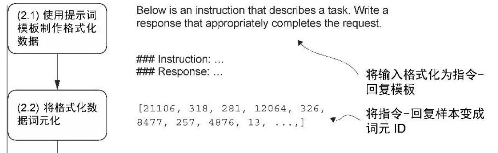
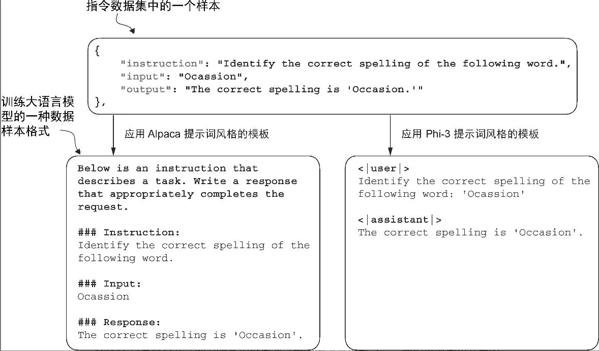
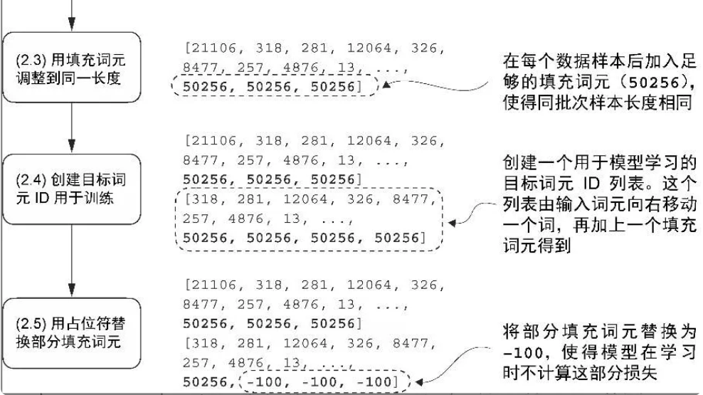
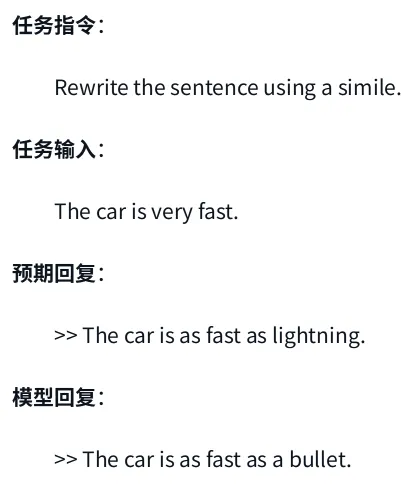

### Datasets
#### S - Download raw datasets
T

- 该数据集保存在一个相对较小的 JSON 格式的文件中（仅 204 KB）。JSON（JavaScript 对象表示法）是一种既便于人类阅读又适合机器处理的数据交换结构，有点儿类似于 Python 字典
- 指令数据集包含 1100 个指令-回复对


A

```py
import json
import os
import urllib


def download_and_load_file(file_path, url):
    if not os.path.exists(file_path):
        with urllib.request.urlopen(url) as response:
            text_data = response.read().decode("utf-8")
        with open(file_path, "w", encoding="utf-8") as file:
            file.write(text_data)
    with open(file_path, "r", encoding="utf-8") as file:
        data = json.load(file)
    return data


file_path = "instruction-data.json"
url = (
    "https://raw.githubusercontent.com/rasbt/LLMs-from-scratch"
    "/main/ch07/01_main-chapter-code/instruction-data.json"
)

data = download_and_load_file(file_path, url)
print("Number of entries:", len(data))
print("Example entry:\n", data[50])

# 从 JSON 文件中加载的 data 列表包含了1100 个指令数据集样本
>>> type(data)
<class 'list'>
>>> len(data)
1100
>>>
>>> from rich.pretty import pprint
>>> pprint(data[0])
{
│   'instruction': 'Evaluate the following phrase by transforming it into the spelling given.',
│   'input': 'freind --> friend',
│   'output': 'The spelling of the given phrase "freind" is incorrect, the correct spelling is "friend".'
}
```


#### ***S - Data preprocessing before any encapsulation
- split by portion

TA

- Split
```py
train_portion = int(len(data) * 0.85)  # 85% for training
test_portion = int(len(data) * 0.1)    # 10% for testing
val_portion = len(data) - train_portion - test_portion  # Remaining 5% for validation

train_data = data[:train_portion]
test_data = data[train_portion:train_portion + test_portion]
val_data = data[train_portion + test_portion:]
```


#### ***S - Data preprocessing & encapsulate by datasets


T

- 提示词风格
  - Alpaca 风格（左）
    - 为指令、输入和回复定义了不同的小节，其采用的是结构化的形式
    - Alpaca 是最早公开详细说明其指令微调过程的大语言模型之一
  - Phi-3 风格（右）
    - 使用了更简单的形式，主要借助的是特殊词元 <|user|> 和 <|assistant|>
    - 微软开发的另一种风格
  - format_input 函数将 data 列表中的样本转换成Alpaca 风格的输入格式
  


A

- Alpaca
```py
def format_input(entry):
    instruction_text = (
        f"Below is an instruction that describes a task. "
        f"Write a response that appropriately completes the request."
        f"\n\n### Instruction:\n{entry['instruction']}"
    )

    input_text = f"\n\n### Input:\n{entry['input']}" if entry["input"] else ""

    return instruction_text + input_text


model_input = format_input(data[50])
desired_response = f"\n\n### Response:\n{data[50]['output']}"

print(model_input + desired_response)

# Below is an instruction that describes a task. Write a response that appropriately completes the request.

# ### Instruction:
# Identify the correct spelling of the following word.

# ### Input:
# Ocassion

# ### Response:
# The correct spelling is 'Occasion.'
```

- Datasets
```py
import torch
from torch.utils.data import Dataset


class InstructionDataset(Dataset):
    def __init__(self, data, tokenizer):
        self.data = data

        # Pre-tokenize texts
        self.encoded_texts = []
        for entry in data:
            instruction_plus_input = format_input(entry)
            response_text = f"\n\n### Response:\n{entry['output']}"
            full_text = instruction_plus_input + response_text
            self.encoded_texts.append(
                tokenizer.encode(full_text)
            )

    def __getitem__(self, index):
        return self.encoded_texts[index]

    def __len__(self):
        return len(self.data)
```


#### ***S - Data preprocessing & encapsulate by dataloaders
- padding
- training pairs
- ignore padding loss



T

- 自定义的聚合函数
  - 在第6章中，训练批次是通过PyTorch的 DataLoader 类自动创建的，该类使用默认的聚合(collate)函数将样本列表组合成训练批次。聚合函数的作用是将单个数据样本列表合并为一个批次，以便模型在训练时能够高效地处理。
  - 指令微调的批次处理稍微有些复杂，因为需要创建一个自定义的聚合函数
- 使用词元 ID 50256 对批次中的训练样本进行填充，以确保每个批次的长度一致。但每个批次的长度可能不同，比如第一批数据就与第二批数据长度不同
- 大语言模型指令微调过程中使用的输入词元和目标词元之间的对应关系。对每个输入序列而言，首先将其向左移动一个词元的位置，然后将输入序列的第一个词元忽略，最后在尾部加入结束符词元即可得到其对应的目标序列
- 为所有填充词元都分配一个 -100 占位符值。这个特殊值使我们能够在计算训练损失时排除填充词元的影响，从而确保只有有效的数据会影响模型的学习


A

- 2.3 padding
```py
def custom_collate_draft_1(
    batch,
    pad_token_id=50256,
    device="cpu"
):
    # Find the longest sequence in the batch
    # and increase the max length by +1, which will add one extra
    # padding token below
    batch_max_length = max(len(item)+1 for item in batch)

    # Pad and prepare inputs
    inputs_lst = []

    for item in batch:
        new_item = item.copy()
        # Add an <|endoftext|> token
        new_item += [pad_token_id]
        # Pad sequences to batch_max_length
        padded = (
            new_item + [pad_token_id] *
            (batch_max_length - len(new_item))
        )
        # Via padded[:-1], we remove the extra padded token
        # that has been added via the +1 setting in batch_max_length
        # (the extra padding token will be relevant in later codes)
        inputs = torch.tensor(padded[:-1])
        inputs_lst.append(inputs)

    # Convert list of inputs to tensor and transfer to target device
    inputs_tensor = torch.stack(inputs_lst).to(device)
    return inputs_tensor
```

- 2.4 training pairs
```py
def custom_collate_draft_2(
    batch,
    pad_token_id=50256,
    device="cpu"
):
    # Find the longest sequence in the batch
    batch_max_length = max(len(item)+1 for item in batch)

    # Pad and prepare inputs
    inputs_lst, targets_lst = [], []

    for item in batch:
        new_item = item.copy()
        # Add an <|endoftext|> token
        new_item += [pad_token_id]
        # Pad sequences to max_length
        padded = (
            new_item + [pad_token_id] *
            (batch_max_length - len(new_item))
        )
        inputs = torch.tensor(padded[:-1])  # Truncate the last token for inputs
        targets = torch.tensor(padded[1:])  # Shift +1 to the right for targets
        inputs_lst.append(inputs)
        targets_lst.append(targets)

    # Convert list of inputs to tensor and transfer to target device
    inputs_tensor = torch.stack(inputs_lst).to(device)
    targets_tensor = torch.stack(targets_lst).to(device)
    return inputs_tensor, targets_tensor
```

- 2.5 ignore padding loss
```py
def custom_collate_fn(
    batch,
    pad_token_id=50256,
    ignore_index=-100,
    allowed_max_length=None,
    device="cpu"
):
    # Find the longest sequence in the batch
    batch_max_length = max(len(item)+1 for item in batch)

    # Pad and prepare inputs and targets
    inputs_lst, targets_lst = [], []

    for item in batch:
        new_item = item.copy()
        # Add an <|endoftext|> token
        new_item += [pad_token_id]
        # Pad sequences to max_length
        padded = (
            new_item + [pad_token_id] *
            (batch_max_length - len(new_item))
        )
        inputs = torch.tensor(padded[:-1])  # Truncate the last token for inputs
        targets = torch.tensor(padded[1:])  # Shift +1 to the right for targets

        # New: Replace all but the first padding tokens in targets by ignore_index
        mask = targets == pad_token_id
        indices = torch.nonzero(mask).squeeze()
        if indices.numel() > 1:
            targets[indices[1:]] = ignore_index

        # New: Optionally truncate to maximum sequence length
        if allowed_max_length is not None:
            inputs = inputs[:allowed_max_length]
            targets = targets[:allowed_max_length]

        inputs_lst.append(inputs)
        targets_lst.append(targets)

    # Convert list of inputs and targets to tensors and transfer to target device
    inputs_tensor = torch.stack(inputs_lst).to(device)
    targets_tensor = torch.stack(targets_lst).to(device)

    return inputs_tensor, targets_tensor
```

- Encapsulate by dataloader
```py
device = torch.device("cuda" if torch.cuda.is_available() else "cpu")

from functools import partial

customized_collate_fn = partial(
    custom_collate_fn,
    device=device,
    allowed_max_length=1024
)


from torch.utils.data import DataLoader

num_workers = 0
batch_size = 8
torch.manual_seed(123)

train_dataset = InstructionDataset(train_data, tokenizer)
train_loader = DataLoader(
    train_dataset,
    batch_size=batch_size,
    collate_fn=customized_collate_fn,
    shuffle=True,
    drop_last=True,
    num_workers=num_workers
)

val_dataset = InstructionDataset(val_data, tokenizer)
val_loader = DataLoader(
    val_dataset,
    batch_size=batch_size,
    collate_fn=customized_collate_fn,
    shuffle=False,
    drop_last=False,
    num_workers=num_workers
)

test_dataset = InstructionDataset(test_data, tokenizer)
test_loader = DataLoader(
    test_dataset,
    batch_size=batch_size,
    collate_fn=customized_collate_fn,
    shuffle=False,
    drop_last=False,
    num_workers=num_workers
)
```


### Model
#### S - 创建模型
#### S - 加载预训练权重到自定义 GPT 模型中
```py
from gpt_download import download_and_load_gpt2
from previous_chapters import GPTModel, load_weights_into_gpt
# If the `previous_chapters.py` file is not available locally,
# you can import it from the `llms-from-scratch` PyPI package.
# For details, see: https://github.com/rasbt/LLMs-from-scratch/tree/main/pkg
# E.g.,
# from llms_from_scratch.ch04 import GPTModel
# from llms_from_scratch.ch05 import download_and_load_gpt2, load_weights_into_gpt


BASE_CONFIG = {
    "vocab_size": 50257,     # Vocabulary size
    "context_length": 1024,  # Context length
    "drop_rate": 0.0,        # Dropout rate
    "qkv_bias": True         # Query-key-value bias
}

model_configs = {
    "gpt2-small (124M)": {"emb_dim": 768, "n_layers": 12, "n_heads": 12},
    "gpt2-medium (355M)": {"emb_dim": 1024, "n_layers": 24, "n_heads": 16},
    "gpt2-large (774M)": {"emb_dim": 1280, "n_layers": 36, "n_heads": 20},
    "gpt2-xl (1558M)": {"emb_dim": 1600, "n_layers": 48, "n_heads": 25},
}

CHOOSE_MODEL = "gpt2-medium (355M)"

BASE_CONFIG.update(model_configs[CHOOSE_MODEL])

model_size = CHOOSE_MODEL.split(" ")[-1].lstrip("(").rstrip(")")
settings, params = download_and_load_gpt2(
    model_size=model_size,
    models_dir="gpt2"
)

model = GPTModel(BASE_CONFIG)
load_weights_into_gpt(model, params)
model.eval();
```

#### No need ***S - 修改模型以进行微调


### Train
### Inference & Evaluate accuracy by human

Output


```py
torch.manual_seed(123)


for entry in test_data[:3]:

    input_text = format_input(entry)

    token_ids = generate(
        model=model,
        idx=text_to_token_ids(input_text, tokenizer).to(device),
        max_new_tokens=256,
        context_size=BASE_CONFIG["context_length"],
        eos_id=50256
    )
    generated_text = token_ids_to_text(token_ids, tokenizer)
    response_text = (
        generated_text[len(input_text):]
        .replace("### Response:", "")
        .strip()
)

    print(input_text)
    print(f"\nCorrect response:\n>> {entry['output']}")
    print(f"\nModel response:\n>> {response_text.strip()}")
    print("-------------------------------------")
```

### Evaluate by loss
```py
torch.manual_seed(123)

optimizer = torch.optim.AdamW(model.parameters(), lr=0.00005, weight_decay=0.1)

num_epochs = 2

train_losses, val_losses, tokens_seen = train_model_simple(
    model, train_loader, val_loader, optimizer, device,
    num_epochs=num_epochs, eval_freq=5, eval_iter=5,
    start_context=format_input(val_data[0]), tokenizer=tokenizer
)
```

```py
from previous_chapters import plot_losses
# Alternatively:
# from llms_from_scratch.ch05 import plot_losses

epochs_tensor = torch.linspace(0, num_epochs, len(train_losses))
plot_losses(epochs_tensor, tokens_seen, train_losses, val_losses)
```


### ***S - Evaluate accuracy by another model
指令微调模型评估
- 并不像指令微调那样简单。
- 在文本分类时，我们只需通过计算正确的垃圾消息与非垃圾消息分类标签的比例来获取准确性。
- 然而，在实践中，对指令微调的大语言模型（如聊天机器人）的评估需要多种方法

T

评估方法
- 多项选择问答 - 短答案和多项选择的基准测试
  - 比如“Measuring Massive Multitask Language Understanding”(MMLU)，主要考查模型的综合知识
- 人类评估 - 与其他大语言模型进行人类偏好比较
  - 比如 LMSYS 聊天机器人竞技场
- 衡量对话性能的自动化指标 - 使用其他大语言模型（如 GPT-4）来自动评估回复的对话基准
  - 比如 AlpacaEval
  - 大语言模型的对话性能是指它们在理解上下文、细微差别和意图的基础上，进行类似人类沟通的能力。这种性能涵盖了多项技能，包括提供相关且连贯的回答、保持一致性，以及能够适应不同的主题和交流风格。


我们要采用的是一种受 AlpacaEval 启发的方法，使用另一个大语言模型来评估微调后的模型的回复。
- 使用了由 Meta AI 开发的现有的
  - 经过指令微调后参数量为 80 亿的 Llama3 模型
  - 该模型可以通过开源的 Ollama 应用程序在本地运行
    - Ollama 是一款高效的应用程序，作为开源 llama.cpp 库的包装器，它旨在用纯 C/C++实现大语言模型，以最大限度提高效率
    - 专为在笔记本电脑上运行大语言模型而设计
    - 不过，Ollama 仅用于生成文本（推理），不支持大语言模型的训练或微调

与依赖公开的基准数据集不同，我们将使用自定义的测试集
- 将生成的模型响应附加到 test_set 字典中，并将更新后的数据保存为 instruction-data-with-response.json 文件


A

指令和回复数据文件
```py
from tqdm import tqdm

for i, entry in tqdm(enumerate(test_data), total=len(test_data)):

    input_text = format_input(entry)

    token_ids = generate(
        model=model,
        idx=text_to_token_ids(input_text, tokenizer).to(device),
        max_new_tokens=256,
        context_size=BASE_CONFIG["context_length"],
        eos_id=50256
    )
    generated_text = token_ids_to_text(token_ids, tokenizer)
    response_text = generated_text[len(input_text):].replace("### Response:", "").strip()

    test_data[i]["model_response"] = response_text


with open("instruction-data-with-response.json", "w") as file:
    json.dump(test_data, file, indent=4)  # "indent" for pretty-printing

print(test_data[0])
# {'instruction': 'Rewrite the sentence using a simile.', 
#  'input': 'The car is very fast.', 
#  'output': 'The car is as fast as lightning.', 
#  'model_response': 'The car is as fast as a bullet.'}
```

start ollama
```bash
# 启动 Ollama 应用程序
ollama serve
```
```py
# Check ollama serve running
import psutil

def check_if_running(process_name):
    running = False
    for proc in psutil.process_iter(["name"]):
        if process_name in proc.info["name"]:
            running = True
            break
    return running

ollama_running = check_if_running("ollama")

if not ollama_running:
    raise RuntimeError("Ollama not running. Launch ollama before proceeding.")
print("Ollama running:", check_if_running("ollama"))
```

start model
```bash
# 启动 Llama 3 模型
ollama run llama3
```

```bash
# 进入一个可以与模型进行交互的命令行界面
>>> What do llamas eat?
# 
# 结束此次 ollama run llama3 会话
/bye
```

```py
import urllib.request

def query_model(
    prompt,
    model="llama3",
    url="http://localhost:11434/api/chat"
):
    # Create the data payload as a dictionary
    data = {
        "model": model,
        "messages": [
            {"role": "user", "content": prompt}
        ],
        "options": {     # Settings below are required for deterministic responses
            "seed": 123,
            "temperature": 0,
            "num_ctx": 2048
        }
    }


    # Convert the dictionary to a JSON formatted string and encode it to bytes
    payload = json.dumps(data).encode("utf-8")

    # Create a request object, setting the method to POST and adding necessary headers
    request = urllib.request.Request(
        url,
        data=payload,
        method="POST"
    )
    request.add_header("Content-Type", "application/json")

    # Send the request and capture the response
    response_data = ""
    with urllib.request.urlopen(request) as response:
        # Read and decode the response
        while True:
            line = response.readline().decode("utf-8")
            if not line:
                break
            response_json = json.loads(line)
            response_data += response_json["message"]["content"]

    return response_data


model = "llama3"
result = query_model("What do Llamas eat?", model)
print(result)
```


利用 Llama 3 模型为我们的微调模型的回复打分，评分范围为 0 到 100
```py
def generate_model_scores(json_data, json_key, model="llama3"):
    scores = []
    for entry in tqdm(json_data, desc="Scoring entries"):
        prompt = (
            f"Given the input `{format_input(entry)}` "
            f"and correct output `{entry['output']}`, "
            f"score the model response `{entry[json_key]}`"
            f" on a scale from 0 to 100, where 100 is the best score. "
            f"Respond with the integer number only."
        )
        score = query_model(prompt, model)
        try:
            scores.append(int(score))
        except ValueError:
            print(f"Could not convert score: {score}")
            continue

    return scores


scores = generate_model_scores(test_data, "model_response")
print(f"Number of scores: {len(scores)} of {len(test_data)}")
print(f"Average score: {sum(scores)/len(scores):.2f}\n")
```


### Conclusion

```py
# Copyright (c) Sebastian Raschka under Apache License 2.0 (see LICENSE.txt).
# Source for "Build a Large Language Model From Scratch"
#   - https://www.manning.com/books/build-a-large-language-model-from-scratch
# Code: https://github.com/rasbt/LLMs-from-scratch
#
# A minimal instruction finetuning file based on the code in chapter 7

from functools import partial
from importlib.metadata import version
import json
import os
import re
import time
import urllib

import matplotlib.pyplot as plt
import tiktoken
import torch
from torch.utils.data import Dataset, DataLoader
from tqdm import tqdm

# Import from local files in this folder
from gpt_download import download_and_load_gpt2
from previous_chapters import (
    calc_loss_loader,
    generate,
    GPTModel,
    load_weights_into_gpt,
    text_to_token_ids,
    train_model_simple,
    token_ids_to_text
)


class InstructionDataset(Dataset):
    def __init__(self, data, tokenizer):
        self.data = data

        # Pre-tokenize texts
        self.encoded_texts = []
        for entry in data:
            instruction_plus_input = format_input(entry)
            response_text = f"\n\n### Response:\n{entry['output']}"
            full_text = instruction_plus_input + response_text
            self.encoded_texts.append(
                tokenizer.encode(full_text)
            )

    def __getitem__(self, index):
        return self.encoded_texts[index]

    def __len__(self):
        return len(self.data)


def custom_collate_fn(
    batch,
    pad_token_id=50256,
    ignore_index=-100,
    allowed_max_length=None,
    device="cpu"
):
    # Find the longest sequence in the batch
    batch_max_length = max(len(item)+1 for item in batch)

    # Pad and prepare inputs and targets
    inputs_lst, targets_lst = [], []

    for item in batch:
        new_item = item.copy()
        # Add an <|endoftext|> token
        new_item += [pad_token_id]
        # Pad sequences to max_length
        padded = new_item + [pad_token_id] * (batch_max_length - len(new_item))
        inputs = torch.tensor(padded[:-1])  # Truncate the last token for inputs
        targets = torch.tensor(padded[1:])  # Shift +1 to the right for targets

        # New: Replace all but the first padding tokens in targets by ignore_index
        mask = targets == pad_token_id
        indices = torch.nonzero(mask).squeeze()
        if indices.numel() > 1:
            targets[indices[1:]] = ignore_index

        # New: Optionally truncate to maximum sequence length
        if allowed_max_length is not None:
            inputs = inputs[:allowed_max_length]
            targets = targets[:allowed_max_length]

        inputs_lst.append(inputs)
        targets_lst.append(targets)

    # Convert list of inputs and targets to tensors and transfer to target device
    inputs_tensor = torch.stack(inputs_lst).to(device)
    targets_tensor = torch.stack(targets_lst).to(device)

    return inputs_tensor, targets_tensor


def download_and_load_file(file_path, url):

    if not os.path.exists(file_path):
        with urllib.request.urlopen(url) as response:
            text_data = response.read().decode("utf-8")
        with open(file_path, "w", encoding="utf-8") as file:
            file.write(text_data)

    with open(file_path, "r") as file:
        data = json.load(file)

    return data


def format_input(entry):
    instruction_text = (
        f"Below is an instruction that describes a task. "
        f"Write a response that appropriately completes the request."
        f"\n\n### Instruction:\n{entry['instruction']}"
    )

    input_text = f"\n\n### Input:\n{entry['input']}" if entry["input"] else ""

    return instruction_text + input_text


def plot_losses(epochs_seen, tokens_seen, train_losses, val_losses):
    fig, ax1 = plt.subplots(figsize=(12, 6))

    # Plot training and validation loss against epochs
    ax1.plot(epochs_seen, train_losses, label="Training loss")
    ax1.plot(epochs_seen, val_losses, linestyle="-.", label="Validation loss")
    ax1.set_xlabel("Epochs")
    ax1.set_ylabel("Loss")
    ax1.legend(loc="upper right")

    # Create a second x-axis for tokens seen
    ax2 = ax1.twiny()  # Create a second x-axis that shares the same y-axis
    ax2.plot(tokens_seen, train_losses, alpha=0)  # Invisible plot for aligning ticks
    ax2.set_xlabel("Tokens seen")

    fig.tight_layout()  # Adjust layout to make room
    plot_name = "loss-plot-standalone.pdf"
    print(f"Plot saved as {plot_name}")
    plt.savefig(plot_name)
    # plt.show()


def main(test_mode=False):
    #######################################
    # Print package versions
    #######################################
    print()
    pkgs = [
        "matplotlib",  # Plotting library
        "tiktoken",    # Tokenizer
        "torch",       # Deep learning library
        "tqdm",        # Progress bar
        "tensorflow",  # For OpenAI's pretrained weights
    ]
    for p in pkgs:
        print(f"{p} version: {version(p)}")
    print(50*"-")

    #######################################
    # Download and prepare dataset
    #######################################
    file_path = "instruction-data.json"
    url = "https://raw.githubusercontent.com/rasbt/LLMs-from-scratch/main/ch07/01_main-chapter-code/instruction-data.json"
    data = download_and_load_file(file_path, url)

    train_portion = int(len(data) * 0.85)  # 85% for training
    test_portion = int(len(data) * 0.1)    # 10% for testing

    train_data = data[:train_portion]
    test_data = data[train_portion:train_portion + test_portion]
    val_data = data[train_portion + test_portion:]

    # Use very small subset for testing purposes
    if args.test_mode:
        train_data = train_data[:10]
        val_data = val_data[:10]
        test_data = test_data[:10]

    print("Training set length:", len(train_data))
    print("Validation set length:", len(val_data))
    print("Test set length:", len(test_data))
    print(50*"-")

    tokenizer = tiktoken.get_encoding("gpt2")
    device = torch.device("cuda" if torch.cuda.is_available() else "cpu")
    print("Device:", device)
    print(50*"-")

    customized_collate_fn = partial(custom_collate_fn, device=device, allowed_max_length=1024)

    num_workers = 0
    batch_size = 8

    torch.manual_seed(123)

    train_dataset = InstructionDataset(train_data, tokenizer)
    train_loader = DataLoader(
        train_dataset,
        batch_size=batch_size,
        collate_fn=customized_collate_fn,
        shuffle=True,
        drop_last=True,
        num_workers=num_workers
    )

    val_dataset = InstructionDataset(val_data, tokenizer)
    val_loader = DataLoader(
        val_dataset,
        batch_size=batch_size,
        collate_fn=customized_collate_fn,
        shuffle=False,
        drop_last=False,
        num_workers=num_workers
    )

    #######################################
    # Load pretrained model
    #######################################

    # Small GPT model for testing purposes
    if args.test_mode:
        BASE_CONFIG = {
            "vocab_size": 50257,
            "context_length": 120,
            "drop_rate": 0.0,
            "qkv_bias": False,
            "emb_dim": 12,
            "n_layers": 1,
            "n_heads": 2
        }
        model = GPTModel(BASE_CONFIG)
        model.eval()
        device = "cpu"
        CHOOSE_MODEL = "Small test model"

    # Code as it is used in the main chapter
    else:
        BASE_CONFIG = {
            "vocab_size": 50257,     # Vocabulary size
            "context_length": 1024,  # Context length
            "drop_rate": 0.0,        # Dropout rate
            "qkv_bias": True         # Query-key-value bias
        }

        model_configs = {
            "gpt2-small (124M)": {"emb_dim": 768, "n_layers": 12, "n_heads": 12},
            "gpt2-medium (355M)": {"emb_dim": 1024, "n_layers": 24, "n_heads": 16},
            "gpt2-large (774M)": {"emb_dim": 1280, "n_layers": 36, "n_heads": 20},
            "gpt2-xl (1558M)": {"emb_dim": 1600, "n_layers": 48, "n_heads": 25},
        }

        CHOOSE_MODEL = "gpt2-medium (355M)"

        BASE_CONFIG.update(model_configs[CHOOSE_MODEL])

        model_size = CHOOSE_MODEL.split(" ")[-1].lstrip("(").rstrip(")")
        settings, params = download_and_load_gpt2(model_size=model_size, models_dir="gpt2")

        model = GPTModel(BASE_CONFIG)
        load_weights_into_gpt(model, params)
        model.eval()
        model.to(device)

    print("Loaded model:", CHOOSE_MODEL)
    print(50*"-")

    #######################################
    # Finetuning the model
    #######################################
    print("Initial losses")
    with torch.no_grad():
        train_loss = calc_loss_loader(train_loader, model, device, num_batches=5)
        val_loss = calc_loss_loader(val_loader, model, device, num_batches=5)

    print("   Training loss:", train_loss)
    print("   Validation loss:", val_loss)

    start_time = time.time()
    optimizer = torch.optim.AdamW(model.parameters(), lr=0.00005, weight_decay=0.1)

    num_epochs = 2

    torch.manual_seed(123)
    train_losses, val_losses, tokens_seen = train_model_simple(
        model, train_loader, val_loader, optimizer, device,
        num_epochs=num_epochs, eval_freq=5, eval_iter=5,
        start_context=format_input(val_data[0]), tokenizer=tokenizer
    )

    end_time = time.time()
    execution_time_minutes = (end_time - start_time) / 60
    print(f"Training completed in {execution_time_minutes:.2f} minutes.")

    epochs_tensor = torch.linspace(0, num_epochs, len(train_losses))
    plot_losses(epochs_tensor, tokens_seen, train_losses, val_losses)
    print(50*"-")

    #######################################
    # Saving results
    #######################################
    print("Generating responses")
    for i, entry in tqdm(enumerate(test_data), total=len(test_data)):

        input_text = format_input(entry)

        token_ids = generate(
            model=model,
            idx=text_to_token_ids(input_text, tokenizer).to(device),
            max_new_tokens=256,
            context_size=BASE_CONFIG["context_length"],
            eos_id=50256
        )
        generated_text = token_ids_to_text(token_ids, tokenizer)
        response_text = generated_text[len(input_text):].replace("### Response:", "").strip()

        test_data[i]["model_response"] = response_text

    test_data_path = "instruction-data-with-response-standalone.json"
    with open(test_data_path, "w") as file:
        json.dump(test_data, file, indent=4)  # "indent" for pretty-printing
    print(f"Responses saved as {test_data_path}")

    file_name = f"{re.sub(r'[ ()]', '', CHOOSE_MODEL) }-sft-standalone.pth"
    torch.save(model.state_dict(), file_name)
    print(f"Model saved as {file_name}")


if __name__ == "__main__":

    import argparse

    parser = argparse.ArgumentParser(
        description="Finetune a GPT model for classification"
    )
    parser.add_argument(
        "--test_mode",
        default=False,
        action="store_true",
        help=("This flag runs the model in test mode for internal testing purposes. "
              "Otherwise, it runs the model as it is used in the chapter (recommended).")
    )
    args = parser.parse_args()

    main(args.test_mode)
```