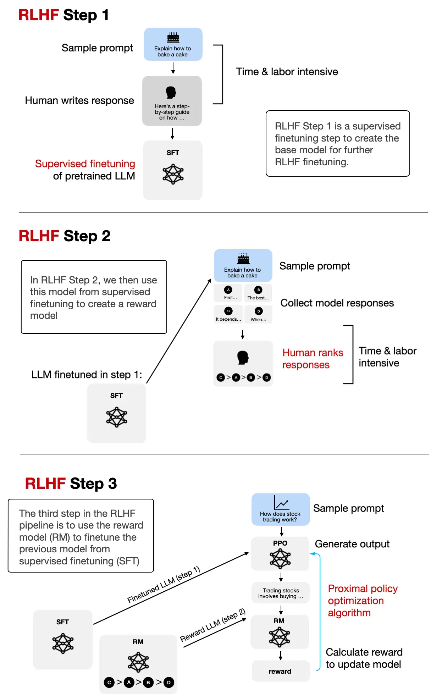

## LLM development flow
| 学习阶段 | Pretraining | SFT | Align - RLHF(PPO) 
|------|----------------------------|------------------------------------|--------------------------------------------------------|
| **目标** | 学习语言结构、常识、语义关系 | 让模型学会“如何正确回答问题” | 通过强化学习优化模型，使其输出更符合人类偏好 |
| **数据** | 海量网页、书籍、代码等 | 人工构造的问答对、对话、代码任务等 | 人类对多个模型回答进行排序，用于训练奖励模型 |
| **方法 / 步骤** | 自监督语言建模（预测下一个词） | 标准监督学习 | 1. 训练奖励模型（Reward Model） 2. 使用 RL（如 PPO）优化输出 |

#### S - 解决序列决策问题（Sequential Decision Making），即在多步决策中平衡短期与长期收益。

T - RL 
- 核心是通过与环境（Environment）的交互学习最优决策策略。通过试错获得反馈（奖励或惩罚），最终目标是最大化累积奖励。
- 类比：类似于训练小狗完成动作——做对了给零食（正奖励），做错了不鼓励（负奖励），最终小狗学会“坐下”或“握手”。

#### S - 不仅能完成目标任务，还能理解人类的主观意图和价值观
T - RLHF

- 核心思想：通过人类的主观反馈替代或修正环境奖励，让AI更符合人类价值观
- 类比：AI的“家教辅导班”. 想象你在教一个孩子学画画，但无法直接用分数评价每幅画的好坏（传统奖励函数设计困难）。于是你请了一位美术老师（人类），对孩子的画作进行点评（反馈），告诉TA哪些线条更优美、哪些配色需要改进。

T - PPO（近端策略优化）

- PPO的核心思想：制定一个“安全范围”，让学员每次训练量只能小幅调整，确保稳定进步
- 类比：健身教练的“安全训练计划”. 想象你是一名健身教练，学员要通过不断调整训练动作来增强肌肉（最大化奖励）。但直接让学员每天大幅增加训练量（策略突变），可能会导致受伤（训练崩溃）
- 核心原理
  - 策略梯度（Policy Gradient）
    - 基础思想：根据动作的“好坏”（优势函数）调整策略。比如，某个动作让学员举得更重（高奖励），就多鼓励这个动作。
    - 问题：如果学员突然尝试过重的动作（策略突变），可能导致肌肉拉伤（训练崩溃
  - PPO的改进——Clip机制
    - “安全阈值”：规定每次训练量变化不超过±20%（类比Clip阈值ε=0.2）

A

R
| 模型                     | 是否使用SFT (用人工问答对训练模型学会“如何回答问题”) | 是否使用RLHF (优化模型输出，使其更符合人类偏好) | 说明                                                                 |
|--------------------------|---------------|----------------|----------------------------------------------------------------------|
| GPT-1 / GPT-2 / GPT-3 | ❌            | ❌             | 仅使用大规模无监督预训练（语言建模）                                |
| GPT-3.5 | ✅            | ✅             | 使用 SFT + 奖励模型 + RLHF（PPO）进行对齐训练                        |
| GPT-4 / GPT-4-turbo   | ✅            | ✅             | 同样使用 SFT + RLHF，训练过程更复杂，可能加入 DPO 等新技术          |
| ChatGPT（所有版本）   | ✅            | ✅             | ChatGPT 是在 GPT-3.5 / GPT-4 基础上，经过 SFT + RLHF 微调得到的对话模型 |

