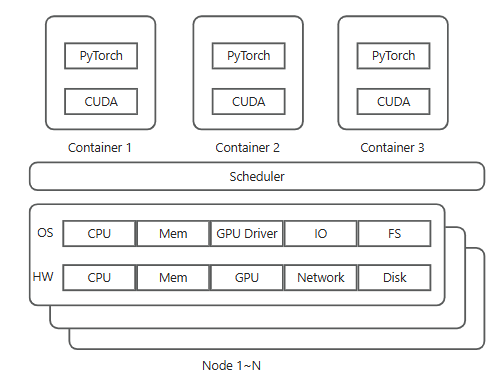
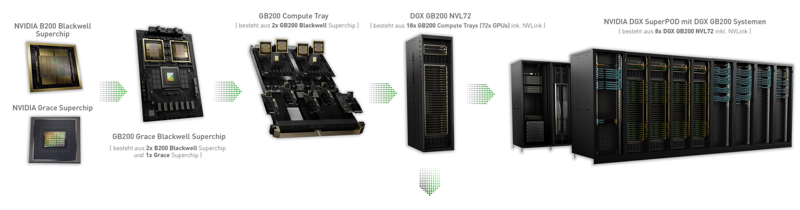
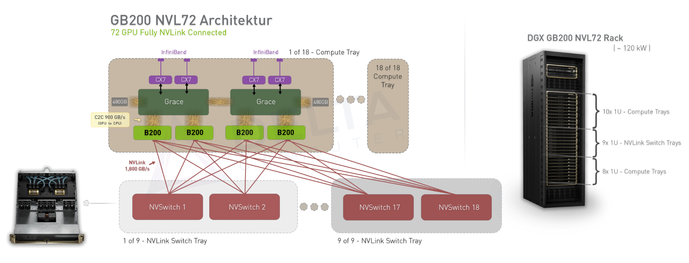
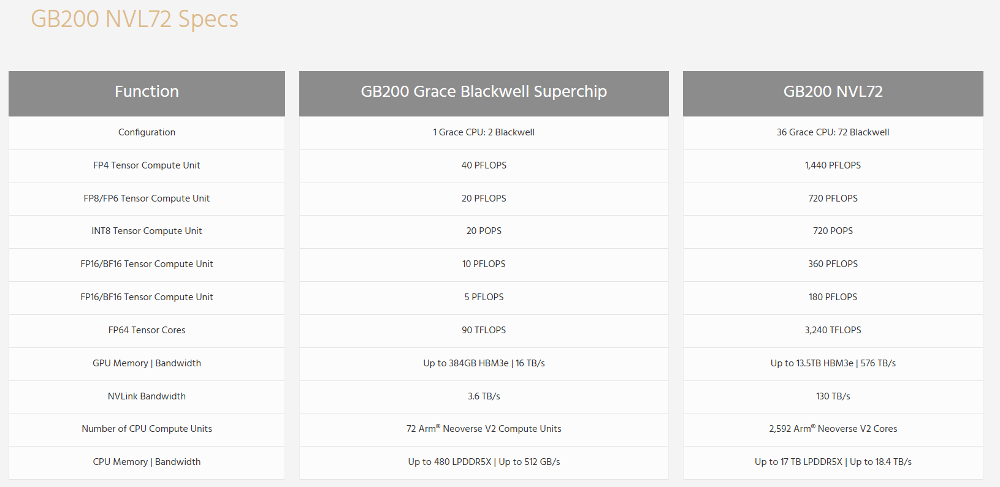
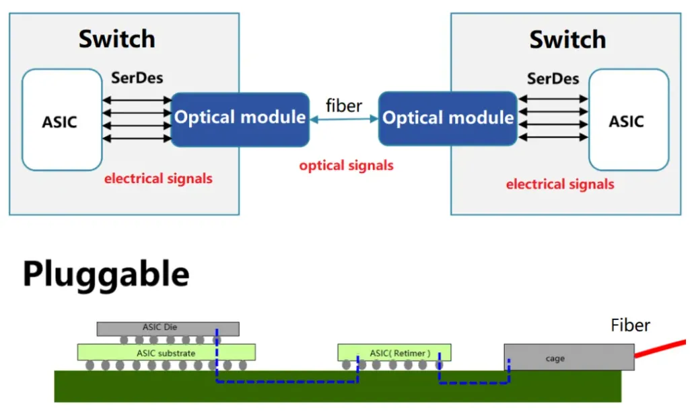
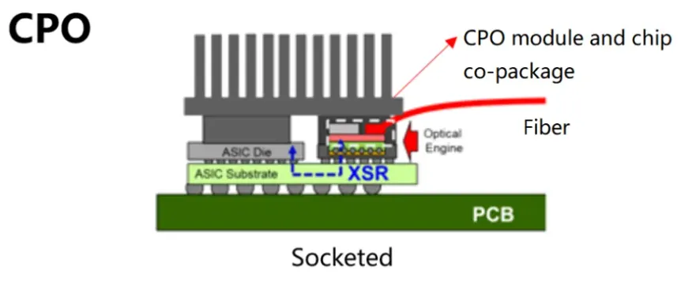

## ML Job Workflow
When a researcher submits a training job, 
1. **Scheduler** reserves nodes, 
2. **OS** provides the GPU devices and memory allocations using the NVIDIA driver
3. **Container** provides the correct software environment including the optimized, hardware-aware CUDA libraries
4. User code (e.g. **PyTorch**, TensorFlow, JAX) uses these **CUDA** libraries which ultimately communicate with the driver and hardware.

## Quick refresher
From Superchip to SuperPOD

GB200 & GB200 NVL72 Specs

## Connect millions of GPUs, seamless and efficient
### Blackwell B200 GPU(GPU,HBM)
#### S - Breaking the limit of transistor number
- there’s a manufacturing limit to how large you can make a chip on silicon.
  - 4nm process means two transistors 4 nanometers apart
  - 从物理角度看，硅原子的直径约为0.22纳米，理论上制程可以做到 0.5纳米。
  - 但在 小于3nm 时，量子隧穿效应会变得显著，影响晶体管的开关性能和稳定性 。
  - 因此，硅基芯片的实用极限大约在2~3nm
  - 再往下发展可能需要 新材料（如碳纳米管、氮化镓、bismuth (BI)）或 新架构（如量子计算）来突破。It’s important to note that silicon is just one of many substances that can be used to create transistors, and it wasn’t chosen for its size; it was chosen because it’s the second most common element on the periodic table of elements. 
- How to double the total transistor budget for the GPU

T - a multi-chip module (MCM)  
Each Blackwell B200 GPU is actually a multi-chip module (MCM) with two GPU dies.

R  
each die has about 104 billion transistors (two transistors 4 nanometers apart) based on TSMC台积电  process

#### S - Die-to-die interconnect
T - 10 TB/s
HW
- die-to-die interconnect that runs at 10 TB/s bandwidth between  

SW
- NVIDIA’s software and scheduling ensure that **work is balanced** across the two dies. This allows developers to largely ignore this complexity as they appear as one GPU as NVIDIA intended.

### GB200 superchip(CPU, DRAM)
#### S - Ultra-large model not fitting on one GPU memory
- Reality, for giant AI models 500 GB in size, much more headroom for model parameters, activations, and input data.
- In older systems, a single GPU might be limited to <100 GB of memory
- dreaded “out of memory” errors 
- which meant models larger than that had to 
  - partitioning the model across multiple GPUs
  - or offloaded to slower NVMe storage or network.

T - unified memory architecture/Extended GPU Memory (EGM)  

CPU and GPU “Superchip”  
- a coherent/unified module/unit 
- packaging an ARM-based CPU together with one or more GPUs in the same unit/pair xxx with on the same package/fusing a CPU and GPUs together
  - Grace CPU sits in the center of the module, flanked by two Blackwell GPU dies 两侧是两个Blackwell GPU芯片
  - Grace-Hopper (GH200) superchip: one Grace CPU + one Hopper H200 GPU
  - Grace-Blackwell (GB200) superchip: one Grace CPU + two Blackwell B200 GPUs

R 
- memeory: To put it simply, each superchip has nearly a terabyte of fast, unified memory at its disposal. 
  - 够大Superchip carries a tremendous amount of memory.
    - One Grace CPU: LPDDR5X DRAM, 480 GB
    - two Blackwell GPUs：HBM3e，384GB
    - total of 864 GB/nearly a terabyte
  - 够方便CPU and GPU share a unified memory address space
    - always see the same data values.
    - GPU can read or write data stored in the CPU’s memory without needing explicit copies.
    - simplifies data management by eliminating the need for manual data transfers between CPU and GPU
    - reduce the programming complexity. Developers can write code without worrying about explicit data movement, which accelerates development and helps focus on improving AI algorithms.
    - effectively blurs the line between “CPU memory” and “GPU memory
- Compute
  - Harmonious coupling
    - CPU: random memory accesses or control-heavy code. GPUs are weaker
    - GPUs: accelerate the number-crunching数字运算. CPU are weaker.

#### S - NVLink-C2C (chip-to-chip) link 
T - 900GB/s
- Tightly linking GPUs and CPU with a high-speed interface/bus/all wired together/NVLink-C2C (chip-to-chip) link 
- Much faster than PCIe. Grace CPU and Blackwell GPUs on a superchip can all access each other’s memory directly as if it were one huge memory pool. 
  - NVLink-C2C link runs at: 900 GB/s of bandwidth between the Grace CPU and each GPU.

R

Disadv
- Accessing data in LPDDR5X isn’t as quick as HBM on the GPU. It’s on the order of 10× lower bandwidth and higher latency. 
- 慢也比disk快The GPU can fetch from CPU RAM at perhaps 900 GB/s (half-duplex 450 GB/s each way), which while slower than HBM, is vastly faster than fetching from NVMe storage. 
- Practice
  - HBM: keep the most frequently used data
  - LPDDR5X DRAM
    - for overflow or 
    - less speed-critical data or
    - to handle general-purpose tasks, preprocess and feed/shovel data to the GPUs

### DGX GB200 NVL72 Rack AI Supercomputer(NVSwitch/NVLink)
#### S - intra rack interconnection
- Multi-node, large model training, GPU sync over slow network
- Traditionally, the GPUs are in different compute nodes and racks so the synchronization happens over relatively-slow network links like InfiniBand and Ethernet

T - NVLink/NVSwitch

“DGX” 是 NVIDIA 的高端 AI 计算平台品牌，代表：
- 完整的系统设计（硬件 + 软件）
- 企业级支持和优化
- 与 NVIDIA 的 AI 工具链（如 Base Command、AI Enterprise）深度集成

GB200 NVL72
- Rack has 18 NVSwitch
  - Rack has 9 switch trays. Each switch tray contains two NVSwitch chips
  - Each chip contains 72 high-speed NVLink5 ports
- Rack has 72 GPU
  - 18 1U compute nodes. Each node contains two GB200 superchips
  - Each Blackwell GPU has 18 NVLink5 ports
-   each GPU uses its 18 NVLink ports to connect to the 18 NVSwitch chips (one link to each switch)
-  full crossbar(完整的横梁, 全连接),Every GPU is connected to every NVSwitch, and every NVSwitch to every GPU

R
- every GPU can talk to any other GPU at very high speed as if all 72 were on the same motherboard
  - any GPU can reach any other GPU in at most two hops (GPU → NVSwitch → GPU)
  - GPUs can operate in a globally shared memory space across the rack. This is why the NVL72 is often described as “one big GPU” or “an AI supercomputer in a rack”.
- a high/enormous/full-bandwidth path between any pair of GPUs.
  - each port can support 100 GB/s of data transferred bidirectionally or 50 GB/s in a single direction. 
  - Combined, a single GPU can shuffle up to 1.8 TB/s (18 NVLink ports * 100 GB/s) of data with its peers via NVLink.

### DGX SuperPod to form AI Factory(RDMA)
#### S - inter rack
- How an NVL72 rack talks to another NVL72 - or to an external storage system like a shared file system
- CPU bogged down managing network interrupts

T - CPU bogged down managing network interrupts
InfiniBand-based solution
- Each compute node in NVL72 is equipped with 
  - high-speed Network Interface Cards [four ConnectX InfiniBand NICs] and
  - a Data Processing Unit (DPU) [one BlueField-3 DPU]
    - serves as a smart network controller, moving data directly between NICs and GPU memory using NVIDIA’s RDMA software called GPUDirect which does not require CPU involvement.
- Switch
  - NVDIA Quantum-series InfiniBand switches

Alternative/Ethernet-based solution/Spectrum-X
- RDMA over Converged Ethernet (RoCE) 
- Spectrum switches  

If you only have Ethernet without RDMA
- try to ensure that it’s the highest bandwidth possible - at least 100 Gbit/s.
- Also make sure your Ethernet networking stack is tuned to use large MTU jumbo frames like 9000 bytes so that you send fewer big packets rather than many small ones. Fewer, larger packets will create less overhead than more, smaller packers. 
- Lastly, ensure your TCP buffer sizes are high enough so the system can have a lot of data in flight. use the Linux networking /etc/sysctl.conf parameters: net.core.rmem_max, net.core.wmem_max to set max buffer sizes

AI factory
The DGX SuperPOD is the computational engine of the AI Factory:
- Built from DGX systems (like DGX H100 or Blackwell-based DGX)
- Connected via NVLink and InfiniBand
- Managed by NVIDIA Base Command and AI Enterprise software
- Scalable to thousands of GPUs

Besides DGX SuperPOD, an AI Factory includes:
- High-speed storage (e.g., NVIDIA Magnum IO, GPUDirect Storage)
- Data pipelines for ingesting and preprocessing training data
- Model orchestration and MLOps tools
- Inference serving infrastructure

R
offload CPU
- offload networking tasks like RDMA, TCP/IP, and NVMe storage access from Grace CPU bogged down managing network interrupts
- let the CPU focuses on other tasks like data preprocessing.

High throughput
- Each of the four InfiniBand NICs runs at 400 Gb/s each. 
- Combined, these NICs send and receive data on the order of 1.6 Tbit/s (1600 Gbit/s) to the outside world
- total outside-rack throughput is nearly 30 Tbit/s (1.6 Tbit/s * 18 compute nodes

#### S - Inter rack, large data, long electrical pathways to optical module
- As networking data throughput rates climb to 800 Gbit/s and beyond
- the traditional approach of pluggable optical modules starts to hit power and signal limits. This burns a lot of power as it converts electrical signals to optical at the switch. 

T - shortens electrical pathways by integrating  optics to switch
integrating co-packaged optics (CPO) into switches 
- optical transmitters are integrated right next to the switch silicon
- NVIDIA is integrating CPO into its Quantum-3 InfiniBand switches scheduled for late 2025 or 2026.

R
- drastically shortens electrical pathways, enabling even higher bandwidth links between racks, reduces power draw, and improves overall communication efficiency
- connect hundreds and thousands of racks (“AI factories”) into a single unified fabric in which inter-rack bandwidth is no longer the bottleneck.

