## Thread

### 分布式训练
#### S - 单个 GPU 训练
T - 只需要将张量传输到同一个 GPU 设备上，PyTorch 会处理其余的工作

将Tensor和Model传输到同一个 GPU 设备上, PyTorch 会处理其余的工作
- 计算在GPU
- 输出的 logits 也自然会在 GPU 上。

回到CPU

- 如果你要将 GPU 张量传给 NumPy、Pandas、Matplotlib 等非 PyTorch 库，就必须显式 .cpu()，否则会报错。
- 自动拷贝只发生在 print() 或 str() 等只读操作中。
  - 可以直接 print() GPU 上的张量，不需要先手动把它 .cpu() 回主机内存。PyTorch 会自动在后台把数据从 GPU 拷贝到 CPU，以便打印。


A

Basic
```py
tensor_1 = torch.tensor([1., 2., 3.])
tensor_2 = torch.tensor([4., 5., 6.])
print(tensor_1 + tensor_2)  # 有两个张量可以相加。默认情况下，这个计算将在 CPU 上执行：
# tensor([5., 7., 9.])


# 如果一个 PyTorch 张量存放在某个设备上，那么其操作也会在同一个设备上执行
# 将这些张量转移到 GPU 上  .to("cuda")、.to("cuda:0")、.to("cuda:1")
tensor_1 = tensor_1.to("cuda")
tensor_2 = tensor_2.to("cuda")
print(tensor_1 + tensor_2)  # 在GPU执行加法操作
# tensor([5., 7., 9.], device='cuda:0')


# 所有的张量必须位于同一个设备上。否则，如果一个张量位于 CPU，另一个张量位于 GPU，计算就会失败
tensor_1 = tensor_1.to("cpu")
print(tensor_1 + tensor_2)
```

tensor and model
```py
import torch.nn.functional as F


torch.manual_seed(123)
model = NeuralNetwork(num_inputs=2, num_outputs=2)

device = torch.device("cuda" if torch.cuda.is_available() else "cpu") # NEW
model.to(device) # NEW

optimizer = torch.optim.SGD(model.parameters(), lr=0.5)

num_epochs = 3

for epoch in range(num_epochs):

    model.train()
    for batch_idx, (features, labels) in enumerate(train_loader):

        features, labels = features.to(device), labels.to(device) # NEW
        # 在当前修改后的训练循环中，由于从 CPU 转移到 GPU的内存传输成本，我们可能不会看到速度的提升。然而，我们可以期待在训练深度神经网络，尤其是大语言模型时，会有显著的速度提升。
        logits = model(features)
        loss = F.cross_entropy(logits, labels) # Loss function

        optimizer.zero_grad()
        loss.backward()
        optimizer.step()

        ### LOGGING
        print(f"Epoch: {epoch+1:03d}/{num_epochs:03d}"
              f" | Batch {batch_idx:03d}/{len(train_loader):03d}"
              f" | Train/Val Loss: {loss:.2f}")

    model.eval()
```


#### S - 多个 GPU 训练
- 分布式训练的概念是将模型训练分配到多个机器的多个 GPU上

T - PyTorch的分布式数据并行(DistributedDataParallel，DDP)策略
分数据，共享梯度

- 模型复制传输到GPUs - PyTorch 会在每个 GPU 上启动一个独立的进程，每个进程都会接收并保存一份模型副本
- 数据分割传输到GPUs - 每个模型都会从数据加载器中接收一个小批次（或简称“批次”） 数据。可以使用 DistributedSampler 来确保在使用 DDP 时，每个 GPU 接收到的批次不同且不重叠

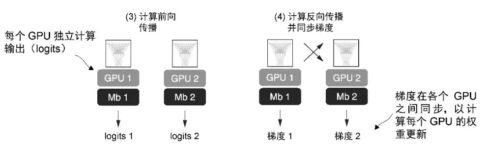
- 由于每个模型副本会看到不同的训练数据样本，因此前向传播和反向传播在每个 GPU 上独立执行。
- 一旦前向传播和反向传播完成，每个 GPU 上各个模型副本的梯度会在所有GPU 之间同步。这可以确保每个模型副本具有相同的更新权重，可以确保模型不会出现分歧


rank
- 这个词来源于 MPI（Message Passing Interface），这是一个早期的并行计算标准。在 MPI 中：
- 每个进程在通信组（communicator）中都有一个编号。
- 这个编号就叫做 rank，意思是“在这个组中的位置”，从 0 到 world_size - 1
- 如果你有 2 张 GPU，那么：
  - rank=0 表示第一个进程（通常绑定 GPU 0）
  - rank=1 表示第二个进程（通常绑定 GPU 1）

一GPU一进程（官方推荐的做法，也是业界主流的分布式训练方式）
- DDP 的设计初衷就是每个 GPU 对应一个进程
- 能最大化 GPU 利用率和通信效率

一GPU多进程（不常见）
- 可能导致资源竞争、上下文切换开销大


A

1.限制能用的GPU
- 在多 GPU 机器上限制用于训练的 GPU 数量，那么最简单的方法是使用CUDA_VISIBLE_DEVICES 环境变量
```py
# 如果你的机器有 4 个 GPU，而你只想使用第一个和第三个 GPU
CUDA_VISIBLE_DEVICES=0,2 python xxx.py
```

2.按照GPU数量，启动多个进程
- 使用 torch.cuda.device_count() 打印可用 GPU的数量作为world_size
- 使用 PyTorch的 multiprocessing.spawn 函数生成新进程
  - nproces=world_size - 为每个 GPU 启动一个进程
  - main - 用这些进程启动主函数main，并通过args 提供一些额外的参数。
- main 的第一个参数 rank 是由 mp.spawn 自动传入的，表示当前进程的编号（从 0 到 world_size - 1）。main 实际上是这样被调用的：
  - main(rank=0,world_size,num_epochs)
  - main(rank=1,world_size,num_epochs)
  - ...
  - main(rank=world_size-1,world_size,num_epochs)
```py
if __name__ == "__main__":
    torch.manual_seed(123)
    num_epochs = 3
    world_size = torch.cuda.device_count()
    mp.spawn(main, args=(world_size, num_epochs), nprocs=world_size)
```


3.将每个进程加入到进程组并绑定到各自GPU
- 设置主节点的地址和端口以便不同进程之间进行通信
  - 在单机多卡训练中，localhost 表示本机。
  - 所有进程会通过这个地址和端口建立通信连接。
- init_process_group- 加入同一个进程组，并完成自身的初始化。
  - init_method - 初始化方法env://, topc://ip.port
  - backend - 通信后端nccl, mpi, gloo
  - rank - 当前进程编号,0~world_size -1
  - world_size - 总进程数
- 将当前进程绑定到编号为 rank 的 GPU
  - 如果你有 4 张 GPU，rank 为 0 的进程就用 cuda:0，rank 为 1 的进程就用 cuda:1，以此类推

```py
def ddp_setup(rank, world_size):
    os.environ["MASTER_ADDR"] = "localhost"
    os.environ["MASTER_PORT"] = "12345"

    init_process_group(backend="nccl", rank=rank, world_size=world_size)

    torch.cuda.set_device(rank)
```

4.每个进程接受子样本
- 在训练加载器中设置 sampler=DistributedSampler(train_ds) 每个 GPU 将接收不同的训练数据子样本
```py

def prepare_dataset():
    X_train = torch.tensor([
        [-1.2, 3.1],
        [-0.9, 2.9],
        [-0.5, 2.6],
        [2.3, -1.1],
        [2.7, -1.5]
    ])
    y_train = torch.tensor([0, 0, 0, 1, 1])

    X_test = torch.tensor([
        [-0.8, 2.8],
        [2.6, -1.6],
    ])
    y_test = torch.tensor([0, 1])


    train_ds = ToyDataset(X_train, y_train)
    test_ds = ToyDataset(X_test, y_test)

    train_loader = DataLoader(
        dataset=train_ds,
        batch_size=2,
        shuffle=False,  # NEW: False because of DistributedSampler below
        pin_memory=True,
        drop_last=True,
        sampler=DistributedSampler(train_ds)  # NEW
    )
    test_loader = DataLoader(
        dataset=test_ds,
        batch_size=2,
        shuffle=False,
    )
    return train_loader, test_loader
```

5.每个进程单独训练
- 通过.to(rank) 将模型和数据传输到目标设备，其中 rank 用于指代 GPU 设备 ID
- 通过DDP 封装模型，从而在训练期间实现不同 GPU 之间梯度的同步
- train_loader Set sampler to ensure each epoch has a different shuffle order
- 评估模型后，使用 destroy_process_group() 来干净地退出分布式训练模式并释放已分配的资源
```py
def main(rank, world_size, num_epochs):

    ddp_setup(rank, world_size)  # NEW: initialize process groups

    train_loader, test_loader = prepare_dataset()
    model = NeuralNetwork(num_inputs=2, num_outputs=2)
    model.to(rank)
    optimizer = torch.optim.SGD(model.parameters(), lr=0.5)

    model = DDP(model, device_ids=[rank])  # NEW

    for epoch in range(num_epochs):
        train_loader.sampler.set_epoch(epoch) # NEW

        model.train()
        for features, labels in train_loader:

            features, labels = features.to(rank), labels.to(rank)  # New
            logits = model(features)
            loss = F.cross_entropy(logits, labels)  # Loss function

            optimizer.zero_grad()
            loss.backward()
            optimizer.step()

            # LOGGING
            print(f"[GPU{rank}] Epoch: {epoch+1:03d}/{num_epochs:03d}"
                  f" | Batchsize {labels.shape[0]:03d}"
                  f" | Train/Val Loss: {loss:.2f}")

    model.eval()

    try:
        train_acc = compute_accuracy(model, train_loader, device=rank)
        print(f"[GPU{rank}] Training accuracy", train_acc)
        test_acc = compute_accuracy(model, test_loader, device=rank)
        print(f"[GPU{rank}] Test accuracy", test_acc)

    destroy_process_group()  # NEW
```


6.summary
```py
import torch
import torch.nn.functional as F
from torch.utils.data import Dataset, DataLoader

# NEW imports:
import os
import platform
import torch.multiprocessing as mp
from torch.utils.data.distributed import DistributedSampler
from torch.nn.parallel import DistributedDataParallel as DDP
from torch.distributed import init_process_group, destroy_process_group


# NEW: function to initialize a distributed process group (1 process / GPU)
# this allows communication among processes
def ddp_setup(rank, world_size):
    """
    Arguments:
        rank: a unique process ID
        world_size: total number of processes in the group
    """
    # rank of machine running rank:0 process
    # here, we assume all GPUs are on the same machine
    os.environ["MASTER_ADDR"] = "localhost"
    # any free port on the machine
    os.environ["MASTER_PORT"] = "12345"

    # initialize process group
    if platform.system() == "Windows":
        # Disable libuv because PyTorch for Windows isn't built with support
        os.environ["USE_LIBUV"] = "0"
        # Windows users may have to use "gloo" instead of "nccl" as backend
        # gloo: Facebook Collective Communication Library
        init_process_group(backend="gloo", rank=rank, world_size=world_size)
    else:
        # nccl: NVIDIA Collective Communication Library
        init_process_group(backend="nccl", rank=rank, world_size=world_size)

    torch.cuda.set_device(rank)


class ToyDataset(Dataset):
    def __init__(self, X, y):
        self.features = X
        self.labels = y

    def __getitem__(self, index):
        one_x = self.features[index]
        one_y = self.labels[index]
        return one_x, one_y

    def __len__(self):
        return self.labels.shape[0]


class NeuralNetwork(torch.nn.Module):
    def __init__(self, num_inputs, num_outputs):
        super().__init__()

        self.layers = torch.nn.Sequential(
            # 1st hidden layer
            torch.nn.Linear(num_inputs, 30),
            torch.nn.ReLU(),

            # 2nd hidden layer
            torch.nn.Linear(30, 20),
            torch.nn.ReLU(),

            # output layer
            torch.nn.Linear(20, num_outputs),
        )

    def forward(self, x):
        logits = self.layers(x)
        return logits


def prepare_dataset():
    X_train = torch.tensor([
        [-1.2, 3.1],
        [-0.9, 2.9],
        [-0.5, 2.6],
        [2.3, -1.1],
        [2.7, -1.5]
    ])
    y_train = torch.tensor([0, 0, 0, 1, 1])

    X_test = torch.tensor([
        [-0.8, 2.8],
        [2.6, -1.6],
    ])
    y_test = torch.tensor([0, 1])

    # Uncomment these lines to increase the dataset size to run this script on up to 8 GPUs:
    # factor = 4
    # X_train = torch.cat([X_train + torch.randn_like(X_train) * 0.1 for _ in range(factor)])
    # y_train = y_train.repeat(factor)
    # X_test = torch.cat([X_test + torch.randn_like(X_test) * 0.1 for _ in range(factor)])
    # y_test = y_test.repeat(factor)

    train_ds = ToyDataset(X_train, y_train)
    test_ds = ToyDataset(X_test, y_test)

    train_loader = DataLoader(
        dataset=train_ds,
        batch_size=2,
        shuffle=False,  # NEW: False because of DistributedSampler below
        pin_memory=True,
        drop_last=True,
        # NEW: chunk batches across GPUs without overlapping samples:
        sampler=DistributedSampler(train_ds)  # NEW
    )
    test_loader = DataLoader(
        dataset=test_ds,
        batch_size=2,
        shuffle=False,
    )
    return train_loader, test_loader


# NEW: wrapper
def main(rank, world_size, num_epochs):

    ddp_setup(rank, world_size)  # NEW: initialize process groups

    train_loader, test_loader = prepare_dataset()
    model = NeuralNetwork(num_inputs=2, num_outputs=2)
    model.to(rank)
    optimizer = torch.optim.SGD(model.parameters(), lr=0.5)

    model = DDP(model, device_ids=[rank])  # NEW: wrap model with DDP
    # the core model is now accessible as model.module

    for epoch in range(num_epochs):
        # NEW: Set sampler to ensure each epoch has a different shuffle order
        train_loader.sampler.set_epoch(epoch)

        model.train()
        for features, labels in train_loader:

            features, labels = features.to(rank), labels.to(rank)  # New: use rank
            logits = model(features)
            loss = F.cross_entropy(logits, labels)  # Loss function

            optimizer.zero_grad()
            loss.backward()
            optimizer.step()

            # LOGGING
            print(f"[GPU{rank}] Epoch: {epoch+1:03d}/{num_epochs:03d}"
                  f" | Batchsize {labels.shape[0]:03d}"
                  f" | Train/Val Loss: {loss:.2f}")

    model.eval()

    try:
        train_acc = compute_accuracy(model, train_loader, device=rank)
        print(f"[GPU{rank}] Training accuracy", train_acc)
        test_acc = compute_accuracy(model, test_loader, device=rank)
        print(f"[GPU{rank}] Test accuracy", test_acc)

    ####################################################
    # NEW (not in the book):
    except ZeroDivisionError as e:
        raise ZeroDivisionError(
            f"{e}\n\nThis script is designed for 2 GPUs. You can run it as:\n"
            "CUDA_VISIBLE_DEVICES=0,1 python DDP-script.py\n"
            f"Or, to run it on {torch.cuda.device_count()} GPUs, uncomment the code on lines 103 to 107."
        )
    ####################################################

    destroy_process_group()  # NEW: cleanly exit distributed mode


def compute_accuracy(model, dataloader, device):
    model = model.eval()
    correct = 0.0
    total_examples = 0

    for idx, (features, labels) in enumerate(dataloader):
        features, labels = features.to(device), labels.to(device)

        with torch.no_grad():
            logits = model(features)
        predictions = torch.argmax(logits, dim=1)
        compare = labels == predictions
        correct += torch.sum(compare)
        total_examples += len(compare)
    return (correct / total_examples).item()


if __name__ == "__main__":
    # This script may not work for GPUs > 2 due to the small dataset
    # Run `CUDA_VISIBLE_DEVICES=0,1 python DDP-script.py` if you have GPUs > 2
    print("PyTorch version:", torch.__version__)
    print("CUDA available:", torch.cuda.is_available())
    print("Number of GPUs available:", torch.cuda.device_count())
    torch.manual_seed(123)

    # NEW: spawn new processes
    # note that spawn will automatically pass the rank
    num_epochs = 3
    world_size = torch.cuda.device_count()
    mp.spawn(main, args=(world_size, num_epochs), nprocs=world_size)
    # nprocs=world_size spawns one process per GPU
```


R

除去设备之间由于使用 DDP 而产生的少量通信开销，理论上使用两个 GPU 可以将训练一轮的时间缩短一半。时间效率会随着 GPU 数量的增加而提高，如果有 8 个 GPU，那么可以将一轮的处理速度提高 8 倍，以此类推。


### 容量,增加core


### 数量, Increase in-flight instructions
#### S -  How to saturate bandwidth
T - Little's Law

For Escalator: Add more in-flight people to saturate bandwidth
- Bandwidth = 0.5 person/s
- Latency = 40 senconds
- One person in flight
- How many persons do we need in-flight to saturate bandwidth? 
  - Concurrency = Bandwidth * Latency = 0.5 * 40 = 20 persons


For GPU: Increase in-flight instructions to maximize performance
- FP32 Bandwidth = 8 ops per cycle
- FP32 Latency = 24 cycles
- Concurrency = 8 * 24 operations in-flight
- Increase in-flight instructions -> hide latency of compute & memory access -> saturate compute units & memory bandwidth -> maximize performance


Ways to increase in-flight instructions
- More threads by improving TLP
- More independent instructions per thread by improving ILP


#### S - Improving ILP by computing more elements per thread to merge instruction issue
- 用#prama unroll, 展开且合并两组独立的load指令
- 用常量使idx可静态分析，合并要写元素的load

##### Instruction Issue指令发射
1.一句话通常是一条指令
2.常见指令

| 指令    | 功能描述                               | 示例语句                                     | 说明                                     |
|---------|----------------------------------------|----------------------------------------------|------------------------------------------|
| `LDG(Load Global)`   | 从全局内存加载数据到寄存器             | `ld.global.f32 %f1, [%r1];`                   | 将 `%r1` 指向的内存地址中的 float 加载到 `%f1` |
| `STG(Store Global)`   | 将寄存器中的数据写入全局内存           | `st.global.f32 [%r1], %f2;`                   | 把 `%f2` 中的 float 写入 `%r1` 指定的全局内存地址 |
| `FFMA(Fused Floating-point Multiply-Add融合乘加)`  | 执行 `a * b + c` 操作     | `ffma.f32 %f3, %f1, %f2, %f4;`                | `%f3 = %f1 * %f2 + %f4`，提高精度和性能         |

3.Instruction Issue（指令发射）是指将指令从指令队列发送到执行单元（如 ALU、SFU、Load/Store 单元等）的过程

假设
- LDG/STG（全局内存加载/存储）
  - Issue Rate: 每 1 cycle 可发射一次
  - Dependent Issue Rate: 1000 cycles（即依赖数据的下一条指令必须等 1000 cycles 才能发射）
- FP32 Pipeline（浮点计算）
  - Issue Rate: 每 2 cycles 可发射一次
  - Dependent Issue Rate: 4 cycles（即依赖前一条 FP32 指令的下一条指令需等 4 cycles）
- 每个调度器只有一个 warp 可用

发射
- Cycle N ~ N+2：连续发射了 3 条 LDG 指令（加载 a[idx], b[idx], c[idx]）
  - 由于 LDG 的 issue rate 是 1 cycle，所以可以连续发射。
  - 但这些加载的数据是后续 FFMA 所依赖的，因此必须等待 1000 cycles 才能发射 FFMA。
- Cycle N+3~1001：出现了 (stall)，表示由于数据依赖，调度器无法发射新的指令。
- Cycle N+1002：执行 FFMA（浮点乘加）
  - 由于 LDG 的 dependent latency 是 1000 cycles，FFMA 必须等到 N+1002 才能执行。
  - 如果下一条指令依赖 FFMA 的结果（无论它是不是 FP32 运算），它必须等 4 个 cycles 才能发射。
- Cycle N+1006：执行 STG（将结果写回全局内存）
  - STG 依赖 FFMA 的结果，因此必须等 FFMA 完成后再等 4 cycles（FP32 dependent latency）才能发射。
  - STG 本身是 memory 操作，符合其 issue 和 dependent 规则。

总结
- 总共是1006个cycle
- 由于 全局内存访问的高延迟（1000 cycles），导致即使指令可以快速发射，仍然需要等待数据准备好，最终一个线程处理两个元素的整个 pipeline 需要 1006 个周期

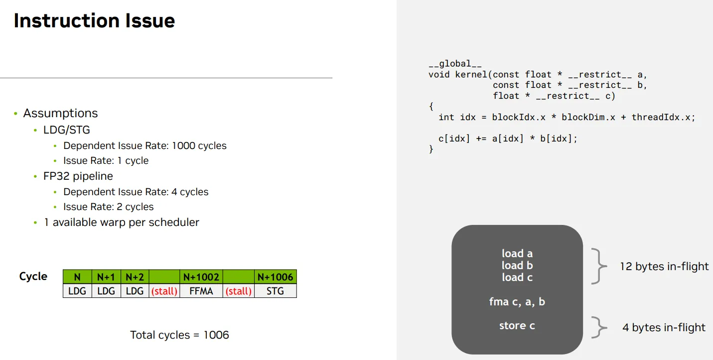


##### computing more elements per thread - 每个线程处理两个相隔 整个grid的线程总数/grid stride 的元素
- 不是说要用grid，本来就要用
- 是说要unroll 2, 展开并合并两组独立的指令，减少整体数据
- grid stride没问题只要数组长度 N 足够：例如至少为 2 * stride

BEFORE
- 每个线程只处理一个元素 idx
- a[idx] 和 b[idx] 的加载是 依赖于 idx 的计算
- c[idx] += ... 是一个 读-改-写 操作，依赖于前面两个加载的结果
- 所以这三个操作之间是严格串行依赖的
```py
int idx = blockIdx.x * blockDim.x + threadIdx.x;
c[idx] += a[idx] * b[idx];
```

AFTER
- 每个线程处理两个元素：idx1 = tid 和 idx2 = tid + stride
- 这两个元素之间没有数据依赖，可以并行调度
- 编译器看到 #pragma unroll 2，会将循环展开为两个独立的语句；
- a[idx] 和 b[idx]，因为它们是 const float*，只读且 __ restrict __ 限定了它们不会别名冲突。
- 因此，load a[idx2] 和 load b[idx2] 可以在 load a[idx1] 和 load b[idx1] 之后立即发射，而不需要等待 FFMA 或 STG 完成。
```py
int tid = blockIdx.x * blockDim.x + threadIdx.x;
int stride = blockDim.x * gridDim.x;
#pragma unroll 2
for (int i = 0; i < 2; i++) {
    const int idx = tid + i * stride;
    c[idx] += a[idx] * b[idx];
}
```
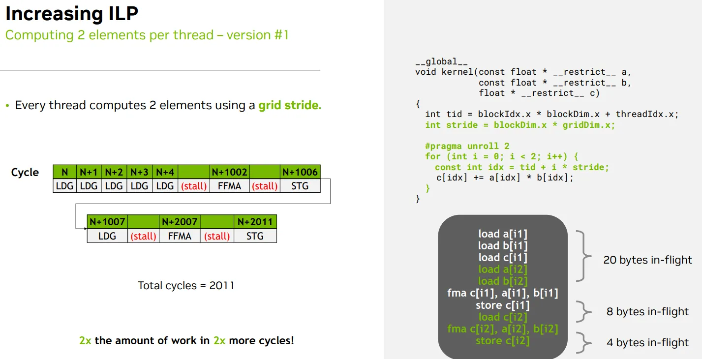


##### computing more elements per thread - 每个线程处理两个相隔 THREAD_BLOCK_DIM/constant block stride 的元素
地址计算是否静态可分析
- 可静态分析”并不是指编译器能知道它的具体值，而是指它的结构和取值范围是可预测的，从而允许编译器进行某些优化
- 为什么 blockIdx.x 是“可分析”的？
  - 虽然 blockIdx.x 是运行时变量，但它的取值范围是 [0, gridDim.x - 1]，而 gridDim.x 是在 host 端 kernel 启动时指定的，编译器知道它是一个固定的配置参数，不会在 kernel 内部改变。
  - 这意味着：
    - 编译器可以假设 blockIdx.x 是一个有限范围内的整数
    - 可以在某些场景下进行循环展开或索引优化
- 为什么 gridDim.x 本身不可静态分析？
  - gridDim.x 是由 host 端传入的配置参数
  - 编译器无法在编译阶段知道它的具体值


BEFORE
- use dim
- 编译器无法在编译期判断 idx0 和 idx1 是否访问不同地址
- c[idx] **+=** ... 是一个 读-改-写（load-modify-store）操作
- 调度器可能采取更保守的策略，等待 FFMA(idx1) 和 store c[idx1] 完成后，才发射 load c[idx2]，以避免潜在的地址冲突（即使实际上没有
```py
int tid = blockIdx.x * blockDim.x + threadIdx.x;
int stride = blockDim.x * gridDim.x;
idx = tid + i * stride;
```

- use constant
- THREAD_BLOCK_DIM 是一个 编译期常量（通常是 #define 或 const int）
- i 是循环变量，循环次数固定（比如 for (int i = 0; i < 2; ++i)）
- blockIdx.x 和 threadIdx.x 是 CUDA 内建变量，虽然它们是运行时值，但它们的 取值范围是已知的（比如 blockIdx.x ∈ [0, gridDim.x)）
- 所以 off + i * THREAD_BLOCK_DIM 是一个线性表达式,不同线程的 off 值是互不重叠、线性分布的
- 编译器可以展开为多个具体的 idx 值
```py
int off = 2 * THREAD_BLOCK_DIM * blockIdx.x + threadIdx.x;  
const int idx = off + i * THREAD_BLOCK_DIM;
```
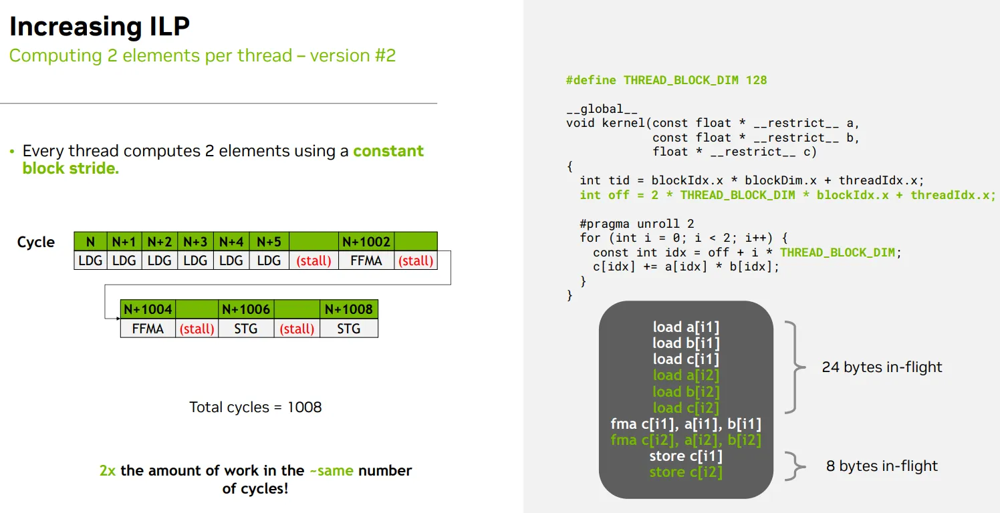


#### S - Improving TLP by increasing active warps num(occupancy) by relieving limiter
- 减少每个线程需要的存储，能创建更多的warp驻留在SM上，有更多的线程

| 资源类型           | 数值要求                   | 说明 |
|--------------------|----------------------------|------|
| 每线程寄存器数     | ≤ 32                       | SM 总寄存器数通常为 65536；64 warp × 32线程 × 32寄存器 = 65536 |
| 每 block 共享内存使用 | ≤ 1.5 KB（推荐）            | SM 的共享内存上限为 96KB（Ampere），如加载 64 warp（假设 256线程/block → 8warp/block）需加载 8 block，共享内存不得超过 96KB / 8 = 12KB/block，推荐进一步保守控制在 1.5KB/block 以内以预留空间 |
| block size（线程数） | 256 ~ 512（需为 32 的倍数） <<<gridDim = 8, blockDim = 256>>> | 保证 warp 整齐划分（32整数倍），并使 SM 能加载多个 block 以填满 warp 数。如 256线程/block → 8warp/block，需要 8 block 才能达到 64 warp |


##### Warp scheduling for active warps num(occupancy)
Warp num

- 固定硬件上限, 每个 SM 理论上最多能容纳的 warp 数（如 64 warp）  -> 最大 warp 
- CUDA kernel 启动时，确实可以创建大量 warp（比如几千个）  -> 可创建 warp 是理论数量
- 但每个 SM 的资源有限（寄存器、共享内存、线程数）,所以只有部分 warp 能真正“驻留”在 SM 上，成为 活跃 warp  -> 活跃 warp 

Occupancy

- 每周期 issue 的 warp 数是调度器能力
- Occupancy 是指有多少 warp 被加载并准备运行（active）\
  - 因为当有些 warp 因为访存而 stall，调度器可以切换到其他 warp：
    - 有更多 warp ➜ 更容易隐藏内存延迟
    - 少 warp ➜ 被访存 stall 卡住，就没别的 warp 可以执行 ➜ idle

Each Warp scheduler

- has 16 warp slots, can manage 16 ready waprs
- issue 1 warp per cycle
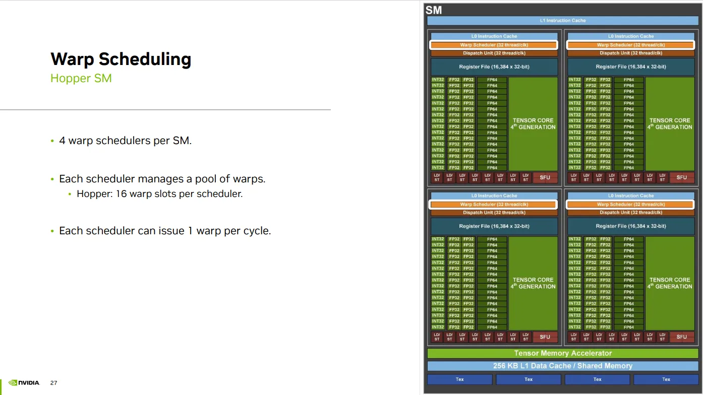


Active Warp states

- Stalled
- Eligible
- Selected/issue/active - Warps occupying scheduler warp slots


From eligible to active

- Each cycle: out of all eligible warps, select one to issue on that cycle.
  - Warp at slot 2 becomes eligible.  Warp at slot 2 is selected. 
- Warp selected at cycle N is not eligible in cycle N+1
    - E.g., instructions with longer latencies.  
- No eligible warps! Issue slot unused
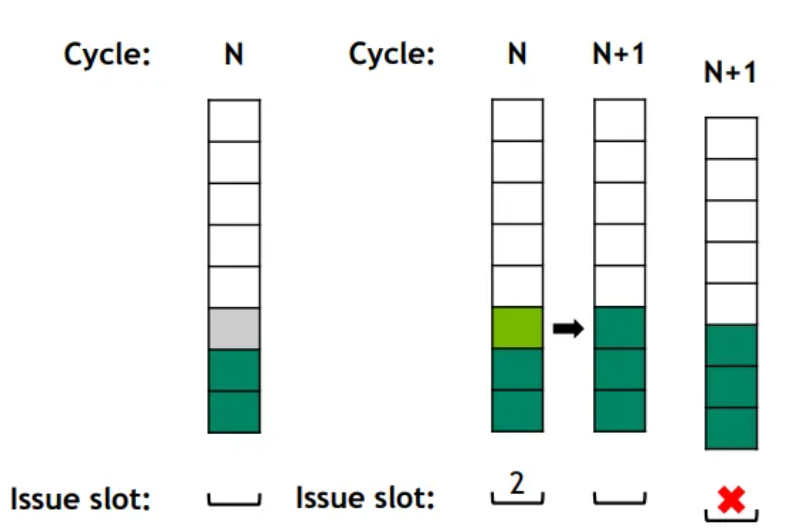


Having more active warps would help reduce idle issue slots and hide latencies of stalled warps.  
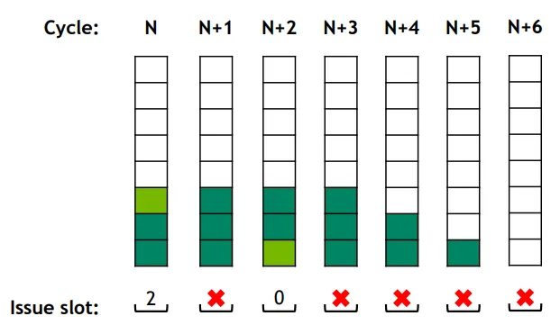


Occupancy（占用率）- 一个 SM（Streaming Multiprocessor）上实际活跃的 warps 数量与其最大可支持 warps 数量的比值
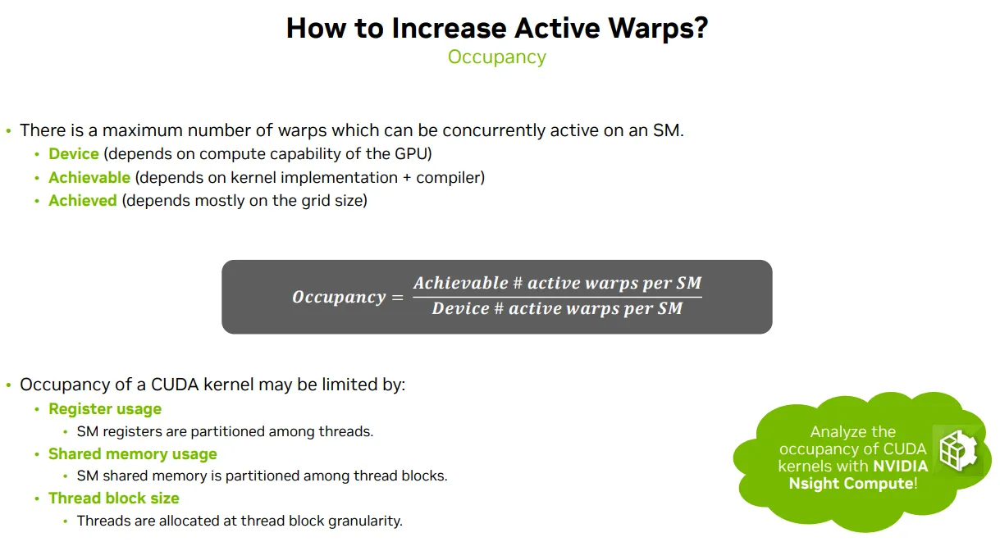


##### Occupancy limiters
<u>Register (Per SM, 64k 32bit registers)</u>
- Each thread uses registers -> Registers per thread: 63, Registers per warp = 63 × 32 = 2016
- Registers are allocated in chunks (e.g., 256) -> Registers allocated per warp (rounded up to next multiple of 256): 2048
- total number of registers per SM is fixed (e.g., 65536) -> Total registers per SM: 65536
- The more registers each warp uses, the fewer warps can fit on an SM，Max active warps per SM = 65536 / 2048 = 32 warps
- Max possible warps per SM (on Hopper architecture): 64 warps
- Occupancy = 32 / 64 × 100% = 50%
- High register usage per thread reduces the number of warps that can be active on an SM, thereby lowering occupancy.
- 每线程使用 ≤ 32 个寄存器 是达到 64 warp occupancy 的关键条件之一。

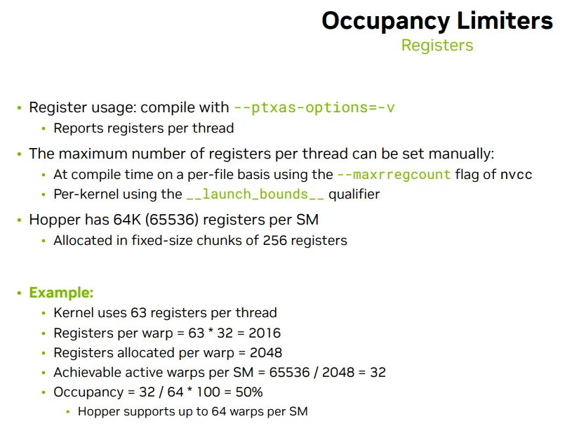


<u>Shared memory (Per SM, 228KB)</u>
- 每个 Block 的共享内存需求是每个kernel不一样的 - 比如，一个 128 线程的 block 使用 17408 字节 的共享内存，再加上 1024 字节 的额外开销，故每个 block 总共使用：17408 + 1024 = 18432 字节
- 每个 SM 总共提供 233472 字节 的共享内存 -> 每个 SM 能容纳的active Block数 Blocks per SM = 233472 / 18432} =12.66 由于实际运行中 block 数必须为整数，所以取整为 12 个 block。
- 每个SM active warp 数为：12 * 4 = 48 个 warp
  - 在一个 SM 上有 12 个 block
  - 每个 block 中有 128 个线程，而一个 warp 有 32 个线程，所以一个 block 内有： 128 / 32 = 4 个 warp
- Occupancy: 48/64=75%

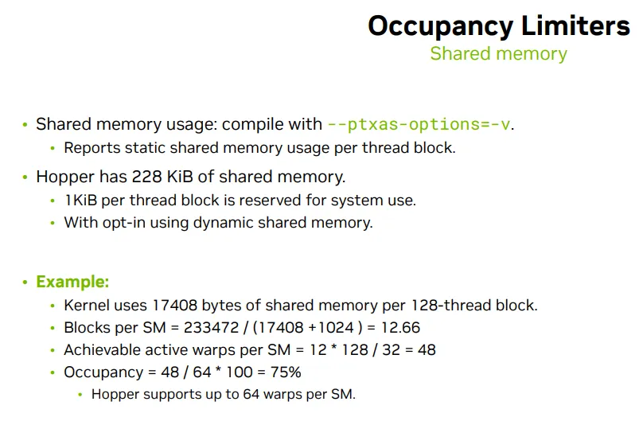


#### Tradeoff between TLP and ILP

Simple alogrithms, High TLP, High occupancy, Choose Fisrt

- more threads per SM
- fewer register per thread, fewer shared memory

Complex algorithms, High ILP

- fewere thread per SM
- more resources per thread

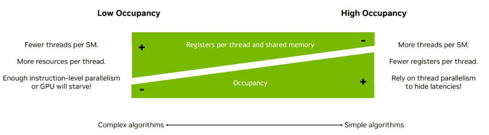


### 质量，Tensor Cores专门硬件计算FMMA
- 深度学习中的大量的矩阵乘法Z=W⋅X+b
- 张量运算 中 矩阵乘法和累加（Matrix Multiply and Accumulate, MMA）（如 A × B + C）比较普遍
- 是 NVIDIA GPU 中专门用于 矩阵乘法和累加（Matrix Multiply and Accumulate, MMA） 的硬件单元，首次出现在 Volta 架构（如 V100）中
- 高吞吐量：Tensor Core 可以在一个时钟周期内执行多个 FFMA 操作


## Memory

### 容量, Increase memory capacity, increase the space for more instructions
- Register: 64K 32-bit registers per SM
- Shared memory/L1 Cache: 228 KB per SM
- L2 Cache: 50 MB per device
- HBM3e: 141 GB per device


### 提高内存访问吞吐量，减少LDG指令的次数

Memory Bandwidth（内存带宽）这是指理论上内存系统每秒可以传输的数据量，通常以 GB/s（千兆字节每秒） 为单位。它由硬件决定

- 内存总线宽度（如 64 位）
- 内存频率（如 3200 MHz）
- 通道数（如双通道、四通道）

Memory Throughput（内存吞吐量）这是指实际运行时程序从内存中读取或写入的数据速率，通常也以 GB/s 表示。它受到多种因素影响：

- 程序的访问模式（顺序 vs 随机）
- 缓存命中率
- 内存控制器调度效率
- 是否存在带宽争用

吞吐量 < 带宽，因为实际运行中总会有延迟、冲突或资源浪费。<br>

- 更少的内存访问次数 - 减少LDG指令的次数
- 每次拿到更多的数据 - 数据量不变


#### S - [L1,L2,Global] memory transactions type and granularity
<u>Type</u>

Reads

- Check if data is in L1
- Check if data is in L2
- Get from DRAM

Writes减少不必要的全局内存写入

- L1 is write-through(透写): 当数据被写入 L1 Cache 时，它同时会被写入 L2 Cache或全局内存。这种方式确保数据的一致性，但可能会增加写入延迟，因为每次写入都需要额外的存储操作。
- L2 is write back(回写): flush data to DRAM only when needed. 数据首先写入 L2 Cache，而不会立即写入全局内存。只有当 L2 Cache 需要腾出空间时，数据才会被刷新到全局内存。这种方式减少了写入次数，提高了性能，但可能会导致数据一致性问题，需要额外的同步机制来确保正确性。

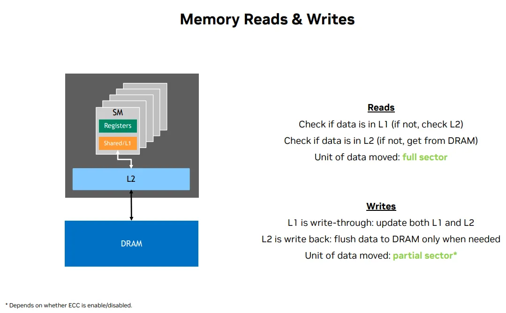


<u>Granularity</u>

| 层级路径               | 粒度       | 传输单位（传输粒度） | 管理单位（缓存粒度） | 说明 |
|------------------------|----------------|------------------------|------------------------|------|
| Thread → L1 Cache      | 访问粒度       | 按需（如 4B、8B）       | 无需加载 cache line     | 每个线程访问大小决定传输粒度，如果命中直接返回 |
| L1 Cache → L2 Cache    | Sector 粒度    | 通常 1 个 Sector（32B） | 128B cache line（4 × 32B） | 缓存行被 sector 分割；按 sector 加载可减少 over-fetch |
| L2 Cache → Global Mem  | Sector 粒度    | 默认 2 个 Sector（64B） | 128B cache line        | 可通过 `cudaDeviceSetLimit(cudaLimitMaxL2FetchGranularity)` 设置为 1、2、4 Sector |
| L1 / L2 内部缓存逻辑   | 缓存行粒度     | 传输视场景而定           | 固定为 128B cache line   | 即使只访问 4B，也会加载整条 cache line；用于替换和驱逐 |

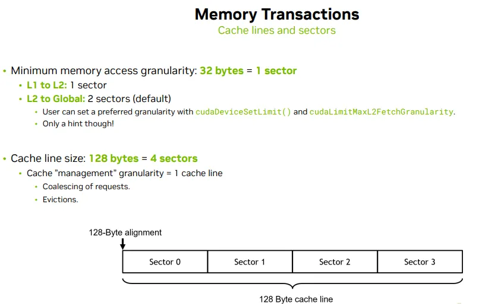


#### Reduce frequency
##### S - Coalesced global memory access
无论是合并（coalesced）还是非合并（uncoalesced）的内存访问，缓存系统的操作仍然是以 cache line（128 字节）为单位进行的  

合并内存访问（Coalesced Access）  

- 多个线程访问的是 同一个 cache line 内的连续地址。
- 这些访问可以被合并成 一次内存事务，只需加载一个 cache line。
- 高效，带宽利用率高，缓存命中率也更好。

非合并内存访问（Uncoalesced Access）  

- 线程访问的是 分散的地址，可能跨越多个 cache lines。
- 当线程访问的地址 不在同一个 cache line 内，每个线程可能会触发一个 独立的内存事务。
- 每个事务会加载一个完整的 128 字节的 cache line，即使线程只需要其中的 4 字节或 8 字节


<u>Aligned & Sequential -> Coalesced</u>   

Aligned - thread index 0 is at certain memory sector 0  

Sequential - thread index and memory address are sequential
- 32 threads scheduled in a warp
- 4-byte element access: 每个线程访问的是一个 4 字节大小的数据元素，例如 int 或 float 类型。
- 整个 warp 总共访问：32 threads×4 bytes=128 bytes
- 正好等于 一个 cache line 的大小（128 字节），也就是 4 个 sector
- 8 bytes element access -> 8 sectors

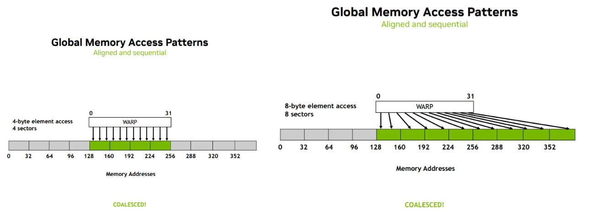


<u>Aligned & Non-sequential -> Coalesced</u>   
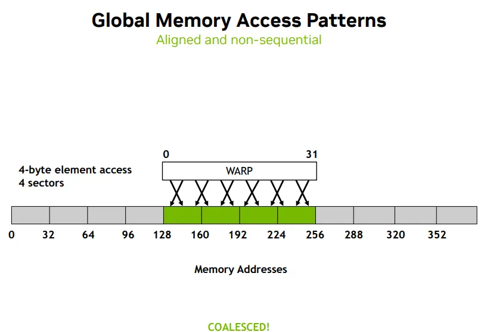


<u>Mis-aligned & Sequential</u>   
- need 5 sectors, head and tail sectors not fully-consumed

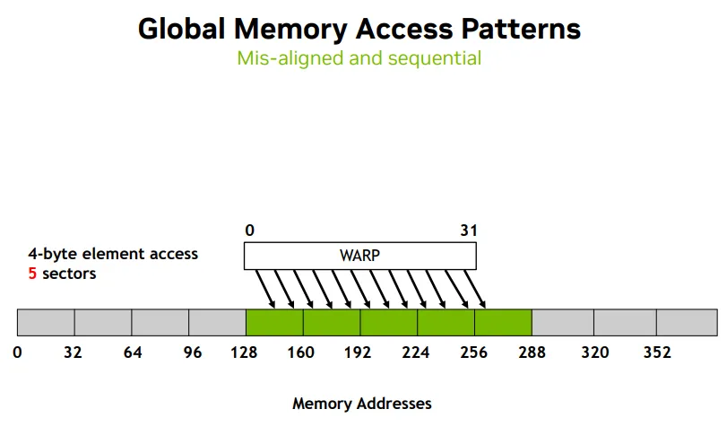


<u>缩小sector数量Same address</u>   
- all 32 threads access 1 sector
- 虽然地址 128 到 132 只占用了 4 个字节，但由于内存访问是以 sector（32 字节）为单位 进行的, 所以整个 sector（128 到 160）会被加载

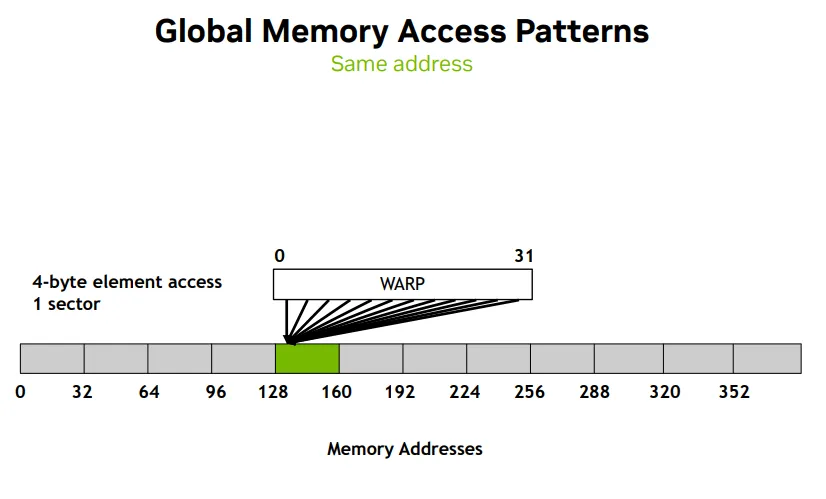


<u>增大sector数量Aligned and strided</u>
- 32 threads access 32 sectors, but 4 byte element access

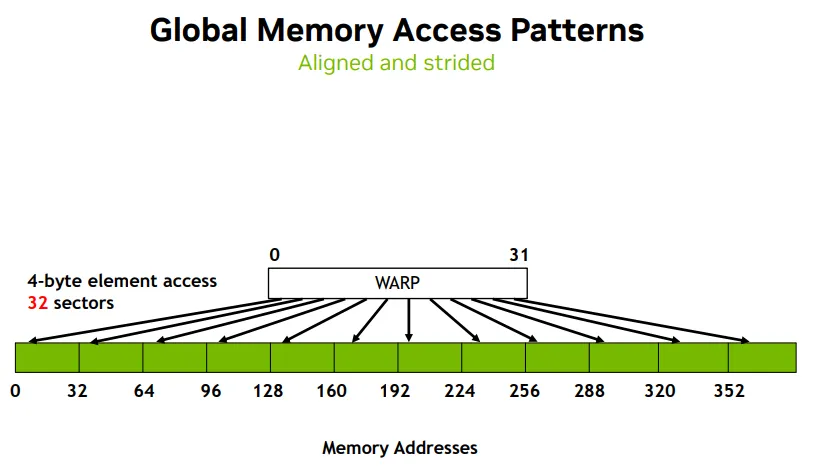


##### S - Data Structure/Layout数据布局, Structure-of-Arrays to support coalesced access
<u>Array-of-Structures（结构体数组）</u>
```c
struct Coefficients {
    float u, v, w;
    float x[8], y[8], z;
};
```
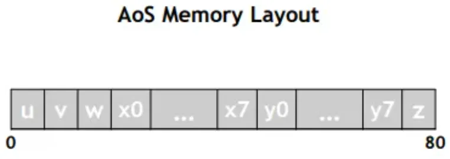
结构体定义  

- 每个 Coefficients 实例包含多个标量和数组字段
- 所有字段是 混合存储 在一起的


```c
__global__ void kernel(Coefficients *data) {
    int i = cg::this_grid.thread_rank();
    data[i].u = data[i].u + 10.f;
    data[i].y[0] = data[i].y[0] + 10.f;
}
```
- 每个线程访问 data[i]，即结构体数组中的第 i 个元素
- 每个线程访问两个字段：
  - u：结构体前部的标量
  - y[0]：结构体中部的数组元素
- 性能隐患：AoS 布局的问题
  - 每个线程访问的数据（如 data[i].u）在内存中是不连续的
  - 这会导致 非合并（uncoalesced）内存访问
  - 特别是访问 y[0] 时，线程之间的访问间隔更大，跨越多个 cache line，进一步降低带宽利用率

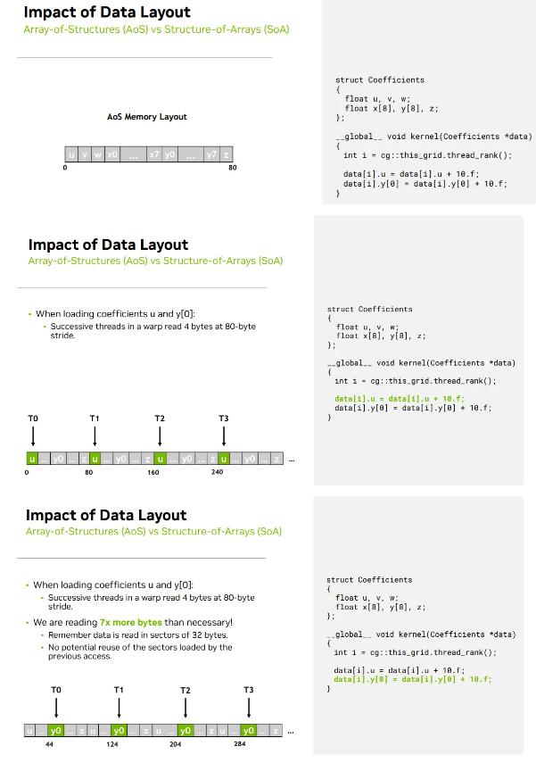


<u>Structure-of-Arrays（数组结构体）</u>
```c
struct Coefficients_SoA {
    float *u, *v, *w;
    float *x[8], *y[8], *z;
};
```
- 每个字段是一个独立的数组
- 所有线程访问 u[i] 或 y[0][i] 时，地址是连续的
- 可以实现 合并访问（coalesced access），大幅提升性能

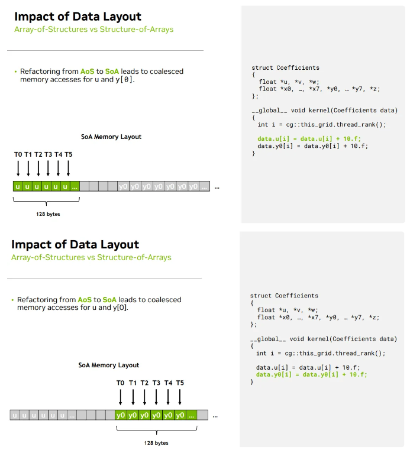


#### Increase parallelism

##### S - Shared memory bank
T - memory bank内存银行 

银行强调“并行访问能力”
- 在现实中，一个银行（Bank）可以独立处理客户的请求（如存取款）
- 多个银行可以同时服务多个客户，提高效率
- 每个 memory bank 是一个独立的访问通道

shared memory bank 的设计初衷就是为了提升并行访问能力。它将共享内存划分为多个独立的 bank（通常是 32 个），每个 bank 可以在一个时钟周期内处理一个访问请求。只要多个线程访问的是不同的 bank，就可以实现真正的并行访问；这正是 CUDA 中 warp 内线程高效协同的关键。


- 4-bytes data -> each bank 4-byte wide
- 128 cache lines -> 128/4=32 bank every line
- 每个bank有多个纵向数据 -> (byte_address / 4) % 32 决定 bank 编号

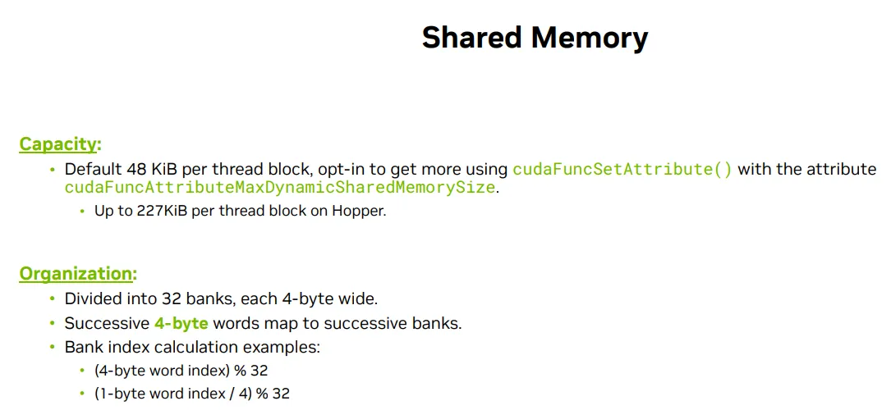

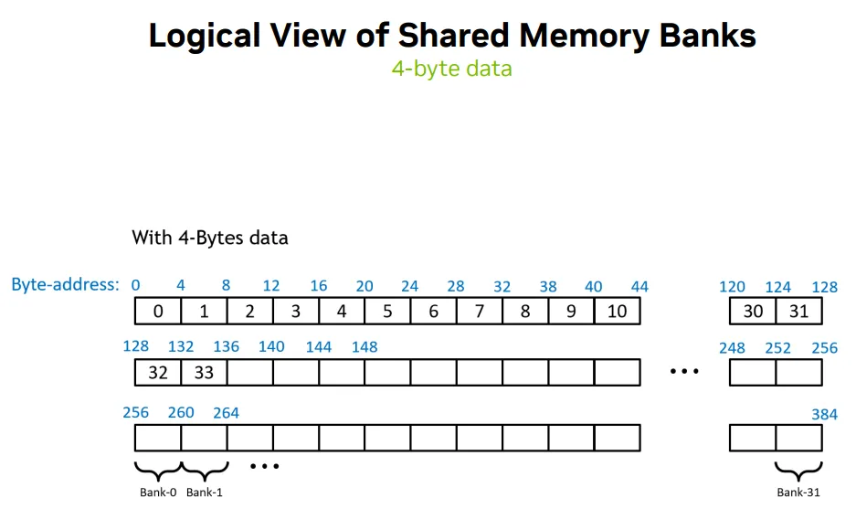

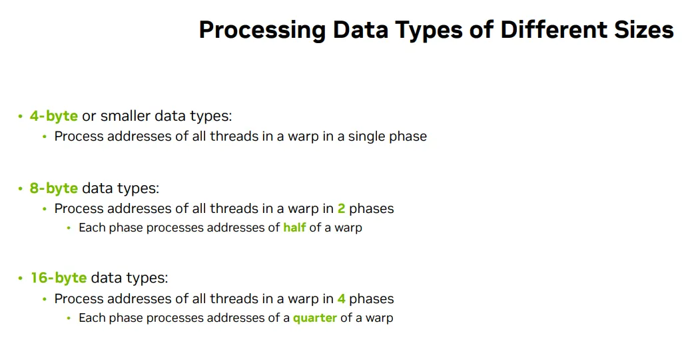


##### S - Padding & Swizzling to avoid Memory bank conflict
- 如果多个线程访问不同的 bank，就可以并行访问
- 如果多个线程访问同一个 bank，就会发生冲突（bank conflict），访问被串行化

| 访问模式                        | 线程地址分布示例              | 映射到 bank 行为                  | 是否发生 bank 冲突 | 特殊机制说明     |
|--------------------------------|-------------------------------|-----------------------------------|--------------------|------------------|
| `shmem[threadIdx.x] = data[tid];`       | 线程 0 → bank 0<br>线程 1 → bank 1 | 每个线程访问不同 bank              | ❌ 无冲突            | 并行执行          |
| `shmem[threadIdx.x * 2] = data[tid];`   | 线程 0 → bank 0<br>线程 1 → bank 2<br>线程 2 → bank 4 | 地址间隔为 2，但 `(addr/4)%32` 映射可能重叠 | ⚠️ 2路冲突     | 部分串行化        |
| `data = shmem[0];`                     | 所有线程访问 `shmem[0]`        | 同一个地址，映射到同一个 bank        | ❌ 无冲突            | ✅ CUDA 广播机制 |
| `idx = threadIdx.x*32 + threadIdx.y;` <br>`shmem[idx]` | 访问的是二维 shmem 的同一列（如 `shmem[0][0~31]`） | | ⚠️ 32路冲突 |        |

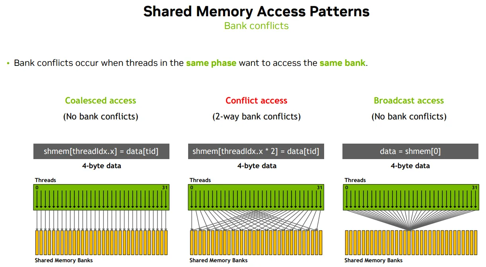

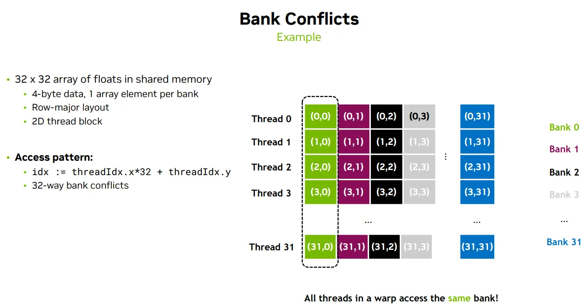


T - Padding & Swizzling 

padding - 在每行末尾填充一个额外元素，打破 bank 对齐

```c
__shared__ float tile[32][33]; // 行数 32，列数 33（第 33 列是 padding）

int idx = threadIdx.x * 33 + threadIdx.y; // 其中每行长度是 33 ➜ 所以需要乘以 33 来正确跳过 padding
```
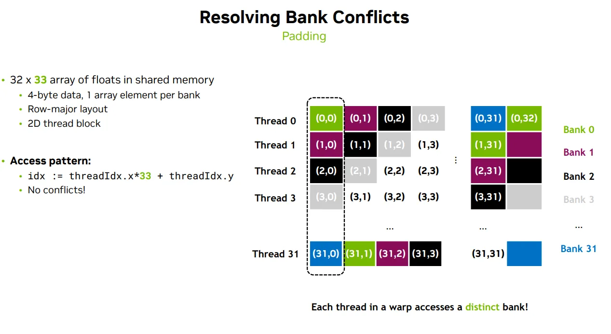


Swizzling - 一种数据重排（data rearrangement）技术
- idx=threadIdx.x*32+(threadIdx.y ^ threadIdx.x);
  - 使用了 按位异或（XOR）操作：threadIdx.y ^ threadIdx.x
  - 这个操作会打乱原本的列索引，使得每个线程访问的地址映射到 不同的 bank
  - 结果是：每个线程访问不同的 bank → 无冲突！

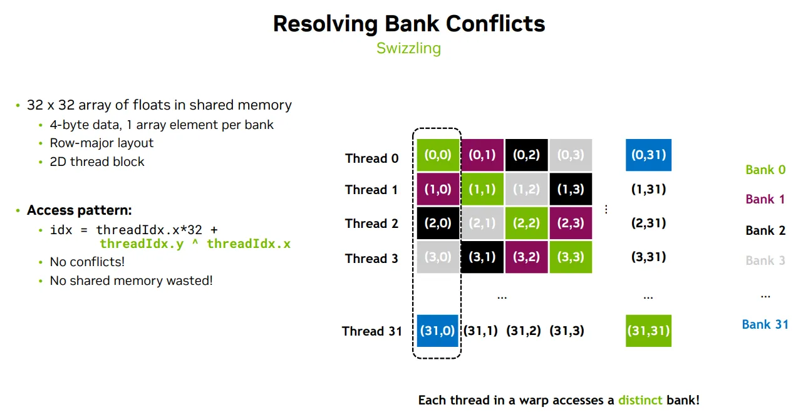


#### Increase data density
##### S - Vectorized(Multi-word) access

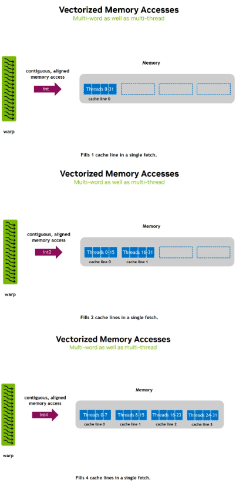


## Requirement

### Lower precesion
T - Mixed precesion

AMP（Automatic Mixed Precision） 是一种自动使用混合精度（如 float16 和 float32）进行训练的技术

autocast —— 自动切换精度的上下文管理器
- 作用：在 with autocast(): 代码块中，PyTorch 会自动将某些操作（如矩阵乘法、卷积）使用 float16 或 bfloat16 执行，而保留其他操作（如归一化、损失计算）为 float32。
- 好处：无需手动转换张量精度，PyTorch 会根据操作类型和硬件自动选择最优精度。


GradScaler —— 梯度缩放器
- 作用：在使用 float16 时，梯度可能非常小，导致“下溢”（变成 0）。GradScaler 会自动放大 loss，从而放大梯度，避免这种问题。
- 自动管理：它会根据训练情况自动调整缩放因子，确保数值稳定。


A

1.training
```py
model = MyModel().cuda()
optimizer = torch.optim.AdamW(model.parameters(), lr=1e-4)


from torch.cuda.amp import autocast, GradScaler
scaler = GradScaler() 


# 训练循环中使用 autocast 和 scaler
for inputs, targets in dataloader:
    inputs, targets = inputs.cuda(), targets.cuda()
    optimizer.zero_grad()

    with autocast():  # 自动使用 float16/bfloat16
        outputs = model(inputs)
        loss = loss_fn(outputs, targets)

    scaler.scale(loss).backward()      # 缩放 loss 以防梯度下溢
    scaler.step(optimizer)             # 更新权重
    scaler.update()                    # 更新缩放因子
```

2.inference
```py
# 将模型和输入转换为低精度
model.eval()
model.half()  # 或 model.to(torch.bfloat16)
inputs = inputs.half().cuda()

# 使用 autocast 进行推理
with torch.no_grad():
    with autocast():
        outputs = model(inputs)
```


R

- 著降低内存使用：从 FP32 降到 FP16 或 BF16 可将内存占用减半，允许更大模型或更大 - batch size。
- 提高性能: more thread could be created, high occupancy
- 提升分布式训练效率：低精度减少通信带宽需求，提升多机训练效率。
- 提升训练速度：现代 GPU（如 NVIDIA A100、H100）对低精度计算有专门优化，Tensor Core - 支持 FP16/BF16/FP8。
- 降低能耗与成本：训练 GPT-3 级别模型的成本高达数百万美元，更快速的训练，耗电更少，低精度可显著降低训练成本。
