Orgnized by the way of thinking, this page shows issues and solutions in each phase of DL


## Data quantity, quality, public availability impacts result
- new datasets

#### S - Need more this kind of data
DeepMind LLM
- Gopher（地鼠） 是 DeepMind 早期的大语言模型之一。
-  Chinchilla（龙猫/毛丝鼠） 是另一种小型啮齿类动物，名字上与 Gopher 保持了一种“动物家族”的风格
  
模型参数 vs 训练数据量
- 在 Chinchilla 之前，主流观点认为：只要模型参数越多，性能就越好，即使训练数据量不变。
- Chinchilla Scaling Laws 的核心观点: 在固定计算预算下，最优的训练方式是：模型规模和训练数据量应同时增长


T - FineWeb Dataset

Other datasets are comparatively small
-  English CommonCrawl section of Matrix (1.3T tokens), English CC-100 (70B tokens), Colossal-OSCAR (850B tokens)

RedPajama 
- contains 20 trillion tokens
- researchers found that models trained on RedPajama result in poorer quality than FineWeb due to the different filtering rules applied

Llama 3 
- models with 8B, 70B, and 405B sizes were trained on 15 trillion tokens as well
- but Meta AI’s training dataset is not publicly available

FineWeb Dataset
- 15 Trillion Token dataset
- publicly available

---
## Value size impacts stability
- 渐变
- threashhold

### LR
#### S - 在训练开始时使用较大的LR更新，损失剧烈波动，模型在训练过程不稳定
T - 学习率预热(learning rate warmup)

- 逐步将学习率从一个非常低的初始值(initial_lr)提升到用户设定的最大值(peak_lr)
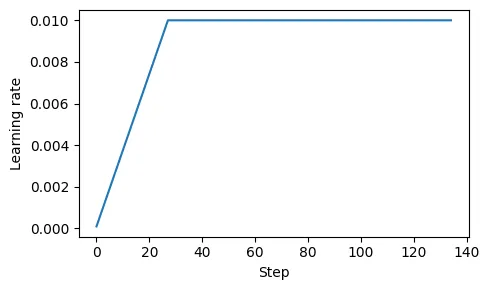


A

- 计划训练一个大语言模型 15 轮，开始时设定的初始学习率为 0.0001，随后将其提升至最大学习率 0.01
- 预热步骤的数量通常设置为总步骤数的 0.1% 到 20%. 这段代码将输出 27，这意味着在前 27 个训练步骤中，我们将控制学习率从 0.0001 逐步提高到 0.01。
```py
n_epochs = 15
initial_lr = 0.0001
peak_lr = 0.01


total_steps = len(train_loader) * n_epochs
warmup_steps = int(0.2 * total_steps) # 20% warmup
print(warmup_steps)
# 27


lr_increment = (peak_lr - initial_lr) / warmup_steps

global_step = -1
track_lrs = []

optimizer = torch.optim.AdamW(model.parameters(), weight_decay=0.1)

for epoch in range(n_epochs):
    for input_batch, target_batch in train_loader:
        optimizer.zero_grad()
        global_step += 1
    
        if global_step < warmup_steps:
            lr = initial_lr + global_step * lr_increment
        else:
            lr = peak_lr
        
        # Apply the calculated learning rate to the optimizer
        # 将计算后的学习率应用到优化器上
        for param_group in optimizer.param_groups:
            param_group["lr"] = lr

        # 记录lr后续plot
        track_lrs.append(optimizer.param_groups[0]["lr"])
    
        # Calculate loss and update weights
        # ...


import matplotlib.pyplot as plt

plt.figure(figsize=(5, 3))
plt.ylabel("Learning rate")
plt.xlabel("Step")
total_training_steps = len(train_loader) * n_epochs
plt.plot(range(total_training_steps), track_lrs)
plt.tight_layout(); plt.savefig("1.pdf")
plt.show()
```


R

- 在训练开始时使用较小的权重更新，有助于降低模型在训练过程中遭遇大幅度、不稳定更新的风险。稳定复杂模型（如大语言模型）的训练过程


#### S - 固定的学习率可能导致模型在训练后期收敛不稳定。

T - 余弦退火/衰减(cosine annealing/decay)

- 调节学习率，使其在预热阶段后呈现余弦曲线的变化，逐渐降低
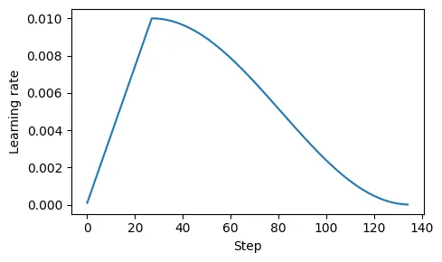


A

```py
import math

min_lr = 0.1 * initial_lr
track_lrs = []

lr_increment = (peak_lr - initial_lr) / warmup_steps
global_step = -1

for epoch in range(n_epochs):
    for input_batch, target_batch in train_loader:
        optimizer.zero_grad()
        global_step += 1
    
        # Adjust the learning rate based on the current phase (warmup or cosine annealing)
        if global_step < warmup_steps:
            # Linear warmup
            lr = initial_lr + global_step * lr_increment  
        else:
            # Cosine annealing after warmup
            progress = ((global_step - warmup_steps) / 
                        (total_training_steps - warmup_steps))
            lr = min_lr + (peak_lr - min_lr) * 0.5 * (
                1 + math.cos(math.pi * progress))
        
        # Apply the calculated learning rate to the optimizer
        for param_group in optimizer.param_groups:
            param_group["lr"] = lr
        track_lrs.append(optimizer.param_groups[0]["lr"])
    
        # Calculate loss and update weights

plt.figure(figsize=(5, 3))
plt.ylabel("Learning rate")
plt.xlabel("Step")
plt.plot(range(total_training_steps), track_lrs)
plt.tight_layout(); plt.savefig("2.pdf")
plt.show()
```


R

旨在减缓模型更新权重的速度，有助于降低训练过程中超过损失最小值的风险，从而确保后期训练的稳定性。


### Gradient
#### S - Gradient过大，梯度在反向传播中爆炸，导致训练不稳定
- 在深度网络或RNN中，梯度过大可能在反向传播中爆炸，导致训练不稳定

T - 梯度裁剪(gradient clipping)

- 该方法涉及设定一个阈值，超过该阈值的梯度会被缩放到预定的最大值


<u>范数Norm</u>
线性代数中的一个概念，用来衡量一个向量的“长度”
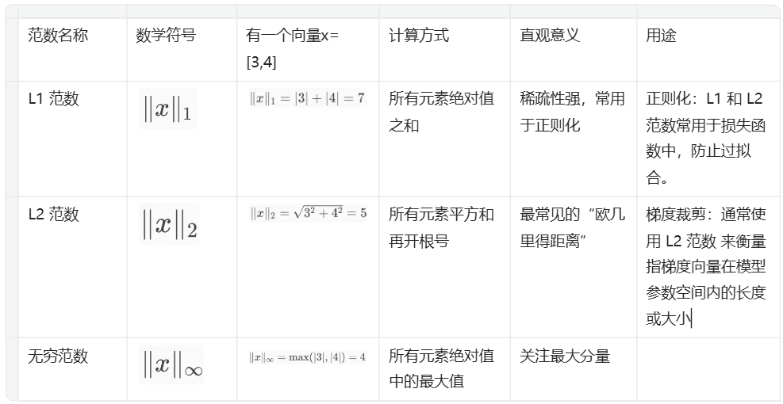


```py
# Get gradient
for param in model.parameters():
    if param.grad is not None:
        grad_values = param.grad.data.flatten()
```


A

```py
torch.manual_seed(123)
model = GPTModel(GPT_CONFIG_124M)
model.to(device)

loss = calc_loss_batch(input_batch, target_batch, model, device)
loss.backward()
# 当调用 .backward() 方法时，PyTorch 会计算损失的梯度，并将其存储在每个模型权重（参数）张量的 .grad 属性中


# 查看最大梯度
def find_highest_gradient(model):
    max_grad = None
    for param in model.parameters():
        if param.grad is not None:
            grad_values = param.grad.data.flatten()
            max_grad_param = grad_values.max()
            if max_grad is None or max_grad_param > max_grad:
                max_grad = max_grad_param
    return max_grad

print(find_highest_gradient(model))
# tensor(0.0411)


# 裁剪梯度
torch.nn.utils.clip_grad_norm_(model.parameters(), max_norm=1.0)
print(find_highest_gradient(model))
tensor(0.0185)
```


R

这种做法可以确保在反向传播过程中，对模型参数的更新保持在一个可控的范围内。


#### Summary
```py
from previous_chapters import evaluate_model, generate_and_print_sample

# train_model_simple ->
def train_model(model, train_loader, val_loader, optimizer, device,
                n_epochs, eval_freq, eval_iter, start_context, tokenizer,
                warmup_steps, initial_lr=3e-05, min_lr=1e-6):

    train_losses, val_losses, track_tokens_seen, track_lrs = [], [], [], []
    tokens_seen, global_step = 0, -1

    # Retrieve the maximum learning rate from the optimizer
    peak_lr = optimizer.param_groups[0]["lr"]

    # Calculate the total number of iterations in the training process
    total_training_steps = len(train_loader) * n_epochs

    # Calculate the learning rate increment during the warmup phase
    lr_increment = (peak_lr - initial_lr) / warmup_steps

    for epoch in range(n_epochs):
        model.train()
        for input_batch, target_batch in train_loader:
            optimizer.zero_grad()
            global_step += 1

            # Adjust the learning rate based on the current phase (warmup or cosine annealing)
            if global_step < warmup_steps:
                # Linear warmup
                lr = initial_lr + global_step * lr_increment  
            else:
                # Cosine annealing after warmup
                progress = ((global_step - warmup_steps) / 
                            (total_training_steps - warmup_steps))
                lr = min_lr + (peak_lr - min_lr) * 0.5 * (1 + math.cos(math.pi * progress))

            # Apply the calculated learning rate to the optimizer
            for param_group in optimizer.param_groups:
                param_group["lr"] = lr
            track_lrs.append(lr)  # Store the current learning rate

            # Calculate and backpropagate the loss
            loss = calc_loss_batch(input_batch, target_batch, model, device)
            loss.backward()


            if global_step >= warmup_steps:
                torch.nn.utils.clip_grad_norm_(model.parameters(), max_norm=1.0)
                
            optimizer.step()
            tokens_seen += input_batch.numel()

            # Periodically evaluate the model on the training and validation sets
            if global_step % eval_freq == 0:
                train_loss, val_loss = evaluate_model(
                    model, train_loader, val_loader,
                    device, eval_iter
                )
                train_losses.append(train_loss)
                val_losses.append(val_loss)
                track_tokens_seen.append(tokens_seen)
                # Print the current losses
                print(f"Ep {epoch+1} (Iter {global_step:06d}): "
                      f"Train loss {train_loss:.3f}, "
                      f"Val loss {val_loss:.3f}"
                )

        # Generate and print a sample from the model to monitor progress
        generate_and_print_sample(
            model, tokenizer, device, start_context
        )

    return train_losses, val_losses, track_tokens_seen, track_lrs
```

---

## Param quantity impacts resource consumption
- Decompose large structure into smaller pieces
  - MoE
  - RoLA
- Cache


### Train/inference

#### S - 如果每次都激活所有参数，计算资源消耗巨大，成本极高, 难以部署和扩展

T - Mistral's Sparse MoE/Mixture of Experts

decompose the one large feed-forward module with  mutiple smaller subnetworks
- Experts - Each subnetwork is said to be responsible for handling different types of tasks or, more concretely, tokens.
- Mixture - an ensemble model that combines several smaller “expert” subnetworks inside the GPT-like decoder architecture. 
- Sparse - refers to the fact that at any given time, only a subset of the expert layers (typically 1 or 2 out of the 8 in Mixtral 8x7B) are actively used for processing a token.
- there is also a Router module (also known as a gating network) that redirects each of the token embeddings to the 8 expert feed-forward modules, where only a subset of these experts are active at a time.

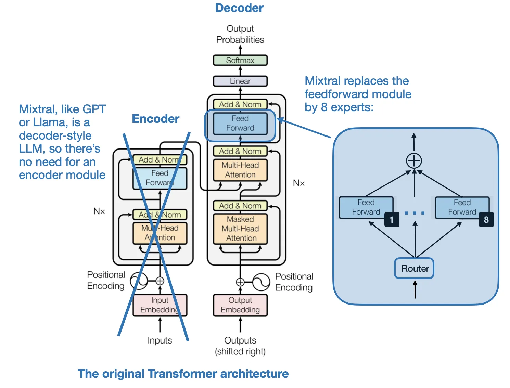


R
MoEs aim to allocate computational resources more efficiently.


### Finetune
#### S - 微调中参数更新的数量巨大
- 原始 Linear 层的权重变换$$y = xW^T + b$$ W是可训练权重，训练时，W 是直接更新的


T - LoRA decompose the Weight update with two small matrix producted

LoRA 的核心是：冻结原始 W，仅训练一个低秩的增量矩阵 ΔW，使得：
$$y = xW^T + x\Delta W^T=xW^T + xAB$$
- Rank秩
  - 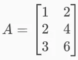
  - 第 2 行是第 1 行的 2 倍，第 3 行是第 1 行的 3 倍。所以这三行其实只包含了一行独立信息。因此，这个矩阵的 Rank = 1。
  - Rank秩 理解为：一个矩阵中有多少行或列是“真正有用的”，也就是线性无关的行或列的数量。
- Low Rank低秩
  - 如果一个权重矩阵的秩很低，说明它的“信息复杂度”不高。
  -  我们可以用两个小得多的矩阵相乘来近似它（低秩分解），从而减少参数量。
- Adapatation自适应
  - 使预训练模型更好地适应特定且通常较小的数据集的技术


<u>W_delta = AB</u>

- r, rank矢，内部维度，可调的超参数。LoRA 的两个小矩阵之所以“特别小”，是因为它们的秩 r很低（通常是 4、8、16 这样的数）,在模型的适应性和效率之间建立平衡
- W_delta = 4096×4096=16,777,216 个参数
- r 是一个很小的秩，比如 r = 8
  - A 有 8×4096=32,768 个参数
  - B有 4096×8=32,768 个参数
  - BA is (4096, 4096)
  - LoRA 参数总数=32,768+32,768=65,536, 只用了不到 0.4% 的参数量！
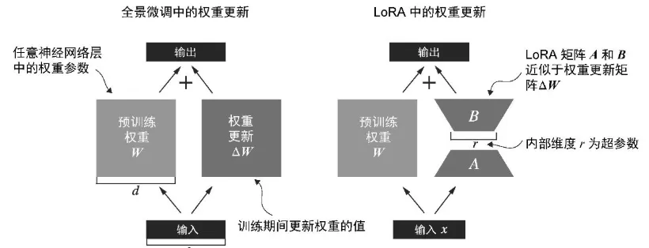


A

初始化一个 LoRA 层，它创建了矩阵 A 和 B，并设置了rank(r)和alpha缩放因子
```py
import math

class LoRALayer(torch.nn.Module):
    def __init__(self, in_dim, out_dim, rank, alpha):
        super().__init__()
        self.A = torch.nn.Parameter(torch.empty(in_dim, rank))
        torch.nn.init.kaiming_uniform_(self.A, a=math.sqrt(5))  # similar to standard weight initialization
        self.B = torch.nn.Parameter(torch.zeros(rank, out_dim))
        self.alpha = alpha

    def forward(self, x):
        x = self.alpha * (x @ self.A @ self.B)
        return x
```

创建一个 LinearWithLoRA 层,整合原始线性层的权重
```py
class LinearWithLoRA(torch.nn.Module):
    def __init__(self, linear, rank, alpha):
        super().__init__()
        self.linear = linear
        self.lora = LoRALayer(
            linear.in_features, linear.out_features, rank, alpha
        )

    def forward(self, x):
        return self.linear(x) + self.lora(x) #xW + xW_delta
```

replace_linear_ with_lora函数, 在 LoRA中，典型的目标是替换现有的线性层，从而允许权重更新直接应用于已有的预训练权重
- for name, module in model.named_children():
  - 遍历模型的所有直接子模块（不包括孙子模块）
  - name 是子模块的名字（字符串），module 是对应的子模块对象
- setattr(object, name, value)
  - setattr 是 Python 的内置函数，用来动态地给对象设置属性。
  - object  对象  要设置属性的对象（比如一个类的实例）
  - name  字符串  要设置的属性名（作为字符串传入）
  - value   任意类型  要赋给该属性的值
- setattr(model, name, LinearWithLoRA(module, rank, alpha))
  - 把model对象中名为name字符串的子模块，替换成一个新的 LinearWithLoRA 实例。

```py
def replace_linear_with_lora(model, rank, alpha):
    for name, module in model.named_children():
        if isinstance(module, torch.nn.Linear):
            # Replace the Linear layer with LinearWithLoRA
            setattr(model, name, LinearWithLoRA(module, rank, alpha))
        else:
            # Recursively apply the same function to child modules
            replace_linear_with_lora(module, rank, alpha)

# 冻结原始模型的参数
total_params = sum(p.numel() for p in model.parameters() if p.requires_grad)
print(f"Total trainable parameters before: {total_params:,}")

for param in model.parameters():
    param.requires_grad = False

total_params = sum(p.numel() for p in model.parameters() if p.requires_grad)
print(f"Total trainable parameters after: {total_params:,}")
# Total trainable parameters before: 124,441,346
# Total trainable parameters after: 0


replace_linear_with_lora(model, rank=16, alpha=16)
# self.linear(x) 部分 不会变化，因为其参数被冻结，不再参与训练。
# self.lora(x) 部分 可以变化，因为 LoRALayer 中的参数 A 和 B 是新创建的 nn.Parameter，默认是 requires_grad=True，仍然可以被训练。

total_params = sum(p.numel() for p in model.parameters() if p.requires_grad)
print(f"Total trainable LoRA parameters: {total_params:,}")
# Total trainable LoRA parameters: 2,666,528
```


#### S - pretrained Weight is also large in quanlity

T - DoRA (Weight-Decomposed Low-Rank Adaptation) - decompose the pretrained Weight

- root idea - that any vector can be represented by its length (magnitude) and direction (orientation), and here we apply it to each column vector of a weight matrix.
- extends/improves LoRA by first decomposing a pretrained weight matrix into two parts: a magnitude vector m and a directional matrix V.
- Once we have m and V, DoRA applies LoRA-style low-rank updates only to the directional matrix V, while allowing the magnitude vector m to be trained separately.
- Rather than uniformly scaling both magnitude and direction as LoRA tends to do, DoRA can make subtle directional adjustments without necessarily increasing the magnitude.

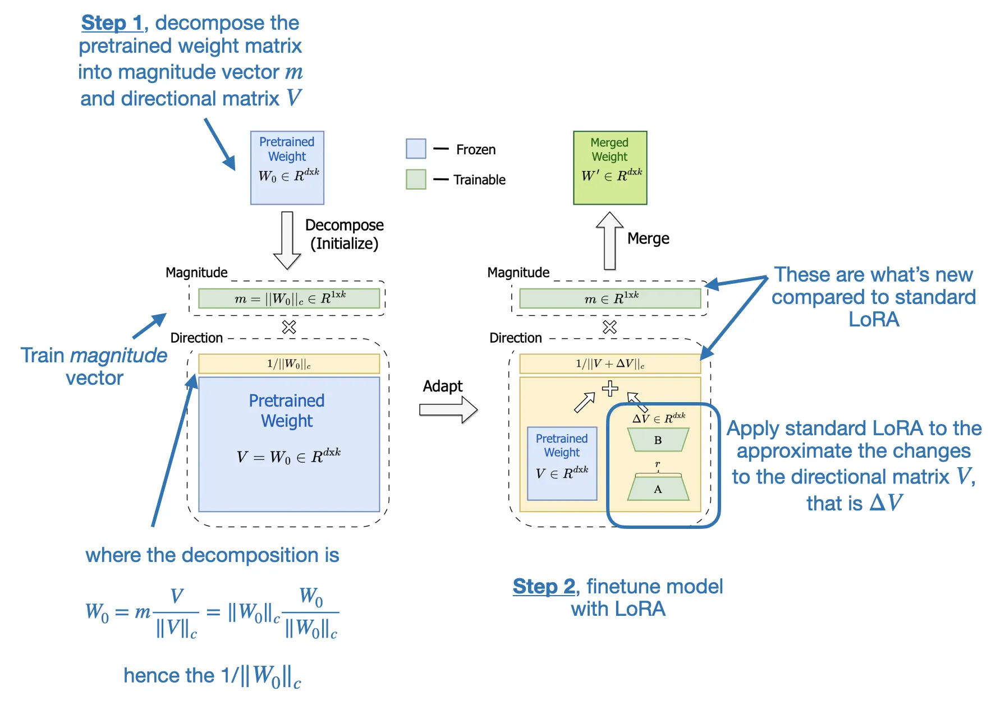

R
The result is improved performance and robustness.


### Inference
#### S - The repeated context is recomputed for each token generation step.

High level
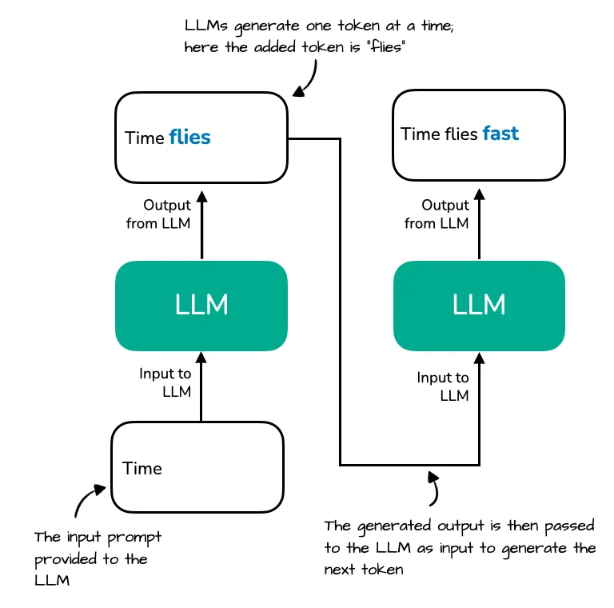
- LLMs generate one word (or token) at a time
- The output from previous step becomes prompt as next step
- the repeated context ("Time flies") that must be reprocessed by the LLM at each generation step. Since the LLM does not cache intermediate key/value states, it re-encodes the full sequence every time a new token (e.g., "fast") is generated.

Zoom in on the attention mechanism itself
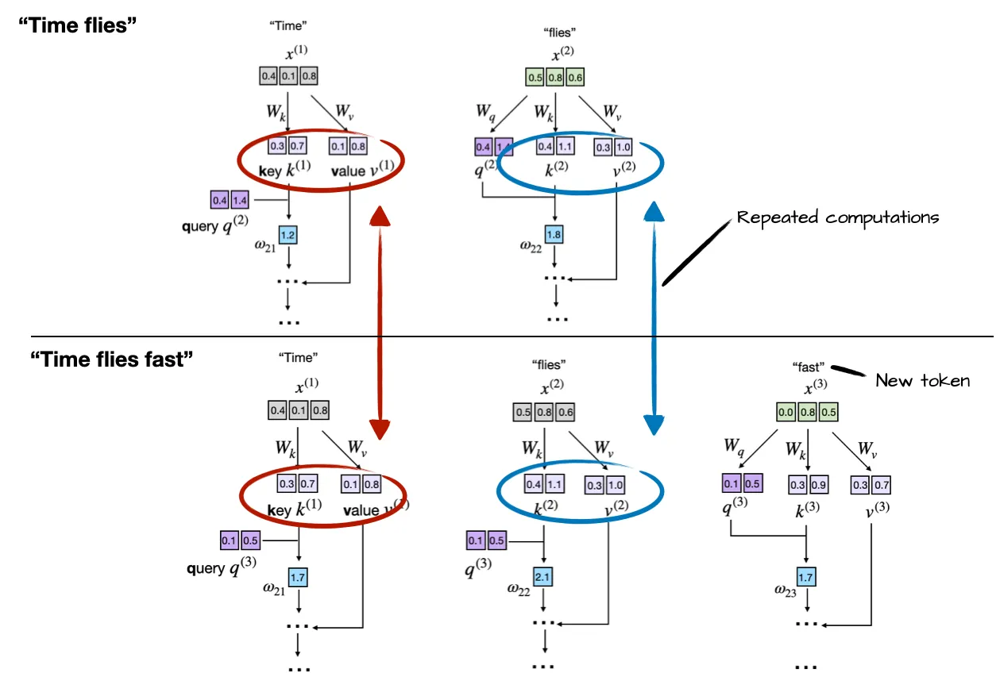
- Each input token (e.g., "Time" and "flies") is projected using learned matrices W\_k and W\_v to obtain its corresponding key and value vectors.
0 Suppose the LLM generated the word “fast” so that the prompt for the next round becomes “Time flies fast”
- the LLM recomputes key and value vectors for previously seen tokens ("Time" and "flies") during each generation step


T

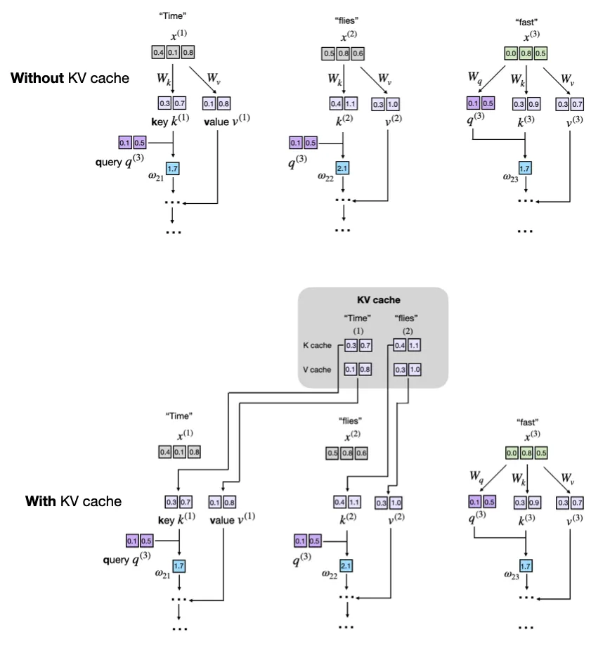
- A KV cache stores intermediate key (K) and value (V) computations for reuse during inference 
- Previously computed keys and values are retrieved from the KV cache to avoid recomputation for faster generation.

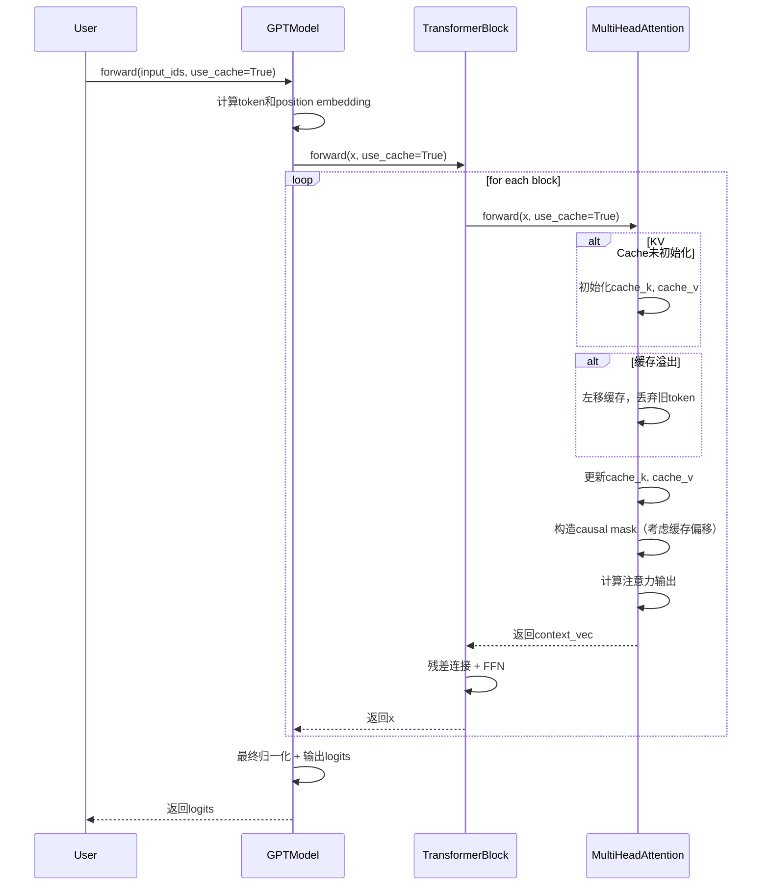


A

1.add two non-persistent buffers, cache_k and cache_v, which will hold concatenated keys and values across steps
```py
class MultiHeadAttention(nn.Module):
    def __init__(self, d_in, d_out, context_length, dropout, num_heads, qkv_bias=False):
        super().__init__()
        assert d_out % num_heads == 0, "d_out must be divisible by num_heads"

        self.d_out = d_out
        self.num_heads = num_heads
        self.head_dim = d_out // num_heads  # Reduce the projection dim to match desired output dim

        self.W_query = nn.Linear(d_in, d_out, bias=qkv_bias)
        self.W_key = nn.Linear(d_in, d_out, bias=qkv_bias)
        self.W_value = nn.Linear(d_in, d_out, bias=qkv_bias)
        self.out_proj = nn.Linear(d_out, d_out)  # Linear layer to combine head outputs
        self.dropout = nn.Dropout(dropout)
        self.register_buffer(
            "mask",
            torch.triu(torch.ones(context_length, context_length), diagonal=1),
            persistent=False
        )

        ####################################################
        # NEW
        self.register_buffer("cache_k", None, persistent=False)
        self.register_buffer("cache_v", None, persistent=False)
        self.ptr_current_pos = 0
        ####################################################
```

2.Forward pass with use_cache flag
- Storing
  - after the cache is initialized via the if self.cache_k is None: ..., we add the newly generated keys and values via self.cache_k = torch.cat(...) and self.cache_v = torch.cat(...) to the cache, respectively.
- Retrieving
  - keys, values = self.cache_k, self.cache_v retrieves the stored values and keys from the cache.
- torch.cat(tensor_list, dim)在指定维度上拼接多个张量（tensor）
  - tensor_list：要拼接的张量列表（它们在除了拼接维度以外的维度上必须形状一致）
  - dim：在哪个维度上拼接
```py
def forward(self, x, use_cache=False):
    b, num_tokens, d_in = x.shape

    keys_new = self.W_key(x)  # Shape: (b, num_tokens, d_out)
    values_new = self.W_value(x)
    queries = self.W_query(x)
    #...

    if use_cache:
        if self.cache_k is None:
            self.cache_k, self.cache_v = keys_new, values_new
        else:
            self.cache_k = torch.cat([self.cache_k, keys_new], dim=1)
            self.cache_v = torch.cat([self.cache_v, values_new], dim=1)
        keys, values = self.cache_k, self.cache_v
    else:
        keys, values = keys_new, values_new

    keys = keys.transpose(1, 2)
    queries = queries.transpose(1, 2)
    values = values.transpose(1, 2)
```

3.reset both the keys and value buffers between two separate text-generation calls. Otherwise, the queries of a new prompt will attend to stale keys left over from the previous sequence
```py
def reset_cache(self):
    self.cache_k, self.cache_v = None, None
```

4.GPT class
- a simple counter that remembers how many tokens the model has already cached during an incremental generation session.
  - The reason for the self.current_pos tracking is that new queries must line up directly after the keys and values that are already stored. Without using a counter, every new step would start at position 0 again, so the model would treat the new tokens as if they overlapped the earlier ones
  - What happens above if we set use_cache=True is that we start at the self.current_pos and count seq_len steps. Then, bump the counter so the next decoding call continues where we left off.
```py
def forward(self, in_idx, use_cache=False):
    # ...
 
    if use_cache:
        pos_ids = torch.arange(
            self.current_pos, self.current_pos + seq_len,            
            device=in_idx.device, dtype=torch.long
        )
        self.current_pos += seq_len
    else:
        pos_ids = torch.arange(
            0, seq_len, device=in_idx.device, dtype=torch.long
        )
    
    pos_embeds = self.pos_emb(pos_ids).unsqueeze(0)
    x = tok_embeds + pos_embeds
    # ...
    for blk in self.trf_blocks:
        x = blk(x, use_cache=use_cache)
```

5.add a model-level reset to GPTModel to clear all block caches
```py
def reset_kv_cache(self):
    for blk in self.trf_blocks:
        blk.att.reset_cache()
    self.current_pos = 0
```

6.Using the Cache in Generation
- only feed the model the new token in c) via logits = model(next_idx, use_cache=True)
- feed the model the whole input logits = model(idx[:, -ctx_len:], use_cache=False) as it has no stored keys and values to reuse
```py
def generate_text_simple_cached(
        model, idx, max_new_tokens, use_cache=True
    ):
    model.eval()

    ctx_len = model.pos_emb.num_embeddings  # max sup. len., e.g. 1024
    if use_cache:
        # Init cache with full prompt
        model.reset_kv_cache()
        with torch.no_grad():
            logits = model(idx[:, -ctx_len:], use_cache=True)

        for _ in range(max_new_tokens):
            # a) pick the token with the highest log-probability 
            next_idx = logits[:, -1].argmax(dim=-1, keepdim=True)
            # b) append it to the running sequence
            idx = torch.cat([idx, next_idx], dim=1)
            # c) feed model only the new token
            with torch.no_grad():
                logits = model(next_idx, use_cache=True)
    else:
        for _ in range(max_new_tokens):
            with torch.no_grad():
                logits = model(idx[:, -ctx_len:], use_cache=False)
            next_idx = logits[:, -1].argmax(dim=-1, keepdim=True)
            idx = torch.cat([idx, next_idx], dim=1)

    return idx
```


R1

- Memory fragmentation and repeated allocations: Continuously concatenating tensors via torch.cat, as shown earlier, leads to performance bottlenecks due to frequent memory allocation and reallocation.
- Pre-allocate Memory. Rather than concatenating tensors repeatedly, we could pre-allocate a sufficiently large tensor based on the expected maximum sequence length. This ensures consistent memory use and reduces overhead.
```py
# Example pre-allocation for keys and values
max_seq_len = 1024  # maximum expected sequence length
cache_k = torch.zeros(
    (batch_size, num_heads, max_seq_len, head_dim), device=device
)
cache_v = torch.zeros(
    (batch_size, num_heads, max_seq_len, head_dim), device=device
)
```


- Linear growth in memory usage: Without proper handling, the KV cache size becomes impractical for very long sequences
- Truncate Cache via Sliding Window. To avoid blowing up our GPU memory, we can implement a sliding window approach with dynamic truncation. Via the sliding window, we maintain only the last window_size tokens in the cache
```py
# Sliding window cache implementation
window_size = 512
cache_k = cache_k[:, :, -window_size:, :]
cache_v = cache_v[:, :, -window_size:, :]
```


R

Compute-efficient/inference speed-ups
- a KV cache stores intermediate key (K) and value (V) computations for reuse during inference (after training), which results in a substantial speed-up when generating text.

Memory-increasing
- adds more complexity to the code, increases memory requirements

The inference speed-ups are often well worth the trade-offs in code complexity and memory when using LLMs in production.


---
## Learning method
### Alignment

| 方法 | 是否需要 Reward Model | 是否需要标注数据（偏好对） | 简要说明 | 通俗理解 |
|------|------------------------|-----------------------------|----------|-----------|
| **PPO**<br>（Proximal Policy Optimization） | ✅ 是 | ✅ 是（间接） | 需要训练一个 reward model 来评估模型输出的好坏，reward model 通常基于人工偏好数据训练。 PPO引入了一个剪切（clipping）机制，限制每次策略更新的幅度，防止模型走得太远。| 学生写作文后，老师（reward model）打分，学生根据分数调整写作风格。老师的评分标准来自于大量人工评分样本。 |
| **DPO**<br>（Direct Preference Optimization） | ❌ 否 | ✅ 是（直接） | 不需要 reward model，直接使用人工标注的偏好对（chosen vs rejected）进行监督学习。 | 老师不打分，而是直接告诉学生“这篇比那篇好”，学生学着写得更像“好”的那篇。 |
| **GRPO**<br>（Group Relative Policy Optimization） | ✅ 是 | ❌ 否 | 使用 reward model 对多个输出打分并归一化，无需人工标注偏好对，减少数据依赖。 | 学生写了几篇作文，老师给每篇打分，学生只看相对分数高低来改进写作，不需要老师明确指出哪篇更好。 |

#### S - PPO需要训练额外的Reward model, DPO不需要


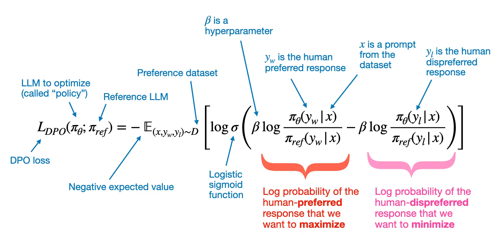

Training data
- x - prompt
- y_w - human preferred response
- y_l - human dispreferred response

Log probabilitite sof the human-preferred(dispreferred) response that we want to maximize(minimize)
- $\pi_\theta$ - policy model, a variable is the so-called policy (a term borrowed from reinforcement learning) and represents the LLM we want to optimize; 
- $\pi_{\text{ref}}$ -  reference LLM, which is typically the original LLM before optimization (at the beginning of the training, two PI are typically the same)
- $\beta$ is a hyperparameter to control the divergence between the policy model and the reference model; increasing $\beta$ increases the impact of the difference between   $\pi_\theta$ and $\pi_{\text{ref}}$ in terms of their log probabilities on the overall loss function, thereby increasing the divergence between the two models

```
model_logratios = model_chosen_logprobs - model_rejected_logprobs
reference_logratios = reference_chosen_logprobs - reference_rejected_logprobs
logits = model_logratios - reference_logratios
```

A Probability score
- $\sigma()$ - logistic sigmoid function, transforms the log-odds of the preferred and rejected responses (the terms inside the logistic sigmoid function) into a probability score

Negative expected value
- expected value E -  is statistics jargon and stands for the average or mean value of the random variable (the expression inside the brackets); optimizing -E aligns the model better with user preferences
```
losses = -F.logsigmoid(beta * logits)
```

##### S - raw dataset
T

- dataset was generated via the create-preference-data-ollama.ipynb notebook
- a json file with 1100 entries
```
{'instruction': "What is an antonym of 'complicated'?",
 'input': '',
 'output': "An antonym of 'complicated' is 'simple'.",
 'chosen': "A suitable antonym for 'complicated' would be 'simple'.",
 'rejected': "An antonym of 'complicated' is 'simple'."}
 ```
- The 'instruction' and 'input' that are used as LLM inputs
- Target for SFT - The 'output' contains the response the model was trained on via the instruction finetuning step in chapter 7
- Target for DPO - the 'chosen' and 'rejected' entries are the entries we use for DPO; here 'chosen' is the preferred response, and 'rejected' is the dispreferred response

A

```py
import json
import os
import urllib


def download_and_load_file(file_path, url):

    if not os.path.exists(file_path):
        with urllib.request.urlopen(url) as response:
            text_data = response.read().decode("utf-8")
        with open(file_path, "w", encoding="utf-8") as file:
            file.write(text_data)
    else:
        with open(file_path, "r", encoding="utf-8") as file:
            text_data = file.read()

    with open(file_path, "r", encoding="utf-8") as file:
        data = json.load(file)

    return data


file_path = "instruction-data-with-preference.json"
url = (
    "https://raw.githubusercontent.com/rasbt/LLMs-from-scratch"
    "/main/ch07/04_preference-tuning-with-dpo/instruction-data-with-preference.json"
)

data = download_and_load_file(file_path, url)
print("Number of entries:", len(data))
```

##### S - preprocess
- create splits/subsets

A

```py
train_portion = int(len(data) * 0.85)  # 85% for training
test_portion = int(len(data) * 0.1)    # 10% for testing
val_portion = len(data) - train_portion - test_portion  # Remaining 5% for validation

train_data = data[:train_portion]
test_data = data[train_portion:train_portion + test_portion]
val_data = data[train_portion + test_portion:]
```


##### S - preprocess & datasets
- formats the model input by applying the Alpaca prompt style 
- format the chosen and rejected responses using the Alpaca prompt style

- InstructionDataset, instead of focusing on single output sequences (responses), we modify the dataset class to return pairs of responses where one is preferred ("chosen") over the other ("rejected")

A

```py
def format_input(entry):
    instruction_text = (
        f"Below is an instruction that describes a task. "
        f"Write a response that appropriately completes the request."
        f"\n\n### Instruction:\n{entry['instruction']}"
    )

    input_text = f"\n\n### Input:\n{entry['input']}" if entry["input"] else ""

    return instruction_text + input_text

model_input = format_input(data[50])
print(model_input)


desired_response = f"### Response:\n{data[50]['chosen']}"
print(desired_response)

possible_response = f"### Response:\n{data[50]['rejected']}"
print(possible_response)

```
```
Below is an instruction that describes a task. Write a response that appropriately completes the request.

### Instruction:
Identify the correct spelling of the following word.

### Input:
Ocassion


### Response:
The correct spelling is 'Occasion.'


### Response:
The correct spelling is obviously 'Occasion.'
```

Datasets
```py
import torch
from torch.utils.data import Dataset


class PreferenceDataset(Dataset):
    def __init__(self, data, tokenizer):
        self.data = data

        # Pre-tokenize texts
        self.encoded_texts = []
        for entry in data:
            prompt = format_input(entry)
            rejected_response = entry["rejected"]
            chosen_response = entry["chosen"]

            prompt_tokens = tokenizer.encode(prompt)
            chosen_full_text = f"{prompt}\n\n### Response:\n{chosen_response}"
            rejected_full_text = f"{prompt}\n\n### Response:\n{rejected_response}"
            chosen_full_tokens = tokenizer.encode(chosen_full_text)
            rejected_full_tokens = tokenizer.encode(rejected_full_text)

            self.encoded_texts.append({
                "prompt": prompt_tokens,
                "chosen": chosen_full_tokens,
                "rejected": rejected_full_tokens,
            })

    def __getitem__(self, index):
        return self.encoded_texts[index]

    def __len__(self):
        return len(self.data)
```


##### S - preprocess & dataloaders
- pad

```py
def custom_collate_fn(
    batch,
    pad_token_id=50256,
    allowed_max_length=None,
    mask_prompt_tokens=True,
    device="cpu"
):
    # Initialize lists to hold batch data
    batch_data = {
        "prompt": [],
        "chosen": [],
        "rejected": [],
        "rejected_mask": [],
        "chosen_mask": []

    }

    # Determine the longest sequence to set a common padding length
    max_length_common = 0
    if batch:
        for key in ["chosen", "rejected"]:
            current_max = max(len(item[key])+1 for item in batch)
            max_length_common = max(max_length_common, current_max)

    # Process each item in the batch
    for item in batch:
        prompt = torch.tensor(item["prompt"])
        batch_data["prompt"].append(prompt)

        for key in ["chosen", "rejected"]:
            # Adjust padding according to the common maximum length
            sequence = item[key]
            padded = sequence + [pad_token_id] * (max_length_common - len(sequence))
            mask = torch.ones(len(padded)).bool()

            # Set mask for all padding tokens to False
            mask[len(sequence):] = False

            # Set mask for all input tokens to False
            # +2 sets the 2 newline ("\n") tokens before "### Response" to False
            if mask_prompt_tokens:
                mask[:prompt.shape[0]+2] = False

            batch_data[key].append(torch.tensor(padded))
            batch_data[f"{key}_mask"].append(mask)

    # Final processing
    for key in ["chosen", "rejected", "chosen_mask", "rejected_mask"]:
        # Stack all sequences into a tensor for the given key
        tensor_stack = torch.stack(batch_data[key])

        # Optionally truncate to maximum sequence length
        if allowed_max_length is not None:
            tensor_stack = tensor_stack[:, :allowed_max_length]

        # Move to the specified device
        batch_data[key] = tensor_stack.to(device)

    return batch_data


from functools import partial

device = torch.device("cuda" if torch.cuda.is_available() else "cpu")
print("Device:", device)

customized_collate_fn = partial(
    custom_collate_fn,
    device=device,            # Put the data directly on a GPU if available
    mask_prompt_tokens=True,  # This is optional
    allowed_max_length=1024   # The supported context length of the model
)
```

dataloader
```py
import tiktoken
from torch.utils.data import DataLoader


tokenizer = tiktoken.get_encoding("gpt2")

example_dataset = PreferenceDataset(example_data, tokenizer)

example_dataloader = DataLoader(
    example_dataset,
    batch_size=2,
    collate_fn=customized_collate_fn,
    shuffle=False
)


for batch in example_dataloader:
    break

print(batch.keys())
# dict_keys(['prompt', 'chosen', 'rejected', 'rejected_mask', 'chosen_mask'])


# Check with text
def decode_tokens_from_batch(token_ids, tokenizer):
    ids_in_python_list = token_ids.flatten().tolist()
    return tokenizer.decode(ids_in_python_list)

text = decode_tokens_from_batch(
    token_ids=batch["prompt"][0],  # [0] for the first entry in the batch
    tokenizer=tokenizer,
)
print(text)


# mask as a selection mask to select only the token IDs that correspond to the response, that is, stripping all prompt and padding tokens
batch["chosen_mask"][0]
# The True values denote token IDs that correspond to the actual response
# the False tokens correspond to token IDs that correspond to either prompt tokens (if we set mask_prompt_tokens=True in the customized_collate_fn function, which we previously did) or padding tokens
text = decode_tokens_from_batch(
    token_ids=batch["chosen"][0][batch["chosen_mask"][0]],
    tokenizer=tokenizer,
)
print(text)
# Only response
```

training, validation, and test set data loaders
```py
from torch.utils.data import DataLoader


num_workers = 0
batch_size = 8

torch.manual_seed(123)

train_dataset = PreferenceDataset(train_data, tokenizer)
train_loader = DataLoader(
    train_dataset,
    batch_size=batch_size,
    collate_fn=customized_collate_fn,
    shuffle=True,
    drop_last=True,
    num_workers=num_workers
)

val_dataset = PreferenceDataset(val_data, tokenizer)
val_loader = DataLoader(
    val_dataset,
    batch_size=batch_size,
    collate_fn=customized_collate_fn,
    shuffle=False,
    drop_last=False,
    num_workers=num_workers
)

test_dataset = PreferenceDataset(test_data, tokenizer)
test_loader = DataLoader(
    test_dataset,
    batch_size=batch_size,
    collate_fn=customized_collate_fn,
    shuffle=False,
    drop_last=False,
    num_workers=num_workers
)
```


##### S - train

load SFT model
```py

from pathlib import Path
import shutil


finetuned_model_path = Path("gpt2-medium355M-sft.pth")
if not finetuned_model_path.exists():

    # Try finding the model checkpoint locally:
    relative_path = Path("..") / "01_main-chapter-code" / finetuned_model_path
    if relative_path.exists():
        shutil.copy(relative_path, ".")

    # If this notebook is run on Google Colab, get it from a Google Drive folder
    elif "COLAB_GPU" in os.environ or "COLAB_TPU_ADDR" in os.environ:
        from google.colab import drive
        drive.mount("/content/drive")
        google_drive_path = "/content/drive/My Drive/Books/LLMs-From-Scratch/ch07/colab/gpt2-medium355M-sft.pth"  # Readers need to adjust this path
        shutil.copy(google_drive_path, ".")

    else:
        print(
            f"Could not find '{finetuned_model_path}'.\n"
            "Run the `ch07.ipynb` notebook to finetune and save the finetuned model."
        )
```

reuse the basic configuration from previous chapters to load the model weights
```py
from previous_chapters import GPTModel
# If the `previous_chapters.py` file is not available locally,
# you can import it from the `llms-from-scratch` PyPI package.
# For details, see: https://github.com/rasbt/LLMs-from-scratch/tree/main/pkg
# E.g.,
# from llms_from_scratch.ch04 import GPTModel


BASE_CONFIG = {
    "vocab_size": 50257,     # Vocabulary size
    "context_length": 1024,  # Context length
    "drop_rate": 0.0,        # Dropout rate
    "qkv_bias": True         # Query-key-value bias
}

model_configs = {
    "gpt2-small (124M)": {"emb_dim": 768, "n_layers": 12, "n_heads": 12},
    "gpt2-medium (355M)": {"emb_dim": 1024, "n_layers": 24, "n_heads": 16},
    "gpt2-large (774M)": {"emb_dim": 1280, "n_layers": 36, "n_heads": 20},
    "gpt2-xl (1558M)": {"emb_dim": 1600, "n_layers": 48, "n_heads": 25},
}

CHOOSE_MODEL = "gpt2-medium (355M)"

BASE_CONFIG.update(model_configs[CHOOSE_MODEL])

model = GPTModel(BASE_CONFIG)
```

DPO works with two LLMs
- a policy model (the LLM that we want to optimize)
- a reference model (the original model that we keep unchanged)

```py
policy_model = model

reference_model = GPTModel(BASE_CONFIG)
reference_model.load_state_dict(
    torch.load(
        "gpt2-medium355M-sft.pth",
        map_location=torch.device("cpu"),
        weights_only=True
    )
)
reference_model.eval()

policy_model.to(device)
reference_model.to(device)
```


##### S - loss


Training data
- x - prompt
- y_w - human preferred response
- y_l - human dispreferred response

Log probabilitite sof the human-preferred(dispreferred) response that we want to maximize(minimize)
- $\pi_\theta$ - policy model, a variable is the so-called policy (a term borrowed from reinforcement learning) and represents the LLM we want to optimize; 
- $\pi_{\text{ref}}$ -  reference LLM, which is typically the original LLM before optimization (at the beginning of the training, two PI are typically the same)
- $\beta$ is a hyperparameter to control the divergence between the policy model and the reference model; increasing $\beta$ increases the impact of the difference between   $\pi_\theta$ and $\pi_{\text{ref}}$ in terms of their log probabilities on the overall loss function, thereby increasing the divergence between the two models

A Probability score
- $\sigma()$ - logistic sigmoid function, transforms the log-odds of the preferred and rejected responses (the terms inside the logistic sigmoid function) into a probability score

Negative expected value
- expected value E -  is statistics jargon and stands for the average or mean value of the random variable (the expression inside the brackets); optimizing -E aligns the model better with user preferences


```py

def compute_logprobs(logits, labels, selection_mask=None):
    """
    Compute log probabilities.

    Args:
      logits: Tensor of shape (batch_size, num_tokens, vocab_size)
      labels: Tensor of shape (batch_size, num_tokens)
      selection_mask: Tensor for shape (batch_size, num_tokens)

    Returns:
      mean_log_prob: Mean log probability excluding padding tokens.
    """

    # Labels are the inputs shifted by one
    labels = labels[:, 1:].clone()

    # Truncate logits to match the labels num_tokens
    logits = logits[:, :-1, :]

    log_probs = F.log_softmax(logits, dim=-1)

    # Gather the log probabilities for the actual labels
    selected_log_probs = torch.gather(
        input=log_probs,
        dim=-1,
        index=labels.unsqueeze(-1)
    ).squeeze(-1)

    if selection_mask is not None:
        mask = selection_mask[:, 1:].clone()

        # Apply the mask to filter out padding tokens
        selected_log_probs = selected_log_probs * mask

        # Calculate the average log probability excluding padding tokens
        # This averages over the tokens, so the shape is (batch_size,)
        avg_log_prob = selected_log_probs.sum(-1) / mask.sum(-1)

        return avg_log_prob

    else:
        return selected_log_probs.mean(-1)


import torch.nn.functional as F

def compute_dpo_loss(
      model_chosen_logprobs,
      model_rejected_logprobs,
      reference_chosen_logprobs,
      reference_rejected_logprobs,
      beta=0.1,
    ):
    """Compute the DPO loss for a batch of policy and reference model log probabilities.

    Args:
        policy_chosen_logprobs: Log probabilities of the policy model for the chosen responses. Shape: (batch_size,)
        policy_rejected_logprobs: Log probabilities of the policy model for the rejected responses. Shape: (batch_size,)
        reference_chosen_logprobs: Log probabilities of the reference model for the chosen responses. Shape: (batch_size,)
        reference_rejected_logprobs: Log probabilities of the reference model for the rejected responses. Shape: (batch_size,)
        beta: Temperature parameter for the DPO loss; typically something in the range of 0.1 to 0.5. We ignore the reference model as beta -> 0.

    Returns:
        A tuple of three tensors: (loss, chosen_rewards, rejected_rewards).
    """

    model_logratios = model_chosen_logprobs - model_rejected_logprobs
    reference_logratios = reference_chosen_logprobs - reference_rejected_logprobs
    logits = model_logratios - reference_logratios

    # DPO (Eq. 7 of https://arxiv.org/pdf/2305.18290.pdf)
    losses = -F.logsigmoid(beta * logits)

    # Optional values to track progress during training
    chosen_rewards = (model_chosen_logprobs - reference_chosen_logprobs).detach()
    rejected_rewards = (model_rejected_logprobs - reference_rejected_logprobs).detach()

    # .mean() to average over the samples in the batch
    return losses.mean(), chosen_rewards.mean(), rejected_rewards.mean()
```


```py
def compute_dpo_loss_batch(batch, policy_model, reference_model, beta):
    """Compute the DPO loss on an input batch"""

    # where policy_model(batch["chosen"]) are the logits
    policy_chosen_log_probas = compute_logprobs(
        logits=policy_model(batch["chosen"]),
        labels=batch["chosen"],
        selection_mask=batch["chosen_mask"]
    )
    policy_rejected_log_probas = compute_logprobs(
        logits=policy_model(batch["rejected"]),
        labels=batch["rejected"],
        selection_mask=batch["rejected_mask"]
    )
    
    with torch.no_grad():
        ref_chosen_log_probas = compute_logprobs(
            logits=reference_model(batch["chosen"]),
            labels=batch["chosen"],
            selection_mask=batch["chosen_mask"]
        )
        ref_rejected_log_probas = compute_logprobs(
            logits=reference_model(batch["rejected"]),
            labels=batch["rejected"],
            selection_mask=batch["rejected_mask"]
        )
    loss, chosen_rewards, rejected_rewards = compute_dpo_loss(
        model_chosen_logprobs=policy_chosen_log_probas,
        model_rejected_logprobs=policy_rejected_log_probas,
        reference_chosen_logprobs=ref_chosen_log_probas,
        reference_rejected_logprobs=ref_rejected_log_probas,
        beta=beta
    )
    return loss, chosen_rewards, rejected_rewards


def compute_dpo_loss_loader(data_loader, policy_model, reference_model, beta, num_batches=None):
    """Apply compute_dpo_loss_batch to a whole data loader"""

    total_loss, total_chosen_rewards, total_rejected_rewards = 0., 0., 0.
    if len(data_loader) == 0:
        return float("nan")

    elif num_batches is None:
        num_batches = len(data_loader)
    else:
        # Reduce the number of batches to match the total number of batches in the data loader
        # if num_batches exceeds the number of batches in the data loader
        num_batches = min(num_batches, len(data_loader))
    for i, batch in enumerate(data_loader):
        if i < num_batches:
            loss, chosen_rewards, rejected_rewards = compute_dpo_loss_batch(
                batch=batch,
                policy_model=policy_model,
                reference_model=reference_model,
                beta=beta
            )
            total_loss += loss.item()
            total_chosen_rewards += chosen_rewards.item()
            total_rejected_rewards += rejected_rewards.item()

        else:
            break

    # calculate average
    total_loss /= num_batches
    total_chosen_rewards /= num_batches
    total_rejected_rewards /= num_batches
    return total_loss, total_chosen_rewards, total_rejected_rewards

def evaluate_dpo_loss_loader(policy_model, reference_model, train_loader, val_loader, beta, eval_iter):
    """Compute the DPO loss for the training and validation dataset"""

    policy_model.eval()
    with torch.no_grad():
        train_loss, train_chosen_rewards, train_rejected_rewards = compute_dpo_loss_loader(
            data_loader=train_loader,
            policy_model=policy_model,
            reference_model=reference_model,
            beta=beta,
            num_batches=eval_iter
        )

        val_loss, val_chosen_rewards, val_rejected_rewards = compute_dpo_loss_loader(
            data_loader=val_loader,
            policy_model=policy_model,
            reference_model=reference_model,
            beta=beta,
            num_batches=eval_iter
        )

    res = {
        "train_loss": train_loss,
        "train_chosen_reward": train_chosen_rewards,
        "train_rejected_reward": train_rejected_rewards,
        "val_loss": val_loss,
        "val_chosen_reward": val_chosen_rewards,
        "val_rejected_reward": val_rejected_rewards
    }

    policy_model.train()
    return res 
```


##### S - train

```py
from previous_chapters import generate_and_print_sample
# Alternatively:
# from llms_from_scratch.ch04 import generate_text_simple


def train_model_dpo_simple(
    policy_model, reference_model, train_loader, val_loader,
    optimizer, num_epochs, beta,
    eval_freq, eval_iter, start_context, tokenizer
):

    # Initialize lists to track losses and tokens seen
    tracking = {
        "train_losses": [],
        "train_chosen_rewards": [],
        "train_rejected_rewards": [],
        "val_losses": [],
        "val_chosen_rewards": [],
        "val_rejected_rewards": [],
        "tokens_seen": []
    }
    tokens_seen, global_step = 0, -1

    # Main training loop
    for epoch in range(num_epochs):
        policy_model.train()  # Set model to training mode

        for batch in train_loader:

            optimizer.zero_grad()  # Reset loss gradients from previous batch iteration

            loss, chosen_rewards, rejected_rewards = compute_dpo_loss_batch(
                batch=batch,
                policy_model=policy_model,
                reference_model=reference_model,
                beta=beta
            )

            loss.backward()  # Calculate loss gradients
            optimizer.step()  # Update model weights using loss gradients

            tokens_seen += batch["chosen"].numel()
            global_step += 1

            # Optional evaluation step
            if global_step % eval_freq == 0:
                res = evaluate_dpo_loss_loader(
                    policy_model=policy_model,
                    reference_model=reference_model,
                    train_loader=train_loader,
                    val_loader=val_loader,
                    beta=beta,
                    eval_iter=eval_iter
                )
                tracking["train_losses"].append(res["train_loss"])
                tracking["train_chosen_rewards"].append(res["train_chosen_reward"])
                tracking["train_rejected_rewards"].append(res["train_rejected_reward"])
                tracking["val_losses"].append(res["val_loss"])
                tracking["val_chosen_rewards"].append(res["val_chosen_reward"])
                tracking["val_rejected_rewards"].append(res["val_rejected_reward"])
                tracking["tokens_seen"].append(tokens_seen)
                train_reward_margin = res["train_chosen_reward"] - res["train_rejected_reward"]
                val_reward_margin = res["val_chosen_reward"] - res["val_rejected_reward"]

                print(
                    f"Ep {epoch+1} (Step {global_step:06d}): "
                    f"Train loss {res['train_loss']:.3f}, Val loss {res['val_loss']:.3f}, "
                    f"Train reward margins {train_reward_margin:.3f}, "
                    f"Val reward margins {val_reward_margin:.3f}"
                )

        # Print a sample text after each epoch
        generate_and_print_sample(
            model=model,
            tokenizer=tokenizer,
            device=loss.device,
            start_context=start_context
        )

    return tracking


torch.manual_seed(123)

optimizer = torch.optim.AdamW(policy_model.parameters(), lr=5e-6, weight_decay=0.01)

num_epochs = 1
tracking = train_model_dpo_simple(
    policy_model=policy_model,
    reference_model=reference_model,
    train_loader=train_loader,
    val_loader=val_loader,
    optimizer=optimizer,
    num_epochs=num_epochs,
    beta=0.1, # value between 0.1 and 0.5
    eval_freq=5,
    eval_iter=5,
    start_context=format_input(val_data[2]),
    tokenizer=tokenizer
)
```


##### S - eval

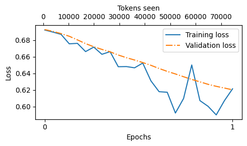


```py
from previous_chapters import plot_losses
# Alternatively:
# from llms_from_scratch.ch05 import plot_losses


epochs_tensor = torch.linspace(0, num_epochs, len(tracking["train_losses"]))
plot_losses(
    epochs_seen=epochs_tensor,
    tokens_seen=tracking["tokens_seen"],
    train_losses=tracking["train_losses"],
    val_losses=tracking["val_losses"],
    label="loss"
)
```


#### S - SFT+RLHF训练出来的模型，推理能力不佳, GROP不需要标注数据，Pure RL涌现推理
- 多步推理的复杂任务（如解谜题、数学推导和解决复杂的编程问题）上
- 传统的SFT + RLHF 表现不佳


T - Pure RL 

- Pure RL(Without previous SFT) 不依赖人类标注，模型通过试错学习推理策略，reward：leetcode，其他的
- SFT(Cold start data) + RL -> SFT(CoT data) + RL(HF-like with verification & human preferecen reward)
- Pure SFT(Without later RL) + distillation(based on small model)

<u>Concepts</u>
推理
- 复杂问题
- 需要多步骤生成并包含中间过程/思维过程
- 解答这些问题的过程叫推理

推理模型
- 具备推理能力的模型
- 例如，回答像“法国的首都是哪里？”这种事实性的问题并不涉及推理。但如果回答像“如果一列火车以每小时60英里的速度行驶 3 小时，它能行驶多远？”这样的问题，就需要一些简单的推理，因为模型需要先识别“距离=速度 × 时间”的关系，才能得出正确答案

推理模型的中间推理步骤主要以两种方式呈现
- 在内部进行多次迭代，但不会向用户展示推理过程
- 直接体现在回答中，让用户看到完整的推理过程


##### DeepSeek R1的训练流程/推理模型的构建和优化4种策略

<u>Inference-time scaling推理时间扩展</u>
What

-  提升大语言模型推理能力的一种方法
-  指的是增加推理时的计算资源来提高模型输出的质量

How

- 一种简单的推理时间扩展方法是提示词工程(prompt engineering), 其中最典型的例子是思维链(chain-of-thought，CoT)提示
  - 输入提示词(prompt)中加入类似“一步步思考”(think step by step)这样的短语，鼓励模型先生成中间推理步骤，而不是直接输出最终答案
  - 上述思维链方法可以被看作一种推理时间扩展，因为它通过生成更多的输出词元来增加推理的计算成本
  - 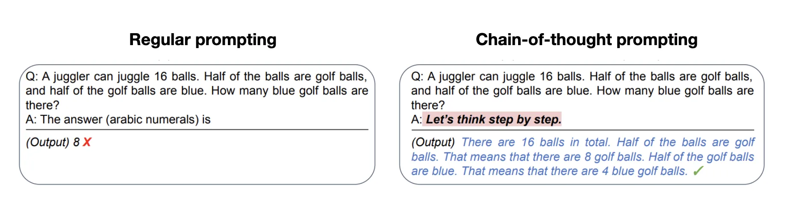
- 另一种推理时间扩展方法是使用投票和搜索算法
  - 一个简单的例子是多数投票法，即让大语言模型生成多个答案，然后我们通过多数投票来选出最有可能的正确答案
  - 同样，我们还可以使用束搜索(beam search)或其他搜索算法来生成更优质的答案


<u>Pure RL纯强化学习</u>
RL强化学习
- Agent（智能体）学习如何行动的主体
- Environment（环境）	智能体所处的世界，它会对智能体的行为做出反应
- State（状态）	当前环境的描述
- Policy（策略）	智能体根据状态选择动作的规则
- Action（动作）	智能体在某个状态下可以选择的行为
- Reward（奖励）	环境对智能体行为的反馈，用于指导学习
- 
- Value Function（价值函数）	评估某个状态或状态-动作对的长期收益
- Q-Function（动作价值函数）	评估在某状态下采取某动作的期望回报
- 
- 强化     通过“奖励”来强化某些行为，从而让智能体学会更好的决策策略。
- 强化学习（Reinforcement Learning, RL）是一种机器学习方法，它让智能体（agent）通过与环境交互来学习如何做决策，以最大化长期奖励。

DeepSeek 团队发现推理能力作为一种行为可以通过纯强化学习自发涌现
- Pure跳过了监督微调阶段
  - 与典型的强化学习流程不同（通常在强化学习之前会先进行监督微调）
  - DeepSeek-R1-Zero 完全通过强化学习进行训练，没有经历初始的监督微调阶段
- 采用了两种奖励方式
  - 准确性奖励：通过使用 LeetCode 编译器来验证代码答案的正确性，并通过一个确定性的系统来评估数学答案的准确性。
  - 格式奖励：依赖大语言模型来确保回答遵循预期的格式，比如在<think>标签内放置推理步骤。
- 令人惊讶的是，仅凭这种方法，大语言模型就已经具备了基本的推理能力,证实了使用纯强化学习开发推理模型是可行的

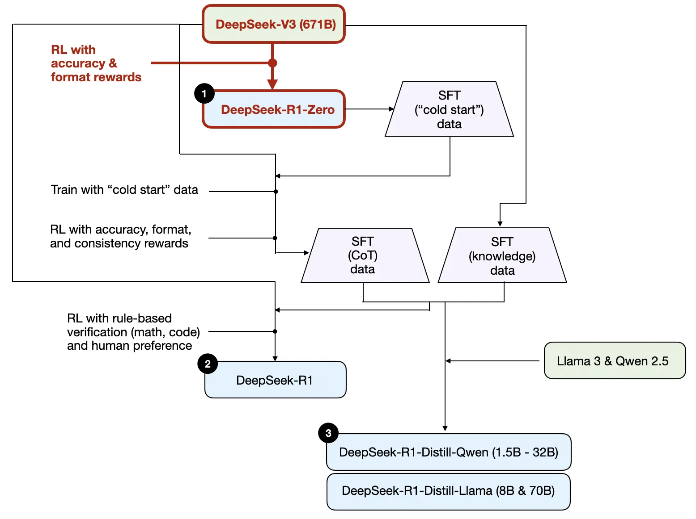


<u>SFT + RL</u>
相较于 DeepSeek-R1-Zero，它通过额外的监督微调和强化学习进一步提升了推理性能
- DeepSeek 团队使用 DeepSeek-R1-Zero 生成了他们所称的“冷启动”监督微调数据。“冷启动”是指这些数据是由 DeepSeek-R1-Zero 模型生成的，而该模型本身并未接受任何监督微调数据的训练
- 在获得这些“冷启动”监督微调数据后，DeepSeek 团队对模型进行了指令微调(instruction fine-tuning)
- 随后又进行了一个强化学习阶段。这个强化学习阶段沿用了DeepSeek-R1-Zero中的奖励机制，包括准确性奖励（验证数学和代码问题的正确性）和格式奖励（确保输出符合预期格式）。除此之外，他们还新增了一个一致性奖励，以避免模型在回答中混用多种语言的问题
- 在强化学习阶段之后，他们进行了新一轮的监督微调数据收集。在这一阶段中，他们使用最新的模型检查点(checkpoint)生成了60 万条思维链监督微调样本，同时还基于DeepSeek-V3 基础模型生成了20 万条基于知识的监督微调样本
- 随后，这 80(20+60)万条监督微调数据被用于指令微调 DeepSeek-V3 基础模型
- 然后又进行最后一轮的强化学习训练。在这一阶段，他们继续使用基于规则的方法对数学和编程问题的答案给予准确性奖励，而对其他类型的问题引入了基于人类偏好标签的奖励机制。

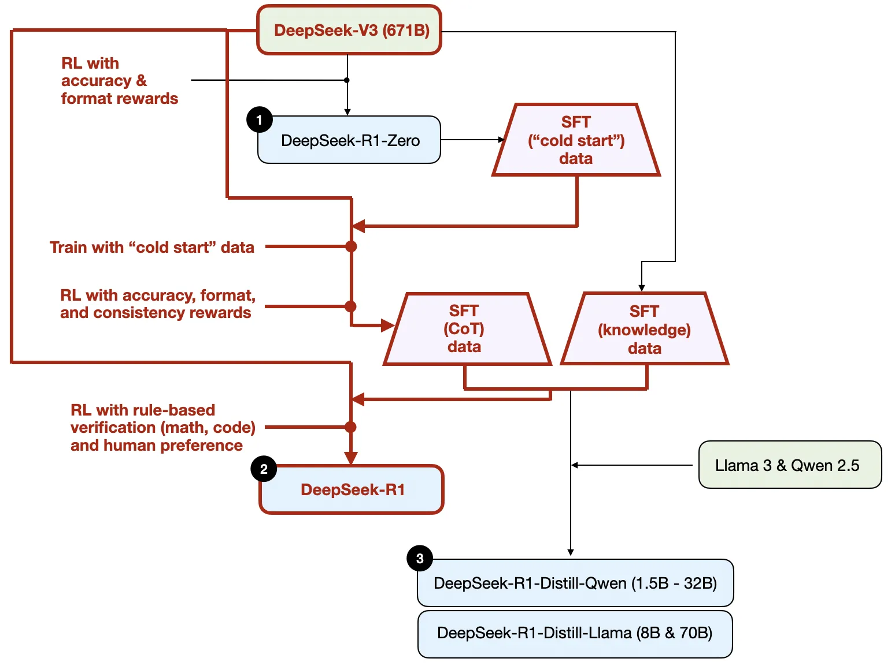


<u>Pure SFT and distillation纯监督微调与蒸馏</u>

传统的知识蒸馏中
- 较小的“学生模型”会在较大的“教师模型”的 logits 和target上进行训练，学说话。

通过蒸馏过程训练小型模型
- DeepSeek的蒸馏方法是通过使用 DeepSeek-V3 和 DeepSeek-R1的中间检查点生成的监督微调数据集(与训练 DeepSeek-R1 时使用的数据集完全相同)，来对较小的大语言模型（如参数量为 80 亿或 700 亿的 Llama 模型以及参数量为 5 亿~320 亿的 Qwen 2.5 模型）进行指令微调
- 为什么 DeepSeek 团队要开发这些蒸馏模型？我认为有两个主要原因。
  - 小型模型具有更高的效率。这意味着它们运行成本更低，同时还可以在低端硬件上运行，这对许多研究人员和像我这样的技术爱好者来说特别具有吸引力。
  - 纯监督微调的案例研究。这些蒸馏模型作为一个有趣的基准，展示了在没有强化学习的情况下，纯监督微调能将模型提升到什么程度。


R 

推理行为是从纯强化学习中**涌现**出来的