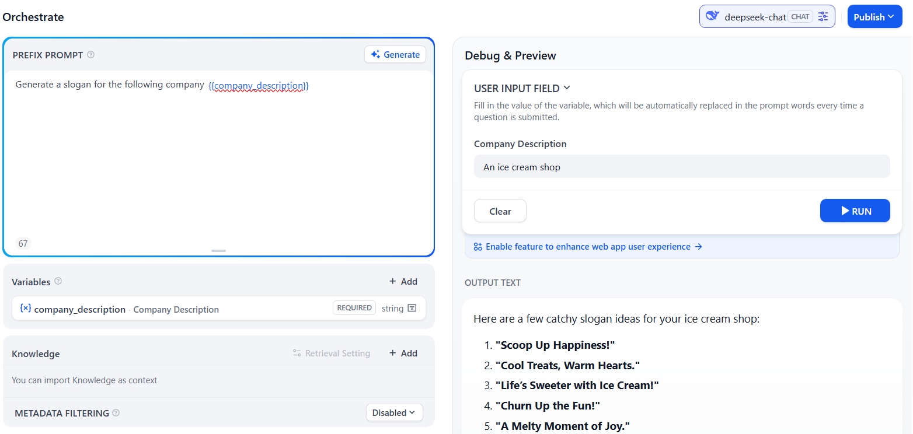
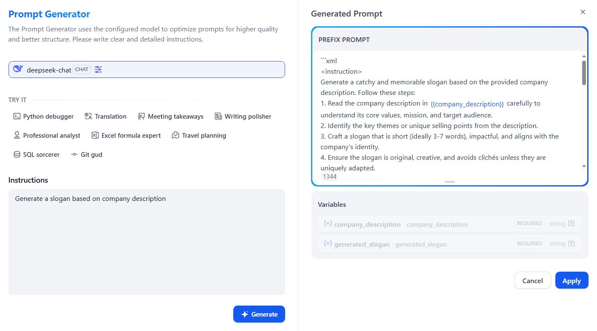
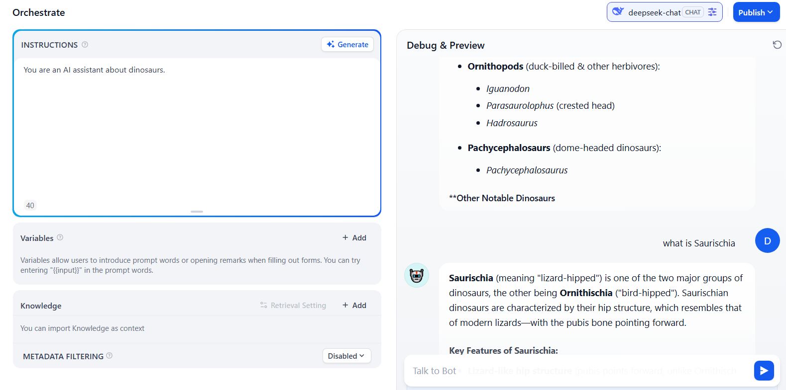

## S - Prompt engineering
Problem is 

- Task: Write in the style of Shakespeare.../Shared template
- Everyone need to prompt the same prompt, a waste of time

Chain/need is

- User input
- Prompt template: combine user input with base template
- Model: switch models as needed

Domain is

- Prompt engineering


## T - Dify No code
- Define and modIFY

### A - Prompt template - one round
Text generator


Prompt generator


```xml
<instruction>
Generate a catchy and memorable slogan based on the provided company description. Follow these steps:
1. Read the company description carefully to understand its core values, mission, and target audience.
2. Identify key themes or unique selling points from the description.
3. Craft a slogan that is short, impactful, and aligns with the company's identity.
4. Ensure the slogan is original and avoids clichés unless they fit exceptionally well.
5. The output should be a single slogan without any additional explanations or XML tags.

Input variables:
- {{company_description}}: A brief description of the company, including its industry, values, and target audience.
</instruction>

<input>
{{company_description}}
</input>

<output>
A single-line slogan reflecting the company's identity.
</output>

<example>
<input>
A sustainable fashion brand that uses recycled materials to create stylish clothing for eco-conscious consumers.
</input>

<output>
"Wear the Change You Wish to See."
</output>
</example>
```

### A - Prompt template - multi rounds
Chatbot


