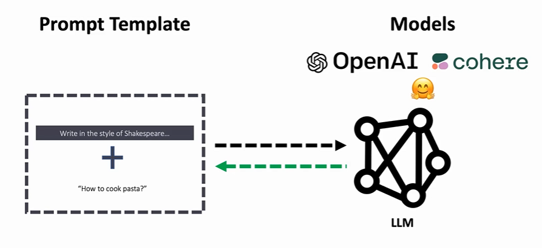
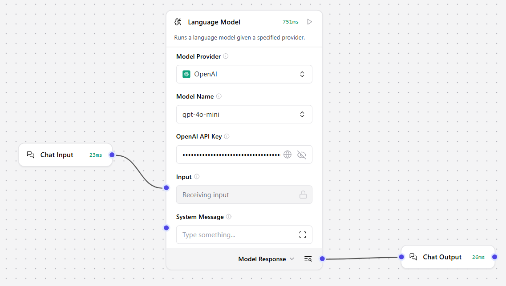
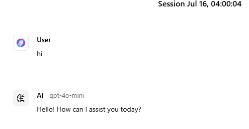
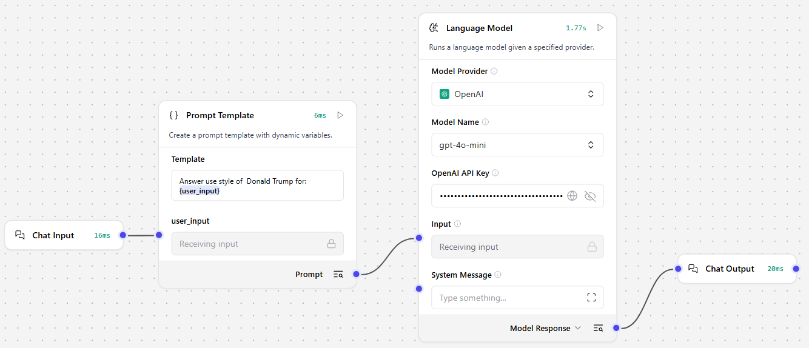

## S - Prompt engineering
Problem is 

- Task: Write in the style of Shakespeare.../Shared template
- Everyone need to prompt the same prompt, a waste of time

Chain/need is

- User input
- Prompt template: combine user input with base template
- Model: switch models as needed

Domain is

- Prompt engineering

## T - LangChain No-Code: Langflow(Flowise)

- Chain - helps use achieve a specific task by linking multiple components together
- Flowise 是一个开源的、可视化的 LLM 应用构建平台，基于 LangChain.js 开发，主打“拖拽式”无代码开发体验
- Langflow 是另一个开源的可视化工具，专注于构建和原型化 LangChain（Python版） 的工作流

- 链逻辑由连接线表示：
- 在 Langflow 的画布中，组件之间的连接线本身就代表了链式执行流程
- 所以不再需要一个单独的 “Chain” 元素来表示流程

### A - Clone a simple ChatGPT

Playground

### A - Prompt templates

