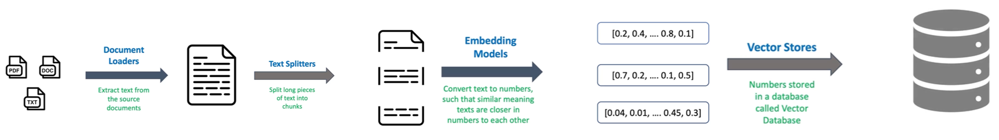
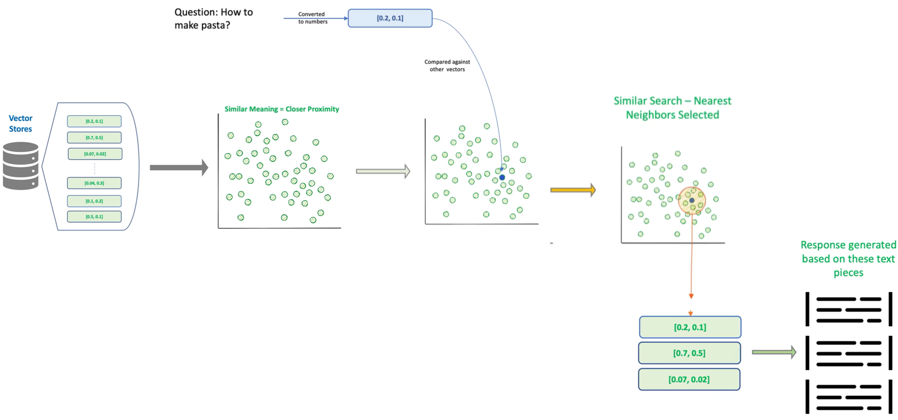
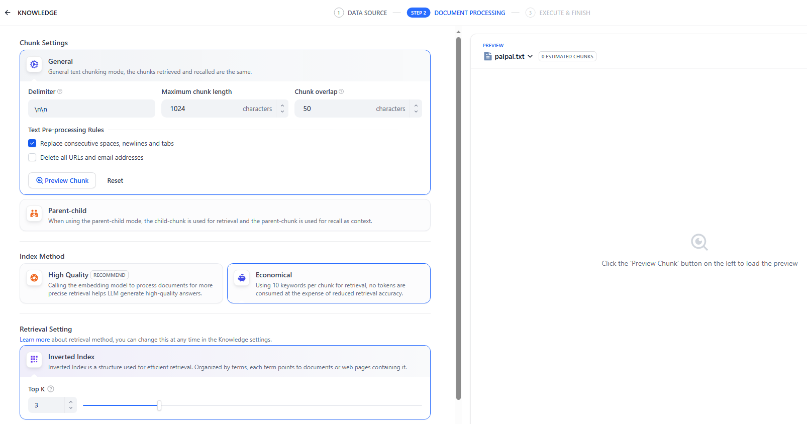
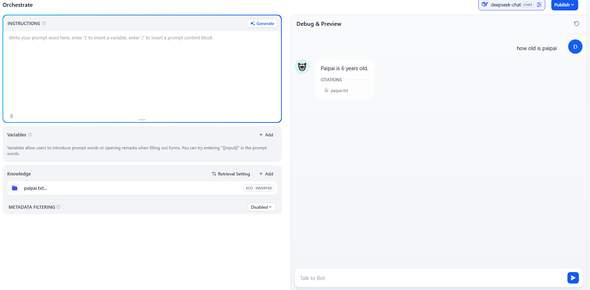
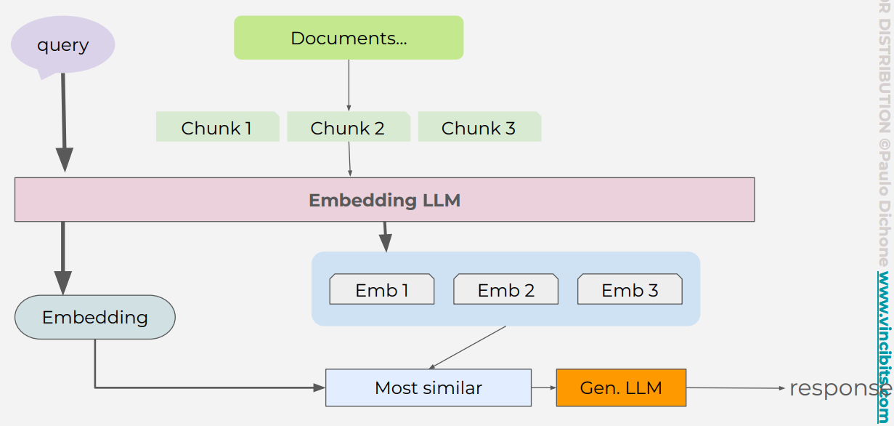
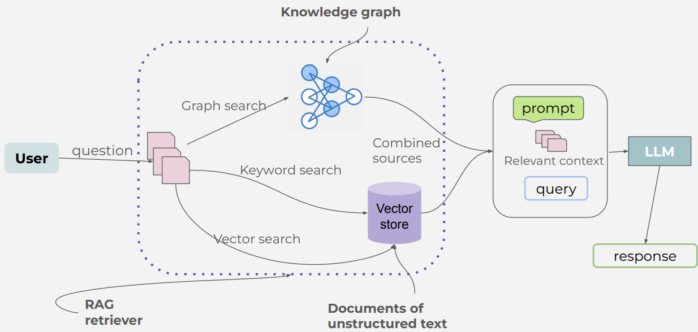
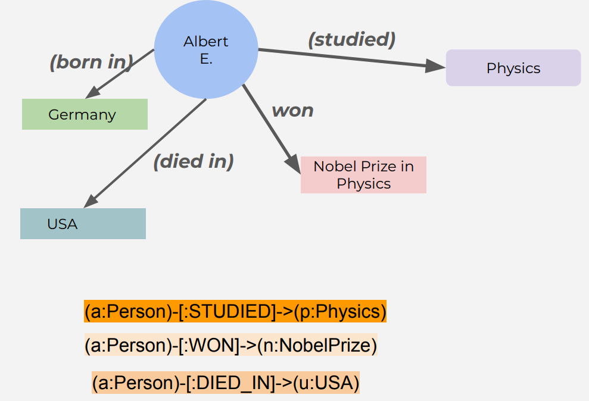

## S - RAG
Problem is

- Task: Seach entire books/Large external data
- Coping text from books and paste in gpt, exceeding the context size


Chain is

Indexing/Embedding path

- Document loaders
- Test splitters
- Embedding models
- Vector stores: Pinecone, FAISS, or Azure Cognitive Search



Retriving/Retrieval path

- Embedding
- Compare
- Search to select
- Convert to text
- LLM



Domain is
- RAG

## T - Dify


### A - Knowledge is RAG
Index


Retrieve



## T - Keyword search
- **字面匹配**


## T - Vector search
- 关键词搜索，严格的字面匹配，只能识别发明人
- 向量搜索，**嵌入+语义搜索**，识别近义词，能识别创造者

3 Steps
- Indexer: embedding raw data, and store in vector store
- Retriever: embedding query, and sematic search to retrieve raw data from vector store
- Generator: LLM with query and retrieved data to generate response



A

<u>原始的做法</u>
- OpenAI DB
- OpenAI client do Index: client.vector_stores.files.upload_and_poll()
- OpenAI client do Retrival: client.vector_stores.search()
- As context in prompt to integrated into LLM

```py
import openai

client = openai.OpenAI()

# 1. 创建向量存储并上传文件（假设你已经完成）
vector_store_id = "vs_abc123"  # 替换为你实际的 vector store ID

# 2. 用户提问
query = "What is LangChain and what is it used for?"

# 3. 检索相关文档片段
search_result = client.vector_stores.search(
    vector_store_id=vector_store_id,
    query=query,
    return_metadata=True
)

# 4. 提取检索到的上下文
context = "\n\n".join([doc["text"] for doc in search_result["data"]])

# 5. 构造提示词并调用 GPT-4
prompt = f"""You are a helpful assistant. Use the following context to answer the question.

Context:
{context}

Question: {query}
Answer:"""

response = client.chat.completions.create(
    model="gpt-4",
    messages=[
        {"role": "user", "content": prompt}
    ],
    temperature=0.2
)

# 6. 输出回答
print(response.choices[0].message.content)
```


<u>结合MCP</u>
- OpenAI DB
- OpenAI client do Index: client.vector_stores.files.upload_and_poll()
- OpenAI client do Retrival: client.vector_stores.search()
- 通过MCP tools, 放入历史对话，来接入到LLM


## T - Graph search
- 向量搜索，基于语义相似性匹配查询，是单跳检索，返回多个碎片：可能直接返回专利，发明人相关的片段
- 图搜索，**知识图谱+结构搜索**，通过遍历路径实现多跳推理，返回精准答案：柴油机->[有]->专利->[发明人是]->张三
- LlamaIndex协调两类检索


4 steps
- Index
- **Build graph**
- Retrial: 
  - Vector search
  - **Graph search**
  - **Combind result**
- Generation




A


### 1.初始化图数据库连接和语言模型
```py
from dotenv import load_dotenv
import os

load_dotenv()


NEO4J_URI = os.environ["NEO4J_URI"]
NEO4J_USERNAME = os.environ["NEO4J_USERNAME"]
NEO4J_PASSWORD = os.environ["NEO4J_PASSWORD"]
NEO4J_DATABASE = os.environ["NEO4J_DATABASE"]
from langchain_community.graphs import Neo4jGraph
kg = Neo4jGraph(url=NEO4J_URI, username=NEO4J_USERNAME, password=NEO4J_PASSWORD, database=NEO4J_DATABASE)


OPENAI_API_KEY = os.getenv("OPENAI_API_KEY")
from langchain_openai import ChatOpenAI
chat = ChatOpenAI(api_key=OPENAI_API_KEY, temperature=0, model="gpt-3.5-turbo")
```

### 2.**Build graph
```py
# 加载维基百科文档raw data
from langchain_community.document_loaders import WikipediaLoader
raw_documents = WikipediaLoader(query="The Roman empire").load()

# Chunk
from langchain.text_splitter import TokenTextSplitter
text_splitter = TokenTextSplitter(chunk_size=512, chunk_overlap=24)
documents = text_splitter.split_documents(raw_documents[:3])

# 利用LLM将文本转图谱并存入 Neo4j
from langchain_experimental.graph_transformers import LLMGraphTransformer
llm_transformer = LLMGraphTransformer(llm=chat)
graph_documents = llm_transformer.convert_to_graph_documents(documents)
res = kg.add_graph_documents(graph_documents, include_source=True, baseEntityLabel=True)
```


### 3.创建向量索引（用于非结构化检索）Indexer

- neo4j DB
- OpenAI do Index:  OpenAIEmbeddings()
- OpenAI do Retrival: vector_index.similarity_search(question)
- As context to pass to LLM

```py
from langchain_community.vectorstores import Neo4jVector
from langchain_openai import OpenAIEmbeddings

vector_index = Neo4jVector.from_existing_graph(
    OpenAIEmbeddings(),
    search_type="hybrid",
    node_label="Document",
    text_node_properties=["text"],
    embedding_node_property="embedding",
)
```


### 4.**Graph search
```py
# 使用 pydantic 定义一个结构化输出模型 Entities
from langchain_core.pydantic_v1 import BaseModel, Field
from typing import Tuple, List
class Entities(BaseModel):
    names: List[str] = Field(..., description="All the person, organization, or business entities...")

# 建一个提示模板，告诉语言模型要提取哪些类型的实体
from langchain_core.prompts import ChatPromptTemplate
prompt = ChatPromptTemplate.from_messages(
    [
        (
            "system",
            "You are extracting organization and person entities from the text.",
        ),
        (
            "human",
            "Use the given format to extract information from the following "
            "input: {question}",
        ),
    ]
)

# 让模型输出符合 Entities 格式的结构化数据
entity_chain = prompt | chat.with_structured_output(Entities)


# 结构化检索函数,获取实体的邻居节点（上下游关系）
from langchain_community.vectorstores.neo4j_vector import remove_lucene_chars


# 将实体名拆分成单词，并为每个单词添加模糊匹配（~2 表示允许最多两个字符的误差）
# 使用 AND 连接多个词，构造 Neo4j 的全文搜索语句
def generate_full_text_query(input: str) -> str:
    """
    Generate a full-text search query for a given input string.

    This function constructs a query string suitable for a full-text search.
    It processes the input string by splitting it into words and appending a
    similarity threshold (~2 changed characters) to each word, then combines
    them using the AND operator. Useful for mapping entities from user questions
    to database values, and allows for some misspelings.
    """
    full_text_query = ""
    words = [el for el in remove_lucene_chars(input).split() if el]
    for word in words[:-1]:
        full_text_query += f" {word}~2 AND"
    full_text_query += f" {words[-1]}~2"
    return full_text_query.strip()


# Graph search
# 调用实体抽取链：从问题中提取实体名。
# 对每个实体执行全文搜索
# 查询实体的邻居节点
# 拼接结果：将所有结果合并为字符串返回
def structured_retriever(question: str) -> str:
    """
    Collects the neighborhood of entities mentioned
    in the question
    """
    result = ""
    entities = entity_chain.invoke({"question": question})
    for entity in entities.names:
        print(f" Getting Entity: {entity}")
        response = kg.query(
            """CALL db.index.fulltext.queryNodes('entity', $query, {limit:2})
            YIELD node,score
            CALL {
              WITH node
              MATCH (node)-[r:!MENTIONS]->(neighbor)
              RETURN node.id + ' - ' + type(r) + ' -> ' + neighbor.id AS output
              UNION ALL
              WITH node
              MATCH (node)<-[r:!MENTIONS]-(neighbor)
              RETURN neighbor.id + ' - ' + type(r) + ' -> ' +  node.id AS output
            }
            RETURN output LIMIT 50
            """,
            {"query": generate_full_text_query(entity)},
        )
        # print(response)
        result += "\n".join([el["output"] for el in response])
    return result
```


### 5.**混合检索器（结构化 + 非结构化）
```py
def retriever(question: str):
    print(f"Search query: {question}")
    structured_data = structured_retriever(question)
    unstructured_data = [
        el.page_content for el in vector_index.similarity_search(question)
    ]

    final_data = f"""Structured data:
{structured_data}
Unstructured data:
{"#Document ". join(unstructured_data)}
    """

    print(f"\nFinal Data::: ==>{final_data}")
    return final_data
```


### 6.构建 RAG 问答链
- 一个完整的 RAG 问答链（Retrieval-Augmented Generation Chain）
```py
from langchain_core.runnables import (
    RunnableBranch,
    RunnableLambda,
    RunnableParallel,
    RunnablePassthrough,
)

from langchain_core.prompts.prompt import PromptTemplate

from langchain_core.messages import AIMessage, HumanMessage
from langchain_core.output_parsers import StrOutputParser


# (1) 对话历史压缩（Condense Follow-up Question）
# 这个模板用于将“追问”转换为“独立问题”，以便后续检索更准确。
# Chat History:
# Q: Who was the first emperor of Rome?
# A: Augustus.
# Follow Up Input: What did he do?
# → Standalone question: What did Augustus do?
_template = """Given the following conversation and a follow up question, rephrase the follow up question to be a standalone question,
in its original language.
Chat History:
{chat_history}
Follow Up Input: {question}
Standalone question:"""  # noqa: E501
CONDENSE_QUESTION_PROMPT = PromptTemplate.from_template(_template)


# (2)将聊天历史格式化为 HumanMessage 和 AIMessage 的列表，供语言模型理解上下文
def _format_chat_history(chat_history: List[Tuple[str, str]]) -> List:
    buffer = []
    for human, ai in chat_history:
        buffer.append(HumanMessage(content=human))
        buffer.append(AIMessage(content=ai))
    return buffer

# (3)构建搜索查询逻辑
# 如果没有历史对话，直接使用当前问题
# 如果有 chat_history，就使用 _format_chat_history + CONDENSE_QUESTION_PROMPT + LLM 来生成独立问题
_search_query = RunnableBranch(
    # If input includes chat_history, we condense it with the follow-up question
    (
        RunnableLambda(lambda x: bool(x.get("chat_history"))).with_config(
            run_name="HasChatHistoryCheck"
        ),  # Condense follow-up question and chat into a standalone_question
        RunnablePassthrough.assign(
            chat_history=lambda x: _format_chat_history(x["chat_history"])
        )
        | CONDENSE_QUESTION_PROMPT
        | ChatOpenAI(temperature=0)
        | StrOutputParser(),
    ),
    # Else, we have no chat history, so just pass through the question
    RunnableLambda(lambda x: x["question"]),
)


# (4) 构建最终提示模板
# 告诉模型只根据提供的上下文回答问题，避免幻觉
template = """Answer the question based only on the following context:
{context}

Question: {question}
Use natural language and be concise.
Answer:"""
prompt = ChatPromptTemplate.from_template(template)


# (5) 组合成完整的 RAG Chain
# 这个链条的执行流程如下：
# 并行执行两个任务：
#     context: 先判断是否有聊天历史 → 得到独立问题 → 调用 retriever 获取结构化 + 非结构化上下文。
#     question: 原始问题直接传入。
# 将上下文和问题填入 prompt 模板。
# 调用 LLM 生成答案。
# 解析输出为字符串。
chain = (
    RunnableParallel(
        {
            "context": _search_query | retriever,
            "question": RunnablePassthrough(),
        }
    )
    | prompt
    | chat
    | StrOutputParser()
)
```

9.测试问答系统
```py
res_simple = chain.invoke({"question": "How did the Roman empire fall?"})
print(f"\n Results === {res_simple}\n\n")
```


### S - Enhance Searching
- Search engines: enhance search capabilities
- Recommendation systems: provide personalized recommendations
- Data Integration: combine data from various sources into one framework
- AI and Machine Learning: enhance machine understanding


T - KG

Definition

- Within a specific domain, unstrcutured data like txt, doc, DBs
- structured representation like nodes, edges


Key concept: triples

- entity/instance/vertic/object/concept by node:  
  - subject by circle: Albert E.
  - object by box: Physics
- relationip/predicate between entities by edge/arrow: studied
- A triple/SPO - building block of KG
  - subject(Albert) predicate(studies) object(Physics)
- Both node and edge
  - attributes/properties/characteristics about nodes and edges: birth data, nationality, profession
  - labels are tags to node and edge to define types


Structure

- Graph-based Structure: nodes, edges to form graph to model real-world knowledge
- Ontology: schema that defines the types of entities, relationships and attributes
- Taxonomy: Hierarchical classification of entities in the graph


Construction of KG

- Manual curation: manual input of data into graph
- Automated Extraction: using algos and NLP to extract information from unstructured data sources (txt, docs, DBs…)
- Crowdsourcing: input from a large number of sources to populate and refine the graph.


Tools representing KG in code

- RDF ( Resource Description Framework)
- SPARQL (SPARQL Protocol and RDF Query Language)
- OWL (Web Ontology Language)
- Neo4j


Neo4j
- “Neo,” meaning new, and “4j,” which originally referenced its Java roots (as in “for Java”)
- A graph database management system that provides an ACID-compliant transactional backend for applications
- Cypher - the query language for interacting with the graph data, 暗示了数据查询和解密的过程
  - Create a variable a and the type is Person (a:Person)
  - Create the relation STUDIES -[:STUDIED]->
  - Create a variable p and the type is Physics (p:Physics)
  - 


A

1.create instance

- https://neo4j.com/

```bash
# or neo4j+ssc://
NEO4J_URI=neo4j+s://2f2cfd51.databases.neo4j.io
NEO4J_USERNAME=neo4j
NEO4J_PASSWORD=wwUEf6264nN3c5jZa3Aw6fX-vAHi1oZCC6VpIufHMS8
NEO4J_DATABASE=neo4j
AURA_INSTANCEID=2f2cfd51
AURA_INSTANCENAME=Free instance
```

2.connect to instance

- .venv
- .env
- kg_simple.py
- uv add neo4j/python-dotenv

- MATCH (n) RETURN count(n)
- MATCH (n)-[r]->(m)
- RETURN n, r, m;
```py
from dotenv import load_dotenv
import os
from neo4j import GraphDatabase

load_dotenv()


NEO4J_DATABASE = os.environ["NEO4J_DATABASE"]
NEO4J_URI = os.environ["NEO4J_URI"]
NEO4J_USERNAME = os.environ["NEO4J_USERNAME"]
NEO4J_PASSWORD = os.environ["NEO4J_PASSWORD"]
AUTH = (NEO4J_USERNAME, NEO4J_PASSWORD)

AURA_INSTANCENAME = os.environ["AURA_INSTANCENAME"]

driver = GraphDatabase.driver(NEO4J_URI, auth=AUTH, database=NEO4J_DATABASE)


def connect_and_query():
    # driver = GraphDatabase.driver(NEO4J_URI, auth=AUTH)
    try:
        with driver.session(database=NEO4J_DATABASE) as session:
            result = session.run("MATCH (n) RETURN count(n)")
            count = result.single().value()
            print(f"Number of nodes: {count}")
    except Exception as e:
        print(f"Error: {e}")
    finally:
        driver.close()

connect_and_query()
```
-  Unable to retrieve routing information
- Ensure your network allows outbound connections to Neo4j Aura

3.create entities and relationships

- MERGE (a:Person {name: 'Albert Einstein'})
- MATCH (a:Person {name: 'Albert Einstein'}), (p:Subject {name: 'Physics'})
- MERGE (a)-[:STUDIED]->(p)

```py
def create_entities(tx):
    # Create Albert Einstein node
    tx.run("MERGE (a:Person {name: 'Albert Einstein'})")

    # Create other nodes
    tx.run("MERGE (p:Subject {name: 'Physics'})")
    tx.run("MERGE (n:NobelPrize {name: 'Nobel Prize in Physics'})")
    tx.run("MERGE (g:Country {name: 'Germany'})")
    tx.run("MERGE (u:Country {name: 'USA'})")


def create_relationships(tx):
    # Create studied relationship
    tx.run(
        """
    MATCH (a:Person {name: 'Albert Einstein'}), (p:Subject {name: 'Physics'})
    MERGE (a)-[:STUDIED]->(p)
    """
    )

    # Create won relationship
    tx.run(
        """
    MATCH (a:Person {name: 'Albert Einstein'}), (n:NobelPrize {name: 'Nobel Prize in Physics'})
    MERGE (a)-[:WON]->(n)
    """
    )

    # Create born in relationship
    tx.run(
        """
    MATCH (a:Person {name: 'Albert Einstein'}), (g:Country {name: 'Germany'})
    MERGE (a)-[:BORN_IN]->(g)
    """
    )

    # Create died in relationship
    tx.run(
        """
    MATCH (a:Person {name: 'Albert Einstein'}), (u:Country {name: 'USA'})
    MERGE (a)-[:DIED_IN]->(u)
    """
    )


def build_knowledge_graph():
    # Open a session with the Neo4j database

    try:
        with driver.session(database=NEO4J_DATABASE) as session:
            # Create entities
            session.execute_write(create_entities)
            # Create relationships
            session.execute_write(create_relationships)

    except Exception as e:
        print(f"Error: {e}")
    finally:
        driver.close()

build_knowledge_graph()
```

4.query all entities names

- MATCH (n)
- RETURN n.name AS name

```py
# Simple Cypher query to find all node names
simple_query = """
MATCH (n)
RETURN n.name AS name
"""

# Function to connect and run a simple Cypher query
def query_graph_simple(cypher_query):
    driver = GraphDatabase.driver(NEO4J_URI, auth=AUTH)
    try:
        with driver.session(database=NEO4J_DATABASE) as session:
            result = session.run(cypher_query)
            for record in result:
                print(record["name"])
    except Exception as e:
        print(f"Error: {e}")
    finally:
        driver.close()
```

5.query paths/relationships

- MATCH path=(a:Person {name: 'Albert Einstein'})-[:STUDIED]->(s:Subject)
- RETURN path
- UNION
- MATCH path=(a:Person {name: 'Albert Einstein'})-[:WON]->(n:NobelPrize)
- RETURN path


```py
# Cypher query to find paths related to Albert Einstein
einstein_query = """
MATCH path=(a:Person {name: 'Albert Einstein'})-[:STUDIED]->(s:Subject)
RETURN path
UNION
MATCH path=(a:Person {name: 'Albert Einstein'})-[:WON]->(n:NobelPrize)
RETURN path
UNION
MATCH path=(a:Person {name: 'Albert Einstein'})-[:BORN_IN]->(g:Country)
RETURN path
UNION
MATCH path=(a:Person {name: 'Albert Einstein'})-[:DIED_IN]->(u:Country)
RETURN path
"""

# Function to connect and run a Cypher query
def query_graph(cypher_query):
    driver = GraphDatabase.driver(NEO4J_URI, auth=AUTH)
    try:
        with driver.session(database=NEO4J_DATABASE) as session:
            result = session.run(cypher_query)
            for record in result:
                print(record["path"])
    except Exception as e:
        print(f"Error: {e}")
    finally:
        driver.close()

query_graph(einstein_query)
```


R

Advantages

- Enhanced data interoperability: good for integrating heterogeneous data sources
- Improved data quality and Consistency: ensures accuracy (well-defined ontologies and taxonomies)
- Facilitate Advanced Querying: allows complex queries
- Supports Inference and Reasoning: machines can infer new knowledge from existing data easily


Chanllenges

- Data quality: accuracy and reliability of the data is challenging
- Scalability: managing and processing large-scale KGs efficiently
- Complexity: developing and maintaining complex ontologies and taxonomies
- Data Privacy: securing sensitive data while utilizing KGs


