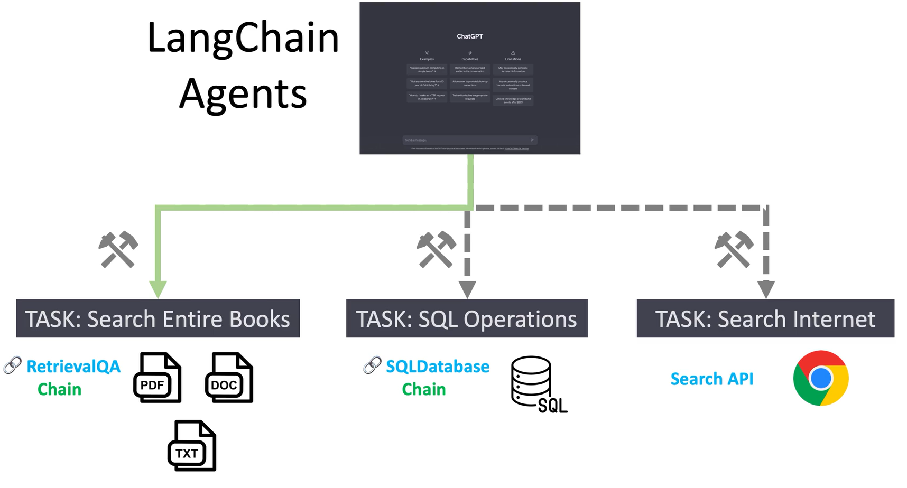
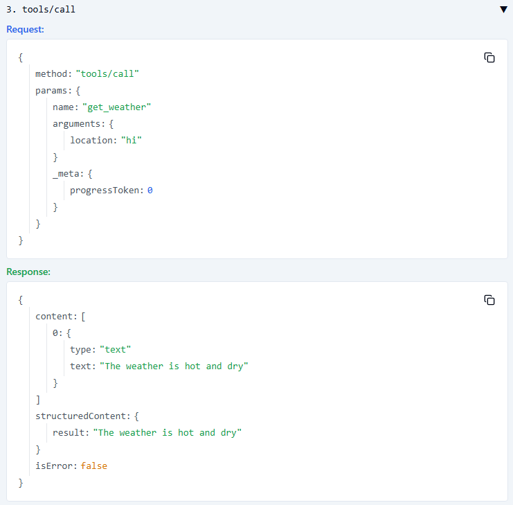

## S - Agent
Problem is
- Tasks/Multiple external tools
  - Search Entire Books/RAG
  - SQL operations
  - Search Internet
- Need tools
- Autommous call tools with self-analysis, without deterministic worflow for step 1,2,3

Chain is

Agent tools
- DuckDuckGo search
- Zapier NLA
- Shell
- Python REPL
- Chains/Agents/Custom functions


Domain is
- Agent


## T - Dify
Tools and autonomous calling


Also a MCP client


## T - MCP: Unify the protocol to interact with external systems


## TA - Model Context Protocol
### Arch overview

边界


类比


Arch


Flow


---
### MCP Server

#### Public Choices
mcp official servers: https://github.com/modelcontextprotocol Airbnb

```json
{
  "mcpServers": {
    "airbnb": {
      "command": "npx",
      "args": ["-y", "@openbnb/mcp-server-airbnb", "--ignore-robots-txt"]
    }
  }
}
```

#### 1/To be called by Client

##### Primitives
| 分类        | 描述                                                                 | 示例/用途                                      |
|-------------|----------------------------------------------------------------------|------------------------------------------------|
| **Tools(99% case)**   | 由模型控制的逻辑/功能模块，可被调用执行操作                         | API 请求、CRUD 操作、计算任务 IN: Parameters to be called; OUT: Connect with external services等                |
| **Resources** | 应用控制的数据资源，用于为主机或客户端提供上下文信息               | 文件内容、读取指令、用户数据等                 |
| **Prompts** | 用户控制的提示模板，用于向 LLM 提供定制化提示                        | 生成特定格式的研究报告、代码注释等   


##### Tool/function as action called by LLM 


1.install packages

- uv Python包管理器,是 pip 和 virtualenv 的替代品
- npm/npx JavaScript 的包管理器


2.initialize project
```bash
# Creat helloworld folder
uv init # create project
uv venv # crate virtual env
.venv\Scripts\activate
```

3.define server
- Create tool with FastMCP class rather lowlevel server class
- mcp server with tool defined <-  @mcp.tool()
- name: will use function name
- description: will use docstring
- schema: will use input params
```py
from mcp.server.fastmcp import FastMCP

mcp = FastMCP("Weather")

@mcp.tool()
def get_weather(location: str) -> str:
    """
    Gets the weather given a location
    Args:
        location: location, can be city, country, state, etc.
    """
    return "The weather is hot and dry"

if __name__ == "__main__":
    mcp.run()
```

4.before publishing, run and debug server
- nothing will happen
```bash
uv run weather.py
```

- MCP inspector to test MCP server before deploy it in MCP client
```bash
uv add mcp[cli] # install MCP CLI
mcp dev weather.py # create a temp MCP host and client that allow us to further connect to server and test it
# connect to server in GUI
```




Custom input schema <- pydantic.BaseModel

```py
from mcp.server.fastmcp import FastMCP
from pydantic import BaseModel, Field
from typing import List

# Create server
mcp = FastMCP("OtherInputs")

class Person(BaseModel):
    first_name: str = Field(..., description="The person's first name")
    last_name: str = Field(..., description="The person's last name")
    years_of_experience: int = Field(..., description="Number of years of experience")
    previous_addresses: List[str] = Field(default_factory=list, description="List of previous addresses")


@mcp.tool()
def add_person_to_member_database(person: Person) -> str:
    """
    Logs the personal details of the given person to the database.
    Args:
        person (Person): An instance of the Person class containing the following personal details:
            - first_name (str): The person's given name.
            - last_name (str): The person's family name.
            - years_of_experience (int): Number of years of experienceh.
            - previous_addresses (List[str]): A list of the person's previous residential addresses.

    Returns:
        str: A confirmation message indicating that the data has been logged.

    """

    with open("log.txt", "a", encoding="utf-8") as log_file:
        log_file.write(f"First Name: {person.first_name}\n")
        log_file.write(f"Last Name: {person.last_name}\n")
        log_file.write(f"Years of Experience: {person.years_of_experience}\n")
        log_file.write("Previous Addresses:\n")
        for idx, address in enumerate(person.previous_addresses, 1):
            log_file.write(f"  {idx}. {address}\n")
        log_file.write("\n")

    return "Data has been logged"

if __name__ == "__main__":
    mcp.run()
```


##### Prompts/Prompt Engineering

- provide the very end user a full prompt guide to use based on some keywords
- 
- mcp server with prompt defined <- @mcp.prompt()
- cline不支持prompts

```py
from mcp.server.fastmcp import FastMCP

mcp = FastMCP("Prompt")

@mcp.prompt()
def get_prompt(topic: str) -> str:
    """
    Returns a prompt that will do a detailed analysis on a topic
    Args:
        topic: the topic to do research on
    """
    return f"Do a detailed analysis on the following topic: {topic}"

@mcp.prompt()
def write_detailed_historical_report(topic: str, number_of_paragraphs: int) -> str:
    """
    Writes a detailed historical report
    Args:
        topic: the topic to do research on
        number_of_paragraphs: the number of paragraphs that the main body should be 
    """

    prompt = """
    Create a concise research report on the history of {topic}. 
    The report should contain 3 sections: INTRODUCTION, MAIN, and CONCLUSION.
    The MAIN section should be {number_of_paragraphs} paragraphs long. 
    Include a timeline of key events.
    The conclusion should be in bullet points format. 
    """

    prompt = prompt.format(topic=topic, number_of_paragraphs=number_of_paragraphs)

    return prompt


if __name__ == "__main__":
    mcp.run()
```


##### Resources/RAG

- expose data to client or LLM as private data or context to answer questions
- like GET to retrieve data, while tools like POST to do action
- 
- mcp server with resources define <- @mcp.resource("inventory://overview")
```py
from mcp.server.fastmcp import FastMCP

mcp = FastMCP("Resources")

@mcp.resource("inventory://overview")
def get_inventory_overview() -> str:
    """
    Returns overview of inventory
    """
    # Sample inventory overview
    overview = """
    Inventory Overview:
    - Coffee
    - Tea
    - Cookies
    """
    return overview.strip()

inventory_id_to_price = {
    "123": "6.99",
    "456": "17.99",
    "789": "84.99"
}

inventory_name_to_id = {
    "Coffee": "123",
    "Tea": "456",
    "Cookies": "789"
}

@mcp.resource("inventory://{inventory_id}/price")
def get_inventory_price_from_inventory_id(inventory_id: str) -> str:
    """
    Returns price from inventory id
    """
    return inventory_id_to_price[inventory_id]

@mcp.resource("inventory://{inventory_name}/id")
def get_inventory_id_from_inventory_name(inventory_name: str) -> str:
    """
    Returns id from inventory name
    """
    return inventory_name_to_id[inventory_name]


if __name__ == "__main__":
    mcp.run()
```

##### Package & publishing
<u>Public for local deployment</u>
if mcp server is in js
- upload to: https://www.npmjs.com/ at https://www.npmjs.com/package/@openbnb/mcp-server-airbnb
- donwload npm package manager: npx
if mcp server is in python
- upload to: github
- download using python package manager: uvx

A

1.Adaption for publishing

```py
# |_src/mcpserver
#         |_ __init__.py
#         |_ __main__.py - tell uvx how to run mcp server, use this file, 
#         |_ weather.py

# __main__.py

from mcpserver.weather import mcp

def main():
    mcp.run()

# avoid first import execution
if __name__ == "__main__":
    main()
```


```bash
# |_pyproject.toml - tell uvx what to build, how to trigger the run
# append to pyproject.toml

[project.scripts]
mcp-server = "mcpserver.__main__:main"

[build-system]
requires = ["setuptools"]
build-backend = "setuptools.build_meta"

[tool.setuptools]
package-dir = {"" = "src"}

[tool.setuptools.packages.find]
where = ["src"]
```
```
# README.md

{
  "mcpServers": {
    "weather": {
      "disabled": false,
      "timeout": 60,
      "type": "stdio",
      "command": "uvx",
      "args": [
        "--from",
        "git+https://github.com/Hongyao-Tang/mcpserverexample",
        "mcp-server"
      ]
    }
  }
}
```

```bash
uv run mcp-server
```

2.push to github
leverage copilot agent mode


3.let other people download to local and run local
- download repo
- install deps according to toml
- run mcp-server defined in toml to run server

```bash
uvx --from git+https://github.com/Hongyao-Tang/mcpserverexample mcp-server
```

This cmd is configed to client

4.add to official

- official servers repo: https://github.com/modelcontextprotocol/servers
- make a PR to README in community servers adding link to your repo


##### Streamable HTTP


> Why streamable HTTP
> S - LLM 生成文本输出时低延迟响应
> 
> - 用户可以更快看到“部分结果”，而> 不是等待完整响应
> 
> T - Streamable HTTP：边生成边发> 送
> 
> - 保持连接	HTTP 连接在响应过程> 中保持打开状态，直到数据流结束
> - 流式传输（Streaming）	数据不> 是一次性发送完，而是分段> （chunked）发送，客户端可以边接收> 边处理
> 
> A
> GET /chat HTTP/1.1
> Accept: text/event-stream


A

1.define a remote server

- look into source code at https://github.com/modelcontextprotocol/python-sdk/blob/main/src/mcp/server/fastmcp/server.py
```
# define a http server
    def run(
        self,
        transport: Literal["stdio", "sse", "streamable-http"] = "stdio",

# change default setting by source code

    host: str = "127.0.0.1"
    port: int = 8000

FastMCP("name", host="2.2.2.2", port=8080)
```

- host默认就是127.0.0.1，是源码，视频里的比较早
- port不能定义在run，是源码，虽然有提示可能是错的
- 

```py
from mcp.server.fastmcp import FastMCP

mcp = FastMCP("server")

@mcp.tool()
def greeting(name: str) -> str:
    "Send a greeting"
    return f"Hi {name}"

if __name__ == "__main__":
    mcp.run(transport="streamable-http")
```


2.serve a remote server

- push to git
- clone to vm with public ip

- if mcp dev 必须要加文件 directly, it always start in local
- so run server directly with uv run server.py
- mcp dev server.py with http and url of http://0.0.0.0:8000/mcp/


3.consume a remote server

if client/cline do not support http, use mcp-remote from npmjs as WA
```json
{
  "mcpServers": {
    "remote-example": {
      "command": "npx",
      "args": [
        "mcp-remote",
        "your url",
        "--allow-http
      ]
    }
  }
}
```
```bash
npm -i mcp-remote
```

mcp install是local的做法，就是一个url


R
- adv: use local capabilities, no auth, no security concern
- disadv: run server locally means running client locally


#### 2/Wrap External Services

- Local file
- Local desktop
  - to screenshot your local computer to tell what you are seeing
- API call
- Another LLM


- Local file <- with open(file,"a/r", encoding="utf-8) as f: f.write(content)/notes = f.read()
```py
from mcp.server.fastmcp import FastMCP

mcp = FastMCP("LocalNotes")

@mcp.tool()
def add_note_to_file(content: str) -> str:
    """
    Appends the given content to the user's local notes.
    Args:
        content: The text content to append.
    """

    filename = 'notes.txt'

    try:
        with open(filename, "a", encoding="utf-8") as f:
            f.write(content + "\n")
        return f"Content appended to {filename}."
    except Exception as e:
        return f"Error appending to file {filename}: {e}"
    

@mcp.tool()
def read_notes() -> str:
    """
    Reads and returns the contents of the user's local notes.
    """
    filename = 'notes.txt'

    try:
        with open(filename, "r", encoding="utf-8") as f:
            notes = f.read()
        return notes if notes else "No notes found."
    except FileNotFoundError:
        return "No notes file found."
    except Exception as e:
        return f"Error reading file {filename}: {e}"
    
if __name__ == "__main__":
    mcp.run()
```

- Local desktop <- pyautogui.screenshot()
```py
from mcp.server.fastmcp import FastMCP
from mcp.server.fastmcp.utilities.types import Image

import pyautogui
import io

# Create server
mcp = FastMCP("ScreenshotDemo")

@mcp.tool()
def capture_screenshot() -> Image:
    """
    Capture the current screen and return the image. Use this tool whenever the user requests a screenshot of their activity.
    """

    buffer = io.BytesIO()

    # if the file exceeds ~1MB, it will be rejected by Claude
    screenshot = pyautogui.screenshot()
    screenshot.convert("RGB").save(buffer, format="JPEG", quality=60, optimize=True)
    return Image(data=buffer.getvalue(), format="jpeg")

if __name__ == "__main__":
    mcp.run()
```

- API call <- requests.get()
```py
from mcp.server.fastmcp import FastMCP
import requests

mcp = FastMCP("Crypto")

@mcp.tool()
def get_cryptocurrency_price(crypto: str) -> str:
    """
    Gets the price of a cryptocurrency.
    Args:
        crypto: symbol of the cryptocurrency (e.g., 'bitcoin', 'ethereum').
    """
    try:
        # Use CoinGecko API to fetch current price in USD
        url = f"https://api.coingecko.com/api/v3/simple/price"
        params = {"ids": crypto.lower(), "vs_currencies": "usd"}
        response = requests.get(url, params=params, timeout=10)
        response.raise_for_status()
        data = response.json()
        price = data.get(crypto.lower(), {}).get("usd")
        if price is not None:
            return f"The price of {crypto} is ${price} USD."
        else:
            return f"Price for {crypto} not found."
    except Exception as e:
        return f"Error fetching price for {crypto}: {e}"
    
if __name__ == "__main__":
    mcp.run()
```

- Another model <- client.chat.completions.create()
```py
from mcp.server.fastmcp import FastMCP
from openai import OpenAI

YOUR_API_KEY = 'xxx'
YOUR_API_KEY1 = 'xxx'

DS = "https://api.deepseek.com"
PL = "https://api.perplexity.ai"

mcp = FastMCP("WebSearch")

@mcp.tool()
def perform_websearch(query: str) -> str:
    """
    Performs a web search for a query
    Args:
        query: the query to web search.
    """

    messages = [
        {
            "role": "system",
            "content": (
                "You are an AI assistant that searches the web and responds to questions"
            ),
        },
        {   
            "role": "user",
            "content": (
                query
            ),
        },
    ]

    client = OpenAI(api_key=YOUR_API_KEY1, base_url=PL)

    # chat completion without streaming
    response = client.chat.completions.create(
        model="sonar-pro",
        messages=messages,
    )
    
    return response.choices[0].message.content

if __name__ == "__main__":
    mcp.run()
```


---
### MCP Client
#### Public choices
|Intergated Host + Client|Plugin Client|
|-|-|
|Claude on Desktop/windsurf ide/cursor/n8n/copilot studio as host+client |VSCode plugin CLine/windsurf as client  <br>VSCode as host|


| Feature               | Cursor                                              | Windsurf                                                      | Cline/Roo-Cline(Cline 的分支，功能增强版,如拖拽图片生成界面或代码)                                      |
|-----------------------|------------------------------------------------------|----------------------------------------------------------------|-----------------------------------------------------|
|**What**|基于 VSCode 的完整 AI IDE|VSCode 插件|插件|
| **AI Models**         | GPT-4o, Claude 3.5 Sonnet, o1, cursor-small           | Codeium (Cascade), GPT-4, Claude 3.5 Sonnet                     | Any via API (Claude, GPT, Gemini, Qwen)             |
| **Pricing**           | \$20/mo (unlimited prompts, custom API)              | \$15/mo (credit-based), free tier available                     | Free (pay-as-you-go via API usage)                  |
| **Customization**     | High (model selection, workflow tweaks)              | Moderate (streamlined, less config)                             | Very high (full control, open source)               |
| **Ease of Use**       | Power-user focused, more features                    | Beginner-friendly, “it just works” feel                         | Requires setup, more manual                         |
| **Best For**          | Advanced users, heavy coders                         | Beginners, those wanting simplicity                             | Tinkerers, privacy/cost-conscious                   |
| **Agentic Features**  | Advanced agents, AI Terminal, Composer               | Automated code updates; Cascade panel                           | Automation via Roo-Cline; manual agent              |
| **Offline/Local Models** | No                                               | No                                                              | Yes (with local LLMs)    


#### 1/Interact with server with MCP protocol
client is to
- download server
- install server
- run server
- connect to server
- list tools
- call tool

T

Using Python SDK ClientSession class
- https://github.com/modelcontextprotocol/python-sdk/blob/main/src/mcp/client/session.py


##### Install server

Installation is recording cmd the start the server in client config.json, this is all we need to do.

- manualy edit config
```json
C:\Users\user2\AppData\Roaming\Code\User\globalStorage\saoudrizwan.claude-dev\settings\cline_mcp_settings.json
{
  "mcpServers": {
    "weather": {
      "disabled": false,
      "timeout": 60,
      "type": "stdio",
      "command": "uv",
      "args": [
        "--directory",
        "C:\Users\user2\Desktop\code\helloworld",
        "run",
        "weather.py"
      ]，
      "autoApprove": ["*"]
    }
  }
}
```
- auto generate run cmd and add it 
```bash
# mcp is by claude, this will add to CLAUDE config.json at C:\Users\user2\AppData\Roaming\Claude\claude_desktop_config.json, need to copy to cline config.json
mcp install weather.py
```

##### Call server
- run server <- mcp.StdioServerParameters
- connect to server <- await session.initialize()
- list <- await session.list_tools()
- call tool，we can list them , we can call them <- await session.call_tool("get_weather", arguments={"location": "SH"})
```py
from mcp import ClientSession, StdioServerParameters, types
from mcp.client.stdio import stdio_client
import asyncio
import traceback

server_params = StdioServerParameters(
    command="npx",
    args=["-y", "@openbnb/mcp-server-airbnb", "--ignore-robots-txt"],  # Optional command line arguments
)

async def run():
    try:
        print("Starting stdio_client...")
        async with stdio_client(server_params) as (read, write):
            print("Client connected, creating session...")
            async with ClientSession(read, write) as session:

                print("Initializing session...")
                await session.initialize()

                # TOOLS
                print("Listing tools...")
                tools = await session.list_tools()
                print("Available tools:", tools)

                # Hardcoded, LLM will determine which tool to call, and what arguments to pass
                print("Calling tool...")
                result = await session.call_tool("airbnb_search", arguments={"location": "California"})
                print("Tool result:", result)

                # RESOURCES

                print("Listing resources...")
                resources = await session.list_resources()
                print("Available resources:", resources)

                print("Listing resources templates...")
                resources = await session.list_resource_templates()
                print("Available resource templates:", resources)

                print("Getting resource")
                resource = await session.read_resource("weather://statement")
                print(resource)

                print("Getting resource template")
                resource = await session.read_resource("weather://Vancouver/statement")
                print(resource)

                # PROMPTS

                print("Listing prompts...")
                prompts = await session.list_prompts()
                print("Available prompts templates:", prompts)

                print("Prompt tool...")
                result = await session.get_prompt("get_prompt", arguments={"topic": "Water Cycle"})
                print("Prompt result:", result)

    except Exception as e:
        print("An error occurred:")
        traceback.print_exc()

if __name__ == "__main__":
    asyncio.run(run())
```
```bash
uv run client.py
```


#### 2/integrated with LLM

- Client
  - list tools
- LLM
  - tool list with auto choice + [{'role': '**user**', 'content': 'Whats the weather in California?'}]
  - analysis tool to call - [{'role': 'user', 'content': 'Whats the weather in California?'}, ChatCompletionMessage(content='', refusal=None, role='**assistant**', annotations=None, audio=None, function_call=None, tool_calls=[ChatCompletionMessageToolCall(id='call_0_f1876815-d17e-423f-84d8-39d6e55c0eed', function=Function(arguments='{"location":"California"}', name='get_weather'), type='function', index=0)])]
- Client:
  - call tool - [{'role': 'user', 'content': 'Whats the weather in California?'}, ChatCompletionMessage(content='', refusal=None, role='assistant', annotations=None, audio=None, function_call=None, tool_calls=[ChatCompletionMessageToolCall(id='call_0_f1876815-d17e-423f-84d8-39d6e55c0eed', function=Function(arguments='{"location":"California"}', name='get_weather'), type='function', index=0)]), {'role': '**tool**', 'tool_call_id': 'call_0_f1876815-d17e-423f-84d8-39d6e55c0eed', 'content': 'The weather is hot and dry'}]
- LLM
  - full msg - above
  - Final msg - The weather in California is currently hot and dry. Stay hydrated and protect yourself from the sun!


A

```py
from mcp import ClientSession, StdioServerParameters, types
from mcp.client.stdio import stdio_client
import asyncio
import traceback
import json

from openai import OpenAI

import os
from dotenv import load_dotenv


load_dotenv('.env')
assert os.getenv("OPENAI_API_KEY"), "OPENAI_API_KEY not found"

server_params = StdioServerParameters(
    command="uv",
    args=["run", "server.py"],  # Optional command line arguments
)

async def run(query):
    try:
        print("Starting stdio_client...")
        async with stdio_client(server_params) as (read, write):
            print("Client connected, creating session...")
            async with ClientSession(read, write) as session:

                # Initialize server
                print("Initializing session...")
                await session.initialize()

                # Get tools
                print("Listing tools...")
                tools_result = await session.list_tools()
                print("Available tools:", tools_result)

                openai_tools = [
                    {
                        "type": "function",
                        "function": {
                            "name": tool.name,
                            "description": tool.description,
                            "parameters": tool.inputSchema,
                        },
                    }
                    for tool in tools_result.tools
                ]

                # Make OpenAI LLM call
                messages = [
                    {"role": "user", "content": query}
                ]

                # client = OpenAI()
                client = OpenAI(base_url="https://api.deepseek.com")

                
                response = client.chat.completions.create(
                    # model='gpt-4o',
                    model='deepseek-chat',
                    messages=messages,
                    tools=openai_tools,
                    tool_choice="auto",
                )

                # LLM can only analyze what tool to call
                # LLM cannot call the tool, client call the tool
                messages.append(response.choices[0].message)

                # Handle any tool calls
                if response.choices[0].message.tool_calls:
                    for tool_execution in response.choices[0].message.tool_calls:
                        # Execute tool call
                        result = await session.call_tool(
                            tool_execution.function.name,
                            arguments=json.loads(tool_execution.function.arguments),
                        )

                        # Add tool response to conversation
                        messages.append(
                            {
                                "role": "tool",
                                "tool_call_id": tool_execution.id,
                                "content": result.content[0].text,
                            }
                        )
                else:
                    return response.choices[0].message.content


                # Get final response from LLM
                response = client.chat.completions.create(
                    # model='gpt-4o',
                    model='deepseek-chat',
                    messages=messages,
                    tools=openai_tools,
                    tool_choice="auto",
                )

                return response.choices[0].message.content

    except Exception as e:
        print("An error occurred:")
        traceback.print_exc()

if __name__ == "__main__":
    query = 'Whats the weather in California?'  # breakpoint
    asyncio.run(run(query))
```
> 💡任何模型的Python SDK都和OpenAI一样，只有URL参数不一样
> - OpenAI换成perplexity,换成deepseek模型
> - SDK都和OpenAI一样用OpenAI(),只有里面的base_url不一样，API key用环境变量os.getenv("OPENAI_API_KEY")
> ```py
> from openai import OpenAI
> client = OpenAI(base_url="https://api.perplexity.ai"/"https://api.deepseek.com")
> client.chat.completions.create()
> ```

> 💡断点 - 展示代码的每一行运行
> \> python interpreter to venv
> \> python debugger to current file
> F5 - start debugger
> F11 - step into  当前行执行前variable的值


> 💡.env
> - 不加空格
> - 可加引号
> PASSWORD='abc123!@#'
> 如果.env不在"${workspaceFolder}/.env"，debugger找不到.env
> To customize Run adn Debug create a launch.json file
> /root/.vscode/launch.json
>  "envFile": "${workspaceFolder}/helloworld/.env"
>
> 进一步，代码里的相对目录可能也会有这个问题
> 干脆把项目根目录设置到子目录里，这样debugger 第一步会cd到这里，.env, 相对目录都能找到
> "cwd": "${workspaceFolder}/helloworld"


---
### MCP Host
- host contains sth
- MCP host is any app that contains an MCP client
- Also include LLM
  - Model: deepseek:deepseek-chat
  - Balance: top up to have balance to create API keys
  - API Keys: sk-xxx
  - API："https://api.deepseek.com" or "https://api.perplexity.ai"


## R

cline就是你的team member
- 告诉他要做什么
- 看看他的计划
- 就执行了


## Issue

### ```if __name__ == "__main__":```
- 不设置，mcp dev 没有反应


### ```--directory```

- 不设置，找不到依赖包
```json
    "Screenshot Demo": {
      "command": "C:\\Users\\user2\\.local\\bin\\uv.EXE",
      "args": [
        "run",
        "--with",
        "mcp[cli]",
        "mcp",
        "run",
        "C:\\Users\\user2\\Desktop\\code\\serverdd\\screenshot.py",
      ]
    }
```

- 指定了目录能在当前的venv
```json
    "Screenshot Demo": {
      "command": "C:\\Users\\user2\\.local\\bin\\uv.EXE",
      "args": [
        "--directory",
        "C:\\Users\\user2\\Desktop\\code\\serverdd",
        "run",
        "--with",
        "mcp[cli]",
        "mcp",
        "run",
        "screenshot.py"
      ]
    }
```


### BUG - mcp dev local.py，GUI默认的是上次的server文件

### BUG - Server name having blan "Screenshot Demo" will have error， need change to "ScreenshotDemo"


