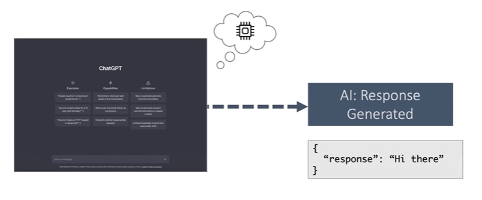

## S - Memory
Problem is

- Tasks: remember conversation

Solution is

- Configured to run with chains or agents

Domain is
- Memory

## T - LangChain No-Code: Flowise & Langflow

---
## S - Parser
Problem is

- Task: generate response in a particular(e.g. json) format that we could use it downstream

Solution is

- Output Parsers

Domain is
- Parser

