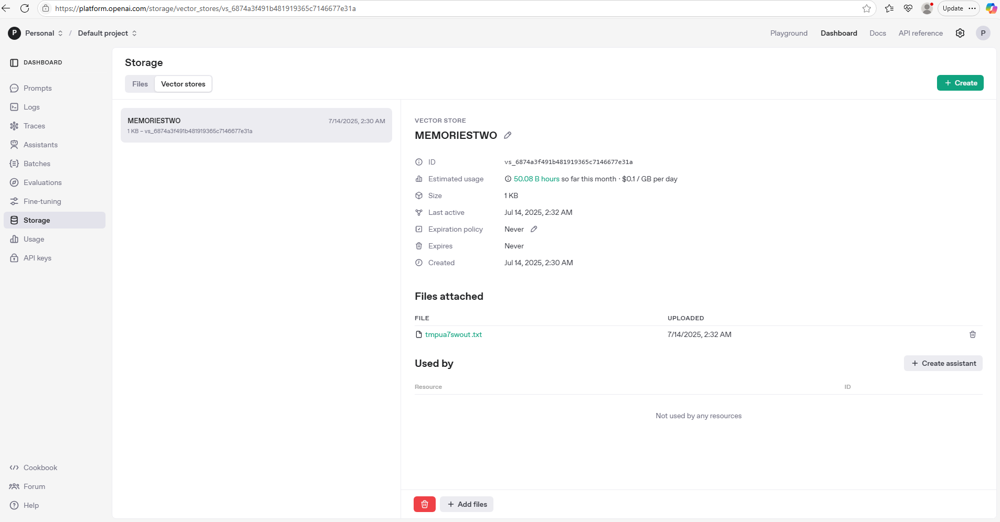

## Memory tracker
- track what you do
- ask to save certain memories
- recall those memories

T - RAG as one of MCP server backends

||Save|Search|
|-|-|-|
|Normal|Data in text file|Keyword search|
|RAG|Data in text file to embeddings in verctore store|Sematic search is more accurate than keyword search|


```py
################ Vector store ################
client.vector_stores.create(name="MEMORIESTWO")

stores = client.vector_stores.list()

client.vector_stores.files.upload_and_poll(
    vector_store_id=vector_store.id,
    file=open(f.name, "rb")
)
# 使用你的 client 对象上传文件。
# vector_store_id 是你目标向量数据库的 ID。
# 用 open(f.name, "rb") 以二进制方式读取刚才创建的临时文件。
# upload_and_poll 方法会上传文件并等待处理完成（可能包括嵌入处理等）。


results = client.vector_stores.search(
        vector_store_id=vector_store.id,
        query=query,
    )

################# Var to temfile ################
with tempfile.NamedTemporaryFile(mode="w+", delete=False, suffix=".txt") as f:
# 使用 tempfile.NamedTemporaryFile 创建一个临时文件
# mode="w+" 表示你可以读写这个文件。
# delete=False 是为了让文件在关闭后不会被自动删除（因为你后续还需要上传它）。
# suffix=".txt" 是文件的扩展名

f.write(memory)
f.flush()
# 将 memory 的内容写入这个临时文件。
# flush() 是为了确保数据真的写进了磁盘，而不是停留在缓冲区。
```

OpenAI上的Vector store



A

```py
from mcp.server.fastmcp import FastMCP
from openai import OpenAI
import tempfile
from dotenv import load_dotenv
import os

# Load environment variables from a .env file if present
load_dotenv()

client = OpenAI()

VECTOR_STORE_NAME = "MEMORIESTWO"

mcp = FastMCP('Memories')

def get_or_create_vector_store():
    # Try to find existing vector store, else create
    stores = client.vector_stores.list()
    for store in stores:
        if store.name == VECTOR_STORE_NAME:
            return store
    return client.vector_stores.create(name=VECTOR_STORE_NAME)


@mcp.tool()
def save_memory(memory: str):
    """Save a memory string to the vector store."""
    vector_store = get_or_create_vector_store()
    # Save memory to a temp file for upload
    with tempfile.NamedTemporaryFile(mode="w+", delete=False, suffix=".txt") as f:
        f.write(memory)
        f.flush()
        client.vector_stores.files.upload_and_poll(
            vector_store_id=vector_store.id,
            file=open(f.name, "rb")
        )
    return {"status": "saved", "vector_store_id": vector_store.id}


@mcp.tool()
def search_memory(query: str):
    """Search memories in the vector store and return relevant chunks."""
    vector_store = get_or_create_vector_store()
    results = client.vector_stores.search(
        vector_store_id=vector_store.id,
        query=query,
    )

    content_texts = [
        content.text
        for item in results.data
        for content in item.content
        if content.type == "text"
    ]

    return {"results": content_texts}


if __name__ == "__main__":
    mcp.run(transport="stdio")
```


## Chess Stats

- https://www.chess.com/news/view/published-data-api
- Hikaru Nakamura

A

- chess_api.py
```py
import requests

CHESS_API_BASE = "https://api.chess.com/pub"

headers = {"accept": "application/json",
           "User-Agent": "Mozilla/5.0 (Windows NT 10.0; Win64; x64) Python/3.10 requests/2.31.0"}

def get_player_profile(username):
    url = f"{CHESS_API_BASE}/player/{username}"
    response = requests.get(url, headers=headers)
    response.raise_for_status()
    return response.json()

def get_player_stats(username):
    url = f"{CHESS_API_BASE}/player/{username}/stats"
    response = requests.get(url, headers=headers)
    response.raise_for_status()
    return response.json()
```

- server.py
```py
from mcp.server.fastmcp import FastMCP

mcp = FastMCP('Chess.com')

from .chess_api import get_player_profile, get_player_stats

@mcp.tool()
def get_chess_player_profile(username: str):
    """Get the public profile for a Chess.com player by username."""
    return get_player_profile(username)

@mcp.tool()
def get_chess_player_stats(username: str):
    """Get the stats for a Chess.com player by username."""
    return get_player_stats(username)
```

- test.py
```py
from .chess_api import get_player_profile, get_player_stats

def test_get_player_profile():
    username = "hikaru"
    profile = get_player_profile(username)
    print("Profile:", profile)

def test_get_player_stats():
    username = "hikaru"
    stats = get_player_stats(username)
    print("Stats:", stats)

def main():
    test_get_player_profile()
    test_get_player_stats()
if __name__ == "__main__":
    main()
```

